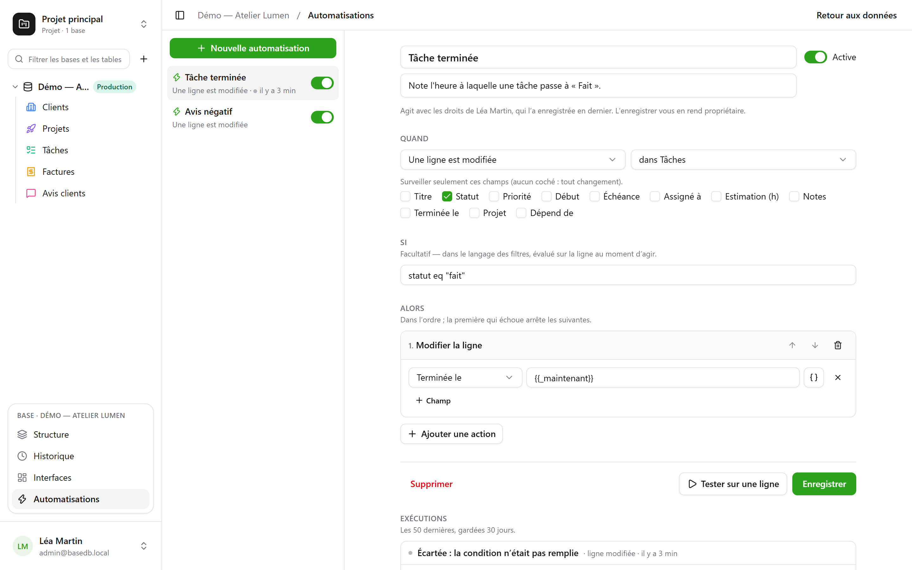

<p align="center">
  
</p>

<h1 align="center">basedb</h1>

<p align="center">
  <strong>La base collaborative dont chaque table est une vraie table PostgreSQL.</strong>
</p>

<p align="center">
  Grilles, huit vues, formulaires, formules, automatisations et tableaux de bord pour l’équipe —<br />
  sur des tables typées et nommées en clair, que <code>psql</code>, vos outils de BI et vos agents IA lisent directement.
</p>

<p align="center">
  <a href="https://demo.basedb.eodia.com/"><strong>Essayer la démo</strong></a> ·
  <a href="https://eodia.github.io/basedb/"><strong>Site et documentation</strong></a> ·
  <a href="https://eodia.github.io/basedb/guides/installation/">Installer</a> ·
  <a href="https://eodia.github.io/basedb/guides/premiers-pas/">Premiers pas</a> ·
  <a href="https://eodia.github.io/basedb/modeles/">Modèles</a> ·
  <a href="https://eodia.github.io/basedb/nouveautes/">Nouveautés</a> ·
  <a href="https://eodia.github.io/basedb/feuille-de-route/">Feuille de route</a>
</p>

<p align="center">
  <a href="https://eodia.github.io/basedb/"></a>
  <a href="LICENSE"></a>
  
  
  
</p>

<p align="center">
  
</p>

## Pourquoi basedb

Les autres bases collaboratives rangent vos lignes dans un modèle générique — colonnes numérotées,
documents JSON. basedb fait l’inverse : **une base est un schéma PostgreSQL, une table est une
table, un champ est une colonne typée, nommée en clair.**

| Dans basedb | Dans PostgreSQL |
|---|---|
| une base « Ventes » | un schéma `b_t4z56fq_ventes` |
| une table « Opportunités » | une table `opportunites` |
| un champ « Échéance » (Date) | une colonne `echeance date` |
| une liste de choix « Statut » | une colonne `text` et sa contrainte `CHECK` |
| une relation « Client » | une colonne `clients_id uuid` et sa `FOREIGN KEY` |
| une formule « Durée » | une colonne générée `STORED` |

Votre équipe travaille dans une interface de tableur ; vos scripts, vos outils de BI et `psql`
lisent les mêmes lignes — et peuvent y écrire : les contraintes tiennent, et même le SQL direct
est historisé. Vos données restent exploitables sans basedb.

## Ce que vous y trouverez

- **Des champs typés** — monnaie, durée, note, e-mail, personne, numéro automatique, fichiers —
  des **relations** simples ou multiples, des **formules** en français (`JOURS([Fin]; [Début])`)
  calculées par PostgreSQL, des **recherches** et des **cumuls** à travers les relations.
- **Huit vues** sur les mêmes lignes : grille, kanban, calendrier, chronologie, galerie, liste,
  formulaire, questionnaire — collaboratives ou personnelles.
- **Des liens partagés** : un formulaire qui reçoit des réponses sans compte, une vue en lecture
  seule intégrable à un site, un calendrier auquel s’abonner depuis son agenda.
- **La collaboration** : commentaires et mentions, notifications, écritures des autres en temps
  réel, et **Ctrl+Z** qui refuse plutôt que d’écraser le travail d’un autre.
- **Des automatisations** — quand une ligne change, à heure fixe ou d’un clic : modifier, créer,
  prévenir, appeler un webhook, écrire sur Slack.
- **Des tableaux de bord** : des questions posées à la souris ou en SQL, quinze graphiques —
  courbes, aires, tableaux croisés, cartes… — sur une grille en onglets, sous des filtres qui
  pilotent les cartes qu’on leur relie ; un clic sur un point ouvre ce qu’il représente ; un lien
  public ou réservé aux membres le partage, intégrable à un autre site.
- **Du SQL pour chacun, avec ses propres droits** : des requêtes enregistrées sous les tables —
  pour soi, pour toute la base ou pour des groupes — et de vraies **vues SQL** PostgreSQL rangées
  parmi elles, que `psql` lit aussi. PostgreSQL lui-même tient chacun à ses tables et à ses champs.
- **Des droits par groupe**, sur un projet, une base ou une table, jusqu’au champ ; un
  **historique** de chaque écriture, d’où qu’elle vienne ; des **environnements** — production,
  recette — que l’on compare et que l’on migre.
- **Une API REST, un serveur MCP et des webhooks**, derrière le même point de contrôle des
  droits. Un agent IA lit et écrit selon ses droits ; il ne change pas la structure, il la
  propose.
- **L’IA en option** — OpenAI, Anthropic, Mistral ou tout serveur compatible (Azure, Ollama…),
  avec votre clé : des champs remplis par un
  modèle, un copilote, une base entière décrite en une phrase. Rien ne part sans configuration.

<table>
  <tr>
    <td width="50%"><br /><sub><b>Tableaux de bord</b> — des questions et leurs graphiques, lus avec les droits de chacun.</sub></td>
    <td width="50%"><br /><sub><b>Automatisations</b> — quand, si, alors, et chaque exécution tracée.</sub></td>
  </tr>
  <tr>
    <td width="50%"><br /><sub><b>Chronologie</b> — des barres entre deux dates, et leurs dépendances.</sub></td>
    <td width="50%"><br /><sub><b>Commentaires</b> — on discute d’une ligne là où elle se trouve.</sub></td>
  </tr>
  <tr>
    <td width="50%"><br /><sub><b>Requêtes</b> — enregistrées sous les tables, exécutées par chacun avec ses droits.</sub></td>
    <td width="50%"><br /><sub><b>Vues SQL</b> — de vraies vues PostgreSQL, rangées parmi les tables.</sub></td>
  </tr>
</table>

## Démarrer

Pour essayer sans rien installer : **<https://demo.basedb.eodia.com>**. Le compte de démonstration
est prérempli ; les créations et les suppressions y sont désactivées, l’IA aussi, et la base revient
chaque nuit à son état initial.

Avec Docker, sur n’importe quel hôte — deux fichiers suffisent :

```bash
mkdir basedb && cd basedb
curl -fsSLO https://raw.githubusercontent.com/eodia/basedb/main/docker-compose.yml
curl -fsSL https://raw.githubusercontent.com/eodia/basedb/main/.env.example -o .env
# dans .env : POSTGRES_PASSWORD, et BASEDB_ENCRYPTION_KEY (openssl rand -base64 32)
docker compose up -d
```

basedb répond sur <http://localhost:3000> — l’interface, l’API sous `/api`, le serveur MCP
sous `/mcp` —, publié sur `127.0.0.1` seulement. Une seule image,
[`eodia/basedb`](https://hub.docker.com/r/eodia/basedb) (amd64 et arm64), à côté de
PostgreSQL ; `docker compose --profile https up -d` avec `BASEDB_DOMAIN` la sert en HTTPS sur
votre domaine, derrière Caddy.

La première page vous fait créer le **compte administrateur** — votre adresse, votre mot de
passe. Ouvrez ensuite la **base de démonstration** : une petite agence, ses clients,
projets, tâches, factures et avis — avec des formules, des vues de chaque sorte, un tableau de
bord et des automatisations. Tout est expliqué dans
[l’installation](https://eodia.github.io/basedb/guides/installation/) et les
[premiers pas](https://eodia.github.io/basedb/guides/premiers-pas/).

## Brancher un programme ou un agent

Menu **⋯** d’une base → **API et agents** → **Jetons API et MCP…** : un jeton limité à cette base, en lecture seule
par défaut, jamais plus puissant que la personne qui l’a créé.

```bash
# Un programme
curl http://localhost:3000/api/v1/<tenant>/data/<base>/<table> \
  -H "Authorization: Bearer $BASEDB_TOKEN"

# Un agent (Claude Code, ou tout client MCP)
claude mcp add basedb -- node apps/mcp/dist/relay.js \
  --url http://localhost:3000/mcp --token-env BASEDB_TOKEN
```

Chaque base a sa page **Documentation API et MCP**, générée et filtrée par vos droits, avec sa
spécification OpenAPI 3.1. Voir [l’API REST](https://eodia.github.io/basedb/integrations/api-rest/),
[le serveur MCP](https://eodia.github.io/basedb/integrations/mcp/) et
[les webhooks](https://eodia.github.io/basedb/integrations/webhooks/).

## Documentation

| | |
|---|---|
| **Pour commencer** | [Introduction](https://eodia.github.io/basedb/guides/introduction/) · [Installation](https://eodia.github.io/basedb/guides/installation/) · [Premiers pas](https://eodia.github.io/basedb/guides/premiers-pas/) |
| **Fonctionnalités** | [Tables et champs](https://eodia.github.io/basedb/fonctionnalites/tables-et-champs/) · [Vues](https://eodia.github.io/basedb/fonctionnalites/vues/) · [Formulaires](https://eodia.github.io/basedb/fonctionnalites/formulaires-partages/) et [vues partagés](https://eodia.github.io/basedb/fonctionnalites/vues-partagees/) · [Collaboration](https://eodia.github.io/basedb/fonctionnalites/collaboration/) · [Automatisations](https://eodia.github.io/basedb/fonctionnalites/automatisations/) · [Requêtes et vues SQL](https://eodia.github.io/basedb/fonctionnalites/requetes-et-vues-sql/) · [Tableaux de bord](https://eodia.github.io/basedb/fonctionnalites/tableaux-de-bord/) · [Environnements](https://eodia.github.io/basedb/fonctionnalites/environnements/) · [Historique](https://eodia.github.io/basedb/fonctionnalites/historique/) · [Droits et groupes](https://eodia.github.io/basedb/fonctionnalites/droits/) · [IA](https://eodia.github.io/basedb/fonctionnalites/ia/) · [Modèles](https://eodia.github.io/basedb/fonctionnalites/modeles/) · [Fichiers](https://eodia.github.io/basedb/fonctionnalites/fichiers/) |
| **Intégrations** | [API REST](https://eodia.github.io/basedb/integrations/api-rest/) · [Serveur MCP](https://eodia.github.io/basedb/integrations/mcp/) · [Webhooks](https://eodia.github.io/basedb/integrations/webhooks/) · [Slack, agendas, synchronisation](https://eodia.github.io/basedb/integrations/synchronisation/) · [SQL direct](https://eodia.github.io/basedb/integrations/sql/) |
| **Hébergement** | [Docker Compose](https://eodia.github.io/basedb/hebergement/docker/) · [Variables d’environnement](https://eodia.github.io/basedb/hebergement/variables/) · [Domaine et HTTPS](https://eodia.github.io/basedb/hebergement/https/) · [Sauvegardes et mises à jour](https://eodia.github.io/basedb/hebergement/sauvegardes/) |
| **Architecture** | [Principes](https://eodia.github.io/basedb/architecture/principes/) · [le document d’architecture](docs/architecture/), une vingtaine de chapitres — [00 — Décisions structurantes](docs/architecture/00-decisions-structurantes.md) suffit pour comprendre le reste |

La documentation est écrite dans [`www/`](www/) (Astro et Starlight) ; chaque page a son lien
« Modifier cette page ».

## Développer

Prérequis : Node 22 ou plus, Docker, et `corepack enable`.

```bash
corepack pnpm install
corepack pnpm exec tsc -b apps/api apps/mcp   # le noyau et ses paquets suivent
corepack pnpm start                           # PostgreSQL 16, API, MCP et interface, sur des ports libres
```

`start` démarre un PostgreSQL jetable, applique le catalogue, amorce un administrateur et
affiche ses identifiants ; `Ctrl+C` arrête tout, conteneur compris.

```bash
corepack pnpm lint        # Biome
corepack pnpm typecheck
corepack pnpm test:unit
corepack pnpm test:int    # un vrai PostgreSQL 16 par Testcontainers
corepack pnpm graph       # les dépendances permises entre paquets
```

| Dossier | Contenu |
|---|---|
| [`apps/web`](apps/web) | l’interface — Next.js |
| [`apps/api`](apps/api) | l’API REST — Hono |
| [`apps/mcp`](apps/mcp) | le serveur MCP et son relais stdio |
| [`packages/core`](packages/core) | le noyau : catalogue, moteur de migrations, droits, enregistrements, historique, automatisations |
| [`packages/catalog-schema`](packages/catalog-schema) | le DDL du catalogue `_basedb`, extrait du document d’architecture |
| [`packages/contracts`](packages/contracts) | le registre des codes d’erreur et les contrats partagés |
| [`packages/naming`](packages/naming) | le nommage : du libellé « Échéance » au nom physique `echeance` |
| [`packages/templates`](packages/templates) | les modèles de base officiels, publiés par le site |
| [`www`](www) | le site public et la documentation |
| [`docs/architecture`](docs/architecture) | le document d’architecture |

Le code — identifiants, types, commentaires — est en anglais ; le français est réservé à ce que
lit l’utilisateur et au document d’architecture.

### Deux principes qui expliquent le reste

**Le catalogue est la source de vérité unique.** La documentation, l’API et le serveur MCP en
dérivent, jamais l’inverse. Le registre des codes d’erreur et le DDL du catalogue sont même
*engendrés* depuis le document d’architecture, et un test échoue s’ils divergent.

**Un seul point d’application des droits.** Le noyau n’expose pas de connexion, il expose des
opérations : aucun adaptateur ne peut contourner la décision. Un champ masqué n’est pas filtré
après coup — il n’est jamais lu, et n’apparaît même pas dans le SQL émis.

## Licence

basedb est un logiciel libre d’[Eodia](https://eodia.com/fr/), studio de logiciel IA-natif,
distribué sous [GNU Affero General Public License v3.0](LICENSE) ou toute version ultérieure
(`AGPL-3.0-or-later`). Si vous le modifiez et le proposez à des utilisateurs à travers un
réseau, vous leur devez le code source de votre version.
