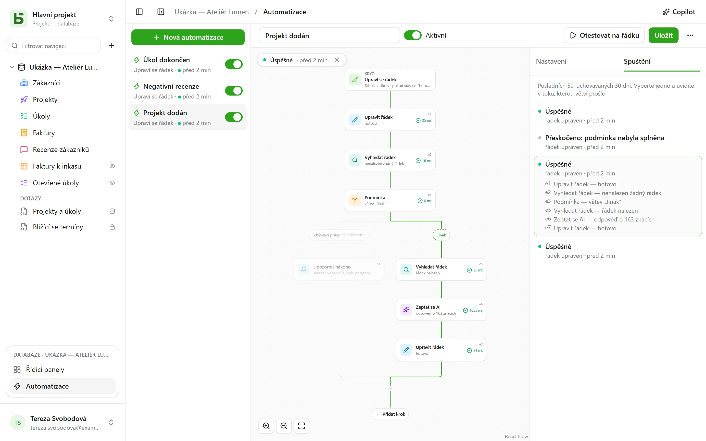

Automatizace říká **kdy**, **jestli** a **pak**: když úkol přejde do stavu „Fait“, zaznamenat
čas; když přijde negativní recenze, upozornit odpovědnou osobu a napsat do Slacku; každé
pondělí v 9:00 vytvořit řádek týmové porady. A když jedna akce nestačí, sleduje **tok**:
vyhledat řádek, vydat se jednou či druhou větví podle toho, co obsahuje, znovu použít v kroku
to, co předchozí krok našel nebo zapsal.

Otevírají se přes **Automatizace** v bloku otevřené databáze dole v postranním panelu
a vyžadují úroveň **Správa**.



## Tok

Tok se kreslí shora dolů: spouštěč, pak jednotlivé kroky. **+** na spojnici přidá krok na
dané místo; karta otevře své nastavení vpravo. Jednoduchá automatizace – spouštěč a akce – se
vejde do dvou karet a nastavuje se jako dříve.

## Kdy

| Spouštěč | Nastavení |
|---|---|
| **Řádek je vytvořen** | tabulka |
| **Řádek je upraven** | tabulka a případně jen pole, která se mají sledovat |
| **V pevný čas** | každou hodinu, každý den nebo každý týden, ve zvolenou hodinu a ve zvoleném časovém pásmu |
| **Kliknutí na tlačítko** | [pole Tlačítko](/basedb/cs/fonctionnalites/tables-et-champs/#tlačítko) tabulky |

Spouštěč nad řádky vidí **všechny** zápisy: rozhraní, API, agenta, sdílený formulář, a dokonce
i přímé SQL – automatizace vycházejí z historie, která je zachytí všechny.

## Jen pokud

Volitelná podmínka v [jazyce filtrů](/basedb/cs/integrations/api-rest/#čtení) –
`statut eq "fait"`, `montant gte 10000 and payee eq false` – vyhodnocená nad řádkem **v okamžiku
akce**. Spuštění, jehož podmínka není splněna, je „přeskočeno“ a uvede to.

## Pak

Až třicet kroků, v daném pořadí; první, který selže, zastaví ty následující.

| Krok | Co dělá |
|---|---|
| **Upravit řádek** | zapíše hodnoty do řádku, který automatizaci spustil – nebo do řádku, který nějaký krok našel či vytvořil |
| **Vytvořit řádek** | v této tabulce nebo v jiné tabulce databáze |
| **Vyhledat řádek** | první řádek tabulky, který odpovídá filtru, aby ho následující kroky mohly citovat nebo upravit |
| **Upozornit někoho** | [oznámení](/basedb/cs/fonctionnalites/collaboration/#oznámení) vybraným osobám nebo osobě z pole Osoba |
| **Odeslat e-mail** | osobám z týmu, osobě z pole Osoba, na adresu z pole E-mail — klientovi, dodavateli — nebo na napsané adresy; předmět a text citují řádek a předchozí kroky |
| **Zavolat webhook** | `POST` přes HTTPS na adresu podle vaší volby; jeho odpověď lze pak citovat |
| **Odeslat do Slacku** | zprávu do [připojeného](/basedb/cs/integrations/synchronisation/#slack) kanálu |
| **Zeptat se AI** | odpověď [poskytovatele AI](/basedb/cs/fonctionnalites/ia/) na pokyn, který cituje řádek a předchozí kroky – napsat, shrnout, zařadit –, čtenou jako text, číslo, ano či ne, datum nebo volbu ze seznamu |
| **Podmínka** | několik větví: použije se první, jejíž podmínka je splněna, a „Jinak“, když není splněna žádná; větve se pak opět spojí |

Vyhledání, které nic nenajde, tok nezastaví: kroky, které měly upravit nalezený řádek, se
přeskočí. Chcete-li v takovém případě udělat něco jiného, otestujte to podmínkou – větev
s prázdným filtrem se použije, jakmile vyhledání něco našlo.

## Zeptat se AI

Stejně jako [pole AI](/basedb/cs/fonctionnalites/ia/#možnost-ai-u-pole) odešle krok
poskytovateli svůj pokyn, v němž je každá citace nahrazena svou hodnotou:

```text
Vyžaduje tato recenze od {{auteur}} nějakou akci z naší strany? {{avis}}
```

Zvolíte **očekávanou odpověď** – volný nebo krátký text, číslo, ano či ne, datum, webovou
adresu nebo volbu ze seznamu, který lze převzít z pole výběru. Model je o tom informován
a odpověď, která ji neobsahuje, způsobí selhání kroku. Následující kroky ji citují pomocí
`{{e1.reponse}}`: v názvu vytvořeného úkolu, ve zprávě nebo v poli výběru, kde se přiřadí
k volbě se stejným popiskem.

To, co pokyn cituje, odchází k poskytovateli: krok vyžaduje váš **souhlas**, který je třeba
udělit znovu, když se pokyn změní. Každé volání se zaznamenává a spolu s poli AI se
započítává do `BASEDB_AI_FIELD_QUOTA` (ve výchozím nastavení 300 za hodinu). AI sama nic
nedělá: zapisují nebo upozorňují až kroky umístěné za ní.

## Citace

Hodnoty, zprávy a filtry citují to, co jim předchází, pomocí tlačítka **{ }** vedle každého
textu:

- `{{Titre}}`, `{{_id}}`: řádek, který automatizaci spustil;
- `{{e2.titre}}`, `{{e2._id}}`: řádek nalezený, vytvořený nebo upravený krokem `e2` – každý
  krok má svůj identifikátor na své kartě;
- `{{e3.statut}}`, `{{e3.reponse.numero}}`: co odpověděl webhook `e3`;
- `{{e4.reponse}}`: odpověď kroku AI `e4`;
- `{{_maintenant}}`: okamžik spuštění.

Hodnota tvořená jedinou citací předá samotnou hodnotu: vazbu, osobu, volbu – tak se
vytvořený řádek propojí s řádkem, který našlo vyhledání. Ve filtru je citace vždy
porovnávanou hodnotou, nikdy součástí jazyka filtrů.

Krok může citovat jen to, co před ním s jistotou proběhlo: co našla některá větev, už za
podmínkou citovat nelze. Editor na to upozorní na kartě ještě před uložením.

## Copilot

**Copilot** v záhlaví otevře vpravo konverzaci v přirozeném jazyce o automatizacích
databáze: „když úkol přejde do revize, upozorni přiřazenou osobu“, „přidej do poznámek
shrnutí od AI“, „proč poslední spuštění selhalo?“. Odpoví a **navrhne** celou automatizaci –
tu, kterou máte na obrazovce, upravenou, nebo novou –, se seznamem změn.

Copilot nic neukládá: **Umístit do toku** zobrazí návrh v editoru, kde si ho před uložením
zkontrolujete – a **Zrušit** na kartě vrátí tok do původního stavu. Nová automatizace se
otevře v editoru, připravená k vytvoření. Každý návrh se ověřuje stejně jako uložení; co
neobstojí, je vyřazeno a oznámeno.

Ve výchozím nastavení odchází k poskytovateli AI spolu s konverzací **jen struktura**:
tabulky a jejich pole, automatizace databáze, ta na obrazovce tak, jak ji ukazuje editor,
a její poslední spuštění – jejich stavy a chybové kódy, nikdy žádná hodnota. Osoby a kanály
Slacku odcházejí pod zástupnými značkami (`p1`, `s1`), nikdy pod svým identifikátorem.
Zaškrtávací políčko **Povolit čtení dat** umožní Copilotovi v rámci konverzace číst řádky
(nejvýše 50 při jednom čtení); každé čtení je uvedeno pod jeho odpovědí.

## Testování a sledování

**Otestovat na řádku** spustí uloženou automatizaci na vybraném řádku, a to doopravdy. Záložka
**Spuštění** uchovává posledních 50 po dobu 30 dnů: čekající, probíhající, úspěšná,
přeskočená s důvodem, neúspěšná s kódem. Výběrem jednoho ho zobrazíte na toku – použitá větev
je vyznačena, každý provedený krok uvádí, co udělal a jak dlouho to trvalo, zbytek je
ztlumený.

## Jménem koho jedná

Automatizace jedná s **oprávněními osoby, která ji naposledy uložila**, znovu posuzovanými
při každém spuštění: pokud tato osoba o nějaké oprávnění přijde, krok, který ho potřeboval,
selže, místo aby ho obešel, a vyhledání najde jen to, co tato osoba smí číst. Historie to
zobrazuje jako „Automatizace ‚Tâche terminée‘ · jménem …“ a její zápisy lze vracet stejně
jako ostatní.

## Omezení

- Co automatizace zapíše, nespustí žádnou jinou: co má následovat po sobě, patří do jediného
  toku.
- Vyhledání vrátí jeden řádek, ten první; zatím chybí „pro každý řádek“ i čekání („tři dny
  poté“).
- Žádný skript. E-mail odchází jako prostý text, jeden pro každého příjemce — nejvýše dvacet
  na krok —, přes [odesílací server](/basedb/cs/hebergement/variables/#e-maily) instance;
  odpověď přijde osobě, která automatizaci naposledy uložila.
- Podmínka testuje řádek: chcete-li zvolit větev podle odpovědi AI, zapište ji nejprve do
  pole řádku.
- [Šablona databáze](/basedb/cs/fonctionnalites/modeles/) přenáší jen automatizace bez
  vyhledání, podmínky a kroku AI.
- 100 spuštění za hodinu na automatizaci; zmeškaný hodinový termín se dožene jen jednou.
- Prodleva mezi zápisem a akcí je v řádu sekund.
