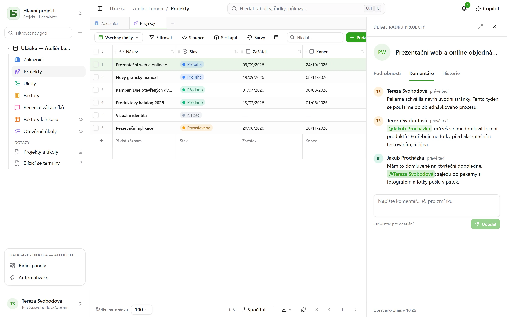
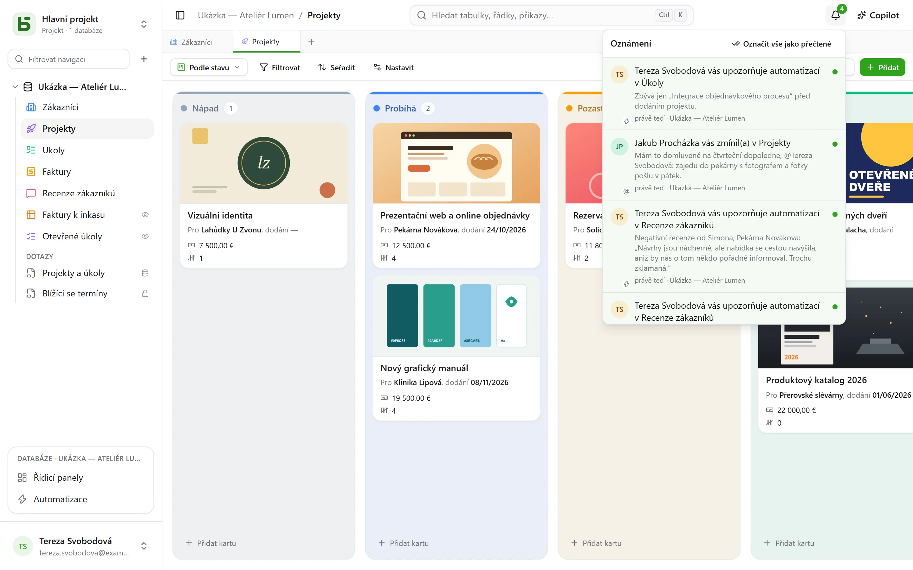

Na stejné databázi pracuje současně více lidí: každý vidí, jak přicházejí zápisy ostatních,
ví, kdo se dívá na co, a o řádku diskutuje přímo tam, kde se nachází.

## Komentáře

Detail řádku má záložku **Komentáře** mezi „Podrobnosti“ a „Historie“. Napište `@`, abyste
**zmínili** člena, a Ctrl+Enter pro odeslání. Každý může upravovat nebo odstraňovat své
vlastní komentáře.

Ke komentování řádku stačí oprávnění ho číst. Zmíněná osoba, která ho číst nemůže, upozorněna
není – a autor je o tom informován, místo aby se domníval, že zpráva odešla.

## Oznámení

Zvonek vpravo nahoře počítá nepřečtené. Přicházejí do něj čtyři věci:

- někdo vás **zmíní** v komentáři;
- někdo **odpoví** v konverzaci, do které jste psali;
- někdo vás **určí** v poli Osoba – z rozhraní, z API, z formuláře nebo z automatizace;
- [automatizace](/basedb/cs/fonctionnalites/automatisations/) vás **upozorní**.

Otevřením oznámení se otevře řádek. **Označit vše jako přečtené** vynuluje počítadlo;
oznámení se uchovávají 90 dní.

### E-mailem

Když má instance [odesílací server](/basedb/cs/hebergement/variables/#e-maily), oznámení,
které zůstane **deset minut nepřečtené**, odejde také e-mailem: jeden e-mail pro všechna,
která čekají, s odkazem na každý řádek. Co si přečtete včas, neodejde. V **Nastavení ›
Oznámení** má každý druh dva přepínače: v basedb a e-mailem.

## Reálný čas

Zápisy ostatních se zobrazují **bez obnovení stránky**: upravená buňka, přesunutá karta,
přidaný řádek – ať přicházejí z rozhraní, z API, od agenta nebo z přímého SQL. Server posílá
jen **signál**, nikdy data: obrazovka si je znovu načte s vašimi oprávněními. Buňka, kterou
právě upravujete, se vám pod rukama nikdy nepřepíše.

## Přítomnost

Tváře lidí, kteří se dívají na **stejnou tabulku**, se zobrazují nahoře na obrazovce; tváře
těch, kdo otevřeli **stejný řádek**, v záhlaví jeho detailu. V mřížce se ukazatel ostatních
objevuje na buňce, nad kterou se právě nacházejí.

## Odkaz na každou obrazovku

Adresa v prohlížeči sleduje to, na co se díváte: tabulku, jedno z jejích zobrazení, detail
řádku, řídicí panel, automatizaci, otázku, vaše nastavení. Vložte ji do zprávy: váš kolega se
dostane na stejné místo, se svými vlastními oprávněními. Přidejte si ji do záložek; tlačítka
zpět a vpřed v prohlížeči vás vrátí tam, kde jste byli.

| Adresa | Co otevře |
|---|---|
| `/bases/ventes/tables/opportunites` | tabulku „Opportunités“ databáze „Ventes“ |
| `/bases/ventes/tables/opportunites?vue=…` | jedno z jejích zobrazení |
| `/bases/ventes/tables/opportunites?ligne=…` | detail jednoho z jejích řádků |
| `/bases/ventes/tableaux-de-bord/…` | řídicí panel |
| `/bases/ventes/automatisations/…` | automatizaci |
| `/parametres/apparence` | vaše nastavení |

Adresa pojmenovává **místo**, ne stav, ve kterém jste ho opustili: filtry, řazení a šířky
sloupců zůstávají takové, jaké má každý prohlížeč. Databáze a tabulka se do ní zapisují svým
názvem v PostgreSQL: po přejmenování stará adresa nikam nevede. Adresa, která nikam nevede —
překlep, odstraněný objekt, nebo něco, co nemáte právo vidět — zobrazí „Tato stránka
neexistuje“.

## Vrácení změn

Ctrl+Z vrátí váš poslední zápis – viz [historie](/basedb/cs/fonctionnalites/historique/#vrácení-změn-ctrlz).

## Omezení

- Žádný e-mail bez odesílacího serveru nastaveného provozovatelem.
- Při více než stu řádcích změněných najednou obrazovka znovu načte celou stránku, nikoli
  řádek po řádku.
