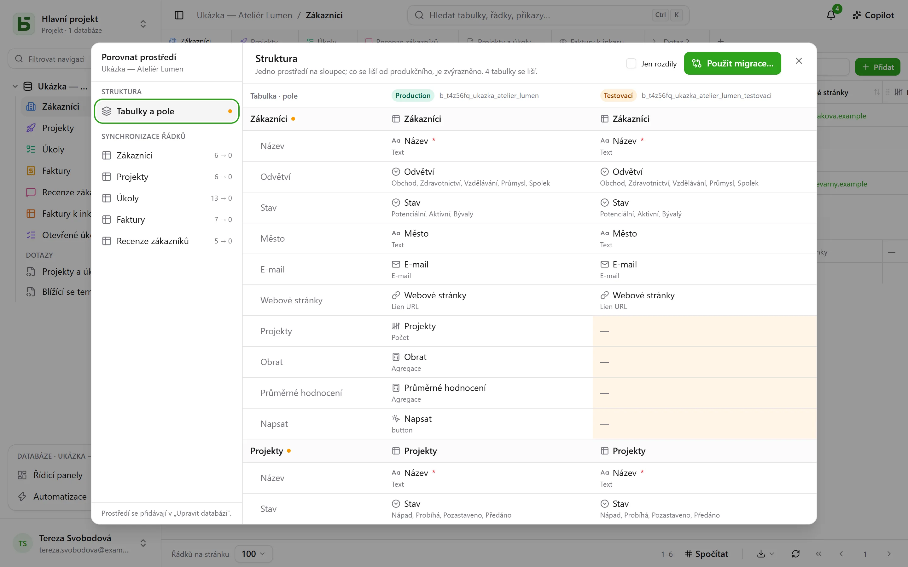

Databáze může mít **prostředí**: produkční, testovací, vývojové… Každé je plnohodnotnou
databází – má své schéma, své tabulky, své řádky, svá oprávnění – a všechna sdílejí **původ**
databáze, jejích tabulek a jejích polí.

## V rozhraní

Postranní panel zobrazuje **jeden řádek na databázi** se štítkem, který ukazuje otevřené
prostředí a umožňuje ho přepnout. Štítek se nezobrazuje, dokud existuje jen produkční
prostředí.

Prostředí se přidávají, přejmenovávají a odstraňují v **Upravit databázi…**: nové prostředí
vzniká **kopií struktury** jiného prostředí, bez jeho řádků.

## Porovnání prostředí

V nabídce databáze v části **Další akce** otevře **Porovnat prostředí…** dialog:

- **Struktura**: prostředí ve sloupcích, tabulky a pole v řádcích; co se liší od produkčního
  prostředí, je zvýrazněno.
- **Použít migrace…** připraví plán přechodu z jednoho prostředí do jiného, krok za krokem.
  Nikdy automaticky nezaškrtne to, co by zrušilo novější změnu v cílovém prostředí.
- **Synchronizace řádků**: tabulku po tabulce přenést řádky z jednoho prostředí do jiného
  podle identifikátoru.

## Jak basedb ví, kdo co změnil

Porovnání se opírá o **historii struktury**: každé vytvoření, úprava nebo odstranění tabulky či
pole je zachyceno triggerem nad katalogem a lze ho číst na záložce „Struktura“ v historii.
Identifikátory původu spojují pole testovacího prostředí s jeho protějškem v produkčním
prostředí, i když bylo přejmenováno.

## V SQL

Každé prostředí je schéma: `b_t4z56fq_ventes` pro produkční, `b_t4z56fq_ventes_recette` pro
testovací. Vaše dotazy přepínají prostředí změnou schématu – nebo `search_path`.
