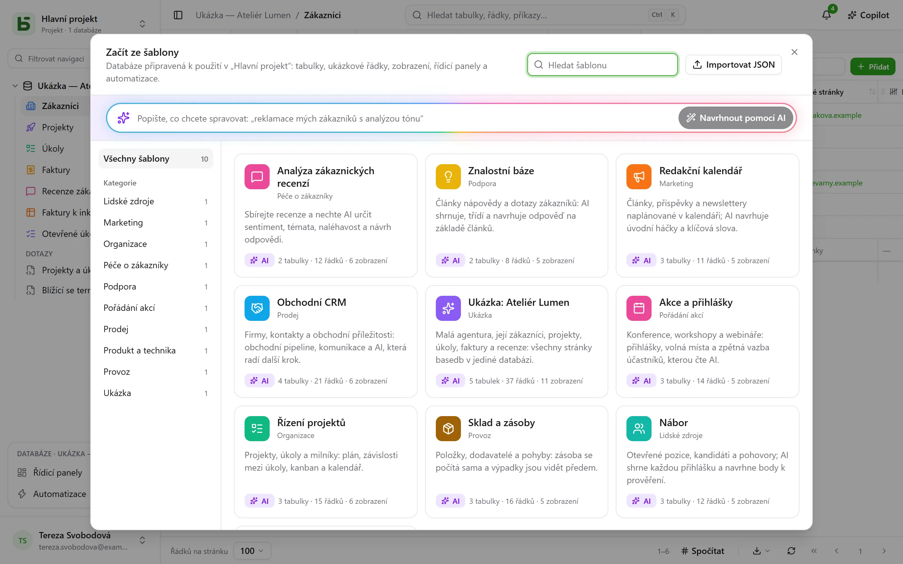

**Šablona** vytvoří celou databázi jedním kliknutím: její tabulky a jejich vazby, ukázkové
řádky, zobrazení, řídicí panel, automatizace a pole, která vyplňuje sama AI.
[Galerie šablon](/basedb/cs/modeles/) ukazuje ty, které basedb nabízí.

## Začít ze šablony

**Nová databáze**, pak **Začít ze šablony, nebo si ji vyžádat od AI**: otevře se galerie.



Každou šablonu si před použitím můžete přečíst celou – její tabulky a jejich pole, její
zobrazení, automatizace a pokyn každého jejího pole AI. **Vytvořit databázi** se zeptá na
její popisek a, obsahuje-li pole AI, na váš souhlas s tím, aby hodnoty, které tato pole
citují, odcházely k poskytovateli AI instance. Bez tohoto souhlasu jde o běžná pole
vyplněná ukázkovými hodnotami.

**Načíst ukázková data**, ve výchozím stavu zaškrtnuté, naplní tabulky ukázkovými řádky, abyste
viděli databázi v akci. Po odškrtnutí zůstanou tabulky prázdné, připravené pro vaše vlastní
data – zobrazení, řídicí panely a automatizace se přesto vytvoří.

Prázdný projekt nabízí také **ukázkovou databázi**: malou agenturu, její klienty, projekty,
úkoly, faktury a recenze, která předvádí všechny stránky basedb.

## Ve vašem jazyce

Oficiální šablony se čtou a vytvářejí **v jazyce obrazovky**: tabulky, pole, možnosti volby,
ukázkové řádky, zobrazení, řídicí panely, automatizace a pokyny pro AI. Ukázkové řádky mění
svět podle jazyka: z „Boulangerie Martin“ z Lyonu se v češtině stává „Pekárna Novákova“
v Brně.

Šablona importovaná do vaší instance, nebo uložená z databáze, je napsaná někým: čte se tak,
jak byla napsána.

## Vyžádání od AI

V horní části galerie popište svou potřebu jednou větou – „sledování reklamací mých
zákazníků s analýzou tónu“. AI navrhne kompletní databázi: tabulky, věrohodné ukázkové řádky,
zobrazení, řídicí panel a pole AI tam, kde se to hodí. Přečtete si ji jako šablonu, můžete ji
**doladit** („přidej tabulku dodavatelů“) a pak vytvořit. AI dostane jen vaši větu – žádná
data z žádné databáze – a před vaším kliknutím se nic nevytvoří.

## Zápis šablony v JSON

Šablona je dokument JSON. Zde je její kostra:

```json
{
  "format": 1,
  "key": "suivi-tickets",
  "label": "Suivi de tickets",
  "summary": "Une phrase pour la galerie.",
  "category": "Produit et technique",
  "icon": "bug",
  "color": "#ef4444",
  "tables": [
    {
      "key": "tickets",
      "label": "Tickets",
      "fields": [
        { "label": "Titre", "kind": "short_text" },
        { "label": "Statut", "kind": "select", "options": ["Nouveau", "En cours", "Résolu"] },
        { "label": "Ouvert le", "kind": "date" },
        { "label": "Description", "kind": "long_text" },
        { "label": "Catégorie", "kind": "select", "options": ["Bug", "Demande"],
          "ai": { "prompt": "Classe ce ticket : {{Titre}} — {{Description}}" } },
        { "label": "Âge (jours)", "kind": "formula", "formula": "JOURS(AUJOURDHUI(); [Ouvert le])" }
      ]
    },
    { "key": "produits", "label": "Produits", "fields": [{ "label": "Nom", "kind": "short_text" }] }
  ],
  "links": [{ "from": "tickets", "label": "Produit", "to": "produits" }],
  "rows": {
    "produits": [{ "$key": "app", "Nom": "Application mobile" }],
    "tickets": [{ "Titre": "Crash au démarrage", "Statut": "En cours", "Ouvert le": "-3d", "Produit": "@app" }]
  },
  "views": [
    { "table": "tickets", "label": "Tableau", "kind": "kanban", "spec": { "group_by": "Statut" } }
  ],
  "dashboards": [
    { "label": "Vue d’ensemble", "blocks": [
      { "kind": "number", "title": "Ouverts", "table": "tickets", "filter": "[Statut] ne \"Résolu\"" },
      { "kind": "chart", "title": "Par catégorie", "table": "tickets", "group_by": "Catégorie", "style": "pie" }
    ] }
  ],
  "automations": []
}
```

Základní pravidla:

- **Vše se cituje popiskem**: pole v zobrazení, filtr (`[Statut] ne "Résolu"`), vzorec
  (`[Prix] * [Quantité]`), pokyn AI nebo zpráva (`{{Titre}}`). Volba se zadává svým
  popiskem.
- **První pole** tabulky je jejím zobrazovaným polem: text, číslo, datum, e-mail nebo
  adresa.
- **Vazba** se deklaruje v `links`, nikdy jako pole; řádek na ni odkazuje pomocí `"@clé"`,
  tedy `$key` řádku cílové tabulky.
- **Datum** může být relativní vůči dni, kdy se šablona použije: `"today"`, `"+3d"`,
  `"-2w"`, `"+1m"`; datum a čas navíc přidává čas, `"+1d 14:30"`. Osoba se zapisuje jako
  `"$moi"`.
- **Pole AI** nese `"ai": { "prompt": "…" }` a může dostat ukázkovou hodnotu, která se zapíše
  jen tehdy, když se AI nepoužívá.
- Šablona **nikdy** neobsahuje sdílení, oprávnění, webhook, soubor ani jinou osobu než
  `"$moi"`: někdy pochází odjinud a nesmí nic otevírat.

Kompletní reference – všechny typy polí, všechny klíče zobrazení, limity – je v kapitole 20
architektonické dokumentace v repozitáři.

## Zveřejnění šablony pro všechny instance

Šablony oficiální galerie jsou soubory ve složce
[`packages/templates/catalog`](https://github.com/eodia/basedb/tree/main/packages/templates/catalog)
repozitáře, jeden soubor na šablonu, pojmenovaný podle jejího `key`. Veřejný web z nich
vytváří [galerii](/basedb/cs/modeles/) a zveřejňuje celý katalog na adrese
[`/basedb/modeles/catalogue.json`](/basedb/modeles/catalogue.json). Každá instance ho načte,
když někdo otevře galerii, a uchová si ho hodinu: stačí upravit soubor a znovu zveřejnit web
a galerie se změní ve všech instancích.

Každá šablona se při sestavení webu ověřuje stejným validátorem, jaký používá server:
neplatná šablona způsobí selhání sestavení, místo aby se dostala k uživatelům.

Oficiální šablona se píše jednou, francouzsky. Její texty v jiném jazyce jsou slovník,
[`packages/templates/i18n/<langue>/<clé>.json`](https://github.com/eodia/basedb/tree/main/packages/templates/i18n)
– francouzský text, pak jeho překlad –, který web zveřejňuje vedle katalogu
(`/basedb/modeles/i18n/<langue>.json`). Instance do něj dosadí každý text a sleduje každý
popisek všude, kde je citován – ve vzorcích, filtrech, zobrazeních, pokynech –, a pak výsledek
znovu přečte: slovník, který by šablonu rozbil, se neposkytne, francouzská šablona ano. Text
chybějící ve slovníku zůstává francouzský.

Instance čte adresu `BASEDB_TEMPLATES_URL` – ve výchozím nastavení adresu veřejného webu.
Nasměrujte ji na vlastní katalog, nebo nastavte `off`, aby nečetla žádný: instance pak
nabízí šablony zabudované ve své verzi.

## Šablony vaší instance

Správce může do své instance **importovat šablonu JSON** z galerie („Importovat JSON“):
přibude do galerie všech uživatelů instance a nahradí šablonu se stejným klíčem. Návrh AI do
ní lze přidat jedním kliknutím.

Šablonou se může stát i jakákoli databáze: **Uložit jako šablonu** v nabídce databáze v části
**Další akce**. Její tabulky, pole, pokyny AI, vazby, sdílená zobrazení, řídicí panely
a automatizace – a pokud chcete, až 50 řádků na tabulku – se stáhnou jako JSON, připravené
k zařazení do oficiálního katalogu nebo do katalogu instance. Automatizace, která vyhledává
řádek, prochází řádky, větví se nebo cituje předchozí krok, zatím zůstává stranou a obrazovka
to oznámí.
