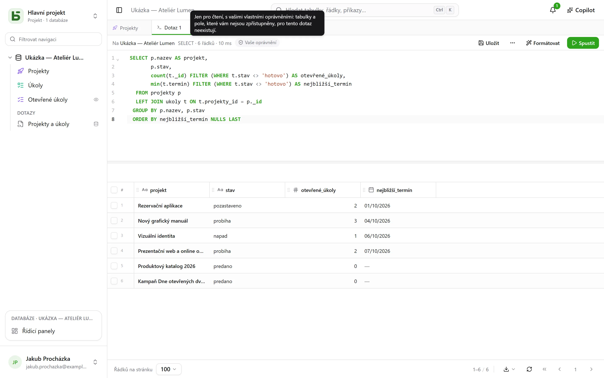
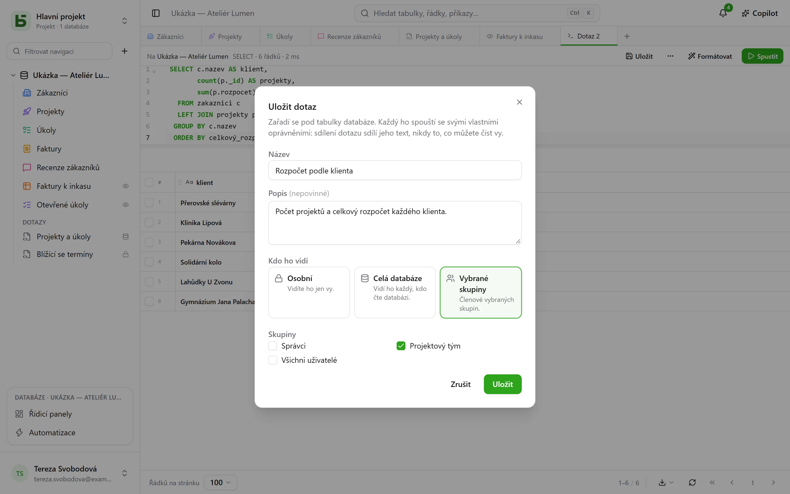
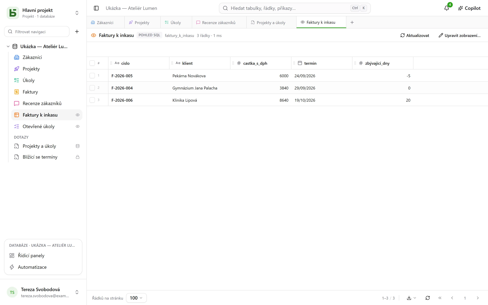
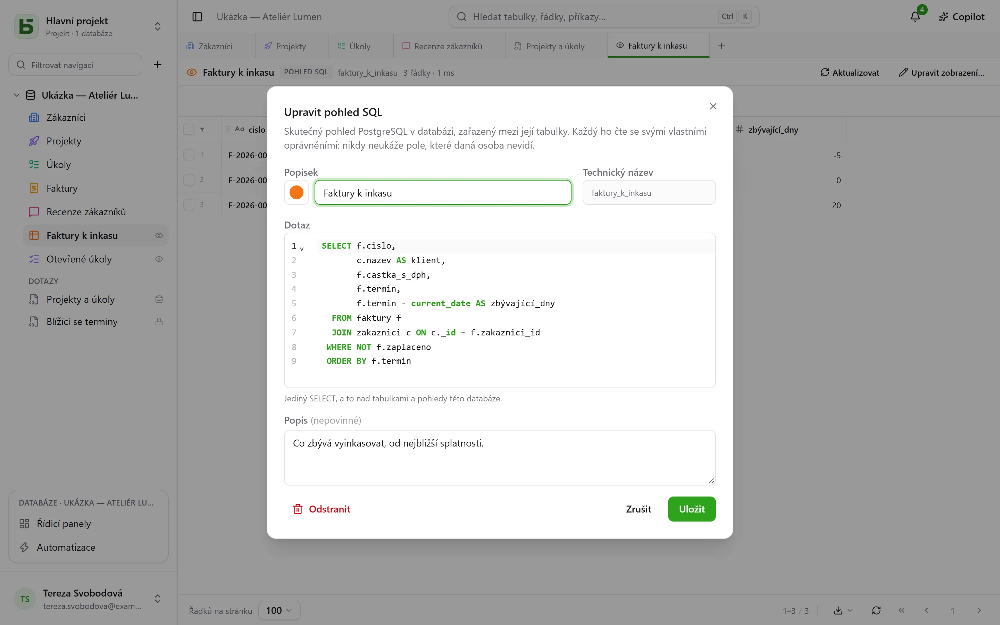

Vaše tabulky jsou skutečné tabulky PostgreSQL a rozhraní se na ně dotazuje v SQL pod jejich
skutečnými názvy. Každý člen databáze může napsat dotaz a **uložit** ho pod tabulky – jen pro
sebe, pro celou databázi nebo pro několik skupin –, a kdo databázi spravuje, může z něj udělat
**pohled SQL**: skutečný pohled PostgreSQL zařazený mezi tabulky, který čtou i `psql` a vaše
nástroje.


## Každý se svými oprávněními

**+** na liště záložek nebo nabídka **⋯** databáze → **Dotaz SQL** otevře záložku SQL: editor
se zvýrazněním syntaxe a doplňováním, **Ctrl+Enter** pro spuštění a výsledek ve stejné mřížce
jako vaše tabulky. Co dotaz smí číst, závisí na tom, kdo ho spouští:

- s úrovní **Správa** nad databází celou databázi, včetně zápisů;
- s úrovní **Čtení** nebo **Úpravy** se dotaz provede **jen pro čtení, s vašimi vlastními
  oprávněními**. Tabulka, která je vám uzavřená, pro něj neexistuje; pole, které je před vámi
  skryté, zmizí ze `SELECT *` a je odmítnuto, pokud ho uvedete, i s kvalifikací tabulky;
  zápis je odmítnut. Výsledek nese štítek **Vaše oprávnění**.



Nefiltruje to obrazovka: vaše oprávnění uplatňuje sám PostgreSQL, sloupec po sloupci, pod
rolí, která je vám vlastní. Dotaz vám tedy nemůže ukázat nic, co by vám neukázala mřížka, API
nebo server MCP.

## Uložení dotazu

**Uložit** na liště záložky zařadí dotaz pod tabulky databáze do sekce **Dotazy**. Znovu se
otevře jedním kliknutím; **⋯** → **Uložit jako…** vytvoří kopii, **Název a sdílení…** (na
záložce nebo v jeho nabídce v postranním panelu) ho přejmenuje, změní, kdo ho vidí, nebo ho
odstraní — **Odstranit** je také v jeho nabídce, pravým kliknutím. Záložka, která ho
zobrazovala, si ponechá svůj text.



| Rozsah | Kdo ho vidí | Kdo ho může vytvořit a upravit |
|---|---|---|
| **Osobní** – zámek | jen vy | kdokoli, kdo vidí databázi, pro sebe |
| **Celá databáze** | kdokoli, kdo vidí databázi | úroveň **Správa** nad databází |
| **Skupiny** | členové zvolených skupin | úroveň **Správa** nad databází |

**Sdílení dotazu sdílí jeho text, nikdy ne to, co smí číst jeho autor.** Každý ho spouští se
svými vlastními oprávněními: tentýž dotaz otevřený dvěma osobami ukáže každé z nich to, co
smí vidět – nebo jí sdělí, že pro ni nějaký sloupec neexistuje.

Dotaz otevřený z postranního panelu **se ihned spustí, jen pro čtení**: vidíte jeho výsledek,
aniž byste cokoli rozhodli. **Spustit** ho pak spustí znovu tak, jak je. Tečka vedle jeho
názvu signalizuje, že jste od uložení změnili jeho text; **Uložit** změnu uloží, pokud ho
smíte upravovat, a jinak nabídne vytvořit nový.

## Pohledy SQL

**Pohled SQL** je skutečný pohled PostgreSQL ve schématu databáze. Zaujímá místo **mezi
tabulkami**, s barvou a ikonou jako tabulka a s malým **okem** vpravo, které říká, že jde
o pohled. Kliknutím se otevře na záložce: jeho řádky v mřížce, **Aktualizovat** pro jejich
opětovné načtení.



Vytváří se přes nabídku **⋯** databáze → **Nový pohled SQL…** nebo ze záložky SQL: **⋯** →
**Vytvořit pohled SQL…** a dotaz na záložce se stane jeho definicí. Dialog se ptá na:

- jeho **popisek** a **vzhled** – barvu, ikonu nebo obrázek, volené jako u tabulky;
- jeho **technický název**, odvozený z popisku, pokud žádný nezadáte – ten, který se píše za
  `FROM`;
- jeho **dotaz**: jediný `SELECT` nad tabulkami a ostatními pohledy databáze. PostgreSQL
  odmítne, co odmítne, a editor ukáže na příslušné místo.



Pohled se pak čte pod svým názvem, z rozhraní stejně jako z `psql` nebo z vašeho nástroje BI:

```sql
SELECT * FROM b_t4z56fq_demo_atelier_lumen.factures_a_encaisser;
```

**Pohled nikdy neukáže pole, které nevidíte.** Každý ho čte se svými vlastními oprávněními ke
každé tabulce a každému sloupci, který pohled čte; postranní panel ho zobrazí jen tomu, kdo smí
číst vše, co pohled čte. Čte jen **svou** databázi: jiná databáze nebo katalog basedb jsou
odmítnuty už při vytvoření. Jeho vytvoření, úprava nebo odstranění vyžaduje úroveň **Správa**
nad databází. **Odstranit**, v jeho nabídce v postranním panelu, ho odebere pro všechny,
včetně skriptů a nástrojů; tabulky, které čte, zůstanou nedotčené.

### Když se změní struktura

- **Přejmenování** tabulky nebo pole pohled nerozbije: PostgreSQL ho sleduje.
- **Změna vzorce** počítaného pole, které pohled čte, pohled na okamžik odebere a pak ho znovu
  vytvoří nad novým sloupcem. Pokud už neobstojí, zůstane **k opravě** – v postranním panelu
  to označuje trojúhelník – se zachovanou definicí: **Upravit pohled…**, opravte, uložte.
- Tabulka se nevyčistí, dokud ji čte nějaký pohled, a pohled se neodstraní, dokud ho čte jiný
  pohled: odmítnutí pojmenuje příslušný pohled.

## Dotaz, pohled SQL, nebo otázka?

| | Co to je | Kde se nachází | K čemu slouží |
|---|---|---|---|
| **Uložený dotaz** | text SQL | pod tabulkami, sekce „Dotazy“ | najít dotaz znovu, sdílet ho jako text |
| **Pohled SQL** | skutečný pohled PostgreSQL | mezi tabulkami | pojmenovat čtení pro rozhraní **i** pro `psql`, vaše skripty, vaše nástroje |
| **Otázka** | čtení sestavené myší nebo v SQL a jeho vizualizace | v [řídicích panelech](/basedb/cs/fonctionnalites/tableaux-de-bord/) | číslo, graf, kontingenční tabulka, pod filtry |

## Omezení

- Mřížka zobrazí nejvýše tolik **řádků na stránku**, kolik je zvoleno dole na obrazovce;
  „zkráceno“ to signalizuje. Dotaz se zastaví po 15 sekundách.
- Pohled SQL se čte v SQL a v rozhraní; REST API a server MCP ho nezpřístupňují.
- Pohled SQL zůstává v prostředí, kde byl vytvořen: vytvoření prostředí, porovnání struktury
  ani uložení šablony ho zatím nepřenáší.
