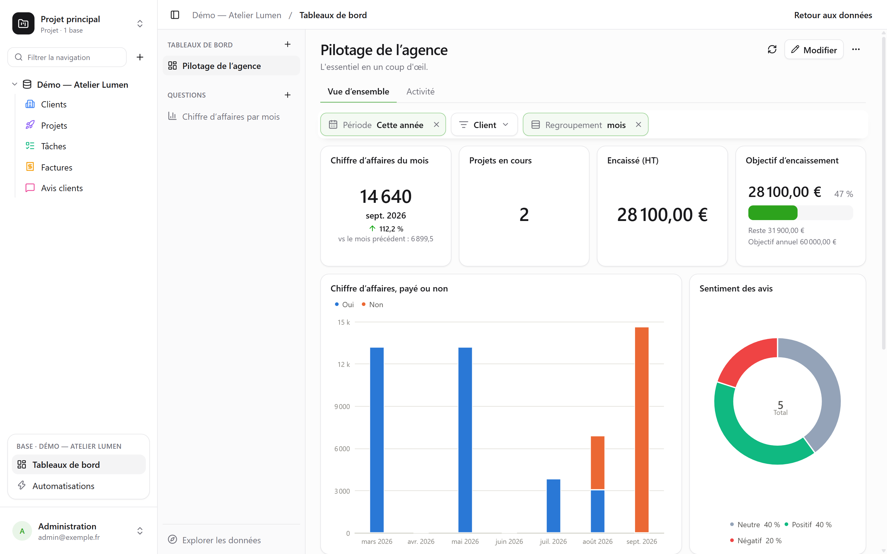
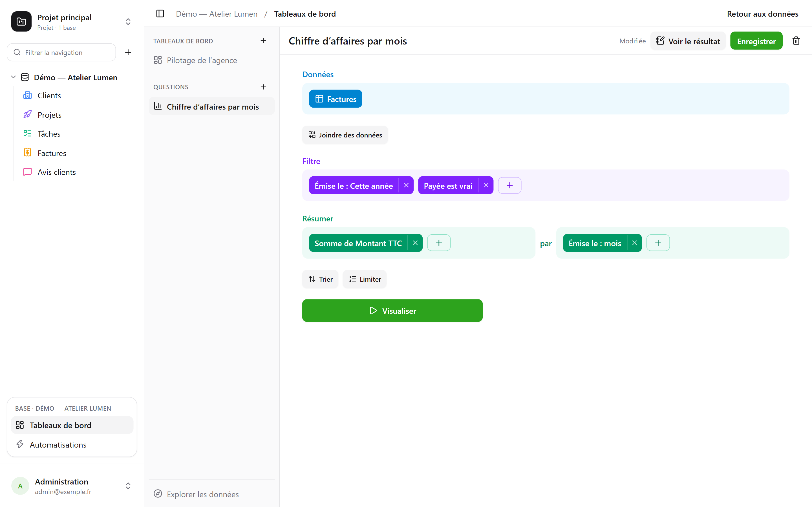
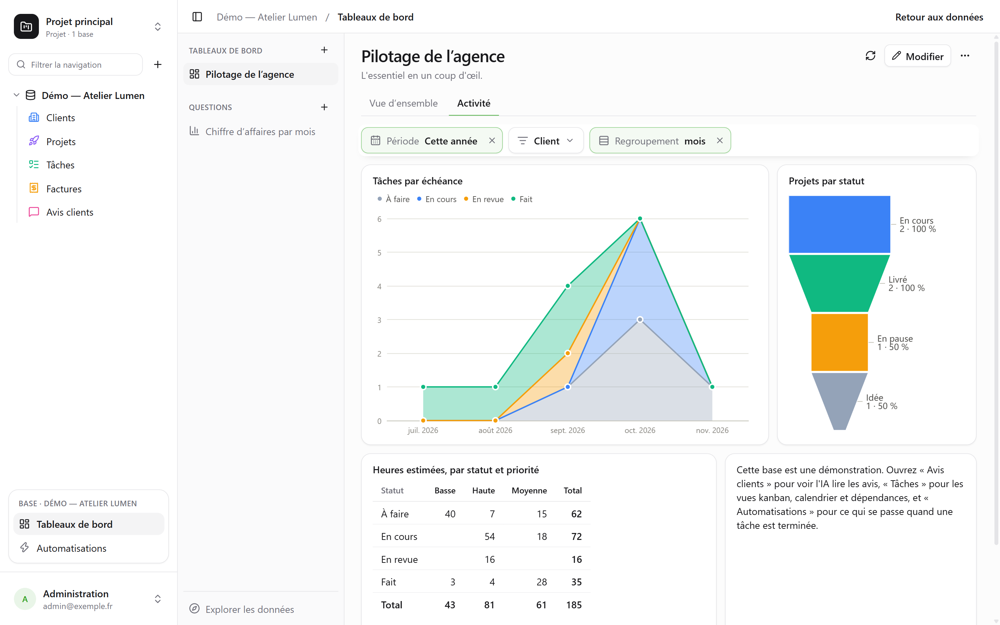

**Řídicí panel** soustředí na jednu stránku to, na co se tým dívá každý den: čísla, na kterých
záleží, jejich vývoj měsíc po měsíci, rozložení stavů, nejbližší termíny. Každá karta na něm
zobrazuje **otázku** – čtení databáze sestavené myší nebo napsané v SQL – a **filtry** v horní
části stránky řídí karty, které jsou k nim připojené.



Vše se otevírá přes **Řídicí panely** v bloku otevřené databáze dole v postranním panelu.
Vlevo jsou řídicí panely a uložené otázky databáze a **Prozkoumat data** pro položení otázky
bez ukládání. Každý čtenář databáze je může prohlížet a zkoumat; vytváření, úpravy a ukládání
vyžadují úroveň **Správa**.

## Položení otázky myší

Otázka se sestavuje po krocích, jeden pod druhým:



| Krok | Co zde volíte |
|---|---|
| **Data** | výchozí tabulku a sloupce zobrazené, když se nic neshrnuje |
| **Připojit data** | další tabulku databáze, propojenou vazbou – nabídnutou automaticky – nebo dvěma sloupci stejné povahy; spojení levé, vnitřní, pravé nebo úplné |
| **Filtr** | podle sloupce, s tím, co nabízí jeho typ: je / není, obsahuje, mezi, prázdné…; pro datum **období**: dnes, posledních 30 dní, tento měsíc, minulé čtvrtletí, od … do …; nebo výraz napsaný jako v liště zobrazení |
| **Shrnout** | míry – počet řádků, součet, průměr, medián, minimum, maximum, jedinečné hodnoty, směrodatnou odchylku, kumulativní součty – **podle** jednoho až tří sloupců |
| **Seřadit**, **Omezit** | pořadí řádků a jejich maximální počet |

Datum se seskupuje **po dnech, týdnech, měsících, čtvrtletích nebo letech**, nebo podle
pořadí – den v týdnu, měsíc v roce, hodina dne; číslo do intervalů. Vícenásobný výběr započítá
každý řádek do každé z jeho voleb. Období se čtou ve vašem časovém pásmu a týden začíná dnem
podle vašeho nastavení.

**Vizualizovat** spustí otázku. Výsledek se zobrazí způsobem, který mu vyhovuje – číslo,
křivka, sloupce, tabulka – a ten lze změnit dole na obrazovce:

| Vizualizace | K zobrazení |
|---|---|
| **Číslo**, **Trend**, **Postup**, **Měřidlo** | jedné hodnoty; posledního období ve srovnání s předchozím a se stejným obdobím loni; postupu k cíli |
| **Sloupce**, **Pruhy**, **Křivka**, **Plochy**, **Kombinovaný** | měr podél dimenze, v řadách vedle sebe, skládaných nebo na 100 % |
| **Výseče**, **Trychtýř** | podílů, fází |
| **Bodový graf** | dvou měr proti sobě, třetí jako velikosti |
| **Tabulka**, **Kontingenční tabulka** | řádků, které lze řadit; řádků podle jedné dimenze a sloupců podle jiné, s jejich součty |
| **Mapa** | regionů nebo departementů Francie nebo zemí, obarvených podle hodnoty; nebo bodů podle zeměpisné šířky a délky |

**Nastavení** určuje, co se zobrazí, a výsledek lze stáhnout jako **CSV**.

### Přizpůsobení grafu

| Vizualizace | Co nabízí **Nastavení** |
|---|---|
| **Sloupce, křivky, plochy, kombinovaný** | barvu a název každé řady; skládání, se součtem nad sloupci; šířku sloupců; vyhlazené nebo schodovité křivky, s body nebo bez nich; pořadí kategorií; názvy os, dílky, sklon popisků, meze, logaritmickou škálu; hodnoty v grafu; cíl |
| **Výseče** | prstenec a jeho tloušťku, půlkruh, růžici; součet uprostřed; počet výsečí před „Ostatní“; barvu a název každé výseče; popisky na výsečích nebo vedle nich; umístění legendy |
| **Trychtýř** | barvu a název každé fáze, jejich pořadí |
| **Číslo, trend, postup, měřidlo** | barvu, barvy podle hodnoty, legendu pod číslem, srovnání – a zda je pokles dobrou zprávou |
| **Tabulka, kontingenční tabulka** | přejmenování a změnu pořadí sloupců, pruhy v buňkách, barvy podle hodnoty – po buňkách nebo po řádcích –, hustotu, řádky na stránku, čísla řádků, součty |
| **Mapa** | odstín, názvy regionů |

Pro všechny formát čísel: desetinná místa, předpona a přípona, zkrácení na `1,2 k`.

## Průzkum jedním kliknutím

Kliknutí na sloupec, bod nebo výseč otevře to, co představuje:

- **Zobrazit tyto řádky**: řádky za bodem, filtrované podle toho, co představuje;
- **Rozpadnout po týdnech**: období rozložené na jemnější – rok na čtvrtletí, měsíc na
  týdny;
- **Rozdělit podle…**: stejná míra pro tento bod podle jiného sloupce;
- **Jen tato hodnota**, **Vyloučit tuto hodnotu**.

Každý krok je samostatná otázka, kterou lze podle potřeby uložit; šipka zpět se vrátí na
předchozí krok. Řádek tabulky otevře svůj detail řádku.

Na řídicím panelu nabízí stejné kliknutí také **Filtrovat panel: „Lyon“** s počtem dotčených
karet: **dočasný** filtr, nikdy neukládaný, zobrazený přerušovanou čarou v liště filtrů
a odstranitelný jedním kliknutím, který se uplatní na každou kartu, jejíž otázka čte stejný
sloupec – přes svou tabulku nebo přes spojení. Nabízí se jen tehdy, když k tomuto sloupci na
kartě ještě není připojen žádný filtr panelu, a zůstává šedý („jediná karta“), když ho žádná
jiná karta nečte. Otázky SQL ho nezohledňují.

## Psaní otázky v SQL

**Otázka SQL** je `SELECT` nad tabulkami databáze pod jejich skutečnými názvy. Provádí se
**jen pro čtení, s vašimi vlastními oprávněními** – pro všechny, včetně těch, kdo databázi spravují: tabulka,
která je vám uzavřená, neexistuje, skryté pole je odmítnuto a zápis je nemožný. Chcete-li
dotaz jen uložit pod tabulky, bez grafu, nebo z něj udělat skutečný pohled PostgreSQL, viz
[Dotazy a pohledy SQL](/basedb/cs/fonctionnalites/requetes-et-vues-sql/).

**Proměnná** se píše `{{nom}}`; část, která se má vynechat, když nemá hodnotu, se píše mezi
`[[` a `]]`:

```sql
SELECT statut, count(*) AS taches
  FROM taches
 WHERE {{periode}} [[AND priorite = {{priorite}}]]
 GROUP BY statut
```

Proměnná je text, číslo, datum – nebo **filtr sloupce**: `{{periode}}` se pak stane celou
podmínkou nad zvoleným sloupcem, zde `echeance`, nebo `TRUE`, když není nic zvoleno. Díky
tomu může filtr řídicího panelu řídit otázku SQL stejně jako ostatní.

## Uspořádání řídicího panelu

**Upravit** přepne panel do režimu úprav:

- **Otázka** umístí uloženou otázku nebo vytvoří otázku vlastní dané kartě;
- **Nadpis** a **Text** přidají nadpis sekce nebo text v Markdownu;
- **Vložená stránka** zobrazí adresu `https://` v izolovaném rámci, který nedostává relaci
  ani data;
- **Záložka** rozdělí karty na více stránek; dvojklik záložku přejmenuje.

Karty se přesouvají za úchyt a jejich velikost se mění tažením za roh, na mřížce o 24
sloupcích. **Uložit** uloží vše; **Zrušit** se vrátí k předchozí verzi. Nadpis karty
v režimu čtení otevře její otázku k prozkoumání, včetně filtrů panelu.

## Filtry

**Filtr** přidá ovládací prvek do horní části panelu: **datum** (období), **kategorii**
(hodnoty k zaškrtnutí), **text**, **číslo** nebo **seskupení data**, které přepne křivky
z měsíců na týdny nebo roky.

Filtr řídí karty, které jsou k němu připojené – jednu, několik nebo všechny. Při vytvoření
se sám připojí ke sloupcům, které mu vyhovují; když je vybrán, ukazuje na každé kartě sloupec,
který filtruje, a ten lze změnit nebo odebrat, a **Připojit ke všem kompatibilním kartám**
doplní zbytek. Může mít **výchozí hodnotu** – například „Tento rok“.

V režimu čtení může kliknutí na bod také nastavit filtr: **Filtrovat podle „Lyon“** na kartě,
jejíž sloupec měst je připojen k filtru „Ville“.



## Copilot

**Copilot** v záhlaví sekce Řídicí panely otevře vpravo konverzaci v přirozeném jazyce
o databázi: „obrat po měsících“, „přidej filtr podle klienta“, „proč srpen klesá?“. Každý
návrh přijde jako karta, kterou použijete jedním kliknutím:

| Návrh | Co dělá |
|---|---|
| **Otázka** | provede se a vykreslí v konverzaci; otevře se v editoru nebo se přidá na panel |
| **Úpravy panelu** nebo nový panel | přidané, upravené či odebrané karty, texty, filtry samy připojené ke kartám, které mají daný sloupec, záložky, název – jediné uložení, **vratné** z karty |
| **Hodnoty pro zobrazené filtry** | „ukaž mi minulý měsíc“: filtry se nastaví, nic se neuloží |

Položit otázku nebo nastavit filtry může každý čtenář databáze; úprava nebo vytvoření panelu
vyžaduje úroveň **Správa**.

Ve výchozím nastavení odchází k poskytovateli AI spolu s konverzací **jen struktura**:
tabulky a jejich pole, panely a uložené otázky databáze a zobrazený panel – jeho záložky,
filtry a definice jeho karet (jejich otázky, jejich texty). Neodcházejí řádky, výsledky karet
ani **hodnoty zvolené ve filtrech**, které mohou být daty: z filtru odchází jen informace, že
nějakou hodnotu má. Pole označené jako neviditelné pro agenty neodchází, a to ani jako otázka
karty, která ho cituje.

Zaškrtávací políčko **Povolit čtení dat** přidá pro danou konverzaci hodnoty zobrazených
filtrů a výsledky karet pod těmito filtry (nejvýše 50 řádků při jednom čtení, uvedené pod
odpovědí), aby bylo možné komentovat čísla s oporou v datech. Viz
[Umělá inteligence](/basedb/cs/fonctionnalites/ia/).

## Sdílení řídicího panelu

**Sdílet** v záhlaví řídicího panelu je k dispozici tomu, kdo má nad databází úroveň
**Správa**. Dvě cesty:

- **Sdílet databázi…** pozve lidi do databáze: panel otevírají v basedb a každá karta čte
  s jejich vlastními oprávněními;
- **Vytvořit odkaz** poskytne odkaz **jen** na tento panel, který nevyžaduje žádná oprávnění
  k databázi.

| Přístup přes odkaz | Kdo čte |
|---|---|
| **Veřejný** | kdokoli, kdo má odkaz, bez účtu |
| **Přihlášení členové** | člen pracovního prostoru po přihlášení – případně jen z některých skupin |

Stránka odkazu zobrazuje záložky, filtry a karty panelu **jen pro čtení**: žádný průzkum,
žádný přístup k řádkům, žádné vlastní otázky. Její karty čtou s **oprávněními osoby, která
odkaz zveřejnila**, znovu posuzovanými při každém čtení: pokud tato osoba ztratí přístup
k databázi, odkaz se **pozastaví**. Přepínač **Odkaz aktivní** ho vypne, aniž by se ztratil,
**Znovu vygenerovat** zneplatní ten starý.

Zaškrtněte **Povolit vložení na jiný web**: dialog poskytne **kód pro vložení** `<iframe>`,
kterým panel zobrazíte na intranetu nebo ve wiki. Jde o stejný mechanismus jako
u [sdílených zobrazení](/basedb/cs/fonctionnalites/vues-partagees/).

## Každý se svými oprávněními

Každá karta čte **s oprávněními toho, kdo se dívá**: tentýž panel ukáže každému to, co smí
vidět – kromě odkazu pro sdílení, který čte s oprávněními osoby, jež ho zveřejnila. Karta, která se týká tabulky nebo pole, jež jsou vám uzavřené, zobrazí
„Nepřístupná data“ místo čísla, které by lhalo opomenutím. Uložení otázky sdílí jen otázku,
nikdy to, co smí číst její autor.

## Omezení

- Otázka vrátí nejvýše 2 000 řádků; souhrnu to téměř vždy stačí.
- Každá karta provede svůj dotaz při otevření a při každé změně filtru, bez mezipaměti.
- Mapové podklady pokrývají metropolitní Francii (regiony, departementy) a země světa. Zdroj:
  IGN, Admin Express (Licence ouverte); Natural Earth.
