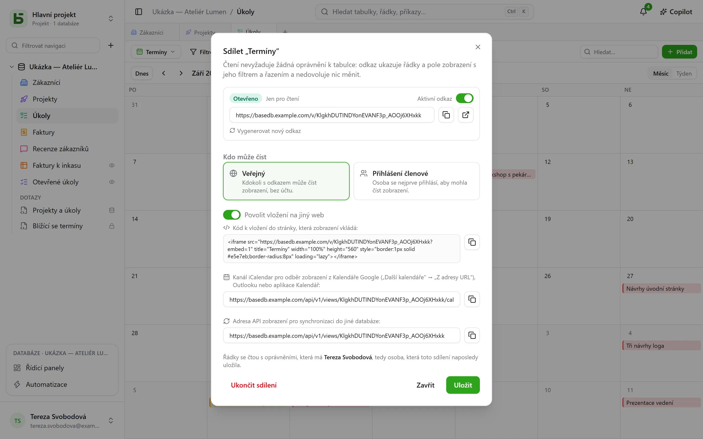
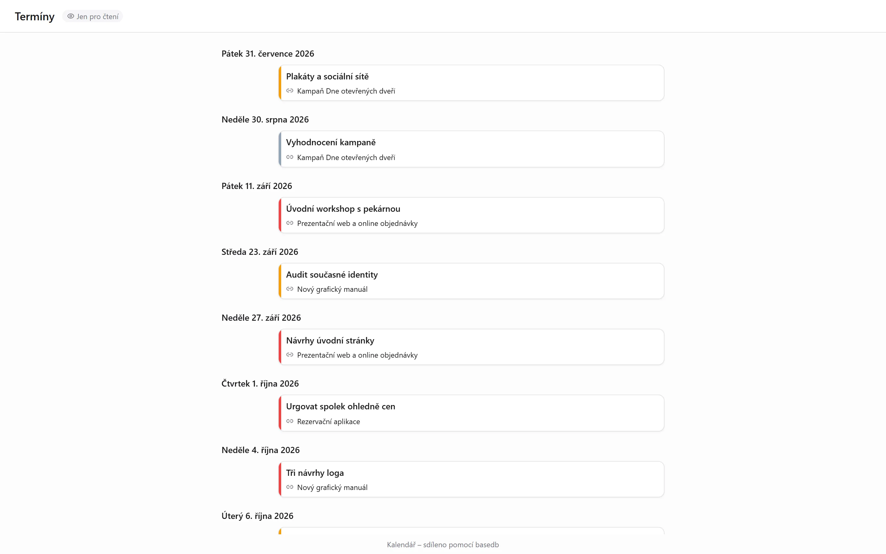

Datové zobrazení – mřížka, kanban, kalendář, časová osa, galerie, seznam – se **sdílí jen pro
čtení**: odkaz `/v/<jeton>` ho ukáže tomu, kdo nemůže otevřít basedb, aniž by umožnil cokoli
zapsat. Je to protějšek [sdílených formulářů](/basedb/cs/fonctionnalites/formulaires-partages/),
které umožňují odpovídat, aniž by cokoli ukázaly. Stejným způsobem se sdílí i
[řídicí panel](/basedb/cs/fonctionnalites/tableaux-de-bord/#sdílení-řídicího-panelu).

## Sdílení

Nabídka zobrazení → **Sdílet…**, pak:

| Přístup | Kdo čte |
|---|---|
| **Veřejný** | kdokoli, kdo má odkaz, bez účtu |
| **Přihlášení členové** | člen pracovního prostoru po přihlášení – případně jen z některých skupin |

Přepínač **Odkaz aktivní** odkaz pozastaví, aniž by se ztratil. Stránka se otevírá mimo
aplikaci: žádný postranní panel, žádný název databáze ani tabulky – jen zobrazení, jeho
filtry, jeho sloupce a nic jiného. Kalendář nebo časová osa se v ní čte jako diář.

## Jménem koho se čte

Zobrazení se čte s **oprávněními osoby, která ho zveřejnila**, znovu posuzovanými při každém
čtení: pole, které je před ní skryté, se nezobrazí, a pokud ztratí přístup k tabulce, odkaz
přestane cokoli ukazovat.

## Vložení na jiný web

Zaškrtněte **Povolit vložení na jiný web**: dialog poskytne **kód pro vložení** `<iframe>`,
který vložíte do intranetu, wiki nebo prezentačního webu. Bez tohoto zaškrtnutí stránka
odmítne zobrazit se v rámci jiného webu.

## Kalendář ve vaší kalendářové aplikaci

U kalendáře nebo časové osy sdílených **veřejně** poskytne dialog **adresu kalendářového
kanálu**: kanál iCalendar (`…/calendar.ics`, nejvýše 1 000 událostí), který lze odebírat
v Kalendáři Google, Outlooku nebo Kalendáři Apple. Termíny týmu se objeví v kalendáři
každého a sledují tabulku.

## Zdroj pro jiné databáze

Veřejný odkaz poskytuje také **adresu API zobrazení**: řádky, které zobrazení ukazuje, ve
formátu JSON. [Synchronizovaná tabulka](/basedb/cs/integrations/synchronisation/) – na této
nebo jiné instanci – ho může použít jako zdroj.

## Omezení

- Čtení je omezeno na 120 požadavků za minutu na adresu a odkaz.
- Formulář se nesdílí ke čtení: sdílí se [pro příjem odpovědí](/basedb/cs/fonctionnalites/formulaires-partages/).
