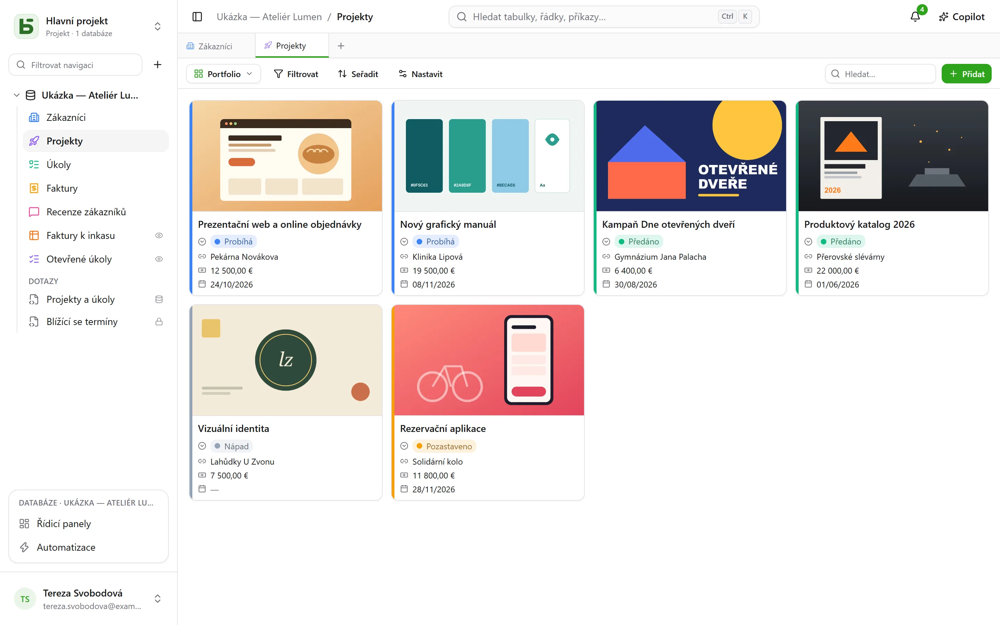
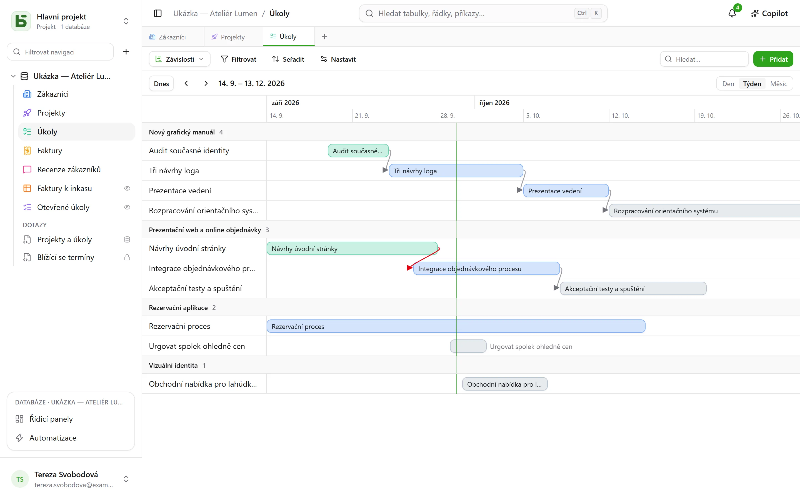
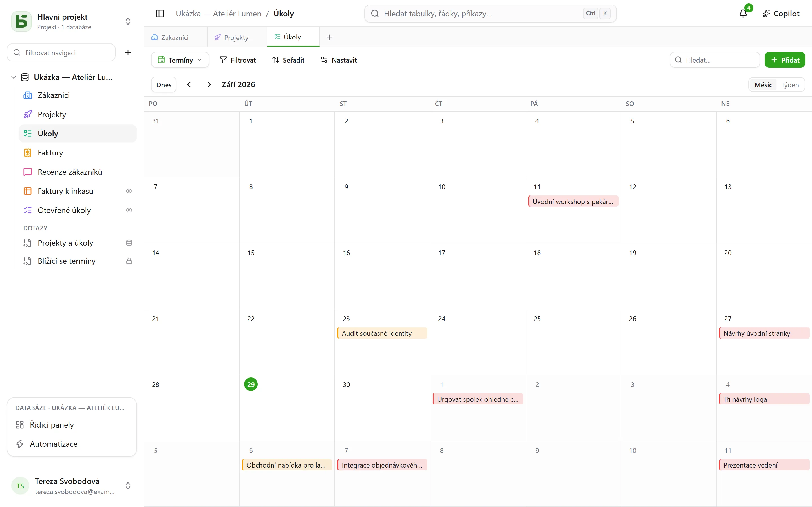
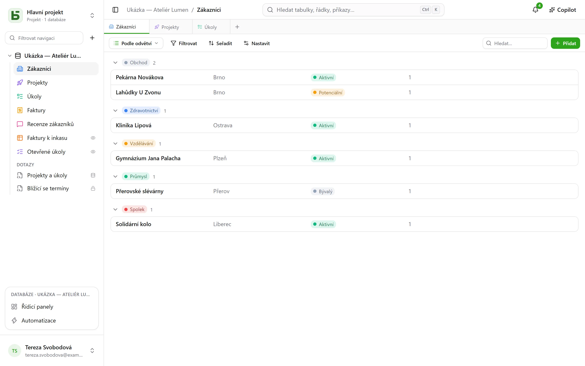

Tabulku lze zobrazit **deseti způsoby**. Zobrazení nekopíruje žádná data a nedává o nic víc
oprávnění než samotná tabulka.

:::note
Tato zobrazení jsou způsoby, jak ukázat **jednu** tabulku. [Pohled SQL](/basedb/cs/fonctionnalites/requetes-et-vues-sql/)
je něco jiného: skutečný pohled PostgreSQL napsaný v SQL nad tabulkami databáze a zařazený
mezi ně v postranním panelu.
:::

| Zobrazení | Co ukazuje | Co potřebuje |
|---|---|---|
| **Mřížka** | řádky, filtrované, řazené, seskupené, se zvolenými sloupci | – |
| **Kanban** | karty ve sloupcích | jednoduchý výběr |
| **Kalendář** | řádky v jejich datu, po měsících nebo po týdnech | pole typu datum |
| **Časová osa** | pruhy mezi dvěma daty a jejich závislosti | počáteční datum |
| **Galerie** | karty s titulním obrázkem | – |
| **Seznam** | jeden řádek na záznam, ve sbalitelných skupinách | – |
| **Mapa** | každý řádek umístěný na mapě | adresa, nebo zeměpisná šířka a délka |
| **Formulář** | stránku otázek pro vytvoření řádku | – |
| **Dotazník** | tytéž otázky, jednu na obrazovku | – |
| **Kvíz** | otázky bodované, jednu na obrazovku, a na konci skóre | – |

## Přepínač zobrazení

Nachází se vlevo od „Filtrovat“. „Všechny řádky“ je mřížka tabulky, kterou nikdo neuložil
a nikdo ji nemůže odstranit; následují **společná zobrazení** v pořadí, které zvolil ten, kdo
databázi buduje, a pak **Moje zobrazení**. Dole **Vytvořit zobrazení** dělí deset druhů do dvou
skupin: ty, které **zobrazují řádky**, a ty, které **sbírají odpovědi** (formulář, dotazník,
kvíz).

- **Společné zobrazení** vidí všichni. Jeho vytvoření, konfigurace, přejmenování, změna
  pořadí nebo odstranění vyžaduje úroveň **Správa**. Může být **uzamčené**: ukazuje to zámek
  a nikdo ho nemůže upravit, dokud ho neodemkne.
- **Osobní zobrazení** vidíte jen vy a vyžaduje jen oprávnění číst tabulku. **Vytvořit osobní
  zobrazení**, nebo **Uložit jako zobrazení** po filtrování a řazení: každý si ukládá své
  vlastní způsoby čtení, aniž by cokoli změnil ostatním. **Duplikovat** společné zobrazení
  vytvoří jeho osobní kopii.

## Panel nástrojů

Nad mřížkou, v tomto pořadí:

- **Filtrovat** kombinuje podmínky podle polí;
- **Sloupce** volí, co se zobrazí – systémové sloupce jsou zvlášť, pod „Systémové
  informace“;
- **Seskupit** rozdělí řádky podle pole s jedinou hodnotou – jednoduchý výběr, vazba, osoba,
  datum, číslo, text, zaškrtávací políčko… – do sbalitelných skupin, každou s počtem za celý
  filtr;
- **Barvy** obarví řádky podle jednoduchého výběru nebo podle **pravidel** – filtr a barva,
  nejvýše dvacet – jako proužek, jako pozadí nebo obojí;
- **Výška řádků**: nízká, střední, vysoká, velmi vysoká;
- **Hledat…** vpravo hledá ve všech sloupcích už během psaní; Esc hledání vymaže. Platí také
  pro kanban, kalendář, časovou osu, galerii a seznam a nikdy se neukládá do zobrazení.

Pod každým sloupcem je **Souhrn** počítaný ze všech řádků filtru, nejen ze stránky:
vyplněné, prázdné, jedinečné hodnoty, součet, průměr, minimum, maximum, zaškrtnutá políčka.

## Kanban, kalendář, časová osa

- **Kanban** řadí karty podle jednoduchého výběru; přetažení karty upraví řádek, „+“ v záhlaví
  sloupce vytvoří řádek, který už tuto volbu má. Každá karta ukazuje nadpis, titulní obrázek,
  zvolená pole a **popis**, který cituje hodnoty řádku – „Livraison prévue le `{{Date}}` pour
  `{{Client}}`“ –, napsaný v nastavení zobrazení tlačítkem **Vložit pole**.
- **Kalendář** umístí každý řádek do jeho data, případně s koncovým datem; přetažením řádku
  z jednoho dne na jiný se řádek posune.
- **Časová osa** kreslí pruhy mezi počátečním a koncovým datem, seskupené podle jednoduchého
  výběru nebo vazby. S nastavením **Závisí na** – vazbou tabulky na sebe samu – spojí šipka
  každý úkol s úkoly, na kterých závisí, a je červená, když jde proti času.

## Galerie a seznam

- **Galerie** ukazuje karty: **titulní obrázek** (oříznutý nebo celý), velikost (malé,
  střední, velké karty), barvu podle jednoduchého výběru.
- **Seznam** ukazuje jeden řádek na záznam, **seskupený** podle jednoduchého výběru, vazby
  nebo osoby.

V kanbanu, galerii a seznamu lze karty a řádky **řadit ručně** přetažením – až 5 000; zvolené
řazení má před tímto pořadím přednost.

## Mapa

**Mapa** umístí každý řádek na jeho místo podle:

- **adresy** — krátkého textu, nejlépe ve formátu **Adresa** (viz
  [Tabulky a pole](/basedb/cs/fonctionnalites/tables-et-champs/)): „12 rue des Lilas, Lyon“;
- nebo **zeměpisné šířky** a **zeměpisné délky**, dvou číselných polí, umístěných tak, jak
  jsou.

Špendlík má **barvu** podle jednoduchého výběru, ukazuje **název** řádku při najetí myší a
kliknutím otevře jeho detail řádku. Mapa sleduje filtr a řazení zobrazení, až do 2 000 řádků.

Adresa je **umístěna jednou provždy** geokódovací službou instance — ve výchozím nastavení
službou OpenStreetMap —, v tempu, které tato služba udává: na nové mapě se špendlíky objevují
postupně, přibližně jeden za sekundu, a napříště hned. Štítek počítá umístěné řádky, adresy
ještě k umístění a ty, které se umístit nepodařilo: adresu, kterou se nepodařilo najít, je
třeba upřesnit (město, poštovní směrovací číslo), nikdy se mlčky nevyřazuje.

:::note[Co odchází z vašeho serveru]
Text adres odchází ke geokódovací službě a prohlížeč každého čtenáře načítá mapový podklad
z dlaždicového serveru. Provozovatel instance může zvolit jiné služby, nebo žádnou: viz
[Proměnné prostředí](/basedb/cs/hebergement/variables/#mapy-a-adresy).
:::

## Formulář a dotazník

Otázky se zaškrtnou a seřadí; každá má název, nápovědu, ukázkovou odpověď a může být povinná.
Formulář má svůj nadpis, úvodní text, popisek tlačítka a děkovnou zprávu. Vyplňuje se v
basedb, nebo se [sdílí odkazem](/basedb/cs/fonctionnalites/formulaires-partages/).

Na začátek není třeba nic nastavovat: nový formulář se ptá na to, co osoba odpovídá — ne na
stav, přiřazenou osobu ani vazby, které tým doplní později, pokud nejsou povinné —, nese
barvu své tabulky a světlý motiv, a každé prázdné pole ukazuje vhodný příklad. Všechno
ostatní se mění, kdykoli chcete:

- **Vzhled**: osm motivů — Světlý, Jemný, Úsvit, Oceán, Les, Noc, Papír, Minimalistický —,
  barva zvýraznění, písmo, zarovnání vlevo nebo na střed;
- **Předvyplnit dnešním datem**: otázka na datum přijde už vyplněná dnešním dnem — u data a času
  i časem —, který člověk ponechá nebo změní;
- **Zeptat se jen když…**: otázka se položí, jen když to vyžaduje dřívější odpověď
  („Sentiment je Negativní“, „Hodnocení je nejvýše 2“). Skrytá otázka není ani povinná, ani
  odeslaná;
- **Další možnosti**: tlačítka uvítání a odeslání, číslování, ukazatel průběhu, automatický
  přechod dál, zprávu a závěrečné tlačítko („Zpět na web“), konfety.

**Dotazník** zabírá celou obrazovku: uvítání, které řekne, kolik to zabere času, a pak jedna
otázka po druhé, která přijíždí zboku. Vše funguje i z klávesnice: **Enter** pro pokračování,
písmena **A**, **B**, **C**… pro výběr, **A** nebo **N** pro ano nebo ne, číslice pro
hodnocení — jediná volba sama přejde na další otázku. Odeslání se slaví: kreslící se fajfka a
konfety v barvách formuláře.

## Kvíz

Kvíz je dotazník, který počítá body. Pod každou otázkou se uvádí její **správná odpověď** a
to, kolik bodů je hodna — **1 bod**, pokud se nic neuvede, až do 100:

| Otázka | Správná odpověď |
|---|---|
| seznam možností | jedna volba |
| vícenásobný výběr | volby, které je třeba zaškrtnout, všechny a jen ony |
| zaškrtávací políčko | ano nebo ne |
| číslo, hodnocení | číslo |
| datum | den |
| krátký text, e-mail, URL | jedna nebo více přijímaných odpovědí, oddělených `;` — bez ohledu na velikost písmen a diakritiku |

Otázka bez správné odpovědi — jméno, komentář — se klade, ale nehodnotí se. Aby šlo kvíz
vytvořit, je potřeba aspoň jedna hodnocená otázka.

Sekce **Bodování** určuje zbytek:

- **Oprava**: **po každé otázce** — odpověď se ověří hned, zeleně, nebo červeně se správnou
  odpovědí, a skóre nahoře obrazovky roste —, **na konci** — nejprve skóre, pak správné
  odpovědi —, nebo **nikdy** — jen skóre, správné odpovědi zůstávají tajné;
- **Práh úspěšnosti**: procento bodů; závěrečná obrazovka pak řekne „Uspěch!“ nebo „Tentokrát
  ne…“;
- **Ukládat skóre do**: číselného pole tabulky, které dostane skóre z každé odpovědi. Seřaďte
  podle něj mřížku: to je žebříček. Pole nazvané „Score“, „Points“ nebo „Note“ se zvolí
  automaticky.

Závěrečná obrazovka ukazuje skóre ve vyplňujícím se prstenci, procenta, a pak, mimo režim
„nikdy“, každou hodnocenou otázku s danou odpovědí a správnou. Otázka, kterou skryla dřívější
odpověď, se do součtu nepočítá.

:::note
V aplikaci si správné odpovědi může přečíst každý, kdo smí zobrazení číst. Přes
[sdílený odkaz](/basedb/cs/fonctionnalites/formulaires-partages/#sdílený-kvíz) neopustí server
nikdy: opravuje a počítá je on.
:::

## Sdílení zobrazení

Datové zobrazení – mřížka, kanban, kalendář, časová osa, galerie, seznam – se **sdílí jen pro
čtení** odkazem, lze ho vložit na jiný web a z kalendáře se stane kalendářový kanál. Viz
[Sdílená zobrazení](/basedb/cs/fonctionnalites/vues-partagees/).

## Co čtenář nevidí

Zobrazení se **znovu promítá pro svého čtenáře**: pole, které je před ním skryté, zmizí ze
sloupců, z karet i z otázek. Zobrazení, jehož filtr cituje skryté pole, se nezobrazí vůbec:
bez svého filtru by ukázalo víc, než k čemu bylo vytvořeno.
