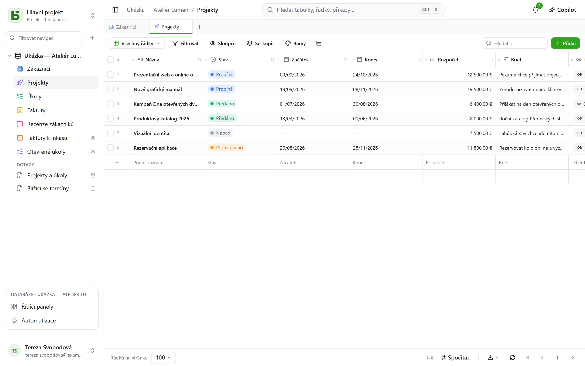

**basedb** je kolaborativní databáze v duchu kolaborativních tabulkových procesorů, kterou
si hostujete sami – s jedním rozdílem, který určuje všechno ostatní: **vaše data žijí ve
skutečných tabulkách PostgreSQL**, typovaných a srozumitelně pojmenovaných.

## Jednoduchý slib

Žádný generický model, žádné univerzální `JSONB`, žádné `field_1837`:

| V basedb | V PostgreSQL |
|---|---|
| Databáze „Ventes“ | schéma `b_t4z56fq_ventes` |
| Tabulka „Opportunités“ | tabulka `opportunites` |
| Pole „Échéance“ (Datum) | sloupec `echeance date` |
| Jednoduchý výběr „Statut“ | sloupec `text` a jeho omezení `CHECK` |
| Vazba „Client“ | sloupec `clients_id uuid` a jeho `FOREIGN KEY` |

Můžete tedy otevřít `psql`, nástroj BI nebo skript v Pythonu a číst svá data bez
prostřednictví produktu – a dokonce do nich zapisovat: omezení platí dál a historie zápis
zaznamená.

## Pro koho?

- **Netechnické týmy**, které chtějí mřížku, zobrazení a formuláře, aniž by čekaly na
  vývoj.
- **Technické týmy**, které odmítají mít data uzavřená v proprietárním formátu a chtějí
  připojit své obvyklé nástroje.
- **AI agenti**, kteří najdou server MCP, jasná oprávnění a návrhy předkládané ke schválení
  člověku.

## Co v něm najdete

- Typované [tabulky a pole](/basedb/cs/fonctionnalites/tables-et-champs/), vazby, které jsou
  skutečnými cizími klíči – i vícenásobné –, vzorce počítané PostgreSQL, vyhledávání
  a agregace přes vazby.
- Deset [zobrazení](/basedb/cs/fonctionnalites/vues/): mřížka, kanban, kalendář, časová osa,
  galerie, seznam, mapa, formulář, dotazník, kvíz – společná nebo osobní.
- [Formuláře](/basedb/cs/fonctionnalites/formulaires-partages/) a
  [zobrazení](/basedb/cs/fonctionnalites/vues-partagees/) sdílená odkazem a kalendáře, které
  lze odebírat v kalendářové aplikaci.
- [Spolupráce](/basedb/cs/fonctionnalites/collaboration/): komentáře a zmínky, oznámení,
  aktualizace v reálném čase.
- [Automatizace](/basedb/cs/fonctionnalites/automatisations/) a
  [řídicí panely](/basedb/cs/fonctionnalites/tableaux-de-bord/) s jejich otázkami, sestavované myší nebo v SQL.
- [SQL pro každého](/basedb/cs/fonctionnalites/requetes-et-vues-sql/) s vlastními oprávněními:
  uložené dotazy pod tabulkami a skutečné pohledy PostgreSQL zařazené mezi ně.
- [Šablony databází](/basedb/cs/fonctionnalites/modeles/), které převezmete z galerie nebo si
  je vyžádáte od AI.
- [Prostředí](/basedb/cs/fonctionnalites/environnements/) – produkční, testovací –, která lze
  porovnávat a migrovat.
- [Historie](/basedb/cs/fonctionnalites/historique/) každého zápisu včetně přímého SQL
  a Ctrl+Z pro vrácení změny.
- [Oprávnění](/basedb/cs/fonctionnalites/droits/) podle skupin, až na úroveň pole.
- [REST API](/basedb/cs/integrations/api-rest/), [server MCP](/basedb/cs/integrations/mcp/),
  [webhooky](/basedb/cs/integrations/webhooks/), Slack a
  [synchronizované tabulky](/basedb/cs/integrations/synchronisation/).
- Volitelně [AI](/basedb/cs/fonctionnalites/ia/): pole počítaná modelem, Copilot.

## Stav projektu

basedb je svobodný software (AGPL-3.0), který vyvíjí [Eodia](https://eodia.com/fr/),
softwarové studio stavějící na AI, a je v aktivním vývoji. Jádro, API, server MCP
a rozhraní fungují a pokrývá je více než tisíc testů;
[plán vývoje](/basedb/cs/feuille-de-route/) říká, co teprve přijde. Jeho
[architektonický dokument](https://github.com/eodia/basedb/tree/main/docs/architecture),
zhruba dvacet kapitol, stanovuje každé rozhodnutí.

:::tip[Vyzkoušet]
Po naklonování repozitáře stačí jediný příkaz: `docker compose up -d`. Viz
[instalace](/basedb/cs/guides/installation/).
:::
