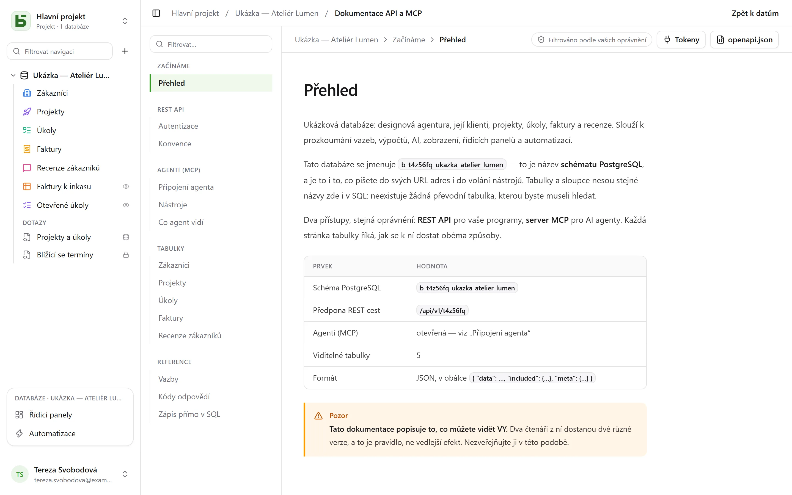

REST API je totéž, které používá rozhraní: **neexistuje žádná soukromá cesta**. Jeho URL nesou
fyzické názvy – ty, které čtete i v SQL.

```text
/api/v1/<tenant>/data/<base>/<table>
/api/v1/t4z56fq/data/b_t4z56fq_ventes/opportunites
```

## Token

V rozhraní zvolte v nabídce **⋯** databáze → **API a agenti** → **Tokeny API a MCP…**: zde
vytvoříte **integrační token** omezený na tuto databázi, ve výchozím nastavení jen pro čtení,
poté co potvrdíte své heslo. Zobrazí se jen jednou; uložte ho do proměnné prostředí.

Token čte, a pokud byl vytvořen pro zápis, také vytváří a upravuje, **nikdy nic
neodstraňuje** a nikdy nemá víc oprávnění než osoba, která ho vytvořila.

```bash
export BASEDB_TOKEN=bdb_…
curl "http://localhost:3000/api/v1/t4z56fq/data/b_t4z56fq_ventes/opportunites?limit=20" \
  -H "Authorization: Bearer $BASEDB_TOKEN"
```

## Čtení

| Parametr | Role |
|---|---|
| `filter` | čitelný výraz: `statut eq "gagne" and montant gte 10000` |
| `sort` | `-montant,nom` |
| `fields` | sloupce, které se mají vrátit |
| `limit`, `after` | stránkování šifrovaným kurzorem: `meta.next_cursor` stránky, předaný jako `after`, vrátí následující (`meta.has_next_page`) |
| `links=display` | vazby s jejich zobrazovanou hodnotou |
| `count=exact` | celkový počet, omezený na 100 000 |
| `variables=raw` | dlouhé texty tak, jak jsou napsané, včetně `{{colonne}}`, místo s [hodnotami řádku](/basedb/cs/fonctionnalites/tables-et-champs/#formátovaný-text-a-proměnné) |

Operátory: `eq`, `ne`, `eq_ci`, `contains`, `starts_with`, `ends_with`, `in`, `is_null`,
`gt`, `gte`, `lt`, `lte`, `between`, kombinované pomocí `and`, `or`, `not` a závorek. Filtr
prochází vazbou: `clients_id.ville eq "Lyon"`.

## Zápis

```bash
curl -X POST "http://localhost:3000/api/v1/t4z56fq/data/b_t4z56fq_ventes/opportunites" \
  -H "Authorization: Bearer $BASEDB_TOKEN" -H "content-type: application/json" \
  -d '{"values": {"nom": "Audit RGPD", "statut": "nouveau", "montant": 12000}}'
```

`PATCH …/<table>/<_id>` upraví řádek se stejným tělem `{"values": {…}}`. Chyby mají jednotný
tvar: `{ "code": "…", "details": {…}, "request_id": "…" }`, se stabilním kódem pro každou
příčinu.

Každý zápis vrací hlavičku `x-basedb-transaction`: když ji předáte do
`POST /api/v1/<tenant>/history/undo` (`{"transaction": "…"}`), zápis se vrátí, stejně jako
Ctrl+Z v rozhraní – vrácení je odmítnuto, pokud byl řádek mezitím upraven.

## Nad rámec řádků

Se stejným tokenem:

| Cesta | Role |
|---|---|
| `GET …/data/<base>/<table>/aggregate` | souhrny nad všemi řádky filtru: `aggregates=montant:sum,nom:filled`, `group=statut` |
| `GET …/data/<base>/<table>/<_id>/comments`, `POST` | čtení a zápis komentářů řádku |
| `POST /api/v1/<tenant>/automations/<id>/run` | spuštění automatizace se spouštěčem tlačítkem nad řádkem (`{"record": "…"}`) |
| `GET /api/v1/<tenant>/meta/bases/<base>/dashboards` | řídicí panely databáze |
| `GET /api/v1/<tenant>/meta/users` | členové pracovního prostoru, pro pole Osoba |
| `GET /api/v1/<tenant>/meta/templates` | šablony databází z galerie |
| `GET /api/v1/<tenant>/events?base=<base>&table=<table>` | sledování tabulky v reálném čase: signály, znovu čtené pomocí cest výše (viz [Webhooky](/basedb/cs/integrations/webhooks/#bez-webhooku-sledování-tabulky)) |

[Sdílená zobrazení](/basedb/cs/fonctionnalites/vues-partagees/) se čtou bez účtu:
`GET /api/v1/views/<jeton>` a `…/rows` v JSON, `…/calendar.ics` v iCalendar.

Budování – vytvoření automatizace, řídicího panelu, integrace – zůstává vyhrazeno relaci
v rozhraní: token čte a zapisuje řádky, databázi nemění.

## Vytvoření databáze ze šablony

Aplikace, která se instaluje, vytvoří svou databázi **jedním voláním**: server použije
šablonu — tabulky, pole, vazby, ukázkové řádky, zobrazení, řídicí panely, automatizace —
a pokud některý krok selže, nezanechá po sobě žádnou databázi.

```bash
curl -X POST "http://localhost:3000/api/v1/t4z56fq/admin/bases" \
  -H "Authorization: Bearer $ACCES" -H "content-type: application/json" \
  -d '{"template": "crm", "label": "Ventes", "rows": false}'
```

`template` je klíč šablony z galerie, nebo celá šablona ve [formátu šablon](/basedb/cs/fonctionnalites/modeles/).
S hlavičkou `Accept: application/x-ndjson` přichází odpověď po řádcích: jeden řádek
`{"step": …}` na krok, a nakonec vytvořená databáze. Toto volání vyžaduje přístupový token
osoby, která může vytvořit databázi (`POST /auth/session/access`, po přihlášení): integrační
token otevře jen existující databázi.

## Ověření tokenu

Tokeny basedb se neověřují mimo basedb. Aplikace, která nějaký obdrží — například nástroj
otevřený z basedb s tokenem dané osoby —, se zeptá, co vlastně platí (introspekce, RFC 7662),
a to svým vlastním integračním tokenem:

```bash
curl -X POST "http://localhost:3000/auth/introspect" \
  -H "Authorization: Bearer $BASEDB_TOKEN" \
  --data-urlencode "token=$JETON_RECU"
```

```json
{ "active": true, "token_type": "access_token",
  "sub": "0195a…", "email": "claire@example.com", "name": "Claire Martin",
  "tenant": "t4z56fq", "groups": ["Commerciaux"], "exp": 1790000000 }
```

Token, který neplatí — neznámý, vypršelý, odvolaný, uzavřená relace, jiný pracovní prostor —,
odpoví `{"active": false}`, aniž by řekl proč. Odpověď se čte naživo: odhlášení se projeví
okamžitě. U integračního tokenu odpověď navíc uvádí databázi, kterou otevírá (`base`), jeho
přístup (`read` nebo `write`) a jeho přístupové cesty.

## Vygenerovaná dokumentace

Každá databáze má svou stránku **Dokumentace API a MCP**: pro každou tabulku její koncové body,
sloupce a příklady v cURL a JavaScriptu. Je **filtrovaná podle vašich oprávnění** – dva
čtenáři dostanou dvě verze –, napsaná **v jazyce vaší obrazovky**, a existuje také ve formátu
OpenAPI 3.1 (`/api/v1/<tenant>/meta/bases/<base>/openapi.json`). Názvy, cesty a chybové kódy
zůstávají stejné ve všech jazycích.


