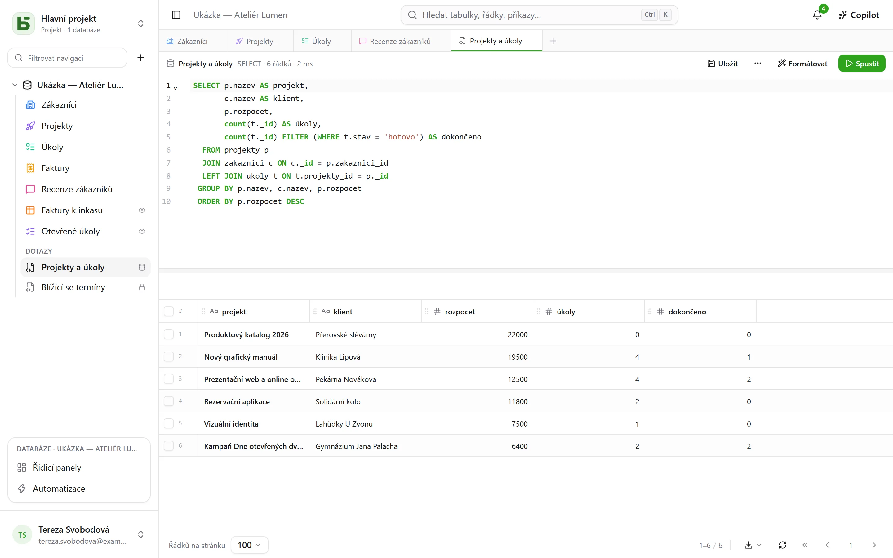

To je smyslem existence basedb: **vaše tabulky jsou skutečné tabulky**. Každý klient
PostgreSQL je čte pod jejich názvem.

## Názvy

| Objekt | Fyzický název | Příklad |
|---|---|---|
| Databáze | schéma `b_<tenant>_<nom>` | `b_t4z56fq_ventes` |
| Testovací prostředí | schéma s příponou | `b_t4z56fq_ventes_recette` |
| Tabulka | její slugifikovaný název | `opportunites` |
| Pole | jeho slugifikovaný název | `echeance` |
| Vazba | `<table cible>_id` | `clients_id` |
| [Pohled SQL](/basedb/cs/fonctionnalites/requetes-et-vues-sql/) | jeho technický název ve schématu databáze | `factures_a_encaisser` |

Stránka **Dokumentace API a MCP** každé databáze je uvádí všechny a `\d` v `psql` ukazuje
popisy (`COMMENT ON`).

## V rozhraní

**+** na liště záložek nebo nabídka **⋯** databáze → **Dotaz SQL**: editor se
zvýrazněním syntaxe a doplňováním, jehož výsledek se zobrazí ve stejné mřížce jako vaše
tabulky.



- **Každý v něm čte se svými oprávněními**: úroveň Správa má celou databázi včetně zápisů;
  ostatní členové píší SQL jen pro čtení, kde uzavřená tabulka neexistuje a skryté pole
  zmizí.
- Dotaz **se ukládá** pod tabulky – pro sebe, pro celou databázi nebo pro skupiny – a pokud
  chcete, stane se z něj **pohled SQL**: skutečný pohled PostgreSQL, zařazený mezi tabulky
  a čitelný z `psql`.

Vše je podrobně popsáno v článku [Dotazy a pohledy SQL](/basedb/cs/fonctionnalites/requetes-et-vues-sql/).

## Z psql

S dodaným `docker-compose.yml` je PostgreSQL publikován na `127.0.0.1:5432`:

```bash
psql "postgres://basedb:<POSTGRES_PASSWORD>@localhost:5432/basedb"
```

```sql
SET search_path = b_t4z56fq_ventes;

SELECT o.nom, o.montant, c.nom AS client
FROM opportunites o
JOIN clients c ON c._id = o.clients_id
WHERE o.statut = 'gagne';
```

Tento účet je vlastníkem databáze: čte vše, a oprávnění basedb se na něj nevztahují. Pro
nástroj BI vytvořte raději samostatnou roli s vlastními příkazy `GRANT`. Pokud tabulka nese
[pravidlo pro řádky](/basedb/cs/fonctionnalites/droits/#až-na-úroveň-řádku), PostgreSQL na ni
uplatňuje zabezpečení na úrovni řádků: taková role v ní nevidí žádný řádek bez atributu
`BYPASSRLS` nebo vlastní politiky.

## Zápis v SQL

Je povolen. Omezení (jednoduché výběry, vazby, URL, povinná pole) hlídá PostgreSQL a odmítne
neplatnou hodnotu stejně jako rozhraní. A zápis se **zaznamená do historie**: historie ho
zobrazí jako „Přímá relace SQL“ s relací, která ho provedla, a lze ho vrátit stejně jako
ostatní.

:::caution
Změna **struktury** v SQL (`ALTER TABLE`) obchází katalog basedb, který by o ní nevěděl.
Použijte rozhraní, API nebo návrh agenta: migrační mechanismus vše naplánuje, zamyká jen
krátce a udržuje katalog přesný.
:::
