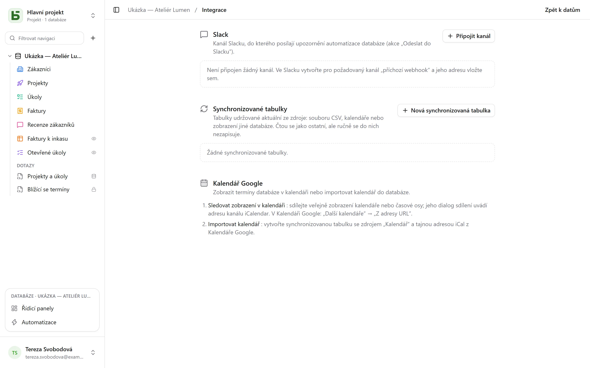

Obrazovka **Integrace** databáze se otevírá z nabídky profilu vlevo dole. Vyžaduje úroveň
**Správa** a sdružuje vše, co propojuje databázi s ostatními vašimi nástroji.

## Slack

**Připojit kanál**: ve Slacku vytvořte pro požadovaný kanál *příchozí webhook* a pak vložte
jeho adresu (`https://hooks.slack.com/…`, jediný přijímaný původ). **Otestovat** odešle
zkušební zprávu. Adresa se hned při uložení zašifruje a už se nikdy nezobrazí.

Připojený kanál je pak akcí [automatizací](/basedb/cs/fonctionnalites/automatisations/):
**Odeslat do Slacku**, se zprávou, která cituje řádek – „Nová negativní recenze od
{{Auteur}}: {{Avis}}“.

## Kalendáře

Dva směry, dva prostředky:

- **Zobrazení v kalendáři**: veřejně sdílejte zobrazení typu kalendář nebo časová osa; jeho
  dialog sdílení poskytne adresu **kanálu iCalendar**, který lze odebírat z Kalendáře Google
  („Další kalendáře“ → „Z adresy URL“), z Outlooku nebo z Kalendáře Apple. Viz
  [Sdílená zobrazení](/basedb/cs/fonctionnalites/vues-partagees/#kalendář-ve-vaší-kalendářové-aplikaci).
- **Import kalendáře**: vytvořte synchronizovanou tabulku se zdrojem „Kalendář“ a s tajnou
  adresou iCal daného kalendáře.

## Synchronizované tabulky

Synchronizovaná tabulka je **udržována aktuální ze zdroje**: čte se, filtruje a zobrazuje
v zobrazeních jako ostatní, ale nedá se do ní zapisovat ručně – připomíná to štítek
„Synchronizováno“ a API odmítne jakýkoli zápis (`TABLE_SYNCED`).

| Zdroj | Čím se tabulka stane |
|---|---|
| **Online soubor CSV** | jeden sloupec pro každý sloupec souboru, typovaný podle obsahu: číslo, datum nebo text |
| **Kalendář** (Kalendář Google, iCalendar) | jedna událost na řádek: název, začátek, konec, místo, popis |
| **Sdílené zobrazení z basedb** | řádky [sdíleného zobrazení](/basedb/cs/fonctionnalites/vues-partagees/#zdroj-pro-jiné-databáze) na této nebo jiné instanci |

**Nová synchronizovaná tabulka** zvolí zdroj a interval – od každých 15 minut po jednou
denně; **Synchronizovat** ji načte okamžitě. Každý průchod vytvoří, upraví a odstraní, co je
potřeba, aby tabulka odpovídala zdroji, přičemž se orientuje podle pole **Synchronizační
klíč**. Všechny tyto zápisy procházejí historií.

**Zastavit** synchronizaci udělá z tabulky běžnou tabulku: její řádky zůstanou a lze do nich
opět ručně zapisovat.

## Omezení

- Zdroj se čte v limitu 5 MB, 10 000 řádků a 10 sekund.
- Neúspěšný zdroj nic nesmaže: tabulka si ponechá své řádky až do dalšího průchodu.
- Sloupec, který se ve zdroji objeví po vytvoření tabulky, se nepřidá.
- Slack se připojuje příchozím webhookem, zatím ne aplikací Slack.
