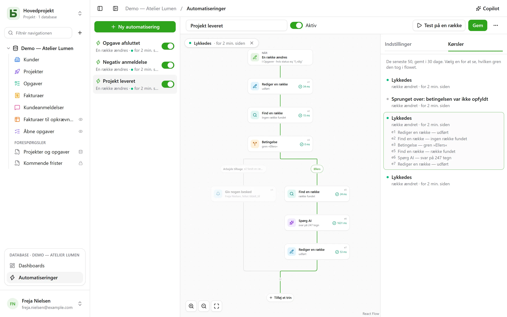

En automatisering siger **hvornår**, **hvis** og **så**: når en opgave skifter til »Fait«,
notér tidspunktet; når en negativ anmeldelse kommer ind, giv den ansvarlige besked, og skriv på
Slack; hver mandag kl. 9, opret rækken til teammødet. Og når én handling ikke er nok, følger den
et **flow**: find en række, tag den ene eller den anden gren alt efter, hvad den siger, gentag
trin for hver række, der matcher et filter, og genbrug i et trin det, som et tidligere trin har
fundet eller skrevet, **vente** tre dage før en rykker, sende en **PDF** som vedhæftning.

De åbnes fra **Automatiseringer** i blokken for den åbne database nederst i sidepanelet og kræver
niveauet **Administrere**.



## Flowet

Flowet tegnes oppefra og ned: udløseren og derefter hvert trin. Et **+** på en linje åbner
listen over trin, ordnet efter kategori — Rækker, Kommunikere, Dokumenter, AI, Logik — med en
søgning, og tilføjer det valgte trin på det sted; et kort åbner sine indstillinger til højre. En
enkel automatisering — en udløser og en handling — fylder to kort og indstilles som før.

## Hvornår

| Udløser | Indstillinger |
|---|---|
| **En række oprettes** | tabellen |
| **En række ændres** | tabellen og om nødvendigt kun de felter, der skal overvåges |
| **På et fast tidspunkt** | hver time, hver dag eller hver uge, på det valgte klokkeslæt og i den valgte tidszone |
| **Der klikkes på en knap** | et [Knap-felt](/basedb/da/fonctionnalites/tables-et-champs/#knap) i tabellen |
| **En række slettes** | tabellen; trinnene citerer rækken, som den var |
| **En række kommer ind i et filter** | tabellen og filteret: automatiseringen starter, når en række kommer ind i det, og starter først igen, når den er kommet ud af det igen — »en faktura bliver forsinket«, ikke »en forsinket faktura ændres« |
| **En dato indtræffer** | et Dato-felt i tabellen, en forskydning — tre dage før, selve dagen, en uge efter — og klokkeslættet: rykkere for forfaldsdatoer, kontraktårsdage |
| **En webhook modtages** | intet: automatiseringen får sin egen adresse, som et andet program kalder ([detaljer](#en-tjeneste-der-kalder-basedb)) |

En udløser på rækker ser **alle** skrivninger: brugerfladen, API'et, en agent, en delt formular og
endda direkte SQL — automatiseringerne tager udgangspunkt i historikken, som fanger dem alle.

## Kun hvis

En valgfri betingelse i [filtersproget](/basedb/da/integrations/api-rest/#læs) —
`statut eq "fait"`, `montant gte 10000 and payee eq false` — evalueret på rækken **i det øjeblik,
der skal handles**. En kørsel, hvis betingelse ikke er opfyldt, bliver »sprunget over« og siger
det.

## Så

Op til fyrre trin, i rækkefølge; det første, der mislykkes, stopper de efterfølgende — undtagen
i en **Prøv**-blok ([detaljer](#prøv)).

| Trin | Hvad det gør |
|---|---|
| **Rediger en række** | skriver værdier i den række, der udløste — eller i den, som et trin har fundet eller oprettet |
| **Opret en række** | i denne tabel eller en anden i databasen |
| **Find en række** | den første række i en tabel, der matcher et filter, så de efterfølgende trin kan citere eller redigere den |
| **Giv nogen besked** | en [notifikation](/basedb/da/fonctionnalites/collaboration/#notifikationer) til udvalgte personer eller til personen i et Person-felt |
| **Send en e-mail** | til personer i teamet, til personen i et Person-felt, til adressen i et E-mail-felt — en kunde, en leverandør — eller til skrevne adresser; emnet og teksten citerer rækken og de foregående trin |
| **Kald en webhook** | en HTTPS-anmodning til en tjeneste — metode, adresse, headere og brødtekst, som du selv bestemmer ([detaljer](#kald-en-tjeneste)); svaret kan derefter citeres |
| **Send til Slack** | en besked i en [forbundet](/basedb/da/integrations/synchronisation/#slack) kanal |
| **Spørg AI** | et svar fra [AI-udbyderen](/basedb/da/fonctionnalites/ia/) på en instruktion, der citerer rækken og de tidligere trin — skriv, opsummér, klassificér —, læst som en tekst, et tal, ja eller nej, en dato eller et valg fra en liste |
| **Betingelse** | flere grene: den første, hvis betingelse er opfyldt, tages, »Ellers« når ingen er det; grenene mødes igen bagefter |
| **For hver række** | de trin, den indeholder, én gang for hver række i en tabel, der matcher et filter ([detaljer](#for-hver-række)) |
| **Slette en række** | rækken, der udløste, eller den, et trin har fundet — den går i papirkurven |
| **Tælle og summere** | antallet af rækker i et filter, deres sum, deres gennemsnit, deres minimum eller maksimum, til at citere eller teste bagefter |
| **Generer en PDF** | [dokumentet](/basedb/da/fonctionnalites/documents/) for en række, lagt i et Fil-felt eller sendt som vedhæftning til en e-mail |
| **Vent** | en varighed, eller indtil datoen i et felt ([detaljer](#vent)) |
| **Prøv** | nogle trin, og andre, der skal udføres, hvis ét af dem mislykkes ([detaljer](#prøv)) |
| **Start en automatisering** | en anden automatisering i databasen, på en række i dens tabel |

En søgning, der ikke finder noget, stopper ikke flowet: de trin, der skulle redigere dens række,
springes over. Vil du gøre noget andet i det tilfælde, tilføjer **Hvis ingen række findes …**
under søgningen en betingelse, der tester det.

En **betingelse** tester en række med et filter, eller en **værdi**: AI'ens svar, koden fra en
webhook, en total — »`{{e2.reponse}}` er lig med Urgent«, »`{{e3.somme.montant}}` er større end
eller lig med 1000«. Tal sammenlignes som tal, tekster uden accenter eller store bogstaver.

## For hver række

Trinnet **For hver række** læser de rækker i en tabel, der matcher dets filter — tomt: alle —,
i den valgte rækkefølge, op til dets grænse (50 som standard, højst 200), og udfører derefter
én gang for hver af dem de trin, der er placeret i dets ramme. »Hver mandag, ryk for ubetalte
fakturaer« skrives: **På et fast tidspunkt**, derefter **For hver række** af fakturaer
`payee eq false and relancee eq false`, og i løkken en e-mail til fakturaens kontakt og
**Rediger en række**, der afkrydser »Relancée«.

I løkken navngiver trinnets id **gennemgangens række**: `{{e1.client}}` citerer den, og
**Rediger en række** foreslår den blandt de rækker, der kan redigeres. Efter løkken fortæller
`{{e1.nombre}}`, hvor mange rækker den har gennemgået — til en opsummering på Slack, for
eksempel. Filteret kan citere det foregående: udløst af en betalt faktura,
`facture eq {{_id}}` gennemgår dens detaljelinjer.

Ud over grænsen venter de resterende rækker på den næste kørsel, som siger det: sørg for, at de
behandlede rækker falder uden for filteret — et afkrydsningsfelt »relancée«, en dato — så de
alle bliver behandlet hen over flere kørsler. En løkke kan ikke indeholde en anden, og en
kørsel stopper efter to minutter.

## Vent

Trinnet **Vent** sætter kørslen på pause — tre timer, to dage — eller indtil datoen i et felt på
en række, med en forskydning og et klokkeslæt: »dagen før forfaldsdatoen, kl. 9«. Kørslen vises
som **På pause** under fanen **Kørsler**, med datoen for dens genoptagelse.

Den genoptager ved det næste trin ved at **genindlæse** sine rækker: »tre dage efter afsendelsen
af tilbuddet, hvis det stadig ikke er accepteret, ryk« skrives som **Vent** 3 dage, derefter en
betingelse på tilbuddets status, som den er den dag. Deaktivering af automatiseringen stopper
kørsler, der er på pause; en ventetid kan ikke placeres i en løkke eller i en **Prøv**-blok, og
varer højst et år.

## Prøv

Blokken **Prøv** har to grene. Den første udføres; hvis et af dens trin mislykkes, fortsætter
flowet med den anden, **Ved fejl**, som citerer fejlen — `{{e4.erreur}}`, koden, og
`{{e4.etape}}`, trinnet —, og fortsætter derefter efter blokken. Det gør det muligt at give
nogen besked, når en tjeneste ikke svarer, uden at stoppe alt.

Mere enkelt: en webhook kan **gentage sig selv** op til tre gange efter en fejl i tjenesten, og
en løkke kan **fortsætte**, selv om en række er mislykket.

## En PDF og en e-mail

**Generer en PDF** laver dokumentet for en række — med en [dokumentskabelon](/basedb/da/fonctionnalites/documents/)
for dens tabel, eller oversigten over alle dens felter — og kan lægge det i et Fil-felt.
**Send en e-mail** kan derefter vedhæfte det, sammen med filerne fra et Fil- eller Billede-felt:

- en e-mail **til hver enkelt**, eller **én enkelt til alle**, med modtagere **i kopi**;
- en besked i **formateret tekst** — fed, lister, links — der citerer rækken;
- en **svaradresse**: din egen som standard, eller adressen fra et E-mail-felt;
- op til 50 modtagere, 10 vedhæftede filer og 15 MB.

»Når et tilbud går til Accepteret, send fakturaen til kunden, bogholderiet i kopi«:
**En række kommer ind i et filter** `statut eq "accepte"`, **Generer en PDF** med skabelonen
Faktura, **Send en e-mail** til kundens E-mail-felt, med fakturaen vedhæftet.

## En tjeneste, der kalder basedb

Med udløseren **En webhook modtages** har automatiseringen sin egen hemmelige adresse, som skal
gives til det program, der skal starte den — en webshop, en ekstern formular, et
automatiseringsværktøj:

```bash
curl -X POST "https://basedb.example.com/api/v1/hooks/<secret>" \
  -H "content-type: application/json" \
  -d '{"client": {"nom": "Dupont"}, "total": 120}'
```

Trinnene citerer det, der er sendt: `{{trigger.client.nom}}`, `{{trigger.total}}`; en formular
læses på samme måde, en tekst med `{{trigger.texte}}`. Adressen kopieres fra udløserens
indstillinger; **Skift adresse** erstatter den, og den gamle ophører med det samme. Et kald får
`202` som svar, og automatiseringen kører i løbet af sekundet.

## Kald en tjeneste

Trinnet **Kald en webhook** sender som standard automatiseringens data som en `POST`: den
valgte række og det, de foregående trin har fundet eller skrevet. For at tale med en tjeneste,
som den forventer det, indstiller du:

- **metoden**: `POST`, `PUT`, `PATCH`, `GET` eller `DELETE` — de to sidste uden brødtekst;
- **adressen**, der kan citere efter sin vært — `https://api.exemple.fr/clients/{{e2.numero}}`;
  hver værdi kodes der;
- **headere**, hvis værdi kan citere: `Idempotency-Key: {{_id}}`;
- **brødteksten**: automatiseringens data, en **JSON at sammensætte**, en **formular** (et
  `nøgle=værdi`-par pr. linje) eller en **tekst**. I en JSON er et citat i anførselstegn tekst,
  og uden for anførselstegn en værdi — et tal, ja eller nej, en liste:

```json
{ "facture": "{{e1.numero}}", "montant": {{e1.montant}}, "payee": {{e1.payee}} }
```

En API-nøgle eller et token sættes i en **hemmelig** header (hængelåsen): krypteret med
instansnøglen bliver den aldrig vist igen — hverken på skærmen, via API'et eller til Copilot —
og sendes kun til den vært, du har givet den til. Skifter adressens vært, skal værdien gives
igen; **Erstat** indtaster en ny.

## Spørg AI

Ligesom et [AI-felt](/basedb/da/fonctionnalites/ia/#ai-tilvalget-for-et-felt) sender trinnet sin
instruktion til udbyderen, hvor hvert citat er erstattet af sin værdi:

```text
Cet avis de {{auteur}} demande-t-il une action de notre part ? {{avis}}
```

Du vælger det **forventede svar** — en fri eller kort tekst, et tal, ja eller nej, en dato, en
webadresse eller et valg fra en liste, som kan hentes fra et Enkeltvalg-felt. Modellen får det at
vide, og et svar, der ikke indeholder et sådant, får trinnet til at mislykkes. De efterfølgende
trin citerer det med `{{e1.reponse}}`: i titlen på en oprettet opgave, i en besked eller i et
Enkeltvalg-felt, hvor det placeres under valget med samme etiket.

Det, instruktionen citerer, sendes til udbyderen: trinnet beder om dit **samtykke**, som skal gives
igen, når instruktionen ændres. Hvert kald logges og tæller, sammen med AI-felterne, med i
`BASEDB_AI_FIELD_QUOTA` (300 i timen som standard). AI gør intet af sig selv: det er de trin, der
er placeret efter den, som skriver eller giver besked.

## Citering

Værdier, beskeder og filtre citerer det foregående via knappen **{ }** ved siden af hver
tekst:

- `{{Titre}}`, `{{_id}}`: den række, der udløste;
- `{{e2.titre}}`, `{{e2._id}}`: den række, der blev fundet, oprettet eller redigeret af trinnet
  `e2` — hvert trin viser sit id på sit kort;
- `{{e3.statut}}`, `{{e3.reponse.numero}}`: det, webhooken `e3` svarede;
- `{{e4.reponse}}`: svaret fra AI-trinnet `e4`;
- `{{e5.client}}` i løkken `e5`, gennemgangens række; `{{e5.nombre}}` efter den, antallet af
  gennemgåede rækker;
- `{{e6.nombre}}`, `{{e6.somme.montant}}`, `{{e6.moyenne.montant}}`, `{{e6.max.echeance}}`: det,
  trinnet `e6` har talt;
- `{{e7.erreur}}`, `{{e7.etape}}`: fejlen, som **Prøv**-blokken `e7` har fanget;
- `{{e8.nom}}`: navnet på PDF'en fra trinnet `e8`;
- `{{trigger.client.nom}}`: det, en indgående webhook har sendt;
- `{{_maintenant}}`: tidspunktet for kørslen.

En værdi, der består af ét enkelt citat, overfører selve værdien: en relation, en person, et
valg — sådan forbindes en oprettet række med den, som en søgning har fundet. I et filter er et
citat altid en værdi, der sammenlignes, aldrig filtersprog.

Et trin kan kun citere det, der med sikkerhed er sket før det: det, en gren har fundet, kan ikke
længere citeres efter betingelsen. Editoren gør opmærksom på det på kortet, før der gemmes.

## Copilot

**Copilot** i toppen åbner til højre en samtale på naturligt sprog om databasens
automatiseringer: »når en opgave går til gennemsyn, så giv den tildelte person besked«,
»tilføj et AI-resumé i noterne«, »hvorfor mislykkedes den seneste kørsel?«. Den svarer og
**foreslår** en hel automatisering — den, du har på skærmen, ændret, eller en ny —, med en liste
over, hvad der ændres.

Copilot gemmer intet: **Placér i flowet** viser forslaget i editoren, hvor du gennemlæser det, før
du gemmer — og **Annuller** på kortet sætter flowet tilbage, som det var. En ny automatisering
åbnes i editoren, klar til at blive oprettet. Hvert forslag kontrolleres, som en gemning ville
blive det; det, der ikke holder, afvises, og det bliver sagt.

Som standard sendes **kun strukturen** til AI-udbyderen sammen med samtalen: tabellerne og deres
felter, databasens automatiseringer, den på skærmen, sådan som editoren viser den, og dens seneste
kørsler — deres status og fejlkoder, aldrig en værdi. Personer og Slack-kanaler sendes under
pladsholdere (`p1`, `s1`), aldrig med deres id. Afkrydsningsfeltet **Tillad læsning af data** lader
Copilot læse rækker i samtalen (højst 50 pr. læsning), og hver læsning listes under svaret.

## Test og opfølgning

**Test på en række** kører den gemte automatisering på en valgt række, helt reelt. Fanen
**Kørsler** gemmer de seneste 50 i 30 dage: afventer, i gang, lykkedes, sprunget over med sin
årsag, mislykkedes med sin kode. Vælger du en, lægges den oven på flowet — den valgte gren
tegnes op, hvert gennemført trin fortæller, hvad det gjorde, og hvor lang tid det tog, og resten
nedtones. I en løkke fortæller hvert trin også, hvor mange gange det har kørt.

## På hvis vegne den handler

En automatisering handler med **tilladelserne for den person, der gemte den sidst**, vurderet på
ny ved hver kørsel: mister personen en tilladelse, mislykkes det trin, der havde brug for den, i
stedet for at gå udenom, og en søgning finder kun det, personen kan læse. Historikken viser det
som »Automatisering ›Tâche terminée‹ · på vegne af …«, og dens skrivninger kan fortrydes som
alle andre.

## Begrænsninger

- Det, en automatisering skriver, udløser ingen andre: det, der skal hænge sammen, skrives i ét
  flow, eller med **Start en automatisering**, højst tre niveauer.
- En søgning giver én række, den første; en løkke gennemgår højst 200 pr. kørsel. En kørsel
  varer højst to minutter, ventetid ikke talt med.
- Ingen scripts. En e-mail sendes via [instansens afsendelsesserver](/basedb/da/hebergement/variables/#e-mails).
- En [databaseskabelon](/basedb/da/fonctionnalites/modeles/) medtager kun automatiseringer uden
  søgning, løkke, betingelse eller AI-trin, og aldrig en webhook.
- En webhook følger ikke omdirigeringer og venter højst 10 sekunder; et andet svar end 2xx får
  trinnet til at mislykkes, efter dets gentagelser.
- En dato, der indtræffer, kontrolleres hvert minut; kun de, der er indtruffet efter
  automatiseringen blev gemt, tælles.
- 100 kørsler i timen pr. automatisering; et mistet tidspunkt i en tidsplan indhentes kun én
  gang.
- Forsinkelsen mellem skrivningen og handlingen er i størrelsesordenen et sekund.
