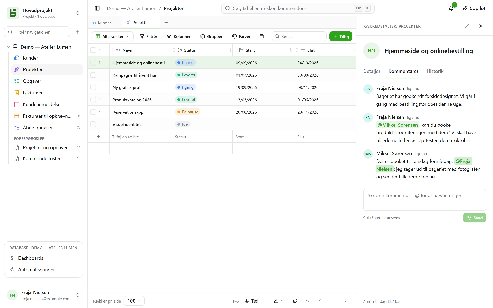
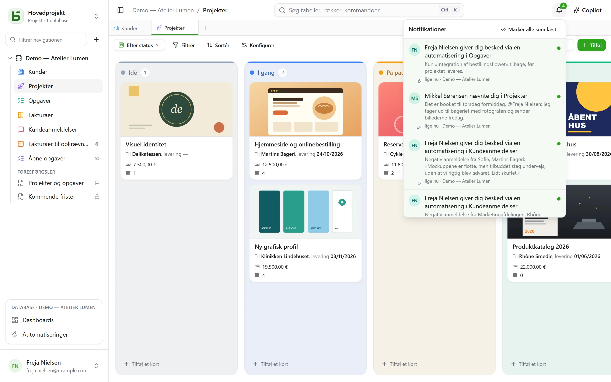

Flere personer arbejder i den samme database på samme tid: hver især ser de andres skrivninger
komme ind, ved, hvem der kigger på hvad, og diskuterer en række der, hvor den befinder sig.

## Kommentarer

Rækkedetaljerne for en række har en fane **Kommentarer** mellem »Detaljer« og »Historik«. Skriv
`@` for at **omtale** et medlem, og Ctrl+Enter for at sende. Hver person kan redigere eller
slette sine egne kommentarer.

Det er nok at kunne læse rækken for at kommentere den. En omtalt person, der ikke kan læse den,
får ingen besked — og forfatteren får det at vide i stedet for at tro, at beskeden er sendt.

## Notifikationer

Klokken øverst til højre tæller det ulæste. Fire ting havner der:

- nogen **omtaler** dig i en kommentar;
- nogen **svarer** i en samtale, hvor du har skrevet;
- nogen **udpeger** dig i et Person-felt — fra brugerfladen, API'et, en formular eller en
  automatisering;
- en [automatisering](/basedb/da/fonctionnalites/automatisations/) **giver dig besked**.

Når du åbner en notifikation, åbnes rækken. **Markér alle som læst** nulstiller tælleren;
notifikationer gemmes i 90 dage.

### Via e-mail

Når instansen har en [afsendelsesserver](/basedb/da/hebergement/variables/#e-mails), sendes en
notifikation, der har været **ti minutter uden at blive læst**, også som e-mail: én samlet
e-mail for alle de notifikationer, der venter, med et link til hver række. Det, du læser i tide,
sendes ikke. Under **Indstillinger › Notifikationer** har hver type to kontakter: i basedb, og
via e-mail.

## Realtid

De andres skrivninger vises **uden genindlæsning**: en ændret celle, et flyttet kort, en
tilføjet række — uanset om de kommer fra brugerfladen, API'et, en agent eller direkte SQL.
Serveren sender kun et **signal**, aldrig data: det er skærmen, der læser igen, med dine
tilladelser. En celle, du er i gang med at redigere, bliver aldrig erstattet under fingrene
på dig.

## Tilstedeværelse

Ansigterne på de personer, der kigger på **den samme tabel**, vises øverst på skærmen; dem, der
har åbnet **den samme række**, vises i toppen af dens rækkedetaljer. I gitteret vises de andres
markør på den celle, de holder musen over.

## Et link til hver skærm

Browserens adresse følger det, du kigger på: en tabel, en af dens visninger, rækkedetaljerne
for en række, et dashboard, en automatisering, et spørgsmål, dine indstillinger. Sæt den ind i
en besked: din kollega ankommer til det samme sted, med sine egne tilladelser. Sæt den som
bogmærke; browserens knapper tilbage og frem fører dig tilbage til, hvor du var.

| Adresse | Hvad den åbner |
|---|---|
| `/bases/ventes/tables/opportunites` | tabellen »Opportunités« i databasen »Ventes« |
| `/bases/ventes/tables/opportunites?vue=…` | en af dens visninger |
| `/bases/ventes/tables/opportunites?ligne=…` | rækkedetaljerne for en af dens rækker |
| `/bases/ventes/tableaux-de-bord/…` | et dashboard |
| `/bases/ventes/automatisations/…` | en automatisering |
| `/parametres/apparence` | dine indstillinger |

En adresse navngiver et **sted**, ikke den tilstand, du forlod det i: filtre, sorteringer og
kolonnebredder forbliver dem, der gælder for hver browser. En database og en tabel skrives der
under deres PostgreSQL-navn: omdøbes de, fører den gamle adresse ingen steder hen. En adresse,
der ikke fører nogen steder hen — en tastefejl, et slettet objekt, eller noget du ikke har ret
til at se — viser »Denne side findes ikke«.

## Fortryd

Ctrl+Z fortryder din seneste skrivning — se [historikken](/basedb/da/fonctionnalites/historique/#fortryd-ctrlz).

## Begrænsninger

- Ingen e-mail uden en afsendelsesserver, konfigureret af den driftsansvarlige.
- Ændres mere end hundrede rækker på én gang, genindlæser skærmen hele siden i stedet for
  række for række.
