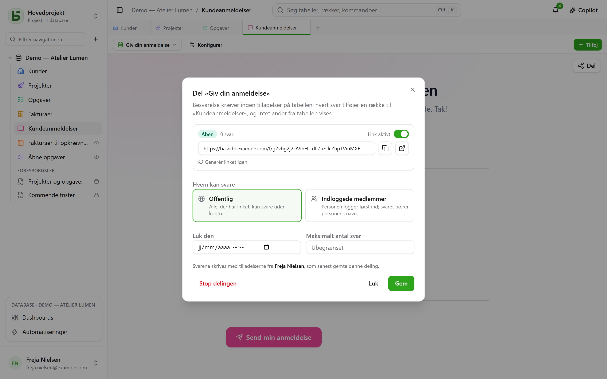
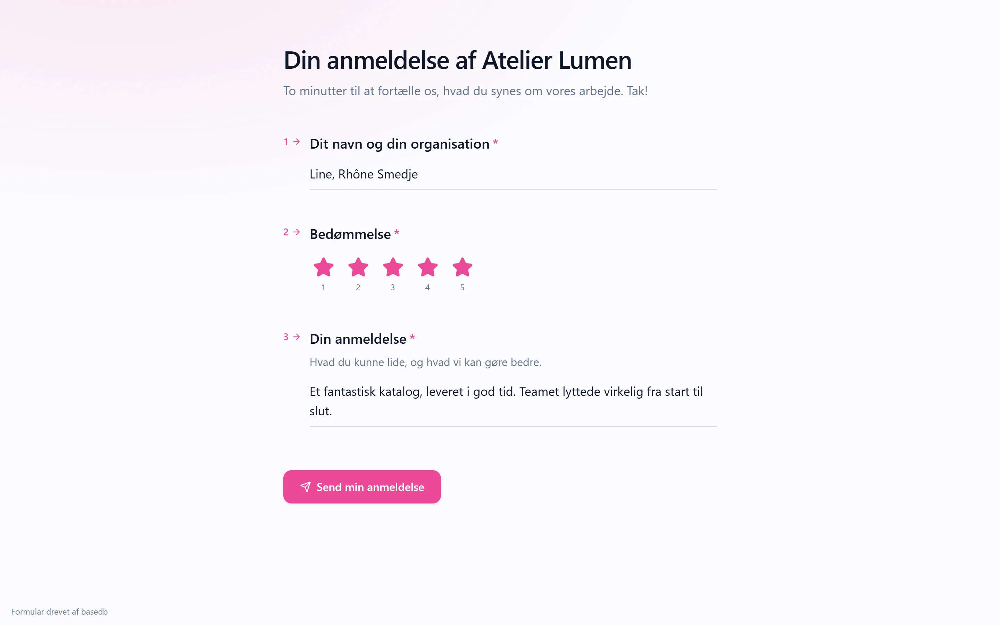

En formular, et spørgeskema eller en quiz **deles via et link** `/f/<jeton>`. Den person, der svarer,
behøver **ingen tilladelser til tabellen**: hvert svar tilføjer en række, og intet andet fra
tabellen vises for personen. Vil du vise rækker i stedet for at modtage dem, kan en visning
deles [skrivebeskyttet](/basedb/da/fonctionnalites/vues-partagees/).

## Hvem kan svare

| Adgang | Hvem svarer | Hvad der vises |
|---|---|---|
| **Offentlig** | alle med linket, uden konto | formularen alene |
| **Indloggede medlemmer** | et medlem af arbejdsområdet — om nødvendigt fra bestemte grupper | login, derefter formularen og »Du svarer som …« |

Linkets side ligger uden for applikationen: intet sidepanel, intet databasenavn, ingen andre
rækker. Den bærer formularens udseende — dens tema, farve, skrifttype —, og stiller kun de
spørgsmål, som tidligere svar kalder på.

## På hvis vegne svaret skrives

Rækken skrives med **myndigheden fra den person, der har udgivet delingen** — den seneste, der
har gemt den. Personens ret til at oprette rækker kontrolleres **ved hvert svar**, begrænset til
formularens spørgsmål: mister personen den, sættes formularen på pause, indtil en anden, der har
retten, gemmer den igen.

Historikken fortæller, hvem der har svaret, ikke hvem der har udgivet:

- et svar fra et **medlem** tilskrives personen;
- et **offentligt** svar tilskrives selve formularen: »Formular ›Demande de devis‹ · offentligt
  svar · udgivet af Camille«.

## Åbn og luk

Dialogen indstiller:

- kontakten **Link aktivt**;
- en **lukkedato**;
- et **maksimalt antal svar** — præcist, også ved samtidige svar;
- **Generér nyt link**: det gamle holder straks op med at virke;
- **Stop deling**: linket forsvinder, svarene bliver i tabellen.

En lukket formular siger det i én sætning, allerede før den beder om login.

## En delt quiz

Siden for en quiz modtager **ingen rigtige svar**: kun hvad hvert spørgsmål er værd. Det er
serveren, der retter.

- Rettet **efter hvert spørgsmål** sender siden serveren hvert bedømte svar, i det øjeblik det
  gives, og får så at vide, om det er rigtigt — og hvilket der var det.
- Ved afsendelsen tæller serveren scoren **ud fra de modtagne svar** og skriver den i det felt,
  der er valgt til den, hvis der er et, og hvis den, der har udgivet delingen, kan skrive i det.
  Siden viser den score, den får tilbage, og rettelsen, medmindre quizzen siger »aldrig«.

En score læses altså i tabellen, sådan som serveren har talt den, ikke sådan som en side ville
have oplyst den.

## Begrænsninger

- Spørgsmål af typen **relation**, **fil** og **billede** stilles ikke via et delt link;
  dialogen gør opmærksom på dem.
- Indsendelse er begrænset til 20 svar i minuttet pr. adresse og pr. link. Bag den medfølgende
  proxy (Caddy) er adressen den besøgendes.

Detaljerne står i [kapitel 15](https://github.com/eodia/basedb/blob/main/docs/architecture/15-formulaires-partages.md)
i arkitekturdokumentet.
