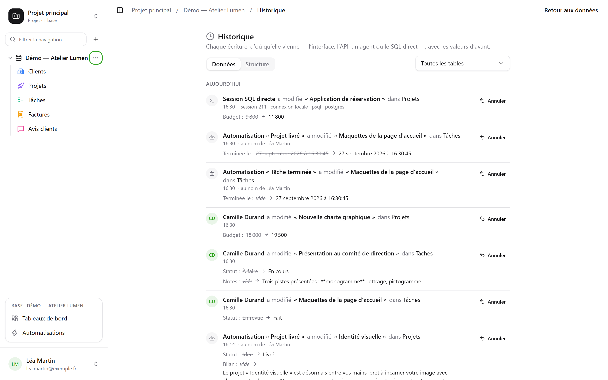

basedb logger **hver skrivning** i historikken, uanset hvor den kommer fra: brugerfladen,
API'et, en MCP-agent, en offentlig formular — og endda en SQL-forespørgsel, der er skrevet i
hånden i `psql`.

## Sådan registreres det

Ikke af applikationen, men af **PostgreSQL-triggere** i selve skrivningens transaktion. En
skrivning, der mislykkes, efterlader intet spor; en skrivning, der lykkes, kan ikke undgå at
efterlade et. Revisionerne overføres derefter til uforanderlige logs, partitioneret pr. måned.

Identiteten følger med via sessionsvariabler, der sættes i starten af hver transaktion. En
skrivning uden dem — direkte SQL — registreres som sådan, med den session, der udførte den
(`psql`, adresse, proces): den afvises aldrig af den grund.

| Aktør | Vises som |
|---|---|
| en person | personens navn |
| et program (API) eller en agent (MCP) | den person, der oprettede tokenet, »via tokenet …« |
| en offentlig formular | »Formular ›…‹ · offentligt svar« |
| en automatisering | »Automatisering ›…‹ · på vegne af« den person, der står inde for den |
| direkte SQL | »Direkte SQL-session« |

## Hvad du kan bruge det til

- **Læse** historikken for en række (fanen »Historik« i dens rækkedetaljer), en tabel eller en
  database (**Historik** i databasens **⋯**-menu), filtreret pr. tabel.
- **Fortryde** en ændring: de tidligere værdier anvendes igen felt for felt.
- **Gendanne** en slettet række fra dens post »har slettet«.
- Følge **strukturhistorikken** (fanen »Struktur«): tabeller og felter, der er oprettet,
  ændret eller slettet.

## Fortryd (Ctrl+Z)

I gitteret fortryder **Ctrl+Z** (⌘Z på Mac) din seneste skrivning; **Ctrl+Shift+Z** eller
**Ctrl+Y** gendanner den. En besked bekræfter, hvad der blev fortrudt — »Fortrudt: ændring af
›Montant‹« — med en knap til at annullere fortrydelsen.

Sådan kan du fortryde en celle, et kort eller en bjælke, der er flyttet, en række, der er
oprettet eller slettet, en indsættelse — og en hel import, der tælles som én handling. Op til
halvtreds handlinger, fane for fane.

Det er ikke en tilbagerulning af skærmen: det er en **ny skrivning**, som serveren udfører ud fra
historikken, og som også logges. Den afvises, hvis nogen har ændret rækken siden — »Kan ikke
fortrydes: ›Statut‹ er ændret siden« — i stedet for at overskrive vedkommendes arbejde. Du kan
kun fortryde dine egne skrivninger fra de seneste fireogtyve timer og aldrig strukturen. I en
celle, du er ved at redigere, er Ctrl+Z fortsat tekstens fortryd.

## Tilladelser

Historikken følger læsetilladelserne: et felt, der er skjult for dig, vises ikke i de
revisioner, du læser.
