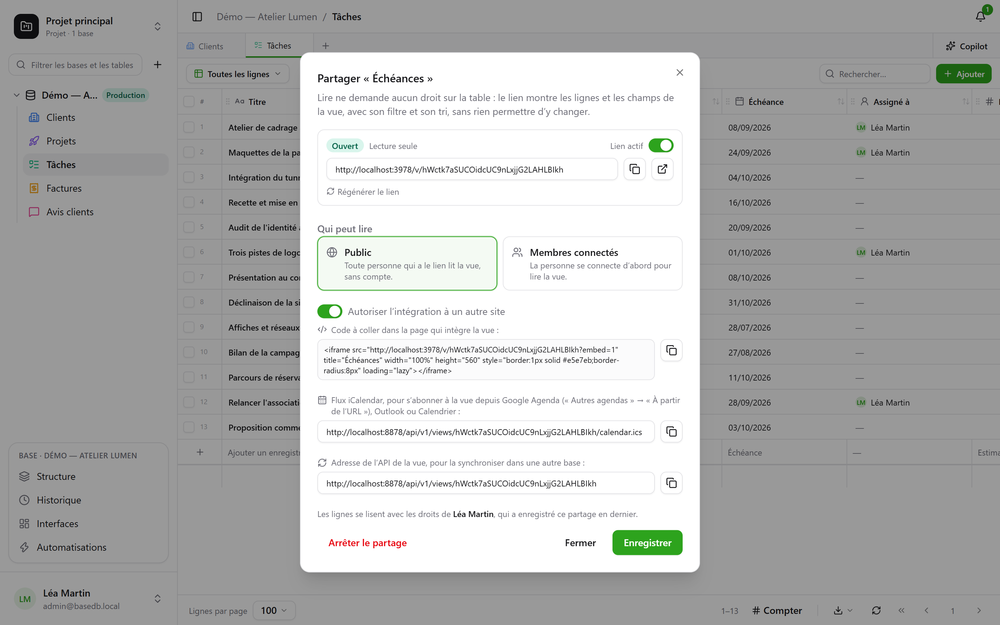
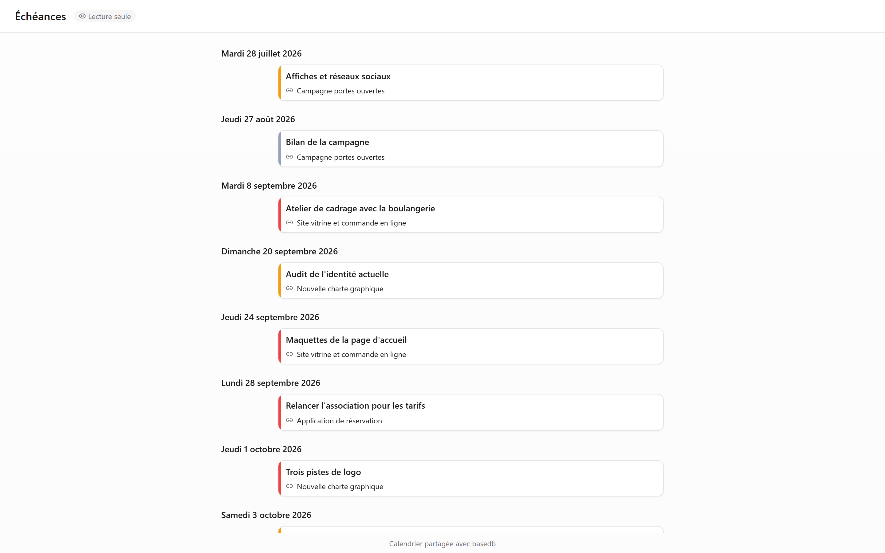

En datavisning — gitter, kanban, kalender, tidslinje, galleri, liste — kan **deles
skrivebeskyttet**: et link `/v/<jeton>` viser den til personer, der ikke kan åbne basedb, uden at
tillade nogen skrivning. Det er modstykket til [delte formularer](/basedb/da/fonctionnalites/formulaires-partages/),
som lader folk svare uden at lade dem læse noget. Et [dashboard](/basedb/da/fonctionnalites/tableaux-de-bord/#del-et-dashboard)
deles på samme måde.

## Del

Visningens menu → **Del…**, og derefter:

| Adgang | Hvem læser |
|---|---|
| **Offentlig** | alle med linket, uden konto |
| **Indloggede medlemmer** | et medlem af arbejdsområdet efter login — om nødvendigt kun fra bestemte grupper |

Kontakten **Link aktivt** sætter linket på pause uden at miste det. Siden åbner uden for
applikationen: intet sidepanel, intet databasenavn, intet tabelnavn — visningen, dens filtre,
dens kolonner og intet andet. En kalender eller en tidslinje læses der som en kalender.

## På hvis vegne der læses

Visningen læses med **tilladelserne for den person, der har udgivet den**, vurderet på ny ved
hver læsning: et felt, der er skjult for personen, vises ikke, og hvis personen mister adgangen
til tabellen, holder linket op med at vise noget som helst.

## Indlejring på et andet websted

Markér **Tillad indlejring på et andet websted**: dialogen giver en `<iframe>`-**indlejringskode**,
som du kan indsætte på et intranet, en wiki eller et præsentationswebsted. Uden dette felt
nægter siden at blive vist i en ramme på et andet websted.

## En kalender i din kalenderapp

For en kalender eller en tidslinje, der er delt **offentligt**, giver dialogen **adressen til
kalenderfeedet**: et iCalendar-feed (`…/calendar.ics`, højst 1 000 begivenheder), som Google
Kalender, Outlook eller Apple Kalender kan abonnere på. Teamets frister vises i hver persons
kalender og følger tabellen.

## En kilde til andre databaser

Et offentligt link giver også **visningens API-adresse**: de rækker, den viser, i JSON. En
[synkroniseret tabel](/basedb/da/integrations/synchronisation/) — på denne instans eller en
anden — kan bruge den som kilde.

## Begrænsninger

- Læsning er begrænset til 120 forespørgsler i minuttet pr. adresse og pr. link.
- En formular deles ikke til læsning: den deles [for at modtage svar](/basedb/da/fonctionnalites/formulaires-partages/).
