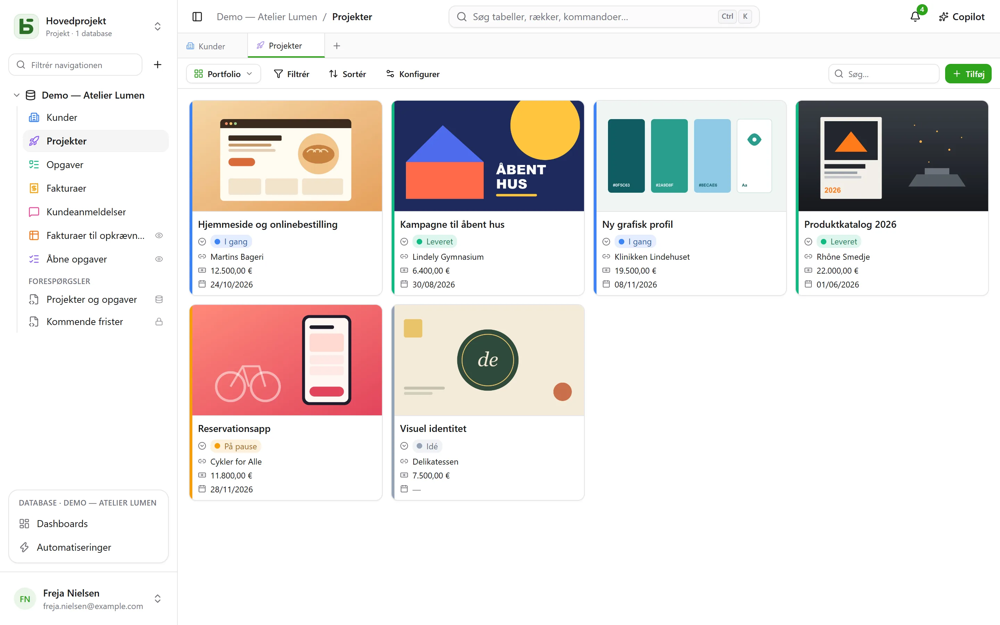
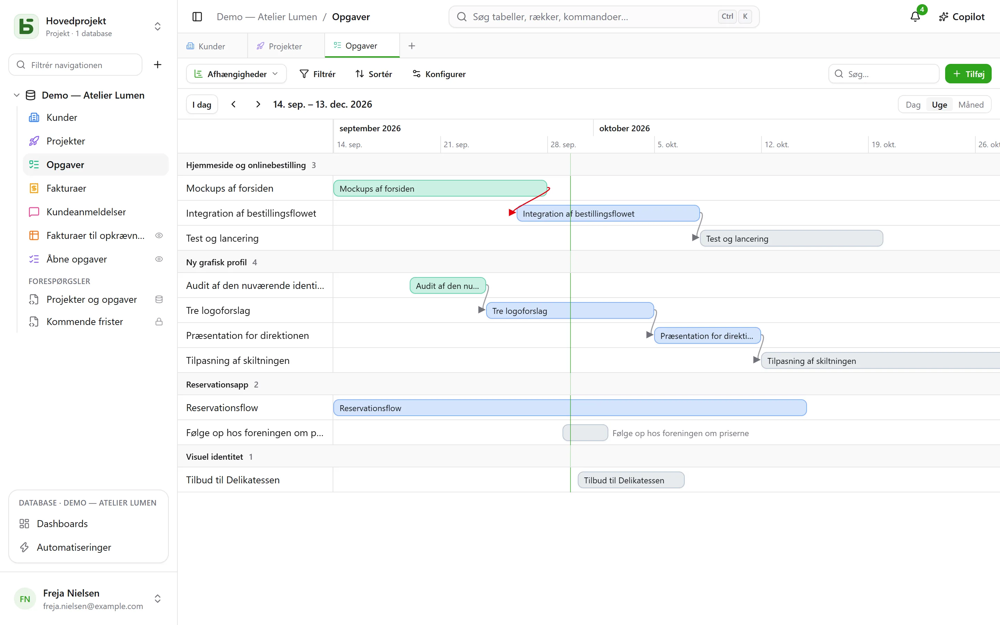
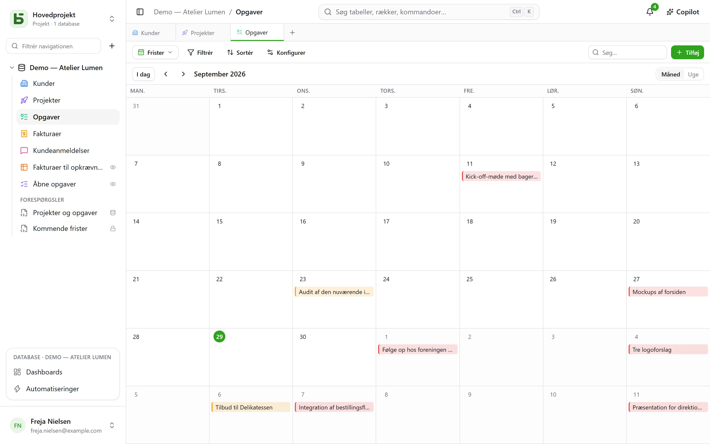
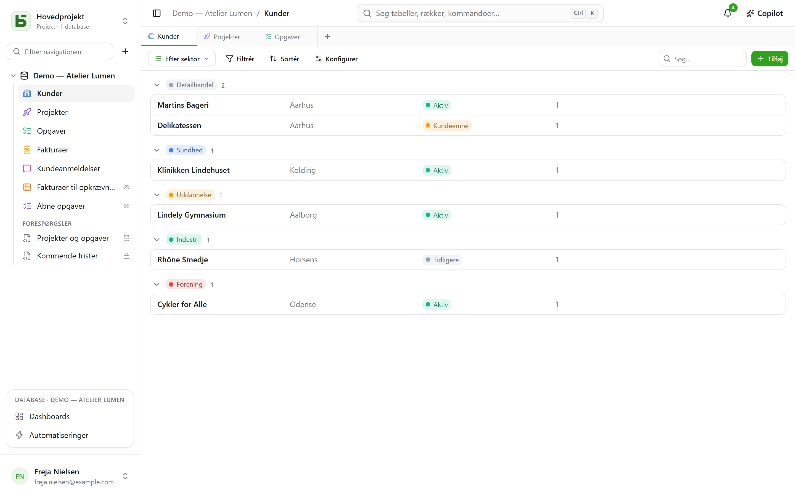

En tabel kan vises på **ti måder**. En visning kopierer ingen data og giver ingen flere
tilladelser end selve tabellen.

:::note
Disse visninger er måder at vise **én** tabel på. Et [SQL-view](/basedb/da/fonctionnalites/requetes-et-vues-sql/)
er noget andet: et rigtigt PostgreSQL-view, skrevet i SQL oven på databasens tabeller og
placeret blandt dem i sidepanelet.
:::

| Visning | Hvad den viser | Hvad den kræver |
|---|---|---|
| **Gitter** | rækker, filtreret, sorteret, grupperet, med valgte kolonner | — |
| **Kanban** | kort i kolonner | et enkeltvalg |
| **Kalender** | rækker på deres dato, pr. måned eller pr. uge | et datofelt |
| **Tidslinje** | bjælker mellem to datoer og deres afhængigheder | en startdato |
| **Galleri** | kort med et forsidebillede | — |
| **Liste** | én linje pr. række, i grupper, der kan foldes sammen | — |
| **Landkort** | hver række placeret på et kort | en adresse, eller en breddegrad og en længdegrad |
| **Formular** | en side med spørgsmål til at oprette en række | — |
| **Spørgeskema** | de samme spørgsmål, ét pr. skærm | — |
| **Quiz** | bedømte spørgsmål, ét pr. skærm, og scoren til sidst | — |

## Visningsvælgeren

Den sidder til venstre for »Filtrer«. »Alle rækker« er tabellens gitter, som ingen har gemt, og
som ingen kan slette; derefter kommer de **fælles visninger** i den rækkefølge, som den, der
bygger databasen, har valgt, og til sidst **Mine visninger**. Nederst ordner **Opret en visning**
de ti slags i to familier: dem, der **ser rækkerne**, og dem, der **samler svar** (formular,
spørgeskema, quiz).

- En **fælles visning** ses af alle. At oprette, konfigurere, omdøbe, omarrangere eller slette
  den kræver niveauet **Administrere**. Den kan **låses**: en hængelås viser det, og ingen kan
  ændre den, før den er låst op igen.
- En **personlig visning** ses kun af dig og kræver kun, at du kan læse tabellen.
  **Opret personlig visning**, eller **Gem som visning** efter at have filtreret og sorteret:
  hver person gemmer sine egne måder at læse på uden at ændre noget for de andre. **Dupliker**
  laver en personlig kopi af en fælles visning.

## Værktøjslinjen

Over gitteret, i denne rækkefølge:

- **Filtrer** kombinerer betingelser pr. felt;
- **Kolonner** vælger, hvad der vises — systemkolonnerne ligger for sig under
  »Systemoplysninger«;
- **Grupper** samler rækkerne efter et felt med én værdi — enkeltvalg, relation, person, dato,
  tal, tekst, afkrydsningsfelt … — i grupper, der kan foldes sammen, hver med sit antal på tværs
  af hele filteret;
- **Farver** farver rækkerne efter et enkeltvalg eller efter **regler** — et filter og en farve,
  højst tyve — som streg, som baggrund eller begge dele;
- **Rækkehøjde**: lav, mellem, høj, meget høj;
- **Søg…** til højre søger i alle kolonner, mens du skriver; Esc rydder søgningen. Den gælder
  også for kanban, kalender, tidslinje, galleri og liste og gemmes aldrig i visningen.

Under hver kolonne vises en **Opsummering**, beregnet på alle rækker i filteret, ikke kun på
siden: udfyldte, tomme, unikke værdier, sum, gennemsnit, minimum, maksimum, afkrydsede felter.

## Kanban, kalender, tidslinje

- **Kanban** sorterer kortene efter et enkeltvalg; når du trækker et kort, ændres rækken, og et
  »+« øverst i en kolonne opretter en række, der allerede har det valg. Hvert kort viser en
  titel, et forsidebillede, de valgte felter og en **beskrivelse**, der citerer rækkens
  værdier — »Levering planlagt den `{{Date}}` til `{{Client}}`« —, skrevet i visningens
  indstillinger med knappen **Indsæt felt**.
- **Kalenderen** placerer hver række på sin dato, eventuelt med en slutdato; når du trækker en
  række fra én dag til en anden, flyttes den.
- **Tidslinjen** tegner bjælker mellem en startdato og en slutdato, grupperet efter et
  enkeltvalg eller en relation. Med indstillingen **Afhænger af** — en relation fra tabellen
  til sig selv — forbinder en pil hver opgave med dem, den afhænger af, rød når den går
  tilbage i tiden.

## Galleri og liste

- **Galleriet** viser kort: et **forsidebillede** (beskåret eller helt), en størrelse (små,
  mellemstore, store kort) og en farve efter et enkeltvalg.
- **Listen** viser én linje pr. række, **grupperet** efter et enkeltvalg, en relation eller en
  person.

I kanban, galleri og liste kan kort og rækker **sorteres manuelt** ved at trække dem — op til
5 000; en valgt sortering har forrang for denne rækkefølge.

## Landkort

**Landkortet** placerer hver række på sin plads efter:

- en **adresse** — en kort tekst, gerne i formatet **Adresse** (se
  [Tabeller og felter](/basedb/da/fonctionnalites/tables-et-champs/)): »12 rue des Lilas, Lyon«;
- eller en **breddegrad** og en **længdegrad**, to talfelter, brugt som de er.

En nål får sin **farve** fra et enkeltvalg, viser rækkens **titel** ved hover og åbner dens
rækkedetaljer med et klik. Landkortet følger visningens filter og sortering, op til 2 000
rækker.

En adresse **findes én gang for alle** af instansens geokodningstjeneste — som standard
OpenStreetMaps —, i det tempo, den tillader: på et nyt kort dukker nålene op i takt med
svarene, cirka én om sekundet, og derefter med det samme de følgende gange. Et mærke tæller de
placerede rækker, de adresser, der stadig skal findes, og dem, det ikke kunne lykkes for: en
adresse, der ikke kan findes, skal præciseres (by, postnummer), aldrig blot fjernet i stilhed.

:::note[Det, der forlader din server]
Adressernes tekst sendes til geokodningstjenesten, og hver læsers browser henter kortbunden fra
fliseserveren. Instansens driftsansvarlige kan vælge andre tjenester, eller ingen: se
[Miljøvariabler](/basedb/da/hebergement/variables/#landkort-og-adresser).
:::

## Formular og spørgeskema

Du markerer spørgsmålene og sætter dem i rækkefølge; hvert spørgsmål har en overskrift, en
hjælpetekst, et eksempelsvar og kan gøres påkrævet. Formularen har sin titel, sin
introduktion, teksten på sin knap og sin takkebesked. Den udfyldes i basedb eller
[deles via et link](/basedb/da/fonctionnalites/formulaires-partages/).

Der er intet at indstille for at komme i gang: en ny formular spørger om det, en person
svarer — ikke status, den tildelte person eller relationerne, som teamet udfylder senere,
medmindre de er påkrævede —, bærer farven fra sin tabel og et lyst tema, og hvert tomt felt
viser et passende eksempel. Alt andet ændrer du, når du vil:

- **Udseende**: otte temaer — Lyst, Blid, Daggry, Hav, Skov, Nat, Papir, Minimal —,
  en accentfarve, en skrifttype, en justering til venstre eller centreret;
- **Udfyld på forhånd med dags dato**: et datospørgsmål er allerede udfyldt med dagen — og
  klokkeslættet, for dato og tid — som personen beholder eller ændrer;
- **Spørg kun hvis…**: et spørgsmål stilles kun, hvis et tidligere svar kræver det (»Sentiment
  er Negativ«, »Bedømmelse er højst 2«). Et skjult spørgsmål er hverken påkrævet eller sendt;
- **Flere indstillinger**: knapperne til velkomst og afsendelse, nummereringen,
  fremdriftslinjen, det automatiske skift til næste, beskeden og en slutknap (»Tilbage til
  sitet«), konfetti.

**Spørgeskemaet** fylder hele skærmen: en velkomst, der siger, hvor lang tid det tager,
derefter ét spørgsmål ad gangen, som glider ind. Alt kan også gøres med tastaturet: **Enter**
for at fortsætte, bogstaverne **A**, **B**, **C**… for et valg, **J** eller **N** for ja eller
nej, tallene for en bedømmelse — et enkelt valg går alene videre til næste spørgsmål.
Afsendelsen fejres: et flueben, der tegner sig, og konfetti i formularens farver.

## Quiz

En quiz er et spørgeskema, der tæller point. Under hvert spørgsmål angiver du dets **rigtige
svar** og det, det giver — **1 point**, hvis intet angives, op til 100:

| Spørgsmål | Rigtigt svar |
|---|---|
| enkeltvalg | ét valg |
| flervalg | de valg, der skal afkrydses — alle og kun dem |
| afkrydsningsfelt | ja eller nej |
| tal, bedømmelse | et tal |
| dato | en dag |
| kort tekst, e-mail, URL | ét eller flere accepterede svar, adskilt med `;` — uden hensyn til store og små bogstaver eller accenter |

Et spørgsmål uden et rigtigt svar — et fornavn, en kommentar — stilles uden at blive bedømt. Der
skal mindst ét bedømt spørgsmål til for at oprette quizzen.

Afsnittet **Bedømmelse** styrer resten:

- **Rettelse**: **efter hvert spørgsmål** — svaret tjekkes med det samme, i grønt, eller i rødt
  med det rigtige svar, og scoren vokser øverst på skærmen —, **til sidst** — scoren og derefter
  rettelsen —, eller **aldrig** — kun scoren, de rigtige svar forbliver hemmelige;
- **Beståelsesgrænse**: en procentdel af pointene; slutskærmen siger så »Bestået!« eller »Ikke
  denne gang…«;
- **Gem scoren i**: et talfelt i tabellen, som modtager scoren for hvert svar. Sortér gitteret
  efter det: der har du ranglisten. Et felt kaldet »Score«, »Point« eller »Karakter« vælges
  automatisk.

Slutskærmen viser scoren i en ring, der fyldes, procentdelen og derefter, undtagen ved »aldrig«,
hvert bedømt spørgsmål med det svar, der blev givet, og det rigtige. Et spørgsmål, som et
tidligere svar har skjult, tæller ikke med i totalen.

:::note
I applikationen kan den, der kan læse visningen, også læse de rigtige svar. Via et
[delt link](/basedb/da/fonctionnalites/formulaires-partages/#en-delt-quiz), forlader de aldrig
serveren: det er den, der retter og tæller.
:::

## Del en visning

En datavisning — gitter, kanban, kalender, tidslinje, galleri, liste — kan **deles skrivebeskyttet**
via et link og indlejres på et andet websted, og en kalender bliver et kalenderfeed. Se
[Delte visninger](/basedb/da/fonctionnalites/vues-partagees/).

## Hvad læseren ikke ser

En visning **tilpasses sin læser**: et felt, der er skjult for læseren, forsvinder fra
kolonnerne, kortene og spørgsmålene. En visning, hvis filter citerer et skjult felt, vises slet
ikke: vist uden sit filter ville den vise mere, end den blev lavet til at vise.
