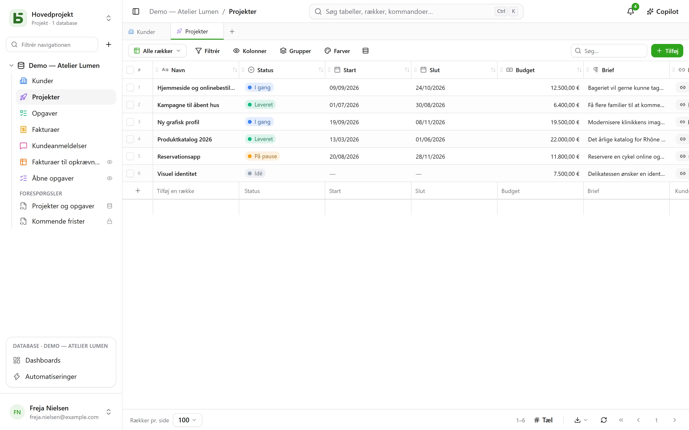

**basedb** er en kollaborativ database i samme ånd som kollaborative regneark, som du selv
hoster — med én forskel, der bestemmer alt det andet: **dine data lever i rigtige
PostgreSQL-tabeller**, med typer og med læsbare navne.

## Et enkelt løfte

Ingen generisk model, ingen `JSONB`-rodekasse, ingen `field_1837`:

| I basedb | I PostgreSQL |
|---|---|
| En database »Ventes« | et skema `b_t4z56fq_ventes` |
| En tabel »Opportunités« | en tabel `opportunites` |
| Et felt »Échéance« (Dato) | en kolonne `echeance date` |
| Et enkeltvalgsfelt »Statut« | en `text`-kolonne og dens `CHECK`-begrænsning |
| En relation »Client« | en kolonne `clients_id uuid` og dens `FOREIGN KEY` |

Du kan altså åbne `psql`, et BI-værktøj eller et Python-script og læse dine data uden om
produktet — og endda skrive i dem: begrænsningerne holder, og historikken registrerer
skrivningen.

## For hvem?

- **Forretningsteams**, der vil have et gitter, visninger og formularer uden at vente på et
  udviklingsprojekt.
- **Tekniske teams**, der nægter at se deres data låst inde i et proprietært format og vil
  koble deres vante værktøjer på.
- **AI-agenter**, der finder en MCP-server, klare tilladelser og forslag, som et menneske skal
  godkende.

## Hvad du finder

- [Tabeller og felter](/basedb/da/fonctionnalites/tables-et-champs/) med typer, relationer, der
  er rigtige fremmednøgler — eller multiple —, formler beregnet af PostgreSQL, opslag og
  aggregeringer på tværs af relationer.
- Ti [visninger](/basedb/da/fonctionnalites/vues/): gitter, kanban, kalender, tidslinje,
  galleri, liste, landkort, formular, spørgeskema, quiz — fælles eller personlige.
- [Formularer](/basedb/da/fonctionnalites/formulaires-partages/) og
  [visninger](/basedb/da/fonctionnalites/vues-partagees/), der deles via et link, og kalendere,
  som du kan abonnere på fra en kalenderapp.
- [Samarbejde](/basedb/da/fonctionnalites/collaboration/): kommentarer og omtaler,
  notifikationer, opdateringer i realtid.
- [Automatiseringer](/basedb/da/fonctionnalites/automatisations/) og
  [dashboards](/basedb/da/fonctionnalites/tableaux-de-bord/) med deres spørgsmål, bygget med musen eller i SQL.
- [SQL til alle](/basedb/da/fonctionnalites/requetes-et-vues-sql/), hver med sine egne
  tilladelser: gemte forespørgsler under tabellerne og rigtige PostgreSQL-views placeret blandt dem.
- [Databaseskabeloner](/basedb/da/fonctionnalites/modeles/), som du vælger i et galleri eller
  beder AI om.
- [Miljøer](/basedb/da/fonctionnalites/environnements/) — produktion, test — som du kan
  sammenligne og migrere.
- En [historik](/basedb/da/fonctionnalites/historique/) over hver skrivning, direkte SQL
  inklusive, og Ctrl+Z for at fortryde.
- [Tilladelser](/basedb/da/fonctionnalites/droits/) pr. gruppe, helt ned til det enkelte felt.
- Et [REST-API](/basedb/da/integrations/api-rest/), en [MCP-server](/basedb/da/integrations/mcp/),
  [webhooks](/basedb/da/integrations/webhooks/), Slack og
  [synkroniserede tabeller](/basedb/da/integrations/synchronisation/).
- [AI](/basedb/da/fonctionnalites/ia/) som tilvalg: felter beregnet af en model, Copilot.

## Projektets status

basedb er fri software (AGPL-3.0) udviklet af [Eodia](https://eodia.com/fr/), et AI-native
softwarestudie, og er under aktiv udvikling. Kernen, API'et, MCP-serveren og brugerfladen
virker og er dækket af mere end tusind tests;
[køreplanen](/basedb/da/feuille-de-route/) fortæller, hvad der stadig mangler. Projektets
[arkitekturdokument](https://github.com/eodia/basedb/tree/main/docs/architecture), omkring
tyve kapitler, fastlægger hver beslutning.

:::tip[Prøv det]
Én kommando er nok, når repositoriet er klonet: `docker compose up -d`. Se
[installationen](/basedb/da/guides/installation/).
:::
