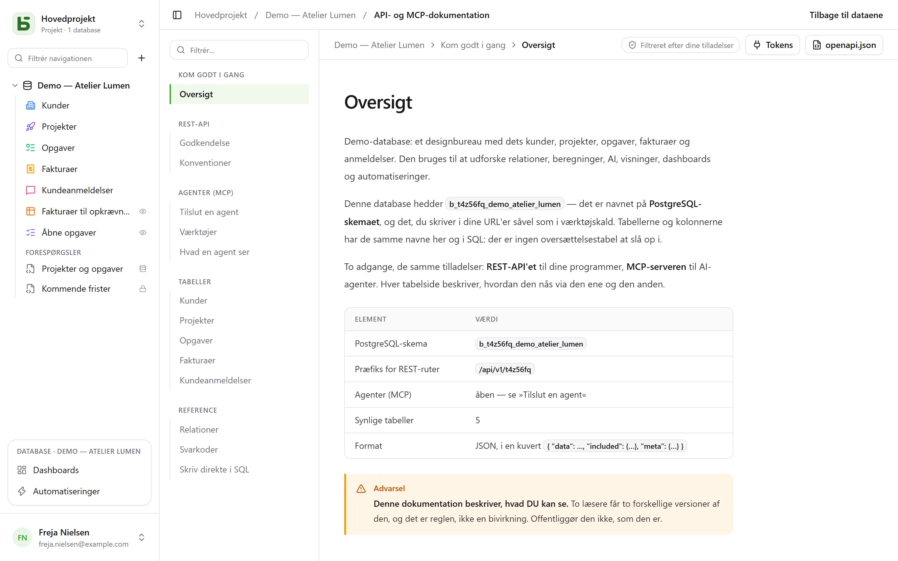

REST-API'et er det samme, som brugerfladen bruger: **der findes ingen private ruter**. Dets URL'er
indeholder de fysiske navne — dem, du også læser i SQL.

```text
/api/v1/<tenant>/data/<base>/<table>
/api/v1/t4z56fq/data/b_t4z56fq_ventes/opportunites
```

## Et token

I brugerfladen, databasens **⋯**-menu → **API og agenter** → **API- og MCP-tokens…**: her
opretter du et **integrationstoken**, der er begrænset til denne database og som standard er
skrivebeskyttet, efter at have bekræftet din adgangskode. Det vises kun én gang; læg det i en
miljøvariabel.

Et token læser, opretter og redigerer, hvis det er oprettet med skriveadgang, **sletter aldrig**
og har aldrig flere tilladelser end den person, der oprettede det.

```bash
export BASEDB_TOKEN=bdb_…
curl "http://localhost:3000/api/v1/t4z56fq/data/b_t4z56fq_ventes/opportunites?limit=20" \
  -H "Authorization: Bearer $BASEDB_TOKEN"
```

## Læs

| Parameter | Rolle |
|---|---|
| `filter` | et læsbart udtryk: `statut eq "gagne" and montant gte 10000` |
| `sort` | `-montant,nom` |
| `fields` | de kolonner, der skal returneres |
| `limit`, `after` | paginering med krypteret cursor: `meta.next_cursor` fra en side, givet videre som `after`, giver den næste (`meta.has_next_page`) |
| `links=display` | relationerne med deres visningsværdi |
| `count=exact` | totalen, med et loft på 100 000 |
| `variables=raw` | lange tekster, som de er skrevet, `{{colonne}}` inklusive, i stedet for med [rækkens værdier](/basedb/da/fonctionnalites/tables-et-champs/#formateret-tekst-og-variabler) |

Operatorerne: `eq`, `ne`, `eq_ci`, `contains`, `starts_with`, `ends_with`, `in`, `is_null`,
`gt`, `gte`, `lt`, `lte`, `between`, kombineret med `and`, `or`, `not` og parenteser. Et
filter kan gå på tværs af en relation: `clients_id.ville eq "Lyon"`.

## Skriv

```bash
curl -X POST "http://localhost:3000/api/v1/t4z56fq/data/b_t4z56fq_ventes/opportunites" \
  -H "Authorization: Bearer $BASEDB_TOKEN" -H "content-type: application/json" \
  -d '{"values": {"nom": "Audit RGPD", "statut": "nouveau", "montant": 12000}}'
```

`PATCH …/<table>/<_id>` redigerer en række med den samme krop `{"values": {…}}`. Fejl har én
fast form: `{ "code": "…", "details": {…}, "request_id": "…" }`, med en stabil kode pr. årsag.

Hver skrivning returnerer headeren `x-basedb-transaction`: sender du den til
`POST /api/v1/<tenant>/history/undo` (`{"transaction": "…"}`), fortrydes den, ligesom Ctrl+Z i
brugerfladen — det afvises, hvis rækken er blevet ændret siden.

## Ud over rækkerne

Med det samme token:

| Rute | Rolle |
|---|---|
| `GET …/data/<base>/<table>/aggregate` | opsummeringer over alle rækker i et filter: `aggregates=montant:sum,nom:filled`, `group=statut` |
| `GET …/data/<base>/<table>/<_id>/comments`, `POST` | læs og skriv en rækkes kommentarer |
| `POST /api/v1/<tenant>/automations/<id>/run` | start en automatisering, der udløses af en knap, på en række (`{"record": "…"}`) |
| `GET /api/v1/<tenant>/meta/bases/<base>/dashboards` | en databases dashboards |
| `GET /api/v1/<tenant>/meta/users` | arbejdsområdets medlemmer, til et Person-felt |
| `GET /api/v1/<tenant>/meta/templates` | galleriets databaseskabeloner |
| `GET /api/v1/<tenant>/events?base=<base>&table=<table>` | følg en tabel i realtid: signaler, som derefter genlæses via ovenstående ruter (se [Webhooks](/basedb/da/integrations/webhooks/#uden-webhook-følg-en-tabel)) |

[Delte visninger](/basedb/da/fonctionnalites/vues-partagees/) kan læses uden konto:
`GET /api/v1/views/<jeton>` og `…/rows` i JSON, `…/calendar.ics` i iCalendar.

At bygge — oprette en automatisering, et dashboard, en integration — er forbeholdt en session i
brugerfladen: et token læser og skriver rækker, det ændrer ikke databasen.

## Opret en database fra en skabelon

En applikation, der installeres, opretter sin database i **ét kald**: serveren anvender
skabelonen — tabeller, felter, relationer, eksempelrækker, visninger, dashboards,
automatiseringer — og efterlader ingen database, hvis et trin mislykkes.

```bash
curl -X POST "http://localhost:3000/api/v1/t4z56fq/admin/bases" \
  -H "Authorization: Bearer $ACCES" -H "content-type: application/json" \
  -d '{"template": "crm", "label": "Ventes", "rows": false}'
```

`template` er nøglen til en skabelon fra galleriet, eller en hel skabelon i
[skabelonformatet](/basedb/da/fonctionnalites/modeles/). Med headeren
`Accept: application/x-ndjson` ankommer svaret linje for linje: en linje `{"step": …}` pr.
trin, derefter den oprettede database. Dette kald kræver adgangstokenet fra en person, der kan
oprette en database (`POST /auth/session/access`, efter login): et integrationstoken åbner kun
en eksisterende database.

## Kontroller et token

basedbs tokens kan ikke kontrolleres uden for basedb. En applikation, der modtager et — et
værktøj, der åbnes fra basedb med personens token, for eksempel — spørger, hvad det er værd
(introspektion, RFC 7662), med sit eget integrationstoken:

```bash
curl -X POST "http://localhost:3000/auth/introspect" \
  -H "Authorization: Bearer $BASEDB_TOKEN" \
  --data-urlencode "token=$JETON_RECU"
```

```json
{ "active": true, "token_type": "access_token",
  "sub": "0195a…", "email": "claire@example.com", "name": "Claire Martin",
  "tenant": "t4z56fq", "groups": ["Commerciaux"], "exp": 1790000000 }
```

Ethvert token, der ikke er gyldigt — ukendt, udløbet, tilbagekaldt, session afsluttet, andet
arbejdsområde — svarer `{"active": false}`, uden at sige hvorfor. Svaret læses direkte: en
udlogning ses med det samme. For et integrationstoken angiver svaret også den database, det
åbner (`base`), dets adgang (`read` eller `write`) og dets flader.

## Den genererede dokumentation

Hver database har sin side **API- og MCP-dokumentation**: for hver tabel dens endpoints, dens
kolonner og eksempler i cURL og JavaScript. Den er **filtreret efter dine tilladelser** — to
læsere får to versioner —, skrevet **på din skærms sprog**, og findes også i OpenAPI 3.1
(`/api/v1/<tenant>/meta/bases/<base>/openapi.json`). Navnene, stierne og fejlkoderne forbliver
de samme på alle sprog.


