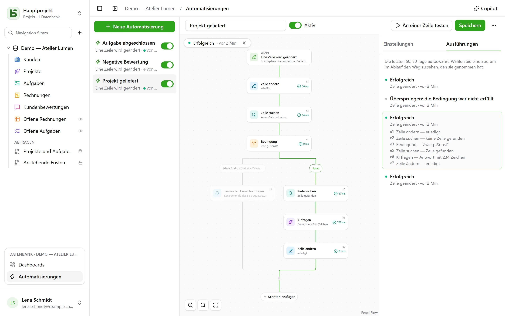

Eine Automatisierung sagt **wann**, **falls** und **dann**: Wenn eine Aufgabe auf „Fait“ wechselt,
die Uhrzeit festhalten; wenn eine negative Bewertung eingeht, die Verantwortliche benachrichtigen
und in Slack schreiben; jeden Montag um 9 Uhr die Zeile für das Teammeeting anlegen. Und wenn eine
Aktion nicht genügt, folgt sie einem **Ablauf**: eine Zeile suchen, je nach deren Inhalt den einen
oder anderen Zweig nehmen, Schritte auf jeder Zeile wiederholen, die einem Filter entspricht, in
einem Schritt wiederverwenden, was ein vorheriger Schritt gefunden oder geschrieben hat, drei Tage
vor einer Mahnung **warten**, ein **PDF** als Anhang senden.

Sie öffnen sich über **Automatisierungen** im Block der geöffneten Datenbank unten in der
Seitenleiste und erfordern die Stufe **Verwalten**.



## Der Ablauf

Der Ablauf wird von oben nach unten gezeichnet: der Auslöser, dann jeder Schritt. Ein **+** auf
einer Linie öffnet die Liste der Schritte, nach Kategorie geordnet – Zeilen, Kommunizieren,
Dokumente, KI, Logik – mit einer Suche, und fügt den gewählten an dieser Stelle hinzu; eine
Karte öffnet ihre Einstellungen rechts. Eine einfache Automatisierung – ein Auslöser und eine Aktion – passt auf zwei Karten und
wird eingestellt wie bisher.

## Wann

| Auslöser | Einstellungen |
|---|---|
| **Eine Zeile wird angelegt** | die Tabelle |
| **Eine Zeile wird geändert** | die Tabelle und bei Bedarf nur die zu überwachenden Felder |
| **Zu fester Uhrzeit** | stündlich, täglich oder wöchentlich, zur gewählten Uhrzeit und in der gewählten Zeitzone |
| **Klick auf eine Schaltfläche** | ein [Feld Schaltfläche](/basedb/de/fonctionnalites/tables-et-champs/#schaltfläche) der Tabelle |
| **Eine Zeile wird gelöscht** | die Tabelle; die Schritte zitieren die Zeile, wie sie war |
| **Eine Zeile tritt in einen Filter ein** | die Tabelle und der Filter: Die Automatisierung startet, wenn eine Zeile eintritt, und erst wieder, nachdem sie ihn verlassen hat – „eine Rechnung wird überfällig“, nicht „eine überfällige Rechnung wird geändert“ |
| **Ein Datum tritt ein** | ein Datumsfeld der Tabelle, ein Versatz – drei Tage vorher, am selben Tag, eine Woche danach – und die Uhrzeit: Fristerinnerungen, Vertragsjubiläen |
| **Ein Webhook wird empfangen** | nichts: Die Automatisierung erhält ihre eigene Adresse, die eine andere Software aufruft ([Details](#ein-dienst-der-basedb-aufruft)) |

Ein Auslöser auf Zeilen sieht **alle** Schreibvorgänge: die Oberfläche, die API, einen Agenten,
ein freigegebenes Formular und sogar direktes SQL – Automatisierungen gehen vom Verlauf aus, der
sie alle erfasst.

## Nur falls

Eine optionale Bedingung in der [Filtersprache](/basedb/de/integrations/api-rest/#lesen) –
`statut eq "fait"`, `montant gte 10000 and payee eq false` –, ausgewertet auf der Zeile **im
Moment des Handelns**. Eine Ausführung, deren Bedingung nicht erfüllt ist, wird „übersprungen“ und
sagt das.

## Dann

Bis zu vierzig Schritte, der Reihe nach; der erste, der fehlschlägt, stoppt die folgenden – außer
in einem Block **Versuchen** ([Details](#versuchen)).

| Schritt | Was er tut |
|---|---|
| **Zeile bearbeiten** | schreibt Werte in die auslösende Zeile – oder in die, die ein Schritt gefunden oder angelegt hat |
| **Zeile anlegen** | in dieser Tabelle oder einer anderen der Datenbank |
| **Zeile suchen** | die erste Zeile einer Tabelle, die einem Filter entspricht, damit die folgenden Schritte sie zitieren oder bearbeiten |
| **Jemanden benachrichtigen** | eine [Benachrichtigung](/basedb/de/fonctionnalites/collaboration/#benachrichtigungen) an ausgewählte Personen oder an die Person aus einem Feld Person |
| **E-Mail senden** | an Personen des Teams, an die aus einem Feld Person, an die Adresse aus einem Feld E-Mail – einen Kunden, einen Lieferanten – oder an eingegebene Adressen; Betreff und Text zitieren die Zeile und die vorherigen Schritte |
| **Webhook aufrufen** | eine HTTPS-Anfrage an einen Dienst – Methode, Adresse, Header und Text nach Ihrer Wahl ([Details](#einen-dienst-aufrufen)); seine Antwort lässt sich anschließend zitieren |
| **An Slack senden** | eine Nachricht in einen [verbundenen](/basedb/de/integrations/synchronisation/#slack) Kanal |
| **KI fragen** | eine Antwort des [KI-Anbieters](/basedb/de/fonctionnalites/ia/) auf eine Anweisung, die die Zeile und die vorherigen Schritte zitiert – verfassen, zusammenfassen, einordnen –, gelesen als Text, Zahl, Ja oder Nein, Datum oder Auswahl aus einer Liste |
| **Bedingung** | mehrere Zweige: Der erste, dessen Bedingung erfüllt ist, wird genommen, „Sonst“, wenn keiner es ist; die Zweige laufen danach wieder zusammen |
| **Für jede Zeile** | die Schritte, die sie enthält, einmal für jede Zeile einer Tabelle, die einem Filter entspricht ([Details](#für-jede-zeile)) |
| **Zeile löschen** | die Zeile, die ausgelöst hat, oder die, die ein Schritt gefunden hat – sie wandert in den Papierkorb |
| **Zählen und addieren** | die Anzahl der Zeilen eines Filters, ihre Summe, ihren Durchschnitt, ihr Minimum oder Maximum, um sie anschließend zu zitieren oder zu testen |
| **PDF erstellen** | das [Dokument](/basedb/de/fonctionnalites/documents/) einer Zeile, abgelegt in einem Feld Datei oder einer E-Mail angehängt |
| **Warten** | eine Dauer, oder bis zum Datum eines Feldes ([Details](#warten)) |
| **Versuchen** | Schritte, und weitere, falls einer von ihnen fehlschlägt ([Details](#versuchen)) |
| **Eine Automatisierung starten** | eine andere Automatisierung der Datenbank, auf einer Zeile ihrer Tabelle |

Eine Suche, die nichts findet, stoppt den Ablauf nicht: Die Schritte, die ihre Zeile bearbeiten
sollten, werden übersprungen. Um in diesem Fall etwas anderes zu tun, fügt **Wenn keine Zeile
gefunden wird…**, unter der Suche, eine Bedingung hinzu, die das prüft.

Eine **Bedingung** prüft eine Zeile mit einem Filter, oder einen **Wert**: die Antwort der KI,
den Code eines Webhooks, eine Summe – „`{{e2.reponse}}` ist gleich Urgent“, „`{{e3.somme.montant}}`
ist größer oder gleich 1000“. Zahlen werden zahlenweise verglichen, Texte ohne Rücksicht auf
Akzente oder Groß- und Kleinschreibung.

## Für jede Zeile

Der Schritt **Für jede Zeile** durchläuft die Zeilen einer Tabelle, die seinem Filter entsprechen –
leer: alle –, in der gewählten Reihenfolge, bis zu seiner Grenze (standardmäßig 50, höchstens 200),
und führt dann einmal für jede von ihnen die in seinem Rahmen platzierten Schritte aus. „Jeden
Montag die unbezahlten Rechnungen mahnen“ schreibt sich so: **Zu fester Uhrzeit**, dann **Für jede
Zeile** der Rechnungen `payee eq false and relancee eq false`, und in der Schleife eine E-Mail an
den Kontakt der Rechnung sowie **Zeile bearbeiten**, das „Gemahnt“ ankreuzt.

In der Schleife benennt die Kennung des Schritts die **Zeile der Runde**: `{{e1.client}}` zitiert
sie, und **Zeile bearbeiten** schlägt sie unter den zu bearbeitenden Zeilen vor. Nach der Schleife
sagt `{{e1.nombre}}`, wie viele Zeilen sie durchlaufen hat – zum Beispiel für eine Zusammenfassung
auf Slack. Der Filter kann zitieren, was vorausgeht: ausgelöst durch eine bezahlte Rechnung,
durchläuft `facture eq {{_id}}` ihre Detailzeilen.

Über die Grenze hinaus warten die übrigen Zeilen auf die nächste Ausführung, die das anzeigt:
Schließen Sie im Filter die bereits bearbeiteten aus – ein Kästchen „gemahnt“, ein Datum –, um sie
im Lauf der Ausführungen alle zu bearbeiten. Eine Schleife enthält keine andere Schleife, und eine
Ausführung endet nach spätestens zwei Minuten.

## Warten

Der Schritt **Warten** setzt die Ausführung in Pause – drei Stunden, zwei Tage – oder bis zum
Datum eines Feldes einer Zeile, mit einem Versatz und einer Uhrzeit: „am Vortag der Frist, um
9 Uhr“. Die Ausführung erscheint als **Pausiert** im Reiter **Ausführungen**, mit dem Datum
ihrer Fortsetzung.

Sie setzt sich beim nächsten Schritt fort, indem sie ihre Zeilen **neu einliest**: „drei Tage
nach dem Versand des Angebots, falls es immer noch nicht angenommen ist, nachfassen“ schreibt
sich als **Warten** 3 Tage, dann eine Bedingung auf den Status des Angebots, wie er an diesem
Tag ist. Die Automatisierung zu deaktivieren stoppt die pausierten Ausführungen; ein Warten
lässt sich weder in einer Schleife noch in einem Block **Versuchen** platzieren, und dauert
höchstens ein Jahr.

## Versuchen

Der Block **Versuchen** hat zwei Zweige. Der erste wird ausgeführt; schlägt einer seiner
Schritte fehl, läuft der Ablauf mit dem zweiten weiter, **Bei einem Fehlschlag**, der den
Fehler zitiert – `{{e4.erreur}}`, den Code, und `{{e4.etape}}`, den Schritt –, und setzt sich
danach nach dem Block fort. So lässt sich jemand benachrichtigen, wenn ein Dienst nicht
antwortet, ohne alles zu stoppen.

Einfacher gesagt: Ein Webhook kann sich nach einem Ausfall des Dienstes bis zu drei Mal selbst
**erneut versuchen**, und eine Schleife kann trotz einer fehlgeschlagenen Zeile **weiterlaufen**.

## Ein PDF und eine E-Mail

**PDF erstellen** erzeugt das Dokument einer Zeile – mit einer
[Dokumentvorlage](/basedb/de/fonctionnalites/documents/) ihrer Tabelle, oder dem Datenblatt
all ihrer Felder – und kann es in einem Feld Datei ablegen. **E-Mail senden** kann es
anschließend anhängen, zusammen mit den Dateien eines Feldes Datei oder Bild:

- eine E-Mail **an jeden**, oder **eine einzige an alle**, mit Empfängern in **Cc**;
- eine Nachricht in **formatiertem Text** – fett, Listen, Links – die die Zeile zitiert;
- eine **Antwortadresse**: standardmäßig Ihre, oder die eines Feldes E-Mail;
- bis zu 50 Empfängern, 10 Anhängen und 15 MB.

„Wenn ein Angebot auf Accepté wechselt, die Rechnung an den Kunden senden, die Buchhaltung in
Cc“: **Eine Zeile tritt in einen Filter ein** `statut eq "accepte"`, **PDF erstellen** mit der
Vorlage Rechnung, **E-Mail senden** an das Feld E-Mail des Kunden, die Rechnung angehängt.

## Ein Dienst, der basedb aufruft

Mit dem Auslöser **Ein Webhook wird empfangen** erhält die Automatisierung ihre eigene geheime
Adresse, die an die Software weitergegeben wird, die sie starten soll – einen Onlineshop, ein
externes Formular, ein Automatisierungswerkzeug:

```bash
curl -X POST "https://basedb.example.com/api/v1/hooks/<secret>" \
  -H "content-type: application/json" \
  -d '{"client": {"nom": "Dupont"}, "total": 120}'
```

Die Schritte zitieren, was er gesendet hat: `{{trigger.client.nom}}`, `{{trigger.total}}`; ein
Formular liest sich ebenso, ein Text über `{{trigger.texte}}`. Die Adresse lässt sich aus den
Einstellungen des Auslösers kopieren; **Adresse ändern** ersetzt sie, und die alte antwortet
sofort nicht mehr. Ein Aufruf erhält `202`, die Automatisierung läuft innerhalb einer Sekunde.

## Einen Dienst aufrufen

Der Schritt **Webhook aufrufen** sendet standardmäßig per `POST` die Daten der Automatisierung:
die gewählte Zeile und das, was die vorherigen Schritte gefunden oder geschrieben haben. Damit er
mit einem Dienst so spricht, wie dieser es erwartet, stellen Sie ein:

- die **Methode**: `POST`, `PUT`, `PATCH`, `GET` oder `DELETE` – die beiden letzteren ohne Text;
- die **Adresse**, die nach ihrem Host zitieren kann – `https://api.exemple.fr/clients/{{e2.numero}}`;
  jeder Wert wird darin codiert;
- **Header**, deren Wert zitieren kann: `Idempotency-Key: {{_id}}`;
- den **Text**: die Daten der Automatisierung, ein **JSON zum Schreiben**, ein **Formular**
  (ein Schlüssel=Wert-Paar pro Zeile) oder ein **Text**. In einem JSON ist ein Zitat in
  Anführungszeichen Text, und außerhalb der Anführungszeichen ein Wert – eine Zahl, Ja oder Nein,
  eine Liste:

```json
{ "facture": "{{e1.numero}}", "montant": {{e1.montant}}, "payee": {{e1.payee}} }
```

Ein API-Schlüssel oder ein Token kommt in einen **geheimen** Header (das Schloss-Symbol): durch
den Schlüssel der Instanz verschlüsselt, wird er nie wieder angezeigt – weder auf dem Bildschirm,
noch über die API, noch beim Copilot – und geht nur an den Host, für den Sie ihn angegeben haben.
Ändert sich der Host der Adresse, muss er erneut eingegeben werden; **Ersetzen** erfasst einen
neuen.

## KI fragen

Wie ein [KI-Feld](/basedb/de/fonctionnalites/ia/#die-ki-option-eines-felds) sendet der Schritt dem
Anbieter seine Anweisung, in der jedes Zitat durch seinen Wert ersetzt ist:

```text
Cet avis de {{auteur}} demande-t-il une action de notre part ? {{avis}}
```

Sie wählen die **erwartete Antwort** – ein freier oder kurzer Text, eine Zahl, Ja oder Nein, ein
Datum, eine Webadresse oder eine Auswahl aus einer Liste, die Sie aus einem Auswahlfeld übernehmen
können. Das Modell wird darüber informiert, und eine Antwort, die keine solche enthält, lässt den
Schritt fehlschlagen. Die folgenden Schritte zitieren sie mit `{{e1.reponse}}`: im Titel einer
angelegten Aufgabe, in einer Nachricht oder in einem Auswahlfeld, wo sie der Option mit derselben
Bezeichnung zugeordnet wird.

Was die Anweisung zitiert, geht an den Anbieter: Der Schritt verlangt Ihre **Zustimmung**, die bei
jeder Änderung der Anweisung erneut zu geben ist. Jeder Aufruf wird protokolliert und zählt,
zusammen mit den KI-Feldern, gegen `BASEDB_AI_FIELD_QUOTA` (standardmäßig 300 pro Stunde). Die KI
tut nichts von sich aus: Es sind die nach ihr gesetzten Schritte, die schreiben oder benachrichtigen.

## Zitieren

Werte, Nachrichten und Filter zitieren, was vorausgeht, über die Schaltfläche **{ }** neben
jedem Text:

- `{{Titre}}`, `{{_id}}`: die auslösende Zeile;
- `{{e2.titre}}`, `{{e2._id}}`: die Zeile, die Schritt `e2` gefunden, angelegt oder bearbeitet
  hat – jeder Schritt trägt seine Kennung auf seiner Karte;
- `{{e3.statut}}`, `{{e3.reponse.numero}}`: was der Webhook `e3` geantwortet hat;
- `{{e4.reponse}}`: die Antwort des KI-Schritts `e4`;
- `{{e5.client}}` in der Schleife `e5`, die Zeile der Runde; `{{e5.nombre}}` danach, die Anzahl
  der durchlaufenen Zeilen;
- `{{e6.nombre}}`, `{{e6.somme.montant}}`, `{{e6.moyenne.montant}}`, `{{e6.max.echeance}}`: was
  der Schritt `e6` gezählt hat;
- `{{e7.erreur}}`, `{{e7.etape}}`: der Fehler, den der Block **Versuchen** `e7` aufgefangen hat;
- `{{e8.nom}}`: der Name des PDFs des Schritts `e8`;
- `{{trigger.client.nom}}`: was ein eingehender Webhook gesendet hat;
- `{{_maintenant}}`: der Zeitpunkt der Ausführung.

Ein Wert, der aus einem einzigen Zitat besteht, übergibt den Wert selbst: eine Verknüpfung, eine
Person, eine Auswahl – so wird eine angelegte Zeile mit der verknüpft, die eine Suche gefunden hat.
In einem Filter ist ein Zitat immer ein verglichener Wert, nie Filtersprache.

Ein Schritt kann nur zitieren, was mit Sicherheit vor ihm stattgefunden hat: Was ein Zweig
gefunden hat, lässt sich nach der Bedingung nicht mehr zitieren. Der Editor zeigt das vor dem
Speichern auf der Karte an.

## Der Copilot

**Copilot** im Kopfbereich öffnet rechts eine Unterhaltung in natürlicher Sprache über die
Automatisierungen der Datenbank: „Wenn eine Aufgabe in die Prüfung geht, benachrichtige die
zugewiesene Person“, „Füge eine KI-Zusammenfassung in die Notizen ein“, „Warum ist die letzte
Ausführung fehlgeschlagen?“. Er antwortet und **schlägt** eine vollständige Automatisierung **vor** –
die auf dem Bildschirm, geändert, oder eine neue –, mit der Liste dessen, was sich ändert.

Der Copilot speichert nichts: **Auf den Ablauf legen** zeigt den Vorschlag im Editor, wo Sie ihn
vor dem Speichern prüfen – und **Abbrechen** auf der Karte stellt den Ablauf wieder her, wie er
war. Eine neue Automatisierung öffnet sich im Editor, noch anzulegen. Jeder Vorschlag wird geprüft,
wie es ein Speichern würde; was nicht hält, wird verworfen, und das wird gesagt.

Standardmäßig geht **nur die Struktur** zusammen mit der Unterhaltung an den KI-Anbieter: die
Tabellen und ihre Felder, die Automatisierungen der Datenbank, die auf dem Bildschirm so, wie der
Editor sie zeigt, und ihre letzten Ausführungen – deren Status und Fehlercodes, nie ein Wert.
Personen und Slack-Kanäle werden unter Platzhaltern (`p1`, `s1`) übermittelt, nie mit ihrer
Kennung. Das Kästchen **Lesen der Daten erlauben** gestattet dem Copilot für diese Unterhaltung,
Zeilen zu lesen (höchstens 50 pro Lesevorgang), wobei jeder Lesevorgang unter seiner Antwort
aufgelistet wird.

## Testen, verfolgen

**An einer Zeile testen** führt die gespeicherte Automatisierung auf einer gewählten Zeile aus,
und zwar wirklich. Der Reiter **Ausführungen** bewahrt die letzten 50 für 30 Tage auf: wartend,
laufend, erfolgreich, übersprungen mit Grund, fehlgeschlagen mit Code. Wählen Sie eine aus, wird sie
auf den Ablauf gelegt – der genommene Zweig ist nachgezeichnet, jeder durchlaufene Schritt sagt,
was er getan hat und wie lange es gedauert hat, der Rest ist ausgegraut. In einer Schleife sagt
jeder Schritt außerdem, wie oft er durchlaufen wurde.

## In wessen Namen sie handelt

Eine Automatisierung handelt mit den **Berechtigungen der Person, die sie zuletzt gespeichert
hat**, bei jeder Ausführung neu entschieden: Verliert diese Person eine Berechtigung, schlägt der
Schritt, der sie brauchte, fehl, statt sich darüber hinwegzusetzen, und eine Suche findet nur,
was sie lesen darf. Der Verlauf zeigt sie als „Automatisierung ‚Tâche terminée‘ · im Namen von …“,
und ihre Schreibvorgänge lassen sich wie alle anderen rückgängig machen.

## Grenzen

- Was eine Automatisierung schreibt, löst keine andere aus: Was aufeinander folgen soll, gehört
  in einen einzigen Ablauf, oder über **Eine Automatisierung starten**, höchstens drei Ebenen tief.
- Eine Suche liefert eine Zeile, die erste; eine Schleife durchläuft höchstens 200 pro
  Ausführung. Eine Ausführung dauert höchstens zwei Minuten, Wartezeiten nicht eingerechnet.
- Kein Skript. Eine E-Mail wird über den [E-Mail-Versand](/basedb/de/hebergement/variables/#e-mails)
  der Instanz verschickt.
- Eine [Datenbankvorlage](/basedb/de/fonctionnalites/modeles/) übernimmt nur Automatisierungen
  ohne Suche, Schleife, Bedingung oder KI-Schritt, und nie einen Webhook.
- Ein Webhook folgt keiner Weiterleitung und wartet höchstens 10 Sekunden; eine Antwort außer 2xx
  lässt den Schritt fehlschlagen, nach seinen Neuversuchen.
- Ein eintretendes Datum wird jede Minute gesucht; es zählen nur die, die nach dem Speichern der
  Automatisierung eintreten.
- 100 Ausführungen pro Stunde und pro Automatisierung; ein verpasster Zeitpunkt wird nur einmal
  nachgeholt.
- Die Verzögerung zwischen Schreibvorgang und Aktion liegt im Bereich einer Sekunde.
