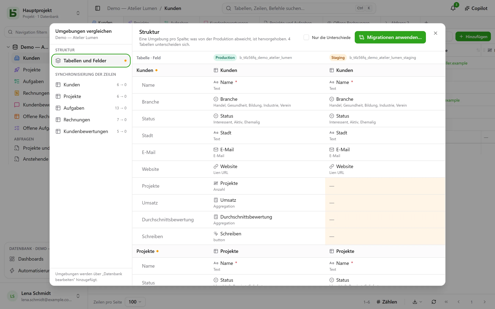

Eine Datenbank kann **Umgebungen** haben: Produktion, Staging, Entwicklung … Jede ist eine
vollwertige Datenbank – mit eigenem Schema, eigenen Tabellen, Zeilen und Berechtigungen –, und alle
teilen die **Abstammung** der Datenbank, ihrer Tabellen und ihrer Felder.

## In der Oberfläche

Die Seitenleiste zeigt **eine Zeile pro Datenbank**, mit einem Badge, das die geöffnete Umgebung
nennt und den Wechsel erlaubt. Das Badge erscheint erst, wenn es mehr als die Produktion gibt.

Umgebungen werden in **Datenbank bearbeiten …** hinzugefügt, umbenannt und gelöscht: Eine neue
Umgebung entsteht aus einer **Kopie der Struktur** einer anderen, ohne deren Zeilen.

## Umgebungen vergleichen

Im Menü der Datenbank öffnet unter **Weitere Aktionen** der Eintrag **Umgebungen vergleichen …**
einen Dialog:

- **Struktur**: die Umgebungen in Spalten, Tabellen und Felder in Zeilen; was von der Produktion
  abweicht, ist hervorgehoben.
- **Migrationen anwenden …** bereitet den Plan vor, um Schritt für Schritt von einer Umgebung zu
  einer anderen zu gelangen. Er hakt nie von sich aus an, was eine jüngere Änderung am Ziel
  rückgängig machen würde.
- **Zeilensynchronisierung**: Tabelle für Tabelle Zeilen von einer Umgebung in eine andere
  übertragen, anhand ihrer Kennung.

## Wie basedb weiß, wer was geändert hat

Der Vergleich stützt sich auf den **Strukturverlauf**: Jedes Anlegen, Ändern oder Löschen einer
Tabelle oder eines Felds wird von einem Trigger auf dem Katalog erfasst und lässt sich im Reiter
„Struktur“ des Verlaufs nachlesen. Die Abstammungskennungen verbinden ein Feld im Staging mit
seinem Gegenstück in der Produktion, auch wenn es umbenannt wurde.

## In SQL

Jede Umgebung ist ein Schema: `b_t4z56fq_ventes` für die Produktion,
`b_t4z56fq_ventes_recette` für das Staging. Ihre Abfragen wechseln die Umgebung, indem sie das
Schema wechseln – oder den `search_path`.
