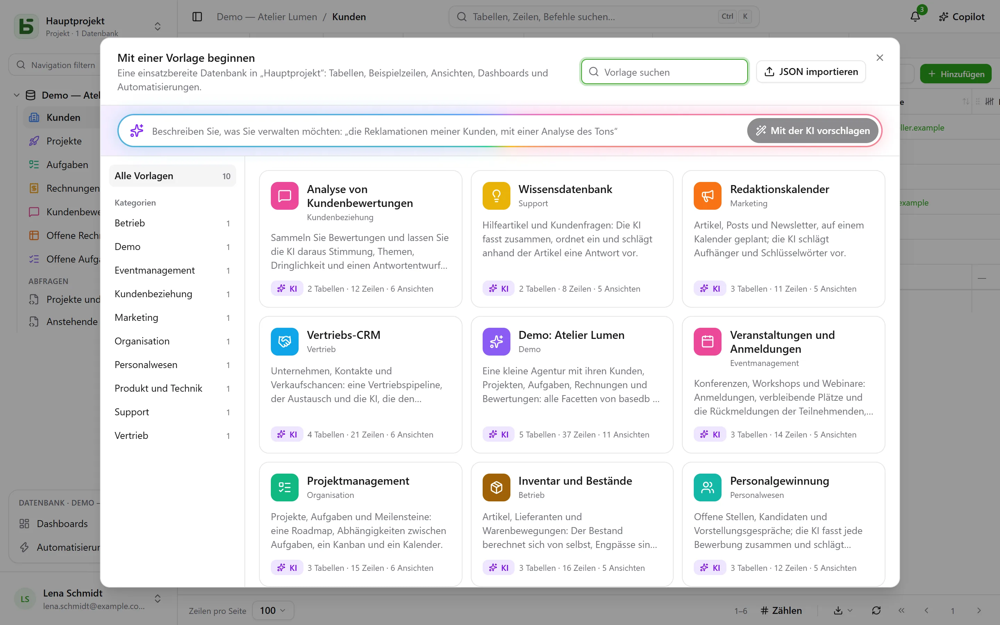

Eine **Vorlage** legt mit einem Klick eine ganze Datenbank an: ihre Tabellen und deren
Verknüpfungen, Beispielzeilen, Ansichten, ein Dashboard, Automatisierungen und Felder, die die KI
selbst ausfüllt. Die [Vorlagengalerie](/basedb/de/modeles/) zeigt, welche basedb anbietet.

## Von einer Vorlage ausgehen

**Neue Datenbank**, dann **Von einer Vorlage ausgehen oder bei der KI anfragen**: Die Galerie
öffnet sich.



Jede Vorlage lässt sich vor der Verwendung vollständig ansehen – ihre Tabellen und deren Felder,
ihre Ansichten, ihre Automatisierungen und die Anweisung jedes ihrer KI-Felder. **Datenbank
anlegen** fragt nach ihrer Bezeichnung und, wenn es KI-Felder gibt, nach Ihrer Zustimmung, dass die
Werte, die sie zitieren, an den KI-Anbieter der Instanz gehen. Ohne diese Zustimmung sind es
gewöhnliche Felder, gefüllt mit ihren Beispielwerten.

**Beispieldaten laden**, standardmäßig angehakt, füllt die Tabellen mit Beispielzeilen, um die
Datenbank in Aktion zu sehen. Ist es nicht angehakt, bleiben die Tabellen leer, bereit für Ihre
eigenen Daten – Ansichten, Dashboards und Automatisierungen werden trotzdem angelegt.

Ein leeres Projekt bietet außerdem die **Demo-Datenbank** an: eine kleine Agentur mit ihren Kunden,
Projekten, Aufgaben, Rechnungen und Bewertungen, die alle Facetten von basedb zeigt.

## In Ihrer Sprache

Die offiziellen Vorlagen werden **in der Sprache des Bildschirms** gelesen und angelegt: Tabellen,
Felder, Auswahlwerte, Beispielzeilen, Ansichten, Dashboards, Automatisierungen und KI-Anweisungen.
Die Beispielzeilen wechseln mit der Sprache die Welt: Aus der „Boulangerie Martin“ aus Lyon wird
auf Deutsch „Bäckerei Keller“ in Leipzig.

Eine Vorlage, die in Ihre Instanz importiert oder aus einer Datenbank gespeichert wurde, wurde von
jemandem geschrieben: Sie wird so gelesen, wie sie geschrieben wurde.

## Bei der KI anfragen

Beschreiben Sie oben in der Galerie Ihren Bedarf in einem Satz – „die Nachverfolgung der
Reklamationen meiner Kunden, mit einer Analyse des Tonfalls“. Die KI schlägt eine vollständige
Datenbank vor: Tabellen, glaubwürdige Beispielzeilen, Ansichten, Dashboard und KI-Felder, wo es
sich anbietet. Sie sehen sie sich an wie eine Vorlage, können sie **verfeinern** („Füge eine
Lieferantentabelle hinzu“) und dann anlegen. Die KI erhält nur Ihren Satz – keine Daten aus
irgendeiner Datenbank –, und nichts wird vor Ihrem Klick angelegt.

## Eine Vorlage in JSON schreiben

Eine Vorlage ist ein JSON-Dokument. Hier ihr Grundgerüst:

```json
{
  "format": 1,
  "key": "suivi-tickets",
  "label": "Suivi de tickets",
  "summary": "Une phrase pour la galerie.",
  "category": "Produit et technique",
  "icon": "bug",
  "color": "#ef4444",
  "tables": [
    {
      "key": "tickets",
      "label": "Tickets",
      "fields": [
        { "label": "Titre", "kind": "short_text" },
        { "label": "Statut", "kind": "select", "options": ["Nouveau", "En cours", "Résolu"] },
        { "label": "Ouvert le", "kind": "date" },
        { "label": "Description", "kind": "long_text" },
        { "label": "Catégorie", "kind": "select", "options": ["Bug", "Demande"],
          "ai": { "prompt": "Classe ce ticket : {{Titre}} — {{Description}}" } },
        { "label": "Âge (jours)", "kind": "formula", "formula": "JOURS(AUJOURDHUI(); [Ouvert le])" }
      ]
    },
    { "key": "produits", "label": "Produits", "fields": [{ "label": "Nom", "kind": "short_text" }] }
  ],
  "links": [{ "from": "tickets", "label": "Produit", "to": "produits" }],
  "rows": {
    "produits": [{ "$key": "app", "Nom": "Application mobile" }],
    "tickets": [{ "Titre": "Crash au démarrage", "Statut": "En cours", "Ouvert le": "-3d", "Produit": "@app" }]
  },
  "views": [
    { "table": "tickets", "label": "Tableau", "kind": "kanban", "spec": { "group_by": "Statut" } }
  ],
  "dashboards": [
    { "label": "Vue d’ensemble", "blocks": [
      { "kind": "number", "title": "Ouverts", "table": "tickets", "filter": "[Statut] ne \"Résolu\"" },
      { "kind": "chart", "title": "Par catégorie", "table": "tickets", "group_by": "Catégorie", "style": "pie" }
    ] }
  ],
  "automations": []
}
```

Die wichtigsten Regeln:

- **Alles wird über die Bezeichnung zitiert**: ein Feld in einer Ansicht, ein Filter
  (`[Statut] ne "Résolu"`), eine Formel (`[Prix] * [Quantité]`), eine KI-Anweisung oder eine
  Nachricht (`{{Titre}}`). Eine Option wird über ihre Bezeichnung angegeben.
- Das **erste Feld** einer Tabelle ist ihr Anzeigefeld: ein Text, eine Zahl, ein Datum, eine
  E-Mail oder eine Adresse.
- Eine **Verknüpfung** wird in `links` deklariert, nie als Feld; eine Zeile verweist darauf mit
  `"@clé"`, dem `$key` einer Zeile der Zieltabelle.
- Ein **Datum** kann relativ zu dem Tag sein, an dem die Vorlage angewendet wird: `"today"`,
  `"+3d"`, `"-2w"`, `"+1m"`; ein Datum mit Uhrzeit fügt die Uhrzeit hinzu, `"+1d 14:30"`. Eine
  Person wird als `"$moi"` geschrieben.
- Ein **KI-Feld** trägt `"ai": { "prompt": "…" }` und kann einen Beispielwert erhalten, der nur
  geschrieben wird, wenn die KI nicht verwendet wird.
- Eine Vorlage enthält **nie** Freigaben, Berechtigungen, Webhooks, Dateien oder andere Personen
  als `"$moi"`: Sie kommt manchmal von anderswo und darf nichts öffnen.

Die vollständige Referenz – alle Feldtypen, alle Schlüssel für Ansichten, die Grenzen – steht in
Kapitel 20 der Architekturdokumentation im Repository.

## Eine Vorlage für alle Instanzen veröffentlichen

Die Vorlagen der offiziellen Galerie sind die Dateien des Ordners
[`packages/templates/catalog`](https://github.com/eodia/basedb/tree/main/packages/templates/catalog)
im Repository, eine Datei pro Vorlage, benannt nach ihrem `key`. Die öffentliche Website macht
daraus die [Galerie](/basedb/de/modeles/) und veröffentlicht den gesamten Katalog unter der Adresse
[`/basedb/modeles/catalogue.json`](/basedb/modeles/catalogue.json). Jede Instanz liest ihn, wenn
jemand die Galerie öffnet, und behält ihn eine Stunde: Eine Datei zu ändern und die Website neu zu
veröffentlichen genügt, um die Galerie aller Instanzen zu ändern.

Jede Vorlage wird beim Bauen der Website mit demselben Validator geprüft wie auf dem Server: Eine
ungültige Vorlage lässt den Build fehlschlagen, statt bei den Benutzern anzukommen.

Eine offizielle Vorlage wird einmal geschrieben, auf Französisch. Ihre Texte in einer anderen
Sprache sind ein Wörterbuch,
[`packages/templates/i18n/<langue>/<clé>.json`](https://github.com/eodia/basedb/tree/main/packages/templates/i18n)
– der französische Text, dann seine Übersetzung –, das die Website neben dem Katalog veröffentlicht
(`/basedb/modeles/i18n/<langue>.json`). Die Instanz übergibt ihm jeden Text und verfolgt jede
Bezeichnung dort, wo sie zitiert wird – Formeln, Filter, Ansichten, Anweisungen –, und liest dann
das Ergebnis erneut: Ein Wörterbuch, das die Vorlage kaputt machen würde, wird nicht ausgeliefert,
die französische Vorlage schon. Ein im Wörterbuch fehlender Text bleibt auf Französisch.

Die Instanz liest die Adresse `BASEDB_TEMPLATES_URL` – standardmäßig die der öffentlichen Website.
Richten Sie sie auf einen eigenen Katalog oder setzen Sie `off`, um keinen zu lesen: Die Instanz
liefert dann die Vorlagen, die in ihre Version eingebaut sind.

## Die Vorlagen Ihrer Instanz

Ein Administrator kann **eine JSON-Vorlage** in seine Instanz **importieren**, aus der Galerie
heraus („JSON importieren“): Sie kommt in die Galerie aller ihrer Benutzer und ersetzt eine Vorlage
mit demselben Schlüssel. Ein Vorschlag der KI lässt sich mit einem Klick dort hinzufügen.

Jede Datenbank kann auch zu einer Vorlage werden: **Als Vorlage speichern** im Menü der Datenbank,
unter **Weitere Aktionen**. Ihre Tabellen, Felder, KI-Anweisungen, Verknüpfungen, freigegebenen Ansichten, Dashboards und
Automatisierungen – und, wenn Sie möchten, bis zu 50 Zeilen pro Tabelle – werden als JSON
heruntergeladen, bereit für den offiziellen Katalog oder den der Instanz. Eine Automatisierung, die
eine Zeile sucht, Zeilen durchläuft, Zweige nimmt oder einen vorherigen Schritt zitiert, bleibt
vorerst außen vor, und der Bildschirm sagt das.
