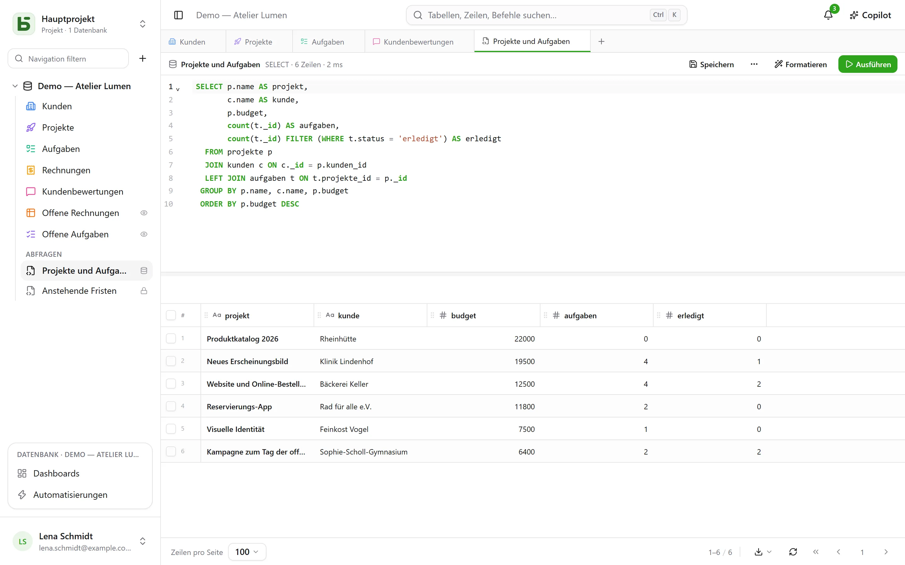
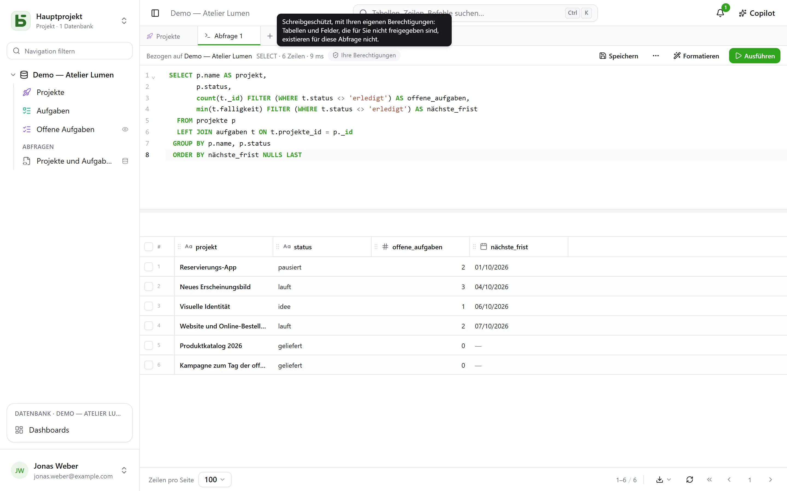
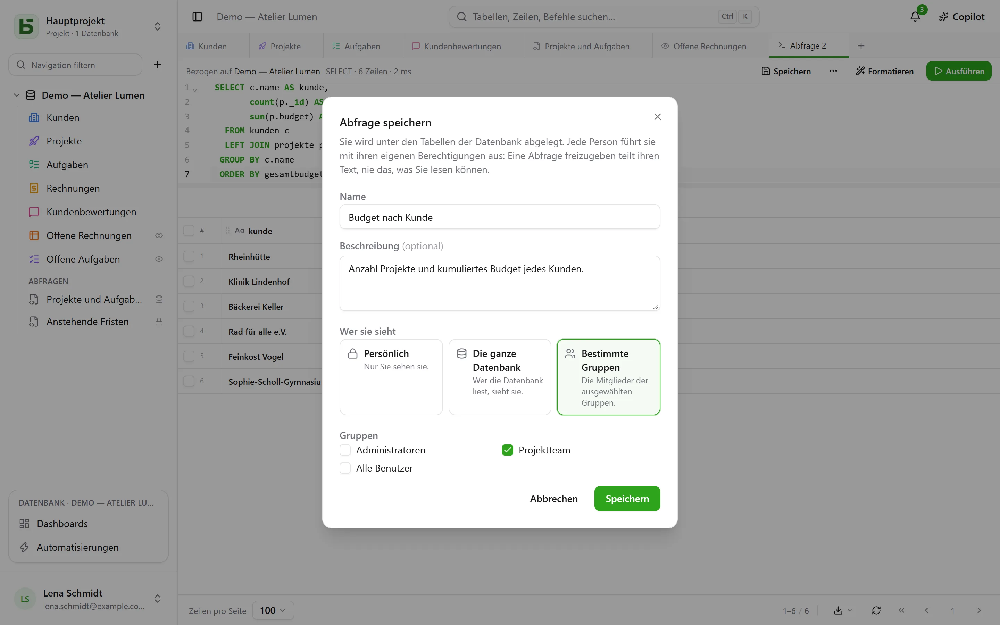
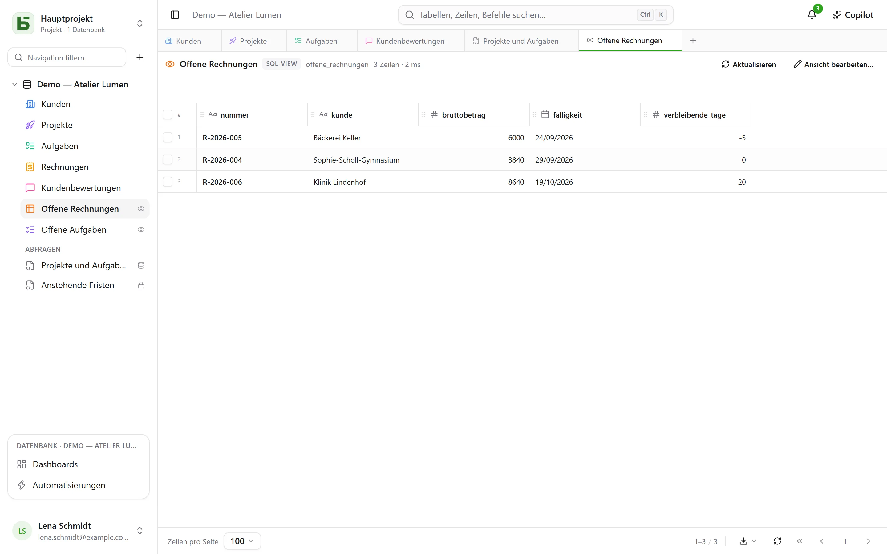
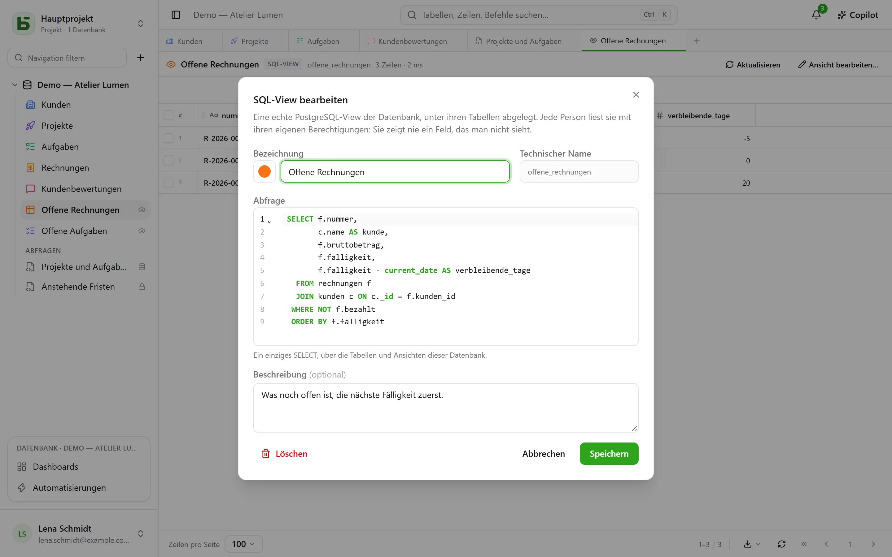

Ihre Tabellen sind echte PostgreSQL-Tabellen, und die Oberfläche fragt sie in SQL ab, unter ihrem
echten Namen. Jedes Mitglied der Datenbank kann eine Abfrage schreiben und sie unter den Tabellen
**speichern** – nur für sich, für die ganze Datenbank oder für einige Gruppen –, und wer die
Datenbank verwaltet, kann daraus eine **SQL-View** machen: eine echte PostgreSQL-View zwischen den
Tabellen, die auch `psql` und Ihre Werkzeuge lesen.



## Jede Person mit ihren Berechtigungen

Das **+** der Reiterleiste oder das Menü **⋯** der Datenbank → **SQL-Abfrage** öffnet einen
SQL-Reiter: einen Editor mit Syntaxhervorhebung und Autovervollständigung, **Strg+Eingabe** zum
Ausführen, und das Ergebnis im selben Raster wie Ihre Tabellen. Was die Abfrage lesen kann, hängt
davon ab, wer sie startet:

- mit der Stufe **Verwalten** auf der Datenbank die ganze Datenbank, Schreibvorgänge eingeschlossen;
- mit den Stufen **Lesen** oder **Bearbeiten** läuft die Abfrage **schreibgeschützt, mit Ihren
  eigenen Berechtigungen**. Eine Tabelle, die Ihnen verschlossen ist, existiert für sie nicht; ein
  Feld, das Ihnen verborgen ist, verschwindet aus `SELECT *` und wird abgelehnt, wenn Sie es
  benennen, selbst mit qualifiziertem Tabellennamen; ein Schreibvorgang wird abgelehnt. Das Ergebnis
  trägt das Kennzeichen **Ihre Berechtigungen**.



Nicht der Bildschirm sortiert aus: PostgreSQL selbst wendet Ihre Berechtigungen an, Spalte für
Spalte, über eine Rolle, die nur Ihnen gehört. Eine Abfrage kann Ihnen also nichts zeigen, was das
Raster, die API oder der MCP-Server Ihnen nicht zeigen würden.

## Eine Abfrage speichern

**Speichern** in der Leiste des Reiters legt die Abfrage unter den Tabellen der Datenbank ab, in der
Rubrik **Abfragen**. Sie öffnet sich mit einem Klick wieder; **⋯** → **Speichern unter …** erstellt
eine Kopie, **Name und Freigabe …** (im Reiter oder in ihrem Menü in der Seitenleiste) benennt sie
um, ändert, wer sie sieht, oder löscht sie – **Löschen** steht auch in ihrem Menü, per Rechtsklick.
Ein Reiter, der sie zeigte, behält ihren Text.



| Reichweite | Wer sie sieht | Wer sie anlegen und bearbeiten kann |
|---|---|---|
| **Persönlich** – ein Schloss | nur Sie | alle, die die Datenbank sehen, für sich selbst |
| **Ganze Datenbank** | alle, die die Datenbank sehen | die Stufe **Verwalten** auf der Datenbank |
| **Gruppen** | die Mitglieder der gewählten Gruppen | die Stufe **Verwalten** auf der Datenbank |

**Eine Abfrage freizugeben gibt ihren Text frei, nie das, was ihr Verfasser lesen darf.** Jede
Person führt sie mit ihren eigenen Berechtigungen aus: Dieselbe Abfrage, von zwei Personen
geöffnet, zeigt jeder, was sie sehen darf – oder sagt ihr, dass eine Spalte für sie nicht
existiert.

Eine aus der Seitenleiste geöffnete Abfrage **wird sofort ausgeführt, schreibgeschützt**: Sie
sehen ihr Ergebnis, ohne etwas entschieden zu haben. **Ausführen** startet sie anschließend so, wie
sie ist, erneut. Ein Punkt neben ihrem Namen zeigt an, dass Sie ihren Text seit dem Speichern
geändert haben; **Speichern** legt die Änderung dort ab, wenn Sie die Abfrage bearbeiten dürfen,
und schlägt sonst vor, eine neue daraus zu machen.

## Die SQL-Views

Eine **SQL-View** ist eine echte PostgreSQL-View im Schema der Datenbank. Sie steht **zwischen den
Tabellen**, mit Farbe und Symbol wie eine Tabelle, und einem kleinen **Auge** rechts, das anzeigt,
dass es eine View ist. Ein Klick öffnet sie in einem Reiter: ihre Zeilen im Raster,
**Aktualisieren**, um sie neu zu lesen.



Sie wird über das Menü **⋯** der Datenbank → **Neue SQL-View …** angelegt oder aus einem
SQL-Reiter: **⋯** → **SQL-View erstellen …**, und die Abfrage des Reiters wird zu ihrer Definition.
Der Dialog fragt nach:

- ihrer **Bezeichnung** und ihrem **Erscheinungsbild** – Farbe, Symbol oder Bild, gewählt wie für
  eine Tabelle;
- ihrem **technischen Namen**, aus der Bezeichnung abgeleitet, wenn Sie keinen angeben – dem Namen,
  den man nach `FROM` schreibt;
- ihrer **Abfrage**: ein einziges `SELECT` über die Tabellen und die anderen Views der Datenbank.
  PostgreSQL lehnt ab, was es ablehnt, und der Editor zeigt auf die Stelle.



Die View wird dann unter ihrem Namen gelesen, aus der Oberfläche ebenso wie aus `psql` oder Ihrem
BI-Tool:

```sql
SELECT * FROM b_t4z56fq_demo_atelier_lumen.factures_a_encaisser;
```

**Eine View zeigt nie ein Feld, das man nicht sieht.** Jede Person liest sie mit ihren eigenen
Berechtigungen, auf jeder Tabelle und jeder Spalte, die sie liest; die Seitenleiste listet sie nur
für diejenigen auf, die alles lesen dürfen, was sie liest. Sie liest nur **ihre** Datenbank: Eine
andere Datenbank oder der Katalog von basedb werden schon beim Anlegen abgelehnt. Sie anzulegen,
zu bearbeiten oder zu löschen erfordert die Stufe **Verwalten** auf der Datenbank. **Löschen**, in
ihrem Menü der Seitenleiste, entfernt sie für alle, Skripte und Werkzeuge eingeschlossen; die
Tabellen, die sie liest, bleiben unberührt.

### Wenn sich die Struktur ändert

- Eine Tabelle oder ein Feld **umzubenennen** macht eine View nicht kaputt: PostgreSQL zieht mit.
- **Die Formel** eines berechneten Felds zu ändern, das sie liest, entfernt sie kurz und setzt sie
  dann auf der neuen Spalte wieder ein. Hält sie nicht mehr, bleibt sie **zu korrigieren** – ein
  Dreieck zeigt es in der Seitenleiste an – und ihre Definition bleibt erhalten: **View bearbeiten …**,
  korrigieren, speichern.
- Eine Tabelle wird nicht bereinigt, solange eine View sie liest, und eine View wird nicht gelöscht,
  solange eine andere View sie liest: Die Ablehnung nennt die betroffene View.

## Abfrage, SQL-View oder Frage?

| | Was es ist | Wo es lebt | Wofür |
|---|---|---|---|
| **Gespeicherte Abfrage** | ein SQL-Text | unter den Tabellen, Rubrik „Abfragen“ | eine Abfrage wiederfinden, sie als Text freigeben |
| **SQL-View** | eine echte PostgreSQL-View | zwischen den Tabellen | einer Lesart einen Namen geben, für die Oberfläche **und** für `psql`, Ihre Skripte, Ihre Werkzeuge |
| **Frage** | eine per Maus oder in SQL erstellte Lesart und ihre Visualisierung | in den [Dashboards](/basedb/de/fonctionnalites/tableaux-de-bord/) | eine Kennzahl, ein Diagramm, eine Kreuztabelle, unter Filtern |

## Grenzen

- Das Raster zeigt höchstens die unten auf dem Bildschirm gewählte Anzahl an **Zeilen pro Seite**;
  „gekürzt“ weist darauf hin. Eine Abfrage wird nach 15 Sekunden abgebrochen.
- Eine SQL-View wird in SQL und in der Oberfläche gelesen; REST-API und MCP-Server stellen sie
  nicht bereit.
- Eine SQL-View bleibt in der Umgebung, in der sie angelegt wurde: Eine Umgebung anlegen, die
  Struktur vergleichen oder eine Vorlage speichern übernimmt sie noch nicht.
