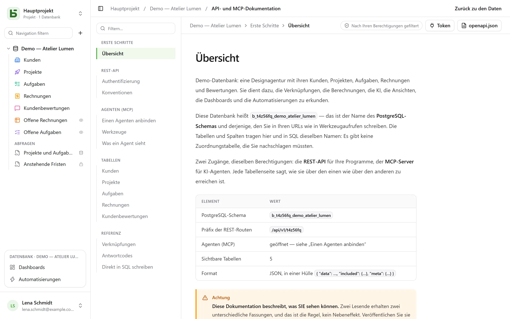

Die REST-API ist dieselbe, die auch die Oberfläche verwendet: **Es gibt keine private Route**.
Ihre URLs tragen die physischen Namen – dieselben, die Sie auch in SQL lesen.

```text
/api/v1/<tenant>/data/<base>/<table>
/api/v1/t4z56fq/data/b_t4z56fq_ventes/opportunites
```

## Ein Token

In der Oberfläche, Menü **⋯** der Datenbank → **API und Agenten** → **API- und MCP-Token …**: Wer
die Stufe **Verwalten** auf der Datenbank oder ihrem Projekt hat, legt dort ein
**Integrationstoken** an, das auf diese Datenbank beschränkt und standardmäßig schreibgeschützt
ist, nachdem das Passwort bestätigt wurde – ein Konto ohne Passwort, das sich über einen
Identitätsanbieter anmeldet, kann das noch nicht. Es wird nur einmal angezeigt; legen Sie es in
einer Umgebungsvariablen ab.

Ein Token liest; es legt an und ändert, wenn es mit Schreibrecht angelegt wurde, und **löscht,
wenn es dafür angelegt wurde** — Rechte „Lesen, Schreiben und Löschen“ —, außer einer Zeile, die
über eine Verknüpfung mit Kaskade andere mitnehmen würde. Es hat nie mehr Berechtigungen als die
Person, die es angelegt hat.

```bash
export BASEDB_TOKEN=bdb_…
curl "http://localhost:3000/api/v1/t4z56fq/data/b_t4z56fq_ventes/opportunites?limit=20" \
  -H "Authorization: Bearer $BASEDB_TOKEN"
```

## Lesen

| Parameter | Rolle |
|---|---|
| `filter` | ein lesbarer Ausdruck: `statut eq "gagne" and montant gte 10000` |
| `sort` | `-montant,nom` |
| `fields` | die zurückzugebenden Spalten |
| `limit`, `after` | Paginierung über einen verschlüsselten Cursor: `meta.next_cursor` einer Seite, übergeben als `after`, liefert die nächste (`meta.has_next_page`) |
| `links=display` | die Verknüpfungen mit ihrem Anzeigewert |
| `count=exact` | die Gesamtzahl, gedeckelt bei 100 000 |
| `variables=raw` | die Langtexte so, wie sie geschrieben wurden, `{{colonne}}` eingeschlossen, statt mit den [Werten der Zeile](/basedb/de/fonctionnalites/tables-et-champs/#formatierter-text-und-variablen) |

Die Operatoren: `eq`, `ne`, `eq_ci`, `contains`, `starts_with`, `ends_with`, `in`, `is_null`,
`gt`, `gte`, `lt`, `lte`, `between`, kombiniert mit `and`, `or`, `not` und Klammern. Ein Filter
geht durch eine Verknüpfung hindurch: `clients_id.ville eq "Lyon"`.

## Schreiben

```bash
curl -X POST "http://localhost:3000/api/v1/t4z56fq/data/b_t4z56fq_ventes/opportunites" \
  -H "Authorization: Bearer $BASEDB_TOKEN" -H "content-type: application/json" \
  -d '{"values": {"nom": "Audit RGPD", "statut": "nouveau", "montant": 12000}}'
```

`PATCH …/<table>/<_id>` ändert eine Zeile mit demselben Body `{"values": {…}}`. Fehler haben eine
einheitliche Form: `{ "code": "…", "details": {…}, "request_id": "…" }`, mit einem stabilen Code
pro Ursache.

Jeder Schreibvorgang gibt den Header `x-basedb-transaction` zurück: Übergeben an
`POST /api/v1/<tenant>/history/undo` (`{"transaction": "…"}`), macht er ihn rückgängig, wie Strg+Z
in der Oberfläche – abgelehnt, wenn die Zeile inzwischen geändert wurde.

## Über die Zeilen hinaus

Mit demselben Token:

| Route | Rolle |
|---|---|
| `GET …/data/<base>/<table>/aggregate` | Zusammenfassungen über alle Zeilen eines Filters: `aggregates=montant:sum,nom:filled`, `group=statut` |
| `GET …/data/<base>/<table>/<_id>/comments`, `POST` | die Kommentare einer Zeile lesen und schreiben |
| `POST /api/v1/<tenant>/automations/<id>/run` | eine per Schaltfläche ausgelöste Automatisierung auf einer Zeile starten (`{"record": "…"}`) |
| `GET /api/v1/<tenant>/meta/bases/<base>/dashboards` | die Dashboards einer Datenbank |
| `GET /api/v1/<tenant>/meta/users` | die Mitglieder des Arbeitsbereichs, für ein Feld Person |
| `GET /api/v1/<tenant>/meta/templates` | die Datenbankvorlagen der Galerie |
| `GET /api/v1/<tenant>/events?base=<base>&table=<table>` | eine Tabelle in Echtzeit verfolgen: Signale, die anschließend über die obigen Routen erneut gelesen werden (siehe [Webhooks](/basedb/de/integrations/webhooks/#ohne-webhook-eine-tabelle-verfolgen)) |

Die [freigegebenen Ansichten](/basedb/de/fonctionnalites/vues-partagees/) lassen sich ohne Konto
lesen: `GET /api/v1/views/<jeton>` und `…/rows` als JSON, `…/calendar.ics` als iCalendar.

Aufbauen – eine Automatisierung, ein Dashboard, eine Integration anlegen – bleibt einer Sitzung in
der Oberfläche vorbehalten: Ein Token liest und schreibt Zeilen, es ändert nicht die Datenbank.

## Eine Datenbank aus einer Vorlage anlegen

Eine Anwendung, die sich installiert, legt ihre Datenbank in **einem Aufruf** an: Der Server
wendet die Vorlage an – Tabellen, Felder, Verknüpfungen, Beispielzeilen, Ansichten, Dashboards,
Automatisierungen – und lässt, falls ein Schritt fehlschlägt, keine Datenbank zurück.

```bash
curl -X POST "http://localhost:3000/api/v1/t4z56fq/admin/bases" \
  -H "Authorization: Bearer $ACCES" -H "content-type: application/json" \
  -d '{"template": "crm", "label": "Ventes", "rows": false}'
```

`template` ist der Schlüssel einer Vorlage aus der Galerie, oder eine vollständige Vorlage im
[Format der Vorlagen](/basedb/de/fonctionnalites/modeles/). Mit dem Header
`Accept: application/x-ndjson` kommt die Antwort Zeile für Zeile: eine Zeile `{"step": …}` pro
Schritt, dann die angelegte Datenbank. Dieser Aufruf verlangt das Zugriffstoken einer Person, die
eine Datenbank anlegen darf (`POST /auth/session/access`, nach der Anmeldung): Ein
Integrationstoken öffnet nur eine bestehende Datenbank.

## Ein Token prüfen

Token von basedb lassen sich nicht außerhalb von basedb prüfen. Eine Anwendung, die eines erhält
– zum Beispiel ein von basedb aus geöffnetes Werkzeug mit dem Token der Person –, fragt ab, was es
wert ist (Introspektion, RFC 7662), mit ihrem eigenen Integrationstoken:

```bash
curl -X POST "http://localhost:3000/auth/introspect" \
  -H "Authorization: Bearer $BASEDB_TOKEN" \
  --data-urlencode "token=$JETON_RECU"
```

```json
{ "active": true, "token_type": "access_token",
  "sub": "0195a…", "email": "claire@example.com", "name": "Claire Martin",
  "tenant": "t4z56fq", "groups": ["Commerciaux"], "exp": 1790000000 }
```

Jedes Token, das nichts wert ist – unbekannt, abgelaufen, widerrufen, Sitzung beendet, anderer
Arbeitsbereich –, antwortet mit `{"active": false}`, ohne den Grund zu nennen. Die Antwort wird
live gelesen: Eine Abmeldung zeigt sich sofort. Für ein Integrationstoken sagt die Antwort auch,
welche Datenbank es öffnet (`base`), seinen Zugriff (`read` oder `write`) und seine Oberflächen.

## Die generierte Dokumentation

Jede Datenbank hat ihre Seite **API- und MCP-Dokumentation**: für jede Tabelle ihre Endpunkte, ihre
Spalten, Beispiele in cURL und JavaScript. Sie ist **nach Ihren Berechtigungen gefiltert** – zwei
Lesende erhalten zwei Fassungen –, geschrieben **in der Sprache Ihres Bildschirms**, und existiert
auch als OpenAPI 3.1 (`/api/v1/<tenant>/meta/bases/<base>/openapi.json`). Die Namen, die Pfade und
die Fehlercodes bleiben in allen Sprachen gleich.


