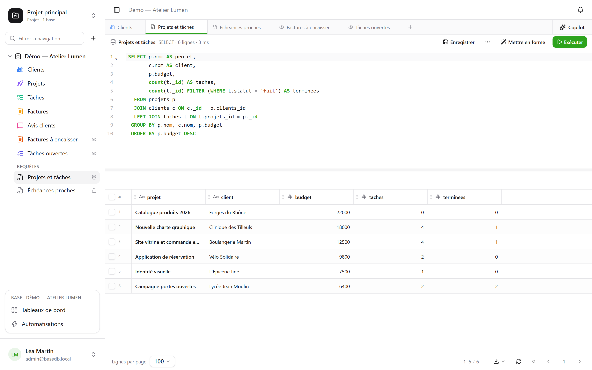

Das ist der Daseinszweck von basedb: **Ihre Tabellen sind echte Tabellen**. Jeder PostgreSQL-Client
liest sie unter ihrem Namen.

## Die Namen

| Objekt | Physischer Name | Beispiel |
|---|---|---|
| Datenbank | ein Schema `b_<tenant>_<nom>` | `b_t4z56fq_ventes` |
| Staging-Umgebung | das Schema mit Suffix | `b_t4z56fq_ventes_recette` |
| Tabelle | ihr slugifizierter Name | `opportunites` |
| Feld | sein slugifizierter Name | `echeance` |
| Verknüpfung | `<table cible>_id` | `clients_id` |
| [SQL-View](/basedb/de/fonctionnalites/requetes-et-vues-sql/) | ihr technischer Name, im Schema der Datenbank | `factures_a_encaisser` |

Die Seite **API- und MCP-Dokumentation** jeder Datenbank nennt sie alle, und `\d` in `psql` zeigt die
Beschreibungen (`COMMENT ON`).

## In der Oberfläche

Das **+** der Reiterleiste oder das Menü **⋯** der Datenbank → **Neue SQL-Abfrage**: ein Editor mit
Syntaxhervorhebung und Autovervollständigung, dessen Ergebnis im selben Raster erscheint wie Ihre
Tabellen.



- **Jede Person liest dort mit ihren Berechtigungen**: Die Stufe Verwalten hat die ganze Datenbank,
  Schreibvorgänge eingeschlossen; die anderen Mitglieder schreiben schreibgeschütztes SQL, in dem
  eine verschlossene Tabelle nicht existiert und ein verborgenes Feld verschwindet.
- Eine Abfrage **wird** unter den Tabellen **gespeichert** – für sich selbst, für die ganze
  Datenbank oder für Gruppen – und wird auf Wunsch zu einer **SQL-View**: einer echten
  PostgreSQL-View zwischen den Tabellen, die auch aus `psql` lesbar ist.

Alle Einzelheiten stehen unter [Abfragen und SQL-Views](/basedb/de/fonctionnalites/requetes-et-vues-sql/).

## Aus psql

Mit der mitgelieferten `docker-compose.yml` wird PostgreSQL auf `127.0.0.1:5432` veröffentlicht:

```bash
psql "postgres://basedb:<POSTGRES_PASSWORD>@localhost:5432/basedb"
```

```sql
SET search_path = b_t4z56fq_ventes;

SELECT o.nom, o.montant, c.nom AS client
FROM opportunites o
JOIN clients c ON c._id = o.clients_id
WHERE o.statut = 'gagne';
```

## In SQL schreiben

Das ist erlaubt. Die Constraints (Einfachauswahlen, Verknüpfungen, URLs, erforderliche Felder)
werden von PostgreSQL durchgesetzt und weisen einen ungültigen Wert ab, genau wie in der
Oberfläche. Und der Schreibvorgang wird **im Verlauf aufgezeichnet**: Der Verlauf zeigt ihn als
„Direkte SQL-Sitzung“, mit der Sitzung, die ihn ausgeführt hat, und er lässt sich wie jeder andere
rückgängig machen.

:::caution
Die **Struktur** in SQL zu ändern (`ALTER TABLE`) umgeht den Katalog von basedb, der davon nichts
wüsste. Gehen Sie über die Oberfläche, die API oder einen Agentenvorschlag: Die Migrations-Engine
plant, sperrt nur kurz und hält den Katalog exakt.
:::
