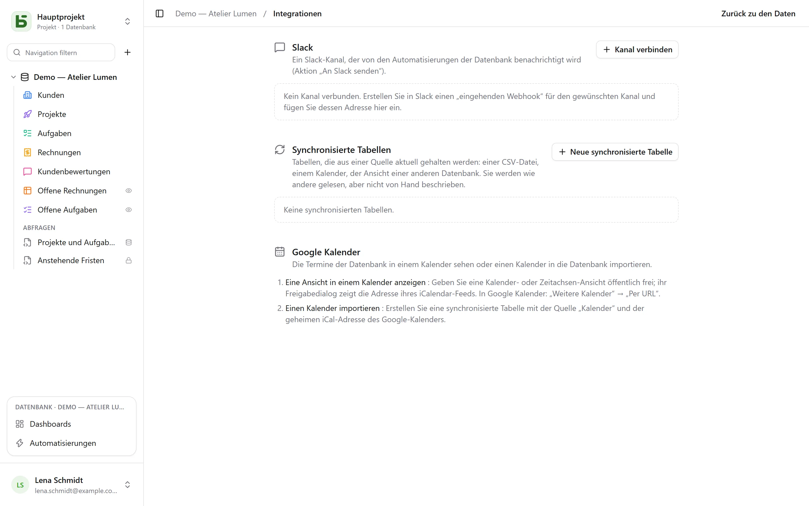

Der Bildschirm **Integrationen** einer Datenbank öffnet sich über das Profilmenü unten links. Er
erfordert die Stufe **Verwalten** und bündelt alles, was die Datenbank mit Ihren übrigen Werkzeugen
verbindet.

## Slack

**Kanal verbinden**: Legen Sie in Slack einen *eingehenden Webhook* für den gewünschten Kanal an und
fügen Sie dann seine Adresse ein (`https://hooks.slack.com/…`, einzige akzeptierte Herkunft).
**Testen** sendet eine Testnachricht. Die Adresse wird beim Speichern verschlüsselt und nie wieder
angezeigt.

Der verbundene Kanal ist dann eine Aktion der [Automatisierungen](/basedb/de/fonctionnalites/automatisations/):
**An Slack senden**, mit einer Nachricht, die die Zeile zitiert – „Neue negative Bewertung von
{{Auteur}}: {{Avis}}“.

## Kalender

Zwei Richtungen, zwei Wege:

- **Eine Ansicht in einem Kalender sehen**: Geben Sie eine Kalender- oder Zeitachsen-Ansicht
  öffentlich frei; ihr Freigabedialog liefert die Adresse eines **iCalendar-Feeds**, den man in
  Google Kalender („Weitere Kalender“ → „Per URL“), Outlook oder Apple Kalender abonniert. Siehe
  [Freigegebene Ansichten](/basedb/de/fonctionnalites/vues-partagees/#ein-kalender-in-ihrer-kalender-app).
- **Einen Kalender importieren**: Legen Sie eine synchronisierte Tabelle mit der Quelle „Kalender“
  und der geheimen iCal-Adresse des Kalenders an.

## Synchronisierte Tabellen

Eine synchronisierte Tabelle wird **aus einer Quelle aktuell gehalten**: Sie lässt sich lesen,
filtern und in Ansichten darstellen wie jede andere, wird aber nicht von Hand beschrieben – ein
Badge „Synchronisiert“ erinnert daran, und die API lehnt jeden Schreibvorgang ab (`TABLE_SYNCED`).

| Quelle | Was aus der Tabelle wird |
|---|---|
| **Online-CSV-Datei** | eine Spalte pro Spalte der Datei, typisiert nach ihrem Inhalt: Zahl, Datum oder Text |
| **Kalender** (Google Kalender, iCalendar) | ein Termin pro Zeile: Titel, Beginn, Ende, Ort, Beschreibung |
| **Freigegebene Ansicht einer basedb-Instanz** | die Zeilen einer [freigegebenen Ansicht](/basedb/de/fonctionnalites/vues-partagees/#eine-quelle-für-andere-datenbanken), auf dieser Instanz oder einer anderen |

**Neue synchronisierte Tabelle** wählt die Quelle und das Intervall – von alle 15 Minuten bis
einmal täglich; **Synchronisieren** liest sie sofort neu ein. Jeder Durchlauf legt an, ändert und
löscht, was nötig ist, damit die Tabelle der Quelle entspricht, und orientiert sich dabei an einem
Feld **Synchronisierungsschlüssel**. Alle diese Schreibvorgänge laufen über den Verlauf.

**Beenden** der Synchronisierung macht die Tabelle wieder gewöhnlich: Ihre Zeilen bleiben und lassen
sich wieder von Hand beschreiben.

## Grenzen

- Eine Quelle wird bis zu einer Grenze von 5 MB, 10 000 Zeilen und 10 Sekunden gelesen.
- Eine fehlgeschlagene Quelle löscht nichts: Die Tabelle behält ihre Zeilen bis zum nächsten
  Durchlauf.
- Eine Spalte, die nach dem Anlegen in der Quelle erscheint, wird nicht hinzugefügt.
- Slack wird über einen eingehenden Webhook verbunden, noch nicht über eine Slack-App.
