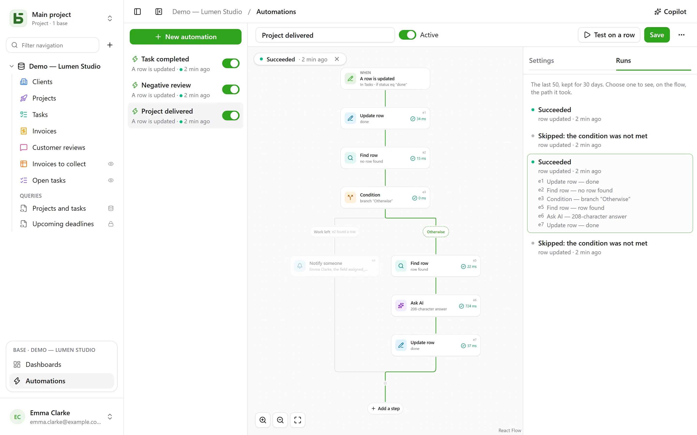

An automation says **when**, **if** and **then**: when a task moves to “Fait”, record the
time; when a negative review comes in, notify the person in charge and post to Slack; every
Monday at 9 a.m., create the row for the team meeting. And when one action is not enough, it
follows a **flow**: find a row, take one branch or another depending on what it says, repeat
steps on each row that matches a filter, reuse in one step what an earlier step found or wrote,
**wait** three days before a follow-up, send a **PDF** as an attachment.

They open from **Automations**, in the block of the open base at the bottom of the sidebar,
and require the **Manage** level.



## The flow

The flow is drawn from top to bottom: the trigger, then each step. A **+** on a line opens the
list of steps, grouped by category — Rows, Communicate, Documents, AI, Logic — with a search,
and adds the one you choose at that point; a card opens its settings on the right. A simple
automation — a trigger and an action — fits in two cards, and is set up as before.

## When

| Trigger | Settings |
|---|---|
| **A row is created** | the table |
| **A row is updated** | the table, and optionally only the fields to watch |
| **At a set time** | every hour, every day or every week, at the chosen time and in the chosen time zone |
| **A button is clicked** | a [Button field](/basedb/en/fonctionnalites/tables-et-champs/#button) of the table |
| **A row is deleted** | the table; the steps cite the row as it was |
| **A row enters a filter** | the table and the filter: the automation runs when a row enters it, and does not run again until it has left — “an invoice becomes overdue”, not “an overdue invoice is updated” |
| **A date arrives** | a Date field of the table, an offset — three days before, the same day, a week after — and the time: due-date reminders, contract anniversaries |
| **A webhook is received** | nothing: the automation gets its own address, which another piece of software calls ([details](#a-service-that-calls-basedb)) |

A trigger on rows sees **all** writes: the interface, the API, an agent, a shared form, and
even direct SQL — automations start from the history, which captures them all.

## Only if

An optional condition, in the [filter language](/basedb/en/integrations/api-rest/#reading) —
`statut eq "fait"`, `montant gte 10000 and payee eq false` — evaluated on the row **at the
moment of acting**. A run whose condition is not met is “skipped”, and says so.

## Then

Up to forty steps, in order; the first one that fails stops the following ones — except inside
a **Try** block ([details](#try)).

| Step | What it does |
|---|---|
| **Update row** | writes values into the row that triggered — or into the one a step found or created |
| **Create row** | in this table or another one of the base |
| **Find row** | the first row of a table that matches a filter, so that the following steps can cite or update it |
| **Notify someone** | a [notification](/basedb/en/fonctionnalites/collaboration/#notifications) to chosen people, or to the one in a Person field |
| **Send an email** | to people on the team, to the one in a Person field, to the address in an Email field — a client, a supplier — or to written addresses; the subject and text cite the row and the previous steps |
| **Call webhook** | an HTTPS request to a service — method, address, headers and body of your choosing ([details](#call-a-service)); its response can then be cited |
| **Send to Slack** | a message in a [connected](/basedb/en/integrations/synchronisation/#slack) channel |
| **Ask AI** | an answer from the [AI provider](/basedb/en/fonctionnalites/ia/) to a prompt that cites the row and the previous steps — draft, summarize, classify —, read as a text, a number, yes or no, a date or a choice from a list |
| **Condition** | several branches: the first one whose condition is met is taken, “Otherwise” when none is; the branches then join again |
| **For each row** | the steps it contains, once for each row of a table that matches a filter ([details](#for-each-row)) |
| **Delete a row** | the row that triggered, or the one a step found — it goes to the trash |
| **Count and add up** | the number of rows matching a filter, their sum, average, minimum or maximum, to cite or test afterwards |
| **Generate a PDF** | the [document](/basedb/en/fonctionnalites/documents/) of a row, stored in a File field or attached to an email |
| **Wait** | a duration, or until the date in a field ([details](#wait)) |
| **Try** | steps, and others to run if one of them fails ([details](#try)) |
| **Run an automation** | another automation of the base, on a row of its table |

A search that finds nothing does not stop the flow: the steps that were to update its row are
skipped. To do something else in that case, **If no row is found…**, below the search, adds a
condition that tests it.

A **condition** tests a row with a filter, or a **value**: the AI's answer, a webhook's code, a
total — “`{{e2.reponse}}` equals Urgent”, “`{{e3.somme.montant}}` is greater than or equal to
1000”. Numbers are compared as numbers, text without accents or capitals.

## For each row

The **For each row** step reads the rows of a table that match its filter — empty: all of
them —, in the chosen order, up to its limit (50 by default, 200 at most), then runs the steps
placed inside it once for each one. “Every Monday, follow up on unpaid invoices” is written as:
**At a set time**, then **For each row** of invoices matching
`payee eq false and relancee eq false`, and inside the loop an email to the invoice’s contact
and **Update row** to check “Relancée”.

Inside the loop, the step’s identifier names the **current row**: `{{e1.client}}` cites it, and
**Update row** offers it among the rows to update. After the loop, `{{e1.nombre}}` says how many
rows it processed — for a summary on Slack, say. The filter can cite what came before:
triggered by a paid invoice, `facture eq {{_id}}` loops over its detail rows.

Beyond the limit, the remaining rows wait for the next run, which says so: take the rows
already handled out of the filter — a “relancée” checkbox, a date — so they all get handled
across runs. A loop can’t contain another one, and a run stops after two minutes.

## Wait

The **Wait** step pauses the run — three hours, two days — or until the date in a field of a
row, with an offset and a time: “the day before the due date, at 9 a.m.”. The run appears as
**Paused** in the **Runs** tab, with the date it resumes.

It resumes at the next step by **re-reading** its rows: “three days after the quote is sent, if
it is still not accepted, follow up” is written as **Wait** 3 days, then a condition on the
quote's status, as it stands that day. Disabling the automation stops paused runs; a wait
cannot be placed inside a loop or a **Try** block, and lasts at most a year.

## Try

The **Try** block has two branches. The first one runs; if one of its steps fails, the flow
continues with the second, **On failure**, which cites the failure — `{{e4.erreur}}`, the code,
and `{{e4.etape}}`, the step —, then resumes after the block. This lets you notify someone when
a service does not respond, without stopping everything.

More simply: a webhook can **retry** itself up to three times after a service outage, and a
loop can **continue** despite a row that failed.

## A PDF and an email

**Generate a PDF** makes the document of a row — with a [document
template](/basedb/en/fonctionnalites/documents/) of its table, or the sheet of all its fields —
and can store it in a File field. **Send an email** can then attach it, along with the files of
a File or Image field:

- an email **to each one**, or **one, to everyone**, with recipients **in CC**;
- a message in **rich text** — bold, lists, links — that cites the row;
- a **reply-to** address: yours by default, or the one in an Email field;
- up to 50 recipients, 10 attachments and 15 MB.

“When a quote moves to Accepted, send the invoice to the client, with accounting in CC”: **A
row enters a filter** `statut eq "accepte"`, **Generate a PDF** with the Invoice template,
**Send an email** to the client's Email field, with the invoice attached.

## A service that calls basedb

With the **A webhook is received** trigger, the automation has its own secret address, to give
to the software that must start it — an online shop, an external form, an automation tool:

```bash
curl -X POST "https://basedb.example.com/api/v1/hooks/<secret>" \
  -H "content-type: application/json" \
  -d '{"client": {"nom": "Dupont"}, "total": 120}'
```

The steps cite what it sent: `{{trigger.client.nom}}`, `{{trigger.total}}`; a form reads the
same way, a text through `{{trigger.texte}}`. The address is copied from the trigger’s
settings; **Change address** replaces it, and the old one stops working at once. A call
receives `202`, and the automation runs within the second.

## Call a service

The **Call webhook** step sends the automation’s data by default, as a `POST`: the chosen row
and what the previous steps found or wrote. To talk to a service the way it expects, you set:

- the **method**: `POST`, `PUT`, `PATCH`, `GET` or `DELETE` — the last two without a body;
- the **address**, which can cite values after its host —
  `https://api.exemple.fr/clients/{{e2.numero}}`; each value is encoded there;
- **headers**, whose value can cite: `Idempotency-Key: {{_id}}`;
- the **body**: the automation’s data, **Custom JSON**, a **form** (one `key=value` pair per
  line) or a **text**. In a JSON, a citation inside quotes is text, and outside quotes a
  value — a number, yes or no, a list:

```json
{ "facture": "{{e1.numero}}", "montant": {{e1.montant}}, "payee": {{e1.payee}} }
```

An API key or a token goes in a **secret** header (the lock icon): encrypted with the instance
key, it is never shown again — not on screen, not by the API, not to Copilot — and is only sent
to the host you gave it for. Changing the address’s host requires giving it again; **Replace**
enters a new one.

## Ask AI

Like an [AI field](/basedb/en/fonctionnalites/ia/#the-ai-option-on-a-field), the step sends its
prompt to the provider, with each citation replaced by its value:

```text
Does this review from {{auteur}} call for action on our part? {{avis}}
```

You choose the **expected answer** — free or short text, a number, yes or no, a date, a web
address, or a choice from a list, which can be taken from a select field. The model is told
so, and an answer that does not contain one makes the step fail. The following steps cite it
as `{{e1.reponse}}`: in the title of a created task, a message, or a select field, where it is
filed under the choice with the same label.

What the prompt cites goes to the provider: the step asks for your **consent**, to be given
again when the prompt changes. Each call is logged and counts, along with AI fields, toward
`BASEDB_AI_FIELD_QUOTA` (300 per hour by default). The AI does nothing on its own: it is the
steps placed after it that write or notify.

## Citing

Values, messages and filters cite what came before, from the **{ }** button next to each
text:

- `{{Titre}}`, `{{_id}}`: the row that triggered;
- `{{e2.titre}}`, `{{e2._id}}`: the row found, created or updated by step `e2` — each step
  shows its identifier on its card;
- `{{e3.statut}}`, `{{e3.reponse.numero}}`: what webhook `e3` responded;
- `{{e4.reponse}}`: the answer of AI step `e4`;
- `{{e5.client}}` in loop `e5`, the current row; `{{e5.nombre}}` after it, the number of rows
  processed;
- `{{e6.nombre}}`, `{{e6.somme.montant}}`, `{{e6.moyenne.montant}}`, `{{e6.max.echeance}}`: what
  step `e6` counted;
- `{{e7.erreur}}`, `{{e7.etape}}`: the failure caught by the **Try** block `e7`;
- `{{e8.nom}}`: the name of the PDF from step `e8`;
- `{{trigger.client.nom}}`: what an incoming webhook sent;
- `{{_maintenant}}`: the moment of the run.

A value made of a single citation passes the value itself: a relation, a person, a choice —
this is how a created row is linked to the one a search found. In a filter, a citation is
always a compared value, never filter language.

A step can only cite what has certainly happened before it: what one branch found can no
longer be cited after the condition. The editor points this out on the card before saving.

## Copilot

**Copilot**, in the header, opens a natural-language conversation on the right about the
base’s automations: “when a task moves to review, notify the assignee”, “add an AI summary to
the notes”, “why did the last run fail?”. It answers and **proposes** a whole automation — the
one on screen, modified, or a new one —, with the list of what changes.

Copilot saves nothing: **Apply to the flow** shows the proposal in the editor, where you
review it before saving — and **Cancel**, on the card, returns the flow to how it was. A new
automation opens in the editor, ready to be created. Each proposal is checked as a save would
be; what does not hold is dropped, and said.

By default, **only the structure** goes to the AI provider, along with the conversation: the
tables and their fields, the base’s automations, the one on screen as the editor shows it, and
its latest runs — their statuses and error codes, never a value. People and Slack channels are
sent as placeholders (`p1`, `s1`), never by their identifier. The **Allow reading data** box
lets Copilot read rows for the conversation (50 at most per read), each read listed under its
answer.

## Testing and monitoring

**Test on a row** runs the saved automation on a chosen row, for real. The **Runs** tab keeps
the last 50, for 30 days: pending, running, succeeded, skipped with its reason, failed with its
code. Choosing one lays it over the flow — the branch taken is traced, each step passed says
what it did and how long it took, the rest is dimmed. Inside a loop, each step also says how
many times it ran.

## On whose behalf it acts

An automation acts with the **permissions of the person who last saved it**, decided again on
every run: if that person loses a permission, the step that needed it fails instead of
bypassing it, and a search only finds what they can read. The history shows it as
“Automation ‘Tâche terminée’ · on behalf of …”, and its writes can be undone like any others.

## Limits

- What an automation writes triggers no other automation: whatever must follow on is written
  in a single flow, or through **Run an automation**, three levels at most.
- A search returns one row, the first; a loop processes 200 at most per run. A run lasts two
  minutes at most, not counting waits.
- No scripts. An email goes out through the instance's [mail server](/basedb/en/hebergement/variables/#emails).
- A [base template](/basedb/en/fonctionnalites/modeles/) only carries automations without
  searches, loops, conditions or AI steps, and never a webhook.
- A webhook does not follow redirects and waits 10 seconds at most; a response other than 2xx
  fails the step, after its retries.
- An arriving date is checked every minute; only the ones that arrive after the automation was
  saved count.
- 100 runs per hour per automation; a missed scheduled time is caught up only once.
- The delay between the write and the action is on the order of a second.
