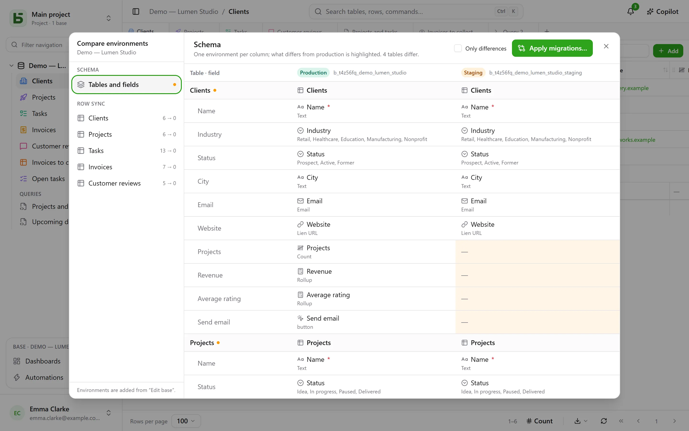

A base can have **environments**: production, staging, development… Each one is a full base
in its own right — its schema, its tables, its rows, its permissions — and they all share the
**lineage** of the base, its tables and its fields.

## In the interface

The sidebar shows **one line per base**, with a badge that says which environment is open and
lets you switch. The badge does not appear as long as there is only production.

Environments are added, renamed and deleted in **Edit base…**: a new environment is born from
a **copy of the schema** of another one, without its rows.

## Comparing environments

From the base’s menu, under **More actions**, **Compare environments…** opens a dialog:

- **Schema**: environments in columns, tables and fields in rows; what differs from production
  is highlighted.
- **Apply migrations…** prepares the plan to go from one environment to another, step by step.
  It never checks by default what would undo a more recent change in the target.
- **Row sync**: table by table, carry rows over from one environment to another, by
  identifier.

## How basedb knows who changed what

The comparison relies on the **schema history**: every creation, change or deletion of a table
or a field is captured by a trigger on the catalog, and can be read in the “Schema” tab of the
history. Lineage identifiers link a staging field to its production counterpart, even when
renamed.

## Through the API, the SDK and MCP

A **token created for the whole base** opens all its environments, today’s and those you will
add: a single token for production and staging. The program or the agent chooses the
environment on each call:

| Where | How |
|---|---|
| [REST API](/basedb/en/integrations/api-rest/#choose-the-environment) | the `X-Basedb-Environment: recette` header, or `?environment=recette` |
| [SDK](/basedb/en/integrations/sdk/#environments) | `db.environment('recette')` |
| [MCP](/basedb/en/integrations/mcp/#choose-the-environment) | the `…/mcp?environment=recette` address, or a tool’s `environment` argument |
| [n8n](/basedb/en/integrations/n8n/#credentials) | the **Environment** field of the credential |

Without any of this, each base designates its own environment: the production’s name opens
production, the staging’s name opens staging. A token can also, when it is created, be limited
to the environment on display: it then sees no other. Either way, its permissions are
intersected, environment by environment, with those of the person who created it.

## In SQL

Each environment is a schema: `b_t4z56fq_ventes` for production, `b_t4z56fq_ventes_recette`
for staging. Your queries switch environments by switching schemas — or `search_path`.
