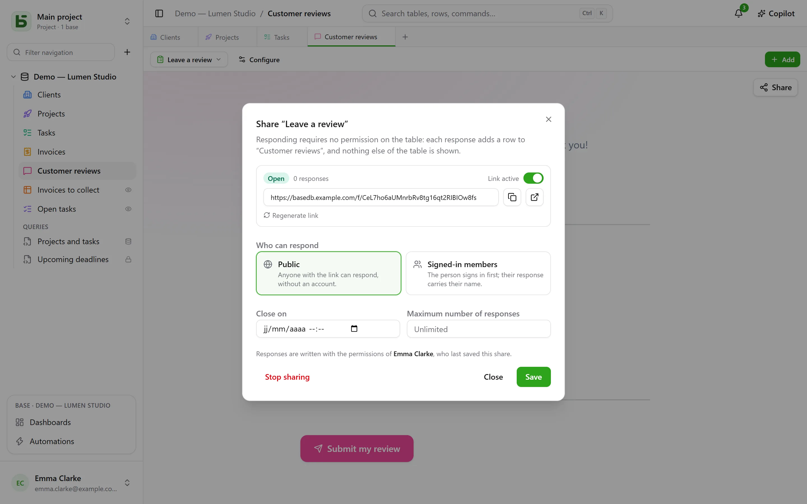
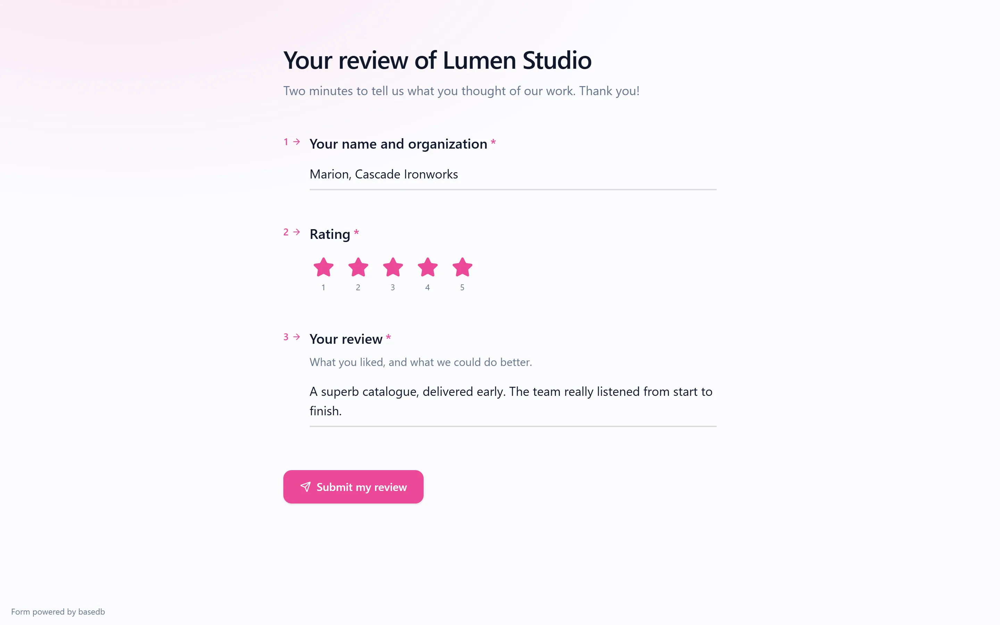

A form, a survey or a quiz is **shared through a link** `/f/<jeton>`. The person who responds needs
**no permission on the table**: each response adds a row, and nothing else from the table is
shown to them. To show rows rather than receive them, a view can be shared
[read-only](/basedb/en/fonctionnalites/vues-partagees/).

## Who can respond

| Access | Who responds | What is shown |
|---|---|---|
| **Public** | anyone with the link, no account needed | the form, alone |
| **Signed-in members** | a member of the workspace — optionally from certain groups only | the sign-in page, then the form and “You are responding as …” |

The link’s page is outside the application: no sidebar, no base name, no other rows.
It wears the form’s appearance — its theme, its color, its font —, and only asks the
questions that earlier answers call for.

## On whose behalf the response is written

The row is written on the **authority of the person who published the share** — the last one
to have saved it. Their right to create rows is checked **on every response**, restricted to
the form’s questions: if they lose it, the form is suspended until someone who has it saves it
again.

The history says who responded, not who published:

- a **member’s** response is attributed to that person;
- a **public** response is attributed to the form itself: “Form ‘Demande de devis’ · public
  response · published by Camille”.

## Opening and closing

The dialog sets:

- the **Link active** switch;
- a **closing date**;
- a **maximum number of responses** — exact, even under simultaneous responses;
- **Regenerate link**: the old one stops working at once;
- **Stop sharing**: the link disappears, the responses stay in the table.

A closed form says so in one sentence, before even asking anyone to sign in.

## A shared quiz

The page of a quiz receives **no right answer**: only what each question is worth. It is the
server that checks it.

- Graded **after each question**, the page sends each scored answer the moment it is given, and
  learns right then whether it is right — and which one was.
- On submission, the server counts the score **from the answers received** and writes it into
  the field chosen for it, if there is one and the person who published the share can write to
  it. The page shows the score it sends back, and the feedback unless the quiz says “never”.

A score is therefore read in the table the way the server counted it, not the way a page might
have announced it.

## Limits

- Questions of type **relation**, **file** and **image** are not asked through a shared link;
  the dialog points them out.
- Submissions are limited to 20 responses per minute, per address and per link. Behind the
  bundled proxy (Caddy), the address is the visitor’s.

The details are in [chapter 15](https://github.com/eodia/basedb/blob/main/docs/architecture/15-formulaires-partages.md)
of the architecture document.
