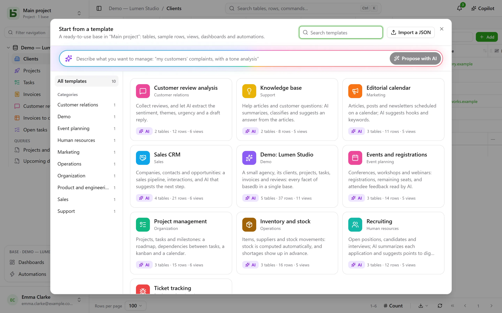

A **template** creates a whole base in one click: its tables and their relations, sample rows,
views, a dashboard, automations, and fields that the AI fills in by itself. The
[template gallery](/basedb/en/modeles/) shows the ones basedb offers.

## Starting from a template

**New base**, then **Start from a template, or ask the AI**: the gallery opens.



Each template can be read in full before it is used — its tables and their fields, its views,
its automations, and the prompt of each of its AI fields. **Create base** asks for its label
and, if there are AI fields, your consent for the values they cite to go to the instance’s AI
provider. Without that consent, they are ordinary fields, filled with their sample values.

**Load sample data**, checked by default, fills the tables with sample rows to see the base at
work. Unchecked, the tables stay empty, ready for your own data — views, dashboards and
automations are created all the same.

An empty project also offers the **demo base**: a small agency, its clients, projects, tasks,
invoices and reviews, which shows every facet of basedb.

## In your language

Official templates are read and created **in the language of the screen**: tables, fields,
choices, sample rows, views, dashboards, automations and the AI’s prompts. Sample rows change
worlds with the language: Lyon’s “Boulangerie Martin” becomes “Martin’s Bakery” in Portland in
English, “Bäckerei Keller” in Leipzig in German.

A template imported into your instance, or saved from a base, is written by someone: it reads
exactly as it was written.

## Asking the AI

At the top of the gallery, describe your need in one sentence — “tracking my clients’
complaints, with an analysis of their tone”. The AI proposes a complete base: tables, credible
sample rows, views, a dashboard, and AI fields when the use case lends itself to them. You read
it like a template, you can **refine** it (“add a suppliers table”), then create it. The AI
receives only your sentence — no data from any base — and nothing is created before you click.

## Writing a template in JSON

A template is a JSON document. Here is its skeleton:

```json
{
  "format": 1,
  "key": "suivi-tickets",
  "label": "Suivi de tickets",
  "summary": "Une phrase pour la galerie.",
  "category": "Produit et technique",
  "icon": "bug",
  "color": "#ef4444",
  "tables": [
    {
      "key": "tickets",
      "label": "Tickets",
      "fields": [
        { "label": "Titre", "kind": "short_text" },
        { "label": "Statut", "kind": "select", "options": ["Nouveau", "En cours", "Résolu"] },
        { "label": "Ouvert le", "kind": "date" },
        { "label": "Description", "kind": "long_text" },
        { "label": "Catégorie", "kind": "select", "options": ["Bug", "Demande"],
          "ai": { "prompt": "Classe ce ticket : {{Titre}} — {{Description}}" } },
        { "label": "Âge (jours)", "kind": "formula", "formula": "JOURS(AUJOURDHUI(); [Ouvert le])" }
      ]
    },
    { "key": "produits", "label": "Produits", "fields": [{ "label": "Nom", "kind": "short_text" }] }
  ],
  "links": [{ "from": "tickets", "label": "Produit", "to": "produits" }],
  "rows": {
    "produits": [{ "$key": "app", "Nom": "Application mobile" }],
    "tickets": [{ "Titre": "Crash au démarrage", "Statut": "En cours", "Ouvert le": "-3d", "Produit": "@app" }]
  },
  "views": [
    { "table": "tickets", "label": "Tableau", "kind": "kanban", "spec": { "group_by": "Statut" } }
  ],
  "dashboards": [
    { "label": "Vue d’ensemble", "blocks": [
      { "kind": "number", "title": "Ouverts", "table": "tickets", "filter": "[Statut] ne \"Résolu\"" },
      { "kind": "chart", "title": "Par catégorie", "table": "tickets", "group_by": "Catégorie", "style": "pie" }
    ] }
  ],
  "automations": []
}
```

The essential rules:

- **Everything is cited by label**: a field in a view, a filter (`[Statut] ne "Résolu"`), a
  formula (`[Prix] * [Quantité]`), an AI prompt or a message (`{{Titre}}`). A choice is given by
  its label.
- A table’s **first field** is its display field: a text, a number, a date, an email or an
  address.
- A **relation** is declared in `links`, never as a field; a row refers to it with `"@clé"`,
  the `$key` of a row of the target table.
- A **date** can be relative to the day the template is applied: `"today"`, `"+3d"`, `"-2w"`,
  `"+1m"`; a date and time adds the time, `"+1d 14:30"`. A person is written `"$moi"`.
- An **AI field** carries `"ai": { "prompt": "…" }` and can receive a sample value, written
  only when AI is not used.
- A **rich long text** carries `"rich": true`: its sample values are written in simple HTML
  (`<p>`, `<h2>`, `<strong>`, `<ul>`…), sanitized when written like any rich value. Not on the
  display column, nor on an AI field. A template that has one declares `"format": 2`: an older
  instance, which would read that HTML as Markdown, then leaves it out.
- A template **never** contains sharing, permissions, webhooks, files or any person other than
  `"$moi"`: it sometimes comes from elsewhere, and must not open anything.

The complete reference — every field type, every view key, the limits — is in chapter 20 of
the architecture documentation, in the repository.

## Publishing a template for every instance

The templates in the official gallery are the files in the repository’s
[`packages/templates/catalog`](https://github.com/eodia/basedb/tree/main/packages/templates/catalog)
folder, one file per template, named after its `key`. The public site turns them into the
[gallery](/basedb/en/modeles/) and publishes the whole catalog at
[`/basedb/modeles/catalogue.json`](/basedb/modeles/catalogue.json). Each instance reads it when
someone opens the gallery, and keeps it for an hour: editing a file and republishing the site
is enough to change the gallery of every instance.

Each template is checked when the site is built, by the same validator as the server: an
invalid template makes the build fail instead of reaching users.

An official template is written once, in French. Its texts in another language are a
dictionary,
[`packages/templates/i18n/<langue>/<clé>.json`](https://github.com/eodia/basedb/tree/main/packages/templates/i18n)
— the French text, then its translation —, which the site publishes next to the catalog
(`/basedb/modeles/i18n/<langue>.json`). The instance passes each text through it and follows
each label wherever it is cited — formulas, filters, views, prompts —, then re-checks the
result: a dictionary that would break the template is not served, the French template is. A text
missing from the dictionary stays in French.

The instance reads the `BASEDB_TEMPLATES_URL` address — by default, the public site’s. Point it
to a catalog of your own, or set it to `off` to read none: the instance then serves the
templates built into its version.

## Your instance’s templates

An administrator can **import a JSON template** into their instance, from the gallery
(“Import JSON”): it joins the gallery of all its users, and replaces a template with the same
key. An AI proposal can be added to it in one click.

Any base can also become a template: **Save as template** in the base’s menu, under **More
actions**. Its tables, fields, AI prompts, relations, shared views, dashboards and
automations — and, if you want, up to 50 rows per table — are downloaded as JSON, ready to join
the official catalog or the instance’s. An automation that finds a row, takes branches or cites
a previous step is left out for now, and the screen says so.
