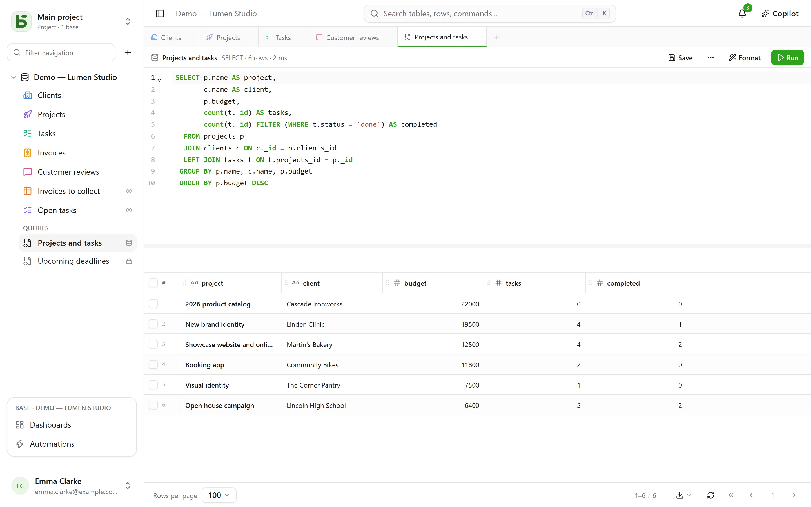
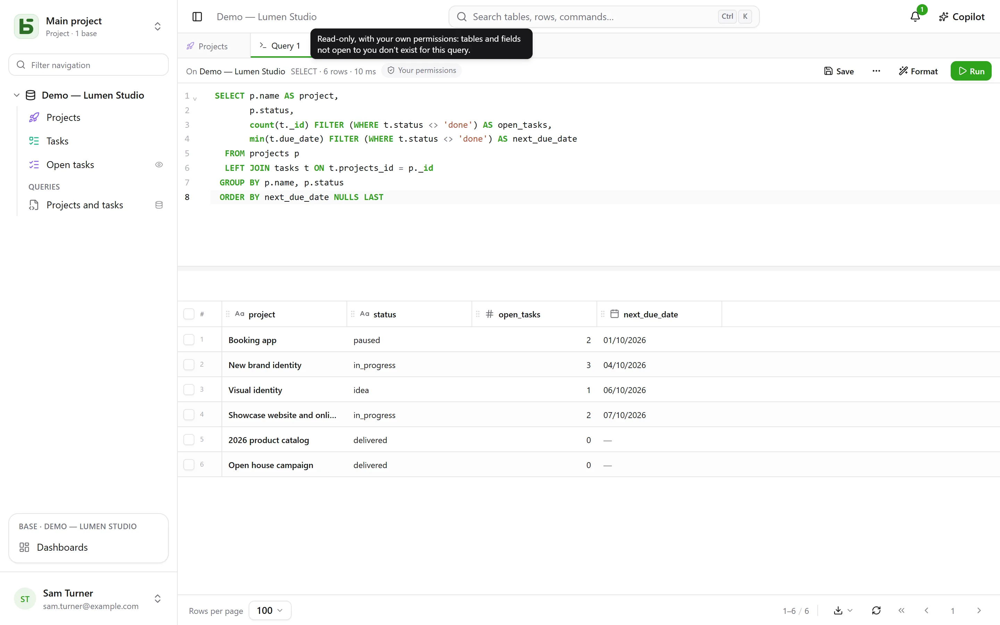
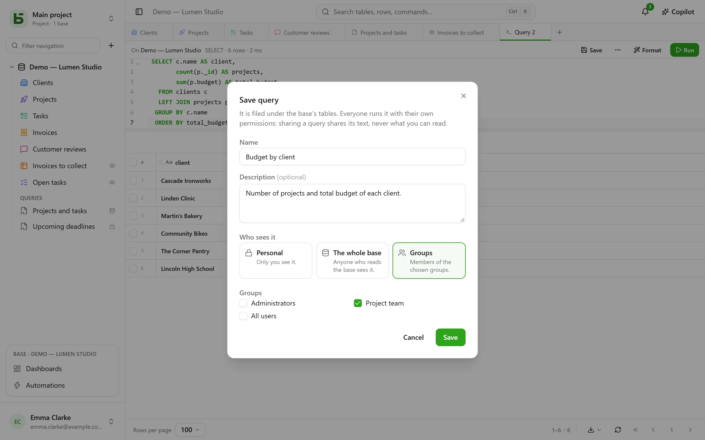
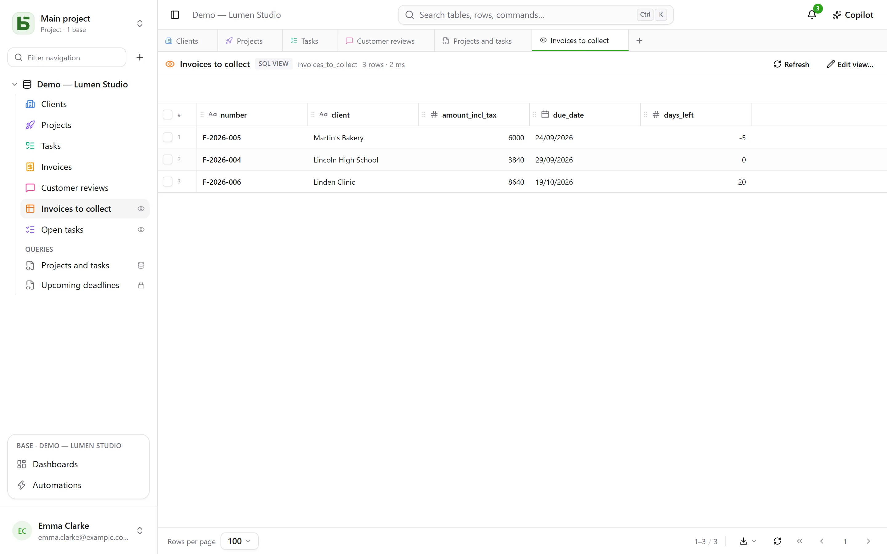
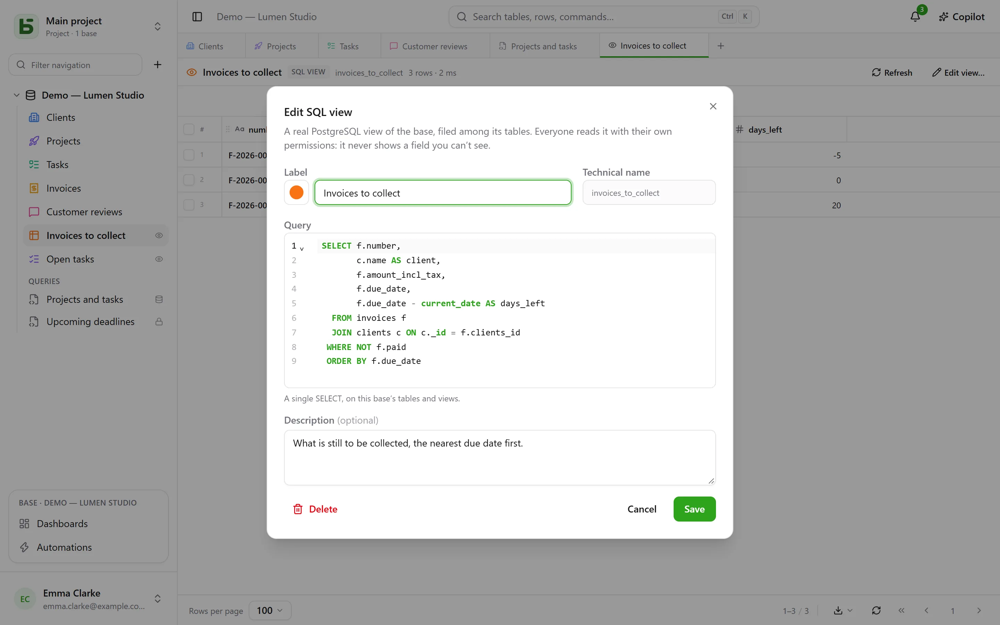

Your tables are real PostgreSQL tables, and the interface queries them in SQL, under their real
names. Every member of the base can write a query and **save** it under the tables — for
themselves only, for the whole base or for a few groups —, and whoever manages the base can turn
it into an **SQL view**: a real PostgreSQL view, filed among the tables, which `psql` and your
tools read too.



## Everyone with their own permissions

The **+** in the tab bar, or the base’s **⋯** menu → **SQL query**, opens an SQL tab: an
editor with syntax highlighting and completion, **Ctrl+Enter** to run, and the result in the
same grid as your tables. What the query can read depends on who runs it:

- with the **Manage** level on the base, the whole base, writes included;
- with the **Read** or **Edit** levels, the query runs **read-only, with your own
  permissions**. A table closed to you does not exist for it; a field hidden from you
  disappears from `SELECT *` and is refused if you name it, even when qualifying the table; a
  write is refused. The result carries the **Your permissions** badge.



It is not the screen that filters: PostgreSQL itself applies your permissions, column by column,
through a role of your own. A query therefore cannot show you anything that the grid, the API
or the MCP server would not show you.

## Saving a query

**Save**, in the tab’s bar, files the query under the base’s tables, in the **Queries**
section. It reopens in one click; **⋯** → **Save as…** makes a copy of it, **Name and
sharing…** (in the tab or in its sidebar menu) renames it, changes who sees it, or deletes it —
**Delete** is also in its menu, with a right click. A tab that was showing it keeps its text.



| Scope | Who sees it | Who can create and edit it |
|---|---|---|
| **Personal** — a padlock | only you | anyone who sees the base, for themselves |
| **Whole base** | anyone who sees the base | the **Manage** level on the base |
| **Groups** | the members of the chosen groups | the **Manage** level on the base |

**Sharing a query shares its text, never what its author can read.** Everyone runs it with
their own permissions: the same query, opened by two people, shows each of them what they are
allowed to see — or tells them that a column does not exist for them.

A query opened from the sidebar **runs at once, read-only**: you see its result without having
decided anything. **Run** then runs it again as it is. A dot next to its name signals that you
have changed its text since it was saved; **Save** stores it there if you can edit it, and
otherwise offers to make a new one.

## SQL views

An **SQL view** is a real PostgreSQL view in the base’s schema. It takes its place **among the
tables**, with its color and icon like a table, and a small **eye** on the right that says it
is a view. A click opens it in a tab: its rows in the grid, **Refresh** to read them again.



It is created from the base’s **⋯** menu → **New SQL view…**, or from an SQL tab: **⋯** →
**Create SQL view…**, and the tab’s query becomes its definition. The dialog asks for:

- its **label** and its **appearance** — color, icon or image, chosen as for a table;
- its **technical name**, derived from the label if you do not give one — the one you write
  after `FROM`;
- its **query**: a single `SELECT`, on the tables and other views of the base. PostgreSQL
  refuses what it refuses, and the editor points to the spot.



The view is then read under its name, from the interface as well as from `psql` or your BI
tool:

```sql
SELECT * FROM b_t4z56fq_demo_atelier_lumen.factures_a_encaisser;
```

**A view never shows a field you cannot see.** Everyone reads it with their own permissions,
on every table and every column it reads; the sidebar only lists it for those who can read
everything it reads. It only reads **its own** base: another base, or basedb’s catalog, are
refused at creation. Creating, editing or deleting one requires the **Manage** level on the
base. **Delete**, in its sidebar menu, removes it for everyone, scripts and tools included; the
tables it reads are not affected.

### When the schema changes

- **Renaming** a table or a field does not break a view: PostgreSQL follows it.
- **Changing the formula** of a computed field it reads removes it for a moment, then puts it
  back on the new column. If it no longer holds, it stays **to be fixed** — a triangle shows it
  in the sidebar — with its definition kept: **Edit view…**, fix it, save.
- A table is not purged as long as a view reads it, and a view is not deleted as long as
  another view reads it: the refusal names the view at fault.

## Query, SQL view or question?

| | What it is | Where it lives | For |
|---|---|---|---|
| **Saved query** | an SQL text | under the tables, in the “Queries” section | finding a query again, sharing it as text |
| **SQL view** | a real PostgreSQL view | among the tables | giving a name to a reading, for the interface **and** for `psql`, your scripts, your tools |
| **Question** | a reading built with the mouse or in SQL, and its visualization | in [dashboards](/basedb/en/fonctionnalites/tableaux-de-bord/) | a number, a chart, a pivot table, under filters |

## Limits

- The grid shows at most the number of **rows per page** chosen at the bottom of the screen;
  “truncated” signals it. A query stops after 15 seconds.
- An SQL view can be read in SQL and in the interface; the REST API and the MCP server do not
  expose it.
- An SQL view stays in the environment where it was created: creating an environment,
  comparing the schema or saving a template do not carry it yet.
