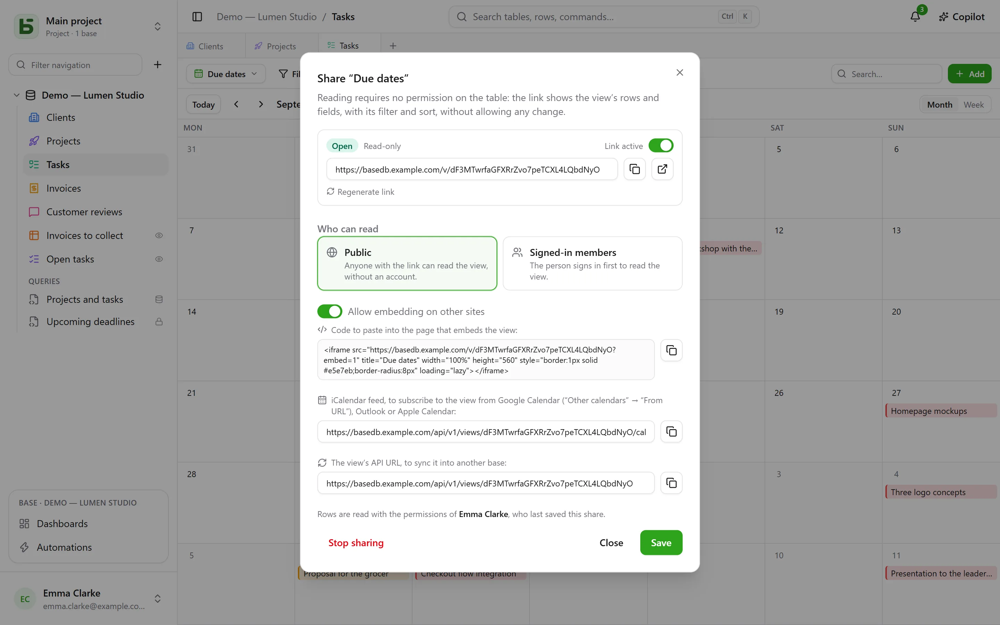
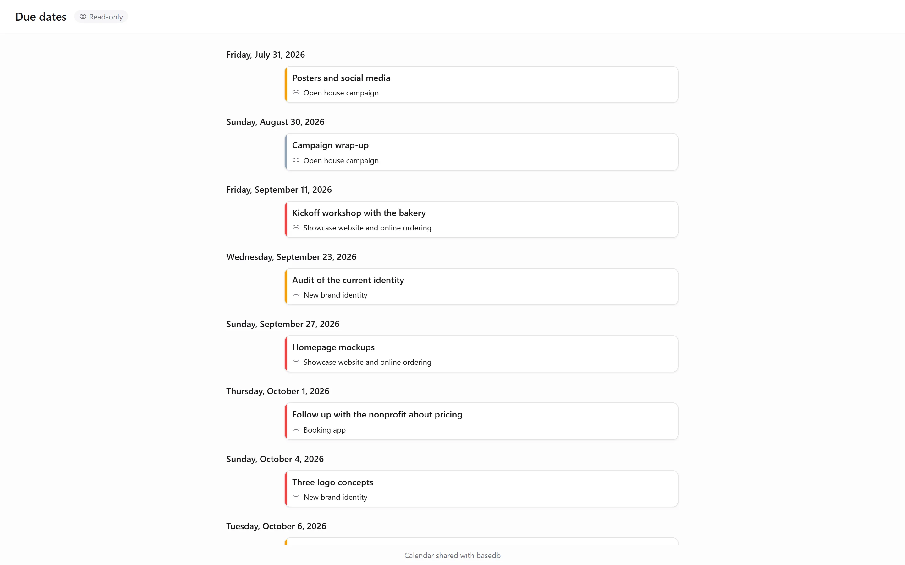

A data view — grid, kanban, calendar, timeline, gallery, list — can be **shared read-only**: a
link `/v/<jeton>` shows it to people who cannot open basedb, without letting them write
anything. It is the counterpart of [shared forms](/basedb/en/fonctionnalites/formulaires-partages/),
which let people respond without letting them read anything. A [dashboard](/basedb/en/fonctionnalites/tableaux-de-bord/#sharing-a-dashboard)
is shared the same way.

## Sharing

The view’s menu → **Share…**, then:

| Access | Who reads |
|---|---|
| **Public** | anyone with the link, no account needed |
| **Signed-in members** | a member of the workspace, after signing in — optionally, from certain groups only |

The **Link active** switch suspends the link without losing it. The page opens outside the
application: no sidebar, no base name, no table name — the view, its filters, its columns, and
nothing else. A calendar or a timeline reads there like a calendar app.

## On whose behalf it is read

The view is read with the **permissions of the person who published it**, decided again on
every read: a field hidden from them is not shown, and if they lose access to the table, the
link stops showing anything at all.

## Embedding in another site

Check **Allow embedding on other sites**: the dialog gives an `<iframe>` **embed code**, to
paste into an intranet, a wiki, a company website. Without that box, the page refuses to be
displayed inside another site’s frame.

## A calendar in your calendar app

For a calendar or a timeline shared as **public**, the dialog gives the **calendar feed
address**: an iCalendar feed (`…/calendar.ics`, 1,000 events at most) that Google Calendar,
Outlook or Apple Calendar can subscribe to. The team’s deadlines appear in everyone’s calendar,
and follow the table.

## A source for other bases

A public link also gives the **view’s API address**: the rows it shows, in JSON. A
[synced table](/basedb/en/integrations/synchronisation/) — on this instance or another — can
use it as its source.

## Limits

- Reading is limited to 120 requests per minute, per address and per link.
- A form is not shared for reading: it is shared [to receive responses](/basedb/en/fonctionnalites/formulaires-partages/).
