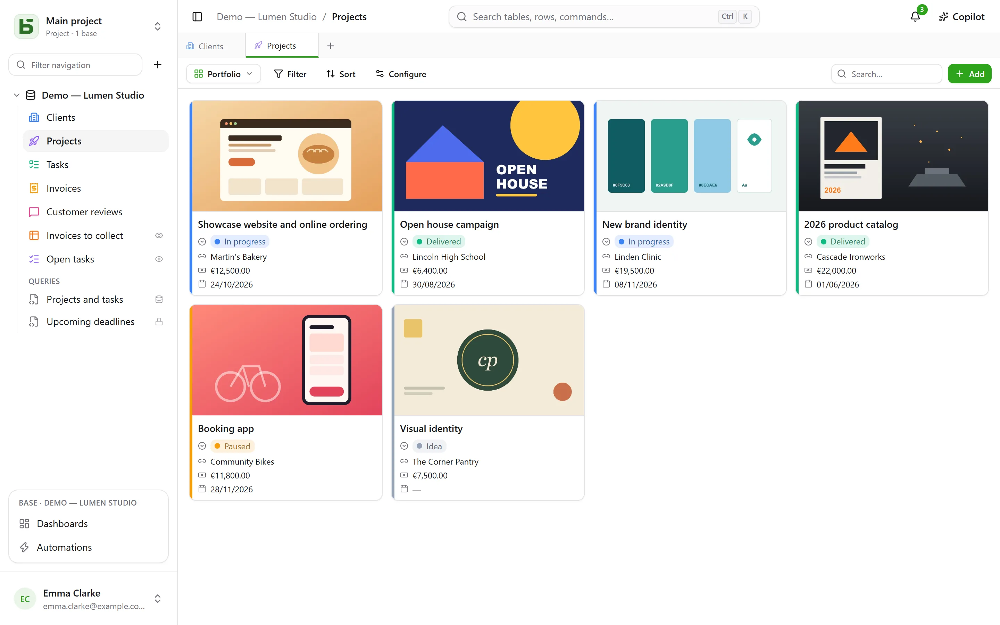
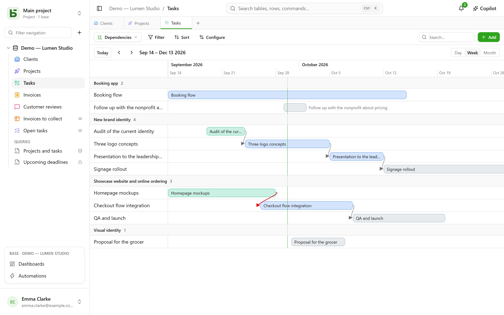
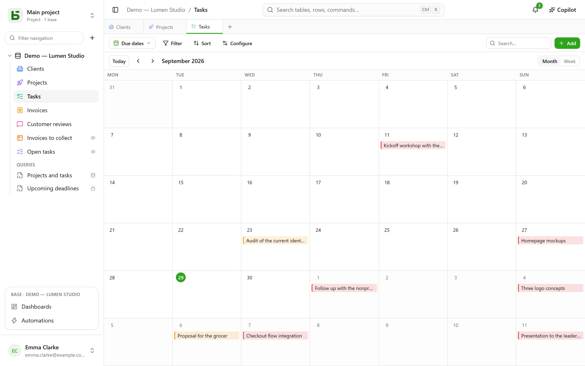
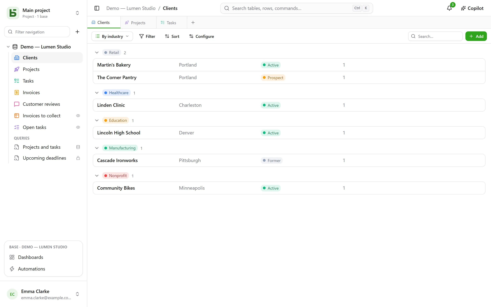

A table can be shown in **ten ways**. A view copies no data, and grants no more permission
than the table itself.

:::note
These views are ways of showing **one** table. A [SQL view](/basedb/en/fonctionnalites/requetes-et-vues-sql/)
is something else: a real PostgreSQL view, written in SQL over the base’s tables, and filed
among them in the sidebar.
:::

| View | What it shows | What it needs |
|---|---|---|
| **Grid** | rows, filtered, sorted, grouped, with chosen columns | — |
| **Kanban** | cards in columns | a single select |
| **Calendar** | rows on their date, by month or by week | a date field |
| **Timeline** | bars between two dates, and their dependencies | a start date |
| **Gallery** | cards, with a cover image | — |
| **List** | one line per row, in collapsible groups | — |
| **Map** | each row placed at its location | an address, or a latitude and longitude |
| **Form** | a page of questions to create a row | — |
| **Survey** | the same questions, one per screen | — |
| **Quiz** | scored questions, one per screen, and the score at the end | — |

## The view selector

It sits to the left of “Filter”. “All rows” is the table’s grid, which nobody saved and nobody
can delete; then come the **collaborative views**, in the order chosen by whoever builds the
base, and then **My views**. At the bottom, **Create a view** sorts the ten kinds into two
families: those that **show rows** and those that **collect answers** (form, survey, quiz).

- A **collaborative view** is seen by everyone. Creating, configuring, renaming, reordering or
  deleting one requires the **Manage** level. It can be **locked**: a padlock says so, and
  nobody can change it until they unlock it.
- A **personal view** is seen only by you, and only requires being able to read the table.
  **Create personal view**, or **Save as view** after filtering and sorting: everyone keeps
  their own ways of reading, without changing anything for the others. **Duplicate** on a
  collaborative view makes a personal copy of it.

## The toolbar

Above the grid, in this order:

- **Filter** combines conditions per field;
- **Columns** chooses what is shown — the system columns are set apart, under
  “System information”;
- **Group** sorts rows by a single-value field — single select, relation, person, date,
  number, text, checkbox… — into collapsible groups, each with its count across the whole
  filter;
- **Colors** colors the rows by a single select, or by **rules** — a filter and a color, twenty
  at most — as a stripe, a background, or both;
- **Row height**: short, medium, tall, extra tall;
- **Search…**, on the right, searches all columns as you type; Esc clears the search. It also
  works for the kanban, calendar, timeline, gallery and list, and is never saved in the view.

Under each column, a **Summary** computed over all the rows of the filter, not just the page:
filled, empty, unique values, sum, average, minimum, maximum, checked boxes.

## Kanban, calendar, timeline

- The **kanban** sorts cards by a single select; dragging a card updates the row, and a “+” at
  the top of a column creates a row that already has that choice. Each card shows a title, a
  cover image, the chosen fields, and a **description** that cites the row’s values —
  “Delivery scheduled for `{{Date}}` for `{{Client}}`” —, written in the view settings with
  the **Insert field** button.
- The **calendar** places each row on its date, with an optional end date; dragging a row from
  one day to another moves it.
- The **timeline** draws bars between a start date and an end date, grouped by a single select
  or a relation. With the **Depends on** setting — a relation from the table to itself — an
  arrow links each task to the ones it depends on, in red when it goes back in time.

## Gallery and list

- The **gallery** shows cards: a **cover image** (cropped or whole), a size (small, medium,
  large cards), a color by single select.
- The **list** shows one line per row, **grouped** by a single select, a relation or a person.

In the kanban, the gallery and the list, cards and rows can be **ordered by hand** by dragging
them — up to 5,000; a chosen sort takes precedence over this order.

## Map

The **map** places each row at its location, based on:

- an **address** — a short text, preferably in the **Address** format (see
  [Tables and fields](/basedb/en/fonctionnalites/tables-et-champs/)): “12 rue des Lilas, Lyon”;
- or a **latitude** and a **longitude**, two number fields, placed as they are.

A pin takes the **color** of a single select, shows the row’s **title** on hover, and opens its
row details on click. The map follows the view’s filter and sort, up to 2,000 rows.

An address is **located once and for all** by the instance’s geocoding service —
OpenStreetMap’s by default —, at the pace it imposes: on a fresh map, pins appear as the
responses come in, about one a second, then right away the following times. A badge counts the
rows placed, the addresses still to be located and the ones that could not be: an address that
cannot be found is to be made more precise (city, postal code), never dropped silently.

:::note[What leaves your server]
The text of addresses goes to the geocoding service, and each reader’s browser loads the map
background from the tile server. The instance’s operator can choose other services, or want
none: see
[Environment variables](/basedb/en/hebergement/variables/#maps-and-addresses).
:::

## Form and survey

You check the questions and put them in order; each has a title, a help text, an example
answer, and can be made required. The form has its own title, its introduction, its button
label and its thank-you message. It is filled in inside basedb, or
[shared through a link](/basedb/en/fonctionnalites/formulaires-partages/).

Nothing needs setting up to start: a new form asks what a person answers — not the status, the
assigned person or the relations the team fills in afterwards, unless they are required —,
wears its table’s color and a light theme, and each empty field shows a fitting example.
Everything else can be changed whenever you like:

- **Appearance**: eight themes — Light, Soft, Dawn, Ocean, Forest, Night, Paper, Minimal —, an
  accent color, a font, a left or centered alignment;
- **Prefill with today’s date**: a date question arrives already holding the day — and the time,
  for a date and time — which the person keeps or changes;
- **Ask only if…**: a question is only asked if an earlier answer calls for it ("Sentiment is
  Negative", "Rating is at most 2"). A hidden question is neither required nor sent;
- **More options**: the welcome and submit buttons, the numbers, the progress bar, moving
  automatically to the next question, the end message and an end button ("Back to site"), the
  confetti.

The **survey** fills the whole screen: a welcome screen that says how long it takes, then one
question at a time, sliding in. Everything also works from the keyboard: **Enter** to continue,
the letters **A**, **B**, **C**… for a choice, **Y** or **N** for yes or no, digits for a
rating — a single choice moves on to the next question by itself. Sending it is celebrated: a
checkmark draws itself, and confetti in the form’s colors.

## Quiz

A quiz is a survey that counts points. Under each question, you give its **right answer** and
what it is worth — **1 point** if you say nothing, up to 100:

| Question | Right answer |
|---|---|
| single select | one choice |
| multiple select | the choices to check, all of them and only them |
| checkbox | yes or no |
| number, rating | a number |
| date | a day |
| short text, email, URL | one or more accepted answers, separated by `;` — ignoring case and accents |

A question with no right answer — a first name, a comment — is asked without being scored. At
least one scored question is required to create the quiz.

The **Grading** section sets the rest:

- **Feedback**: **after each question** — the answer is checked at once, in green, or in red
  with the right answer, and the score grows at the top of the screen —, **at the end** — the
  score, then the feedback —, or **never** — the score alone, the right answers stay secret;
- **Pass threshold**: a percentage of the points; the end screen then says “Passed!” or “Not
  this time…”;
- **Save the score in**: a number field of the table, which receives the score of each response.
  Sort the grid on it: that is the leaderboard. A field named “Score”, “Points” or “Result” is
  chosen by default.

The end screen shows the score in a ring that fills up, the percentage, then, unless “never”,
each scored question with the answer given and the right one. A question hidden by an earlier
answer does not count toward the total.

:::note
In the application, whoever can read the view can read its right answers. Through a
[shared link](/basedb/en/fonctionnalites/formulaires-partages/#a-shared-quiz), they never leave
the server: it is the one that checks and counts.
:::

## Sharing a view

A data view — grid, kanban, calendar, timeline, gallery, list — can be **shared read-only**
through a link, embedded in another site, and a calendar becomes a calendar feed. See
[Shared views](/basedb/en/fonctionnalites/vues-partagees/).

## What the reader does not see

A view is **reprojected for its reader**: a field hidden from them disappears from the
columns, the cards and the questions. A view whose filter cites a hidden field is not shown at
all: shown without its filter, it would show more than it was made to show.
