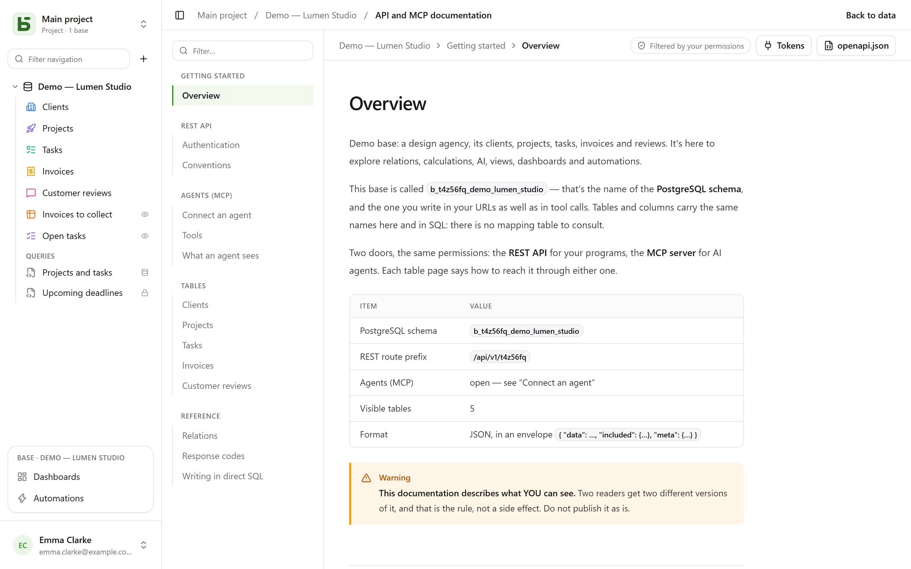

The REST API is the same one the interface uses: **there is no private route**. Its URLs carry
the physical names — the ones you also read in SQL.

```text
/api/v1/<tenant>/data/<base>/<table>
/api/v1/t4z56fq/data/b_t4z56fq_ventes/opportunites
```

## A token

In the interface, the base’s **⋯** menu → **API and agents** → **API and MCP tokens…**: there
you create an **integration token** limited to that base, read-only by default, after
confirming your password. It is shown only once; put it in an environment variable.

A token reads, creates and updates if it was created with write access, **never deletes**, and
never has more permissions than the person who created it.

```bash
export BASEDB_TOKEN=bdb_…
curl "http://localhost:3000/api/v1/t4z56fq/data/b_t4z56fq_ventes/opportunites?limit=20" \
  -H "Authorization: Bearer $BASEDB_TOKEN"
```

## Reading

| Parameter | Role |
|---|---|
| `filter` | a readable expression: `statut eq "gagne" and montant gte 10000` |
| `sort` | `-montant,nom` |
| `fields` | the columns to return |
| `limit`, `after` | pagination with an encrypted cursor: a page’s `meta.next_cursor`, passed as `after`, gives the next one (`meta.has_next_page`) |
| `links=display` | relations with their display value |
| `count=exact` | the total, capped at 100,000 |
| `variables=raw` | long texts as written, `{{colonne}}` included, rather than with the [row’s values](/basedb/en/fonctionnalites/tables-et-champs/#rich-text-and-variables) |

The operators: `eq`, `ne`, `eq_ci`, `contains`, `starts_with`, `ends_with`, `in`, `is_null`,
`gt`, `gte`, `lt`, `lte`, `between`, combined with `and`, `or`, `not` and parentheses. A filter
can go across a relation: `clients_id.ville eq "Lyon"`.

## Writing

```bash
curl -X POST "http://localhost:3000/api/v1/t4z56fq/data/b_t4z56fq_ventes/opportunites" \
  -H "Authorization: Bearer $BASEDB_TOKEN" -H "content-type: application/json" \
  -d '{"values": {"nom": "Audit RGPD", "statut": "nouveau", "montant": 12000}}'
```

`PATCH …/<table>/<_id>` updates a row with the same `{"values": {…}}` body. Errors have a
single shape: `{ "code": "…", "details": {…}, "request_id": "…" }`, with a stable code per
cause.

Every write returns the `x-basedb-transaction` header: passing it to
`POST /api/v1/<tenant>/history/undo` (`{"transaction": "…"}`) undoes it, like Ctrl+Z in the
interface — refused if the row has been changed since.

## Beyond rows

With the same token:

| Route | Role |
|---|---|
| `GET …/data/<base>/<table>/aggregate` | summaries over all the rows of a filter: `aggregates=montant:sum,nom:filled`, `group=statut` |
| `GET …/data/<base>/<table>/<_id>/comments`, `POST` | read and write a row’s comments |
| `POST /api/v1/<tenant>/automations/<id>/run` | run a button-triggered automation on a row (`{"record": "…"}`) |
| `GET /api/v1/<tenant>/meta/bases/<base>/dashboards` | a base’s dashboards |
| `GET /api/v1/<tenant>/meta/users` | the workspace’s members, for a Person field |
| `GET /api/v1/<tenant>/meta/templates` | the base templates in the gallery |

[Shared views](/basedb/en/fonctionnalites/vues-partagees/) can be read without an account:
`GET /api/v1/views/<jeton>` and `…/rows` in JSON, `…/calendar.ics` in iCalendar.

Building — creating an automation, a dashboard, an integration — remains reserved for an
interface session: a token reads and writes rows, it does not change the base.

## The generated documentation

Each base has its **API and MCP documentation** page: for each table, its endpoints, its
columns, examples in cURL and in JavaScript. It is **filtered by your permissions** — two
readers get two versions —, written **in the language of your screen**, and also exists as
OpenAPI 3.1 (`/api/v1/<tenant>/meta/bases/<base>/openapi.json`). Names, paths and error codes
stay the same in every language.


