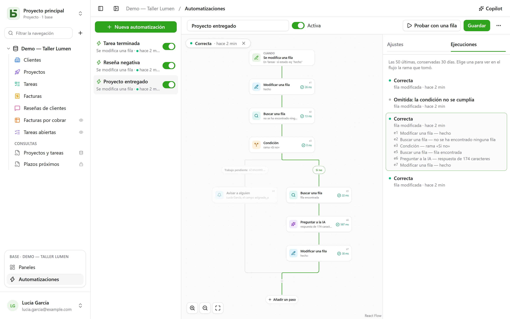

Una automatización dice **cuándo**, **si** y **entonces**: cuando una tarea pasa a «Fait», anotar
la hora; cuando llega una reseña negativa, avisar a la responsable y escribir en Slack; cada
lunes a las 9:00, crear la fila de la reunión de equipo. Y cuando una acción no basta, sigue un
**flujo**: buscar una fila, tomar una rama u otra según lo que diga, repetir pasos en cada
fila que cumple un filtro, reutilizar en un paso lo que un paso anterior ha encontrado o escrito,
**esperar** tres días antes de un recordatorio, enviar un **PDF** adjunto.

Se abren desde **Automatizaciones**, en el bloque de la base abierta en la parte inferior de la barra
lateral, y requieren el nivel **Gestión**.



## El flujo

El flujo se dibuja de arriba abajo: el desencadenador y luego cada paso. Un **+** sobre una línea
abre la lista de pasos, ordenados por categoría —Filas, Comunicar, Documentos, IA, Lógica—, con
una búsqueda, y añade el elegido en ese punto; una tarjeta abre sus ajustes a la derecha. Una
automatización sencilla (un desencadenador y una acción) cabe en dos tarjetas y se configura
como antes.

## Cuándo

| Desencadenador | Ajustes |
|---|---|
| **Se crea una fila** | la tabla |
| **Se modifica una fila** | la tabla y, si hace falta, solo los campos que vigilar |
| **A una hora fija** | cada hora, cada día o cada semana, a la hora y en la zona horaria elegidas |
| **Se hace clic en un botón** | un [campo Botón](/basedb/es/fonctionnalites/tables-et-champs/#botón) de la tabla |
| **Se elimina una fila** | la tabla; los pasos citan la fila tal como era |
| **Una fila entra en un filtro** | la tabla y el filtro: la automatización se dispara cuando una fila entra en él, y no vuelve a dispararse hasta que haya salido de él —«una factura pasa a estar atrasada», no «se modifica una factura atrasada» |
| **Llega una fecha** | un campo Fecha de la tabla, un desplazamiento —tres días antes, el mismo día, una semana después— y la hora: recordatorios de vencimiento, aniversarios de contrato |
| **Se recibe un webhook** | nada: la automatización recibe su propia dirección, que otro programa puede llamar ([detalles](#un-servicio-que-llama-a-basedb)) |

Un desencadenador sobre las filas ve **todas** las escrituras: la interfaz, la API, un agente, un
formulario compartido e incluso el SQL directo, porque las automatizaciones parten del historial, que las
captura todas.

## Solo si

Una condición opcional, en el [lenguaje de los filtros](/basedb/es/integrations/api-rest/#leer)
(`statut eq "fait"`, `montant gte 10000 and payee eq false`), evaluada sobre la fila **en el momento
de actuar**. Una ejecución cuya condición no se cumple queda «descartada», y lo indica.

## Entonces

Hasta cuarenta pasos, en orden; el primero que falla detiene los siguientes —salvo dentro de un
bloque **Intentar** ([detalles](#intentar)).

| Paso | Lo que hace |
|---|---|
| **Modificar una fila** | escribe valores en la fila que lo ha desencadenado, o en la que un paso ha encontrado o creado |
| **Crear una fila** | en esta tabla o en otra de la base |
| **Buscar una fila** | la primera fila de una tabla que cumple un filtro, para que los pasos siguientes la citen o la modifiquen |
| **Avisar a alguien** | una [notificación](/basedb/es/fonctionnalites/collaboration/#notificaciones) a personas elegidas, o a la de un campo Persona |
| **Enviar un correo electrónico** | a personas del equipo, a la de un campo Persona, a la dirección de un campo Correo electrónico (un cliente, un proveedor) o a direcciones escritas; el asunto y el texto citan la fila y los pasos anteriores |
| **Llamar a un webhook** | una solicitud HTTPS a un servicio: método, dirección, encabezados y cuerpo a tu gusto ([detalles](#llamar-a-un-servicio)); su respuesta se puede citar después |
| **Enviar a Slack** | un mensaje en un canal [conectado](/basedb/es/integrations/synchronisation/#slack) |
| **Preguntar a la IA** | una respuesta del [proveedor de IA](/basedb/es/fonctionnalites/ia/) a una instrucción que cita la fila y los pasos anteriores (redactar, resumir, clasificar), leída como un texto, un número, sí o no, una fecha o una opción de una lista |
| **Condición** | varias ramas: se toma la primera cuya condición se cumple, y «Si no» cuando no se cumple ninguna; después, las ramas vuelven a unirse |
| **Para cada fila** | los pasos que contiene, una vez por cada fila de una tabla que cumple un filtro ([detalles](#para-cada-fila)) |
| **Eliminar una fila** | la fila que ha desencadenado, o la que un paso ha encontrado —va a la papelera |
| **Contar y sumar** | el número de filas de un filtro, su suma, su media, su mínimo o máximo, para citar o comprobar después |
| **Generar un PDF** | el [documento](/basedb/es/fonctionnalites/documents/) de una fila, guardado en un campo Archivo o adjunto a un correo electrónico |
| **Esperar** | una duración, o hasta la fecha de un campo ([detalles](#esperar)) |
| **Intentar** | unos pasos, y otros que hacer si alguno de ellos falla ([detalles](#intentar)) |
| **Lanzar una automatización** | otra automatización de la base, sobre una fila de su tabla |

Una búsqueda que no encuentra nada no detiene el flujo: los pasos que debían modificar su
fila se omiten. Para hacer otra cosa en ese caso, **Si no se encuentra ninguna fila…**,
debajo de la búsqueda, añade una condición que lo compruebe.

Una **condición** comprueba una fila con un filtro, o un **valor**: la respuesta de la IA, el
código de un webhook, un total —«`{{e2.reponse}}` es igual a Urgente», «`{{e3.somme.montant}}`
es mayor o igual que 1000». Los números se comparan como números, los textos sin acentos ni
mayúsculas.

## Para cada fila

El paso **Para cada fila** lee las filas de una tabla que cumplen su filtro —vacío: todas—, en
el orden elegido, hasta su límite (50 de forma predeterminada, 200 como máximo), y luego ejecuta
una vez por cada una los pasos colocados en su marco. «Cada lunes, reclamar las facturas
impagadas» se escribe así: **A una hora fija**, luego **Para cada fila** de las facturas
`payee eq false and relancee eq false`, y dentro del bucle un correo electrónico al contacto de
la factura y **Modificar una fila** que marca «Relancée».

En el bucle, el identificador del paso nombra la **fila del turno**: `{{e1.client}}` la cita, y
**Modificar una fila** la ofrece entre las filas que se pueden modificar. Después del bucle,
`{{e1.nombre}}` indica cuántas filas ha recorrido (para un resumen en Slack, por ejemplo). El
filtro puede citar lo anterior: desencadenada por una factura pagada, `facture eq {{_id}}`
recorre sus líneas de detalle.

Más allá del límite, las filas restantes esperan la siguiente ejecución, que lo indica: haz que
salgan del filtro las que ya están tratadas (una casilla «relancée», una fecha) para tratarlas
todas a lo largo de las ejecuciones. Un bucle no contiene otro bucle, y una ejecución se detiene
a los dos minutos como máximo.

## Esperar

El paso **Esperar** pone la ejecución en pausa —tres horas, dos días— o hasta la fecha de un
campo de una fila, con un desplazamiento y una hora: «la víspera del vencimiento, a las 9:00».
La ejecución aparece **En pausa** en la pestaña **Ejecuciones**, con la fecha de su reanudación.

Continúa en el paso siguiente **releyendo** sus filas: «tres días después de enviar el
presupuesto, si todavía no está aceptado, reclamar» se escribe **Esperar** 3 días, y luego una
condición sobre el estado del presupuesto, tal como esté ese día. Desactivar la automatización
detiene las ejecuciones en pausa; una espera no se coloca ni en un bucle ni en un bloque
**Intentar**, y dura un año como máximo.

## Intentar

El bloque **Intentar** tiene dos caminos. El primero se ejecuta; si alguno de sus pasos falla,
el flujo continúa por el segundo, **En caso de error**, que cita el fallo —`{{e4.erreur}}`, el
código, y `{{e4.etape}}`, el paso—, y luego sigue después del bloque. Así se puede avisar a
alguien cuando un servicio no responde, sin detenerlo todo.

Más sencillo: un webhook puede **reintentar** por sí mismo hasta tres veces tras un fallo del
servicio, y un bucle puede **continuar** a pesar de una fila en error.

## Un PDF y un correo electrónico

**Generar un PDF** hace el documento de una fila —con una [plantilla de
documento](/basedb/es/fonctionnalites/documents/) de su tabla, o la ficha con todos sus campos—
y puede guardarlo en un campo Archivo. **Enviar un correo electrónico** puede adjuntarlo
después, junto con los archivos de un campo Archivo o Imagen:

- un correo **a cada uno**, o **uno solo para todos**, con destinatarios **en copia**;
- un mensaje en **texto enriquecido** —negrita, listas, enlaces— que cita la fila;
- una dirección de **respuesta**: la tuya por defecto, o la de un campo Correo electrónico;
- hasta 50 destinatarios, 10 archivos adjuntos y 15 MB.

«Cuando un presupuesto pasa a Aceptado, enviar la factura al cliente, con la contabilidad en
copia»: **Una fila entra en un filtro** `statut eq "accepte"`, **Generar un PDF** con la
plantilla Factura, **Enviar un correo electrónico** al campo Correo electrónico del cliente, con
la factura adjunta.

## Un servicio que llama a basedb

Con el desencadenador **Se recibe un webhook**, la automatización tiene su propia dirección
secreta, para dar al programa que debe lanzarla —una tienda en línea, un formulario externo, una
herramienta de automatización:

```bash
curl -X POST "https://basedb.example.com/api/v1/hooks/<secret>" \
  -H "content-type: application/json" \
  -d '{"client": {"nom": "Dupont"}, "total": 120}'
```

Los pasos citan lo que ha enviado: `{{trigger.client.nom}}`, `{{trigger.total}}`; un
formulario se lee igual, un texto mediante `{{trigger.texte}}`. La dirección se copia desde los
ajustes del desencadenador; **Cambiar de dirección** la sustituye, y la anterior deja de
funcionar al instante. Una llamada recibe `202`, la automatización se ejecuta en el mismo
segundo.

## Llamar a un servicio

El paso **Llamar a un webhook** envía por defecto, en `POST`, los datos de la automatización: la
fila elegida y lo que los pasos anteriores han encontrado o escrito. Para hablar con un servicio
tal como lo espera, se ajustan:

- el **método**: `POST`, `PUT`, `PATCH`, `GET` o `DELETE` (estos dos últimos sin cuerpo);
- la **dirección**, que puede citar después de su host: `https://api.exemple.fr/clients/{{e2.numero}}`;
  cada valor se codifica ahí;
- unos **encabezados**, cuyo valor puede citar: `Idempotency-Key: {{_id}}`;
- el **cuerpo**: los datos de la automatización, un **JSON que componer**, un **formulario** (un
  par `clave=valor` por línea) o un **texto**. En un JSON, una cita entre comillas es texto, y
  fuera de comillas un valor (un número, sí o no, una lista):

```json
{ "facture": "{{e1.numero}}", "montant": {{e1.montant}}, "payee": {{e1.payee}} }
```

Una clave de API o un token se pone en un encabezado **secreto** (el candado): cifrado por la
clave de la instancia, no se vuelve a mostrar nunca (ni en la pantalla, ni por la API, ni al
Copilot) y solo parte hacia el host para el que lo diste. Cambiar el host de la dirección exige
volver a darlo; **Reemplazar** introduce uno nuevo.

## Preguntar a la IA

Como un [campo de IA](/basedb/es/fonctionnalites/ia/#la-opción-de-ia-de-un-campo), el paso envía al
proveedor su instrucción, en la que cada cita se sustituye por su valor:

```text
Cet avis de {{auteur}} demande-t-il une action de notre part ? {{avis}}
```

Se elige la **respuesta esperada**: un texto libre o corto, un número, sí o no, una fecha,
una dirección web o una opción de una lista, que se puede tomar de un campo de selección. Se avisa de ello
al modelo, y una respuesta que no la contenga hace fallar el paso. Los pasos siguientes
la citan con `{{e1.reponse}}`: en el título de una tarea creada, en un mensaje o en un campo de selección,
donde se asigna a la opción con la misma etiqueta.

Lo que cita la instrucción se envía al proveedor: el paso pide tu **consentimiento**, que hay que volver a dar
cuando cambia la instrucción. Cada llamada se registra y cuenta, junto con los campos de IA, en
`BASEDB_AI_FIELD_QUOTA` (300 por hora de forma predeterminada). La IA no hace nada por sí misma: son los
pasos colocados después de ella los que escriben o avisan.

## Citar

Los valores, los mensajes y los filtros citan lo anterior, desde el botón **{ }** junto
a cada texto:

- `{{Titre}}`, `{{_id}}`: la fila que ha desencadenado la automatización;
- `{{e2.titre}}`, `{{e2._id}}`: la fila encontrada, creada o modificada por el paso `e2`; cada
  paso lleva su identificador en su tarjeta;
- `{{e3.statut}}`, `{{e3.reponse.numero}}`: lo que ha respondido el webhook `e3`;
- `{{e4.reponse}}`: la respuesta del paso de IA `e4`;
- `{{e5.client}}` en el bucle `e5`, la fila del turno; `{{e5.nombre}}` después de él, el número
  de filas recorridas;
- `{{e6.nombre}}`, `{{e6.somme.montant}}`, `{{e6.moyenne.montant}}`, `{{e6.max.echeance}}`: lo
  que ha contado el paso `e6`;
- `{{e7.erreur}}`, `{{e7.etape}}`: el fallo que ha detectado el bloque **Intentar** `e7`;
- `{{e8.nom}}`: el nombre del PDF del paso `e8`;
- `{{trigger.client.nom}}`: lo que ha enviado un webhook entrante;
- `{{_maintenant}}`: el instante de la ejecución.

Un valor formado por una sola cita pasa el propio valor: una relación, una persona, una
opción. Así es como una fila creada se vincula con la que ha encontrado una búsqueda. En un
filtro, una cita es siempre un valor comparado, nunca lenguaje de filtro.

Un paso solo puede citar lo que con seguridad ha ocurrido antes que él: lo que una rama ha encontrado
ya no se puede citar después de la condición. El editor lo señala en la tarjeta antes de guardar.

## El Copilot

**Copilot**, en el encabezado, abre a la derecha una conversación en lenguaje natural sobre las
automatizaciones de la base: «cuando una tarea pase a revisión, avisa a la persona
asignada», «añade un resumen hecho por la IA en las notas», «¿por qué ha fallado la última
ejecución?». Responde y **propone** una automatización completa (la que tienes en pantalla,
modificada, o una nueva), con la lista de lo que cambia.

El Copilot no guarda nada: **Colocar en el flujo** muestra la propuesta en el editor,
donde la revisas antes de guardar, y **Deshacer**, en la tarjeta, devuelve el flujo a como
estaba. Una automatización nueva se abre en el editor, lista para crearse. Cada propuesta se
valida como se validaría un guardado; lo que no se sostiene se descarta, y se indica.

De forma predeterminada, **solo la estructura** se envía al proveedor de IA, junto con la conversación: las tablas
y sus campos, las automatizaciones de la base, la que está en pantalla tal como la muestra el editor, y
sus últimas ejecuciones, con sus estados y sus códigos de error, nunca un valor. Las personas
y los canales de Slack se envían con marcadores (`p1`, `s1`), nunca con su identificador. La casilla
**Permitir la lectura de los datos** permite al Copilot, durante la conversación, leer filas
(50 como máximo por lectura), y cada lectura aparece bajo su respuesta.

## Probar y seguir

**Probar con una fila** ejecuta la automatización guardada sobre una fila elegida, de
verdad. La pestaña **Ejecuciones** conserva las 50 últimas durante 30 días: en espera, en curso, completada,
descartada con su motivo, fallida con su código. Al elegir una, se superpone al flujo: la rama
tomada queda trazada, cada paso ejecutado indica lo que hizo y cuánto tardó, y el resto aparece
atenuado. En un bucle, cada paso indica también cuántas veces se ha ejecutado.

## En nombre de quién actúa

Una automatización actúa con los **permisos de la persona que la guardó por última vez**,
que se vuelven a evaluar en cada ejecución: si esa persona pierde un permiso, el paso que lo necesitaba
falla en lugar de saltárselo, y una búsqueda solo encuentra lo que ella puede leer.
El historial la muestra como «Automatización “Tâche terminée” · en nombre de…», y sus escrituras
se deshacen como las demás.

## Límites

- Lo que escribe una automatización no desencadena ninguna otra: lo que deba encadenarse se escribe
  en un solo flujo, o mediante **Lanzar una automatización**, hasta tres niveles como máximo.
- Una búsqueda da una fila, la primera; un bucle recorre 200 como máximo por ejecución. Una
  ejecución dura dos minutos como máximo, sin contar las esperas.
- Sin scripts. Un correo electrónico se envía a través del [servidor de envío](/basedb/es/hebergement/variables/#correos-electrónicos)
  de la instancia.
- Una [plantilla de base](/basedb/es/fonctionnalites/modeles/) solo incluye las automatizaciones sin
  búsqueda, bucle, condición ni paso de IA, y nunca un webhook.
- Un webhook no sigue redirecciones y espera 10 segundos como máximo; una respuesta distinta de
  2xx hace fallar el paso, tras sus reintentos.
- Una fecha que llega se busca cada minuto; solo cuentan las que han llegado después de
  guardarse la automatización.
- 100 ejecuciones por hora y por automatización; una ejecución programada que no se haya realizado solo se recupera
  una vez.
- El retraso entre la escritura y la acción es del orden de un segundo.
