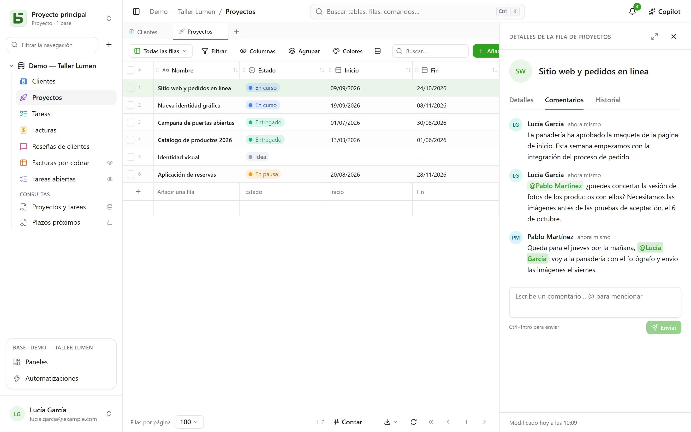
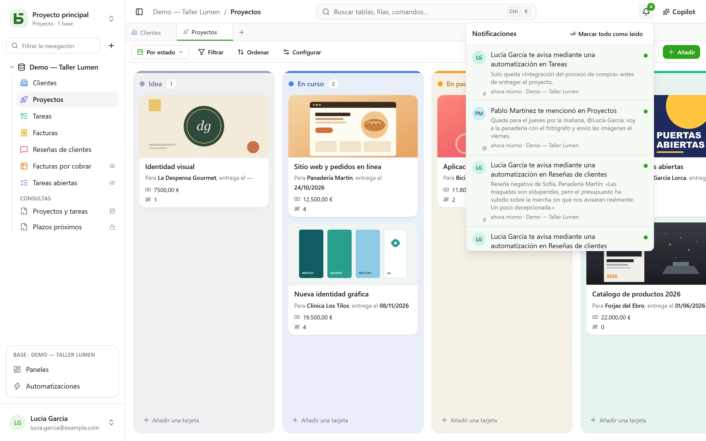

Varias personas trabajan en la misma base a la vez: cada una ve llegar las escrituras de las
demás, sabe quién está mirando qué y comenta una fila allí donde se encuentra.

## Comentarios

Los detalles de una fila tienen una pestaña **Comentarios**, entre «Detalles» e «Historial». Escribe
`@` para **mencionar** a un miembro y Ctrl+Intro para enviar. Cada uno edita o elimina sus
propios comentarios.

Poder leer la fila basta para comentarla. Una persona mencionada que no puede leerla
no recibe aviso, y se informa de ello al autor en lugar de dejarle creer que el mensaje ha llegado.

## Notificaciones

La campana, arriba a la derecha, cuenta lo que no se ha leído. Llegan ahí cuatro cosas:

- alguien te **menciona** en un comentario;
- alguien **responde** en una conversación en la que has escrito;
- alguien te **asigna** en un campo Persona, desde la interfaz, la API, un formulario
  o una automatización;
- una [automatización](/basedb/es/fonctionnalites/automatisations/) te **avisa**.

Abrir una notificación abre la fila. **Marcar todo como leído** pone el contador a cero; las
notificaciones se conservan 90 días.

### Por correo electrónico

Cuando la instancia tiene un [servidor de envío](/basedb/es/hebergement/variables/#correos-electrónicos), una
notificación que lleva **diez minutos sin leerse** también se envía por correo electrónico: un solo correo
para todas las que esperan, con un enlace a cada fila. Lo que lees a tiempo no
se envía. En **Configuración › Notificaciones**, cada tipo tiene dos interruptores: en basedb, y
por correo electrónico.

## Tiempo real

Las escrituras de los demás se muestran **sin recargar**: una celda modificada, una tarjeta
desplazada, una fila añadida, vengan de la interfaz, de la API, de un agente o del SQL
directo. El servidor solo envía una **señal**, nunca un dato: es la pantalla la que vuelve a leer, con
tus permisos. Una celda que estás modificando nunca se reemplaza mientras la
editas.

## Presencia

Las caras de las personas que miran **la misma tabla** se muestran en la parte superior de la pantalla; las
de quienes han abierto **la misma fila**, en el encabezado de sus detalles. En la cuadrícula, el puntero de los
demás aparece en la celda sobre la que pasan.

## Un enlace a cada pantalla

La dirección del navegador sigue lo que estás mirando: una tabla, una de sus vistas, los detalles
de una fila, un panel, una automatización, una pregunta, tu configuración. Cópiala en un
mensaje: tu compañero llega al mismo lugar, con sus propios permisos. Guárdala en favoritos; los
botones atrás y adelante del navegador te devuelven a donde estabas.

| Dirección | Lo que abre |
|---|---|
| `/bases/ventes/tables/opportunites` | la tabla «Opportunités» de la base «Ventes» |
| `/bases/ventes/tables/opportunites?vue=…` | una de sus vistas |
| `/bases/ventes/tables/opportunites?ligne=…` | los detalles de una de sus filas |
| `/bases/ventes/tableaux-de-bord/…` | un panel |
| `/bases/ventes/automatisations/…` | una automatización |
| `/parametres/apparence` | tu configuración |

Una dirección nombra un **lugar**, no el estado en el que la dejaste: filtros, ordenaciones y
anchos de columna siguen siendo los de cada navegador. Una base y una tabla se escriben en ella
por su nombre PostgreSQL: al renombrarlas, la dirección antigua ya no lleva a ningún sitio. Una
dirección que no lleva a nada —una errata, un objeto eliminado, o algo que no tienes permiso
para ver— muestra «Esta página no existe».

## Deshacer

Ctrl+Z deshace tu última escritura: consulta [el historial](/basedb/es/fonctionnalites/historique/#deshacer-ctrlz).

## Límites

- Sin correo electrónico si el operador de la instancia no ha configurado un servidor de envío.
- Si cambian más de cien filas de golpe, la pantalla recarga la página entera en lugar de
  hacerlo fila por fila.
