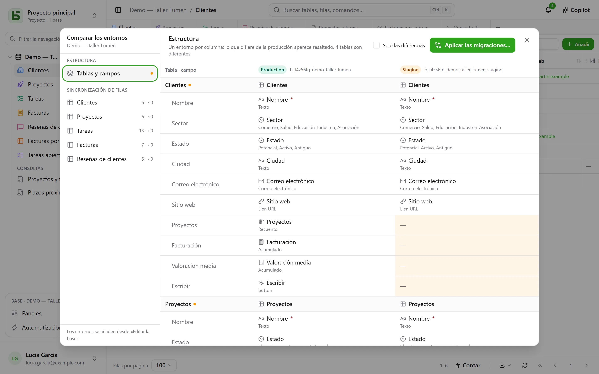

Una base puede tener **entornos**: producción, preproducción, desarrollo… Cada uno es una
base completa (su esquema, sus tablas, sus filas, sus permisos) y todos comparten el
**linaje** de la base, de sus tablas y de sus campos.

## En la interfaz

La barra lateral muestra **una entrada por base**, con una insignia que indica el entorno abierto y
permite cambiarlo. La insignia no aparece mientras solo exista la producción.

Los entornos se añaden, cambian de nombre y se eliminan en **Editar la base…**: un
entorno nuevo nace de una **copia de la estructura** de otro, sin sus filas.

## Comparar los entornos

Desde el menú de la base, en **Más acciones**, **Comparar los entornos…** abre un diálogo:

- **Estructura**: los entornos en columnas, tablas y campos en filas; lo que difiere de
  la producción aparece resaltado.
- **Aplicar las migraciones…** prepara el plan para pasar de un entorno a otro, etapa
  por etapa. Nunca marca de oficio lo que anularía un cambio más reciente en el
  destino.
- **Sincronización de filas**: tabla por tabla, trasladar filas de un entorno a
  otro, por identificador.

## Cómo sabe basedb quién ha cambiado qué

La comparación se apoya en el **historial de estructuras**: cada creación, modificación o
eliminación de una tabla o un campo la captura un disparador sobre el catálogo, y se consulta en
la pestaña «Estructura» del historial. Los identificadores de linaje vinculan un campo de preproducción
con su homólogo de producción, aunque se le haya cambiado el nombre.

## En SQL

Cada entorno es un esquema: `b_t4z56fq_ventes` para la producción,
`b_t4z56fq_ventes_recette` para la preproducción. Tus consultas cambian de entorno cambiando
de esquema, o de `search_path`.
