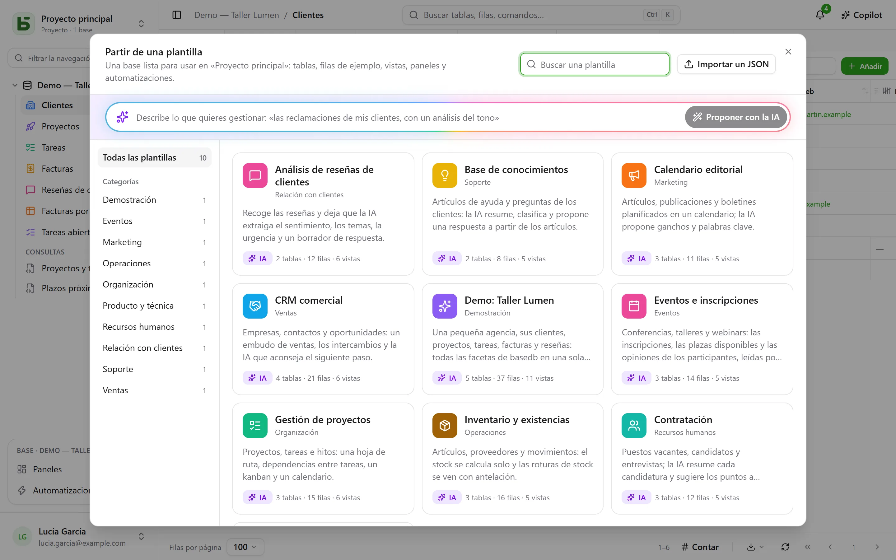

Una **plantilla** crea una base entera con un clic: sus tablas y sus relaciones, filas
de ejemplo, vistas, un panel, automatizaciones y campos que la IA
rellena por sí misma. La [galería de plantillas](/basedb/es/modeles/) muestra las que ofrece basedb.

## Partir de una plantilla

**Nueva base** y después **Partir de una plantilla o pedírsela a la IA**: se abre la galería.



Cada plantilla se puede leer entera antes de usarla: sus tablas y sus campos, sus vistas,
sus automatizaciones y la instrucción de cada uno de sus campos de IA. **Crear la base** pide
su etiqueta y, si hay campos de IA, tu consentimiento para que los valores que citan
se envíen al proveedor de IA de la instancia. Sin ese consentimiento, son campos
normales, rellenados con sus valores de ejemplo.

**Cargar los datos de ejemplo**, marcada por defecto, rellena las tablas con filas de ejemplo
para ver la base en funcionamiento. Desmarcada, las tablas quedan vacías, listas para tus
propios datos —las vistas, los paneles y las automatizaciones se crean de todas formas.

Un proyecto vacío ofrece también la **base de demostración**: una pequeña agencia, sus clientes,
proyectos, tareas, facturas y reseñas, que muestra todas las facetas de basedb.

## En tu idioma

Las plantillas oficiales se leen y se crean **en el idioma de la pantalla**: tablas, campos,
opciones, filas de ejemplo, vistas, paneles, automatizaciones e instrucciones de la IA. Las filas
de ejemplo cambian de mundo con el idioma: la «Boulangerie Martin» de Lyon se convierte en
«Panadería Martín» en Valencia en español.

Una plantilla importada en tu instancia, o guardada desde una base, la escribió alguien: se lee
tal como se escribió.

## Pedírselo a la IA

En la parte superior de la galería, describe tu necesidad en una frase: «el seguimiento de las reclamaciones de
mis clientes, con un análisis del tono». La IA propone una base completa: tablas, filas
de ejemplo verosímiles, vistas, un panel y campos de IA cuando el uso se presta a ello. La
lees como una plantilla, puedes **afinarla** («añade una tabla de proveedores»)
y después crearla. La IA solo recibe tu frase, ningún dato de ninguna base, y no se
crea nada antes de tu clic.

## Escribir una plantilla en JSON

Una plantilla es un documento JSON. Este es su esqueleto:

```json
{
  "format": 1,
  "key": "suivi-tickets",
  "label": "Suivi de tickets",
  "summary": "Une phrase pour la galerie.",
  "category": "Produit et technique",
  "icon": "bug",
  "color": "#ef4444",
  "tables": [
    {
      "key": "tickets",
      "label": "Tickets",
      "fields": [
        { "label": "Titre", "kind": "short_text" },
        { "label": "Statut", "kind": "select", "options": ["Nouveau", "En cours", "Résolu"] },
        { "label": "Ouvert le", "kind": "date" },
        { "label": "Description", "kind": "long_text" },
        { "label": "Catégorie", "kind": "select", "options": ["Bug", "Demande"],
          "ai": { "prompt": "Classe ce ticket : {{Titre}} — {{Description}}" } },
        { "label": "Âge (jours)", "kind": "formula", "formula": "JOURS(AUJOURDHUI(); [Ouvert le])" }
      ]
    },
    { "key": "produits", "label": "Produits", "fields": [{ "label": "Nom", "kind": "short_text" }] }
  ],
  "links": [{ "from": "tickets", "label": "Produit", "to": "produits" }],
  "rows": {
    "produits": [{ "$key": "app", "Nom": "Application mobile" }],
    "tickets": [{ "Titre": "Crash au démarrage", "Statut": "En cours", "Ouvert le": "-3d", "Produit": "@app" }]
  },
  "views": [
    { "table": "tickets", "label": "Tableau", "kind": "kanban", "spec": { "group_by": "Statut" } }
  ],
  "dashboards": [
    { "label": "Vue d’ensemble", "blocks": [
      { "kind": "number", "title": "Ouverts", "table": "tickets", "filter": "[Statut] ne \"Résolu\"" },
      { "kind": "chart", "title": "Par catégorie", "table": "tickets", "group_by": "Catégorie", "style": "pie" }
    ] }
  ],
  "automations": []
}
```

Las reglas esenciales:

- **Todo se cita por su etiqueta**: un campo en una vista, un filtro (`[Statut] ne "Résolu"`), una
  fórmula (`[Prix] * [Quantité]`), una instrucción de IA o un mensaje (`{{Titre}}`). Una opción se
  indica por su etiqueta.
- El **primer campo** de una tabla es su campo principal: un texto, un número, una fecha,
  un correo electrónico o una URL.
- Una **relación** se declara en `links`, nunca como un campo; una fila remite a otra con
  `"@clé"`, la `$key` de una fila de la tabla de destino.
- Una **fecha** puede ser relativa al día en que se aplica la plantilla: `"today"`, `"+3d"`,
  `"-2w"`, `"+1m"`; una fecha y hora añade la hora, `"+1d 14:30"`. Una persona se escribe `"$moi"`.
- Un **campo de IA** lleva `"ai": { "prompt": "…" }` y puede recibir un valor de ejemplo, que solo
  se escribe cuando no se usa la IA.
- Una plantilla **nunca** contiene enlaces compartidos, permisos, webhooks, archivos ni personas
  distintas de `"$moi"`: a veces viene de fuera, y no debe abrir nada.

La referencia completa (todos los tipos de campo, todas las claves de vistas, los límites) está en el
capítulo 20 de la documentación de arquitectura, en el repositorio.

## Publicar una plantilla para todas las instancias

Las plantillas de la galería oficial son los archivos de la carpeta
[`packages/templates/catalog`](https://github.com/eodia/basedb/tree/main/packages/templates/catalog)
del repositorio, un archivo por plantilla, con el nombre de su `key`. El sitio público construye con ellos la
[galería](/basedb/es/modeles/) y publica el catálogo completo en la dirección
[`/basedb/modeles/catalogue.json`](/basedb/modeles/catalogue.json). Cada instancia lo lee
cuando alguien abre la galería y lo conserva una hora: modificar un archivo y volver a publicar el
sitio basta para cambiar la galería de todas las instancias.

Cada plantilla se valida al construir el sitio, con el mismo validador que el servidor:
una plantilla no válida hace fallar la construcción en lugar de llegar a los usuarios.

Una plantilla oficial se escribe una vez, en francés. Sus textos en otro idioma son un
diccionario,
[`packages/templates/i18n/<langue>/<clé>.json`](https://github.com/eodia/basedb/tree/main/packages/templates/i18n)
—el texto en francés, y después su traducción—, que el sitio publica junto al catálogo
(`/basedb/modeles/i18n/<langue>.json`). La instancia le pasa cada texto y sigue cada etiqueta
allí donde se cita —fórmulas, filtros, vistas, instrucciones—, y después vuelve a leer el
resultado: un diccionario que rompiera la plantilla no se sirve, se sirve la plantilla en
francés. Un texto ausente del diccionario se queda en francés.

La instancia lee la dirección `BASEDB_TEMPLATES_URL`, que de forma predeterminada es la del sitio público. Apúntala
a un catálogo propio, o pon `off` para no leer ninguno: la instancia sirve entonces las
plantillas integradas en su versión.

## Las plantillas de tu instancia

Un administrador puede **importar una plantilla JSON** en su instancia, desde la galería
(«Importar un JSON»): se incorpora a la galería de todos sus usuarios y reemplaza la plantilla
con la misma clave. Una propuesta de la IA se puede añadir con un clic.

Cualquier base puede convertirse también en una plantilla: **Guardar como plantilla** en el menú de la
base, en **Más acciones**. Sus tablas, campos, instrucciones de IA, relaciones, vistas compartidas, paneles y
automatizaciones (y, si quieres, hasta 50 filas por tabla) se descargan en
JSON, listos para incorporarse al catálogo oficial o al de la instancia. Una automatización que
busca una fila, recorre filas, toma ramas o cita un paso anterior se queda fuera por
ahora, y la pantalla lo indica.
