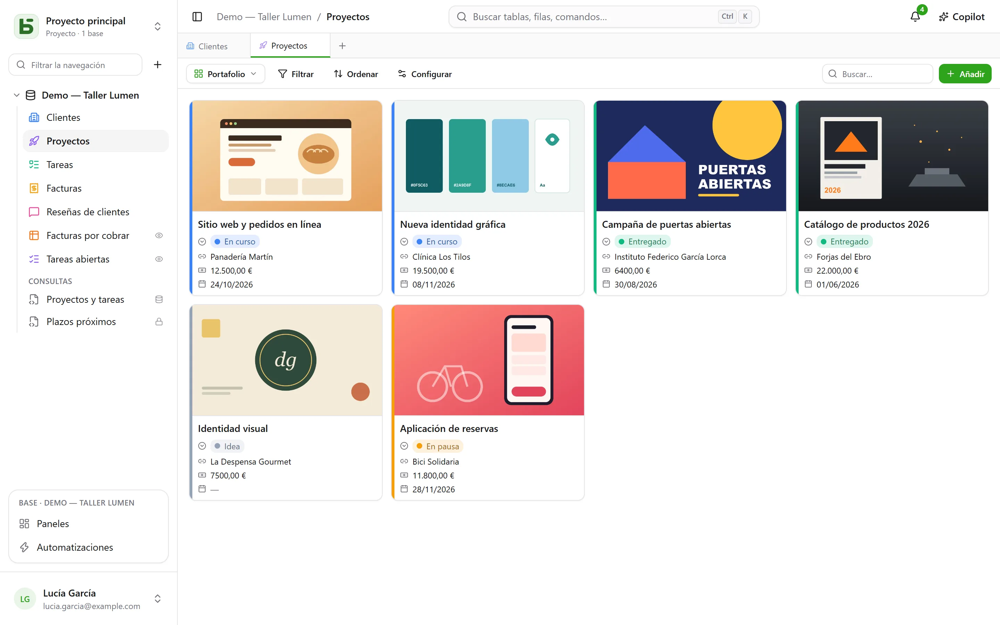
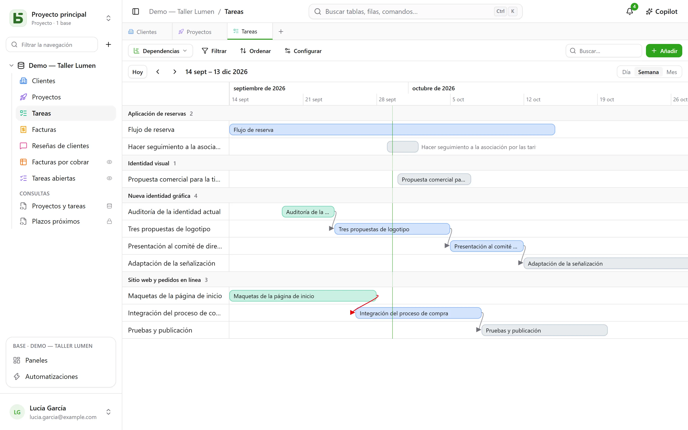
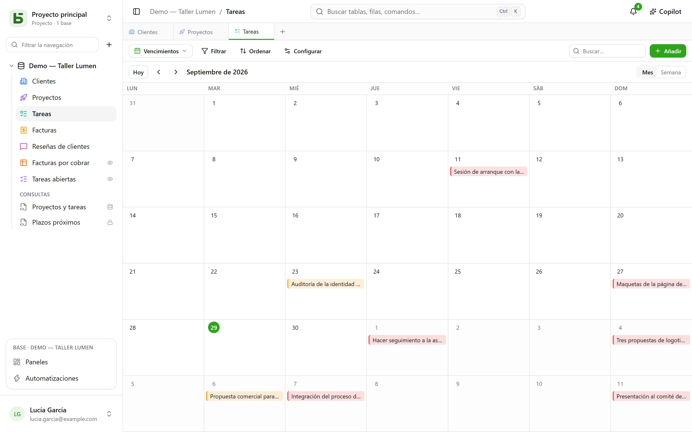
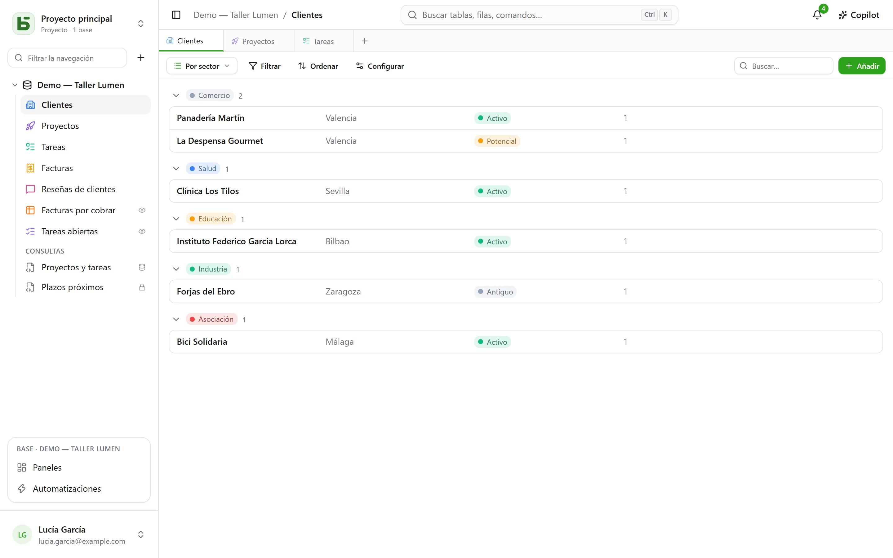

Una tabla se muestra de **diez formas**. Una vista no copia ningún dato ni da más permisos
que la propia tabla.

:::note
Estas vistas son formas de mostrar **una** tabla. Una [vista SQL](/basedb/es/fonctionnalites/requetes-et-vues-sql/)
es otra cosa: una vista PostgreSQL real, escrita en SQL sobre las tablas de la base y colocada
entre ellas en la barra lateral.
:::

| Vista | Lo que muestra | Lo que necesita |
|---|---|---|
| **Cuadrícula** | filas filtradas, ordenadas, agrupadas, con las columnas elegidas | — |
| **Kanban** | tarjetas en columnas | una selección única |
| **Calendario** | filas en su fecha, por mes o por semana | un campo de fecha |
| **Cronología** | barras entre dos fechas, y sus dependencias | una fecha de inicio |
| **Galería** | tarjetas, con una imagen de portada | — |
| **Lista** | una fila por registro, en grupos plegables | — |
| **Mapa** | cada fila colocada en su lugar | una dirección, o una latitud y una longitud |
| **Formulario** | una página de preguntas para crear una fila | — |
| **Encuesta** | las mismas preguntas, una por pantalla | — |
| **Cuestionario** | preguntas puntuadas, una por pantalla, y la puntuación al final | — |

## El selector de vistas

Está a la izquierda de «Filtrar». «Todas las filas» es la cuadrícula de la tabla, que nadie
ha guardado ni puede eliminar; después vienen las **vistas colaborativas**, en
el orden elegido por quien construye la base, y luego **Mis vistas**. Abajo, **Crear una vista**
organiza los diez tipos en dos familias: las que **muestran las filas** y las que **recopilan
respuestas** (formulario, encuesta, cuestionario).

- Una **vista colaborativa** la ven todos. Crearla, configurarla, cambiarle el nombre,
  reordenarla o eliminarla requiere el nivel **Gestión**. Puede estar **bloqueada**: un
  candado lo indica, y nadie la modifica sin haberla desbloqueado antes.
- Una **vista personal** solo la ves tú, y solo requiere poder leer la tabla.
  **Crear una vista personal**, o **Guardar como vista** después de filtrar y ordenar:
  cada uno guarda sus propias formas de leer, sin cambiar nada para los demás. **Duplicar** una
  vista colaborativa crea una copia personal.

## La barra de herramientas

Encima de la cuadrícula, en este orden:

- **Filtrar** combina condiciones por campo;
- **Columnas** elige lo que se muestra; las columnas del sistema van aparte, en
  «Información del sistema»;
- **Agrupar** organiza las filas según un campo de valor único (selección única, relación,
  persona, fecha, número, texto, casilla de verificación…) en grupos plegables, cada uno con su
  recuento sobre todo el filtro;
- **Colores** colorea las filas según una selección única, o según **reglas** (un filtro y
  un color, veinte como máximo) como trazo, como fondo o ambos;
- **Altura de las filas**: baja, media, alta, muy alta;
- **Buscar…**, a la derecha, busca en todas las columnas mientras escribes; Esc
  vacía la búsqueda. También sirve para el kanban, el calendario, la cronología, la galería
  y la lista, y nunca se guarda en la vista.

Debajo de cada columna, un **Resumen** calculado sobre todas las filas del filtro, no solo sobre
la página: rellenas, vacías, valores únicos, suma, media, mínimo, máximo, casillas marcadas.

## Kanban, calendario, cronología

- El **kanban** organiza las tarjetas según una selección única; arrastrar una tarjeta modifica la fila,
  y un «+» en la cabecera de una columna crea una fila que ya tiene esa opción. Cada tarjeta muestra un
  título, una imagen de portada, los campos elegidos y una **descripción** que cita los
  valores de la fila («Entrega prevista el `{{Date}}` para `{{Client}}`»), escrita en los
  ajustes de la vista con el botón **Insertar un campo**.
- El **calendario** sitúa cada fila en su fecha, con una fecha de fin opcional; arrastrar una
  fila de un día a otro la desplaza.
- La **cronología** traza barras entre una fecha de inicio y una fecha de fin, agrupadas por
  una selección única o una relación. Con el ajuste **Depende de** (una relación de la tabla
  consigo misma), una flecha une cada tarea con aquellas de las que depende, en rojo cuando
  retrocede en el tiempo.

## Galería y lista

- La **galería** muestra tarjetas: una **imagen de portada** (recortada o completa), un
  tamaño (tarjetas pequeñas, medianas o grandes), un color según una selección única.
- La **lista** muestra una fila por registro, **agrupada** por una selección única, una
  relación o una persona.

En el kanban, la galería y la lista, las tarjetas y las filas se **ordenan a mano**
arrastrándolas, hasta 5000; una ordenación elegida prevalece sobre ese orden.

## Mapa

El **mapa** coloca cada fila en su lugar, a partir de:

- una **dirección**: un texto corto, preferiblemente con el formato **Dirección** (consulta
  [Tablas y campos](/basedb/es/fonctionnalites/tables-et-champs/)): «12 rue des Lilas, Lyon»;
- o una **latitud** y una **longitud**, dos campos numéricos, colocadas tal cual.

Un marcador toma el **color** de una selección única, muestra el **título** de la fila al
pasar el ratón, y abre sus detalles con un clic. El mapa sigue el filtro y la ordenación de la
vista, hasta 2000 filas.

Una dirección se **sitúa de una vez por todas** mediante el servicio de geocodificación de la
instancia (el de OpenStreetMap de forma predeterminada), al ritmo que este impone: en un mapa
nuevo, los marcadores aparecen a medida que llegan las respuestas, una por segundo
aproximadamente, y de inmediato las veces siguientes. Una insignia cuenta las filas colocadas,
las direcciones aún por situar y las que no se han podido situar: una dirección no encontrada
hay que precisarla (ciudad, código postal), nunca se descarta en silencio.

:::note[Lo que sale de tu servidor]
El texto de las direcciones se envía al servicio de geocodificación, y el navegador de cada
lector carga el fondo del mapa desde el servidor de teselas. El operador de la instancia puede
elegir otros servicios, o no querer ninguno: consulta
[Variables de entorno](/basedb/es/hebergement/variables/#mapas-y-direcciones).
:::

## Formulario y encuesta

Se marcan las preguntas y se ordenan; cada una tiene un enunciado, una ayuda, un ejemplo de
respuesta, y puede hacerse obligatoria. El formulario tiene su título, su presentación, la
etiqueta de su botón y su mensaje de agradecimiento. Se rellena en basedb o se
[comparte mediante un enlace](/basedb/es/fonctionnalites/formulaires-partages/).

No hay nada que configurar para empezar: un formulario nuevo pregunta lo que responde una
persona —no el estado, la persona asignada ni las relaciones que el equipo rellena después,
salvo que sean obligatorias—, lleva el color de su tabla y un tema claro, y cada campo vacío
muestra un ejemplo adecuado. Todo lo demás se cambia cuando se quiere:

- **Apariencia**: ocho temas —Claro, Suave, Amanecer, Océano, Bosque, Noche, Papel, Minimalista—, un
  color de acento, una fuente, una alineación a la izquierda o centrada;
- **Rellenar con la fecha de hoy**: una pregunta de fecha llega ya rellenada con el día —y con
  la hora, si es de fecha y hora—, que la persona conserva o cambia;
- **Preguntar solo si…**: una pregunta solo se hace si una respuesta anterior lo pide
  («Sentimiento es Negativo», «Valoración es como mucho 2»). Una pregunta oculta no es
  obligatoria ni se envía;
- **Más opciones**: los botones de bienvenida y de envío, los números, la barra de progreso, el
  paso automático a la siguiente, el mensaje y un botón final («Volver al sitio»), el confeti.

La **encuesta** ocupa toda la pantalla: una pantalla de bienvenida que dice cuánto tiempo se
tarda, y después una pregunta a la vez, que llega deslizándose. Todo se hace también con el
teclado: **Intro** para continuar, las letras **A**, **B**, **C**… para elegir, **S** o **N**
para sí o no, los dígitos para una valoración —una elección única pasa sola a la siguiente
pregunta—. El envío se celebra: una marca de verificación que se dibuja y confeti de los
colores del formulario.

## Cuestionario

Un cuestionario es una encuesta que cuenta los puntos. Debajo de cada pregunta se indica su
**respuesta correcta** y lo que vale — **1 punto** si no se dice nada, hasta 100:

| Pregunta | Respuesta correcta |
|---|---|
| selección única | una opción |
| selección múltiple | las opciones que hay que marcar, todas y solo ellas |
| casilla de verificación | sí o no |
| número, valoración | un número |
| fecha | un día |
| texto corto, correo electrónico, URL | una o varias respuestas aceptadas, separadas por `;` — sin distinguir mayúsculas ni acentos |

Una pregunta sin respuesta correcta —un nombre, un comentario— se plantea sin puntuarse. Hace
falta al menos una puntuada para crear el cuestionario.

La sección **Puntuación** ajusta el resto:

- **Corrección**: **después de cada pregunta** —la respuesta se comprueba al instante, en verde,
  o en rojo con la respuesta correcta, y la puntuación crece en la parte superior de la
  pantalla—, **al final** —la puntuación y después la corrección—, o **nunca** —solo la
  puntuación, las respuestas correctas permanecen en secreto;
- **Umbral de aprobación**: un porcentaje de los puntos; la pantalla final dice entonces
  «¡Aprobado!» o «Esta vez no…»;
- **Guardar la puntuación en**: un campo numérico de la tabla, que recibe la puntuación de cada
  respuesta. Ordena la cuadrícula por él: ahí está la clasificación. Se elige de oficio un campo
  llamado «Puntuación», «Puntos» o «Nota».

La pantalla final muestra la puntuación en un anillo que se va llenando, el porcentaje y, salvo
«nunca», cada pregunta puntuada con la respuesta dada y la correcta. Una pregunta que una
respuesta anterior ha ocultado no cuenta en el total.

:::note
En la aplicación, quien puede leer la vista puede leer sus respuestas correctas. Por un
[enlace compartido](/basedb/es/fonctionnalites/formulaires-partages/#un-cuestionario-compartido),
nunca salen del servidor: es él quien corrige y quien cuenta.
:::

## Compartir una vista

Una vista de datos (cuadrícula, kanban, calendario, cronología, galería, lista) se **comparte en
solo lectura** mediante un enlace, se inserta en otro sitio web, y un calendario se convierte en un feed
de agenda. Consulta [Vistas compartidas](/basedb/es/fonctionnalites/vues-partagees/).

## Lo que el lector no ve

Una vista se **reproyecta para quien la lee**: un campo que tiene oculto desaparece de las
columnas, las tarjetas y las preguntas. Una vista cuyo filtro cita un campo oculto no se
muestra en absoluto: mostrada sin su filtro, enseñaría más de lo que se hizo para
enseñar.
