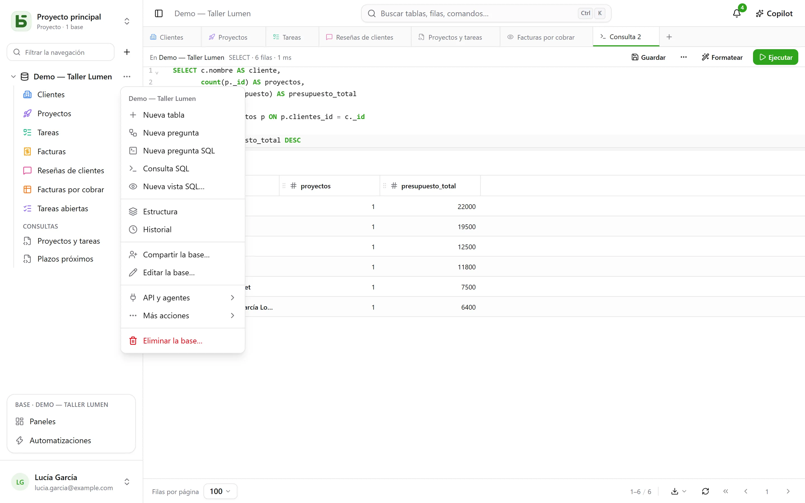

Este recorrido lleva diez minutos y cubre lo esencial: al final tendrás una tabla, una vista
kanban y un formulario público que escribe en ella.

:::tip[Para verlo todo de una vez]
Un proyecto vacío ofrece la **base de demostración**: una pequeña agencia, sus clientes, proyectos,
tareas, facturas y reseñas, con fórmulas, vistas de todo tipo, un panel y
automatizaciones. **Nueva base** abre también la [galería de plantillas](/basedb/es/fonctionnalites/modeles/),
donde puedes describir tu base a la IA.
:::

## 1. Crear una base

Todo se organiza por **proyecto**: el selector de la parte superior de la barra lateral cambia de
proyecto o crea uno. En la barra, el **+** a la derecha del filtro crea una base. Dale una
etiqueta («Ventes») y, si quieres, una descripción, un color, un icono.

La base se convierte en un **esquema PostgreSQL**: su nombre físico (`b_t4z56fq_ventes`) aparece en
el formulario y en la documentación generada.

## 2. Crear una tabla y sus campos

Desde el menú **⋯** de la base: **Nueva tabla**. Añade después sus campos desde
**Estructura**, en ese mismo menú, con su botón
**Campo**:

| Campo | Tipo |
|---|---|
| Nom | Texto corto |
| Statut | Selección única: Nouveau, Qualifié, Gagné, Perdu |
| Montant | Moneda |
| Échéance | Fecha |
| Client | Relación → Clients |
| Notes | Texto largo (Markdown) |

Más adelante, una fórmula (`DAYS([Échéance], TODAY())`), una búsqueda (la ciudad del cliente)
o un acumulado (el importe total por cliente) se añaden de la misma forma; consulta
[Tablas y campos](/basedb/es/fonctionnalites/tables-et-champs/).

También puedes **importar un archivo**: un libro de Excel (`.xlsx`), un CSV o un JSON: la
importación deduce los tipos, te deja corregirlos, crea la tabla o completa una tabla
existente, e indica fila por fila lo que rechaza. De un libro con varias hojas, eliges la
hoja; las fechas, los importes y las casillas de verificación se toman tal como los guarda
Excel, y una fórmula da su valor.



## 3. Introducir datos y filtrar

La cuadrícula se edita como una hoja de cálculo: doble clic o Intro para modificar una celda, Esc
para cancelar. **Filtrar** combina condiciones por campo; la ordenación se hace desde el
encabezado de columna; **Buscar…**, a la derecha de la barra, busca en todas las columnas. Cada
cambio se guarda al instante y queda en el [historial](/basedb/es/fonctionnalites/historique/):
**Ctrl+Z** deshace el último.

## 4. Añadir una vista

El selector de vistas, a la izquierda de «Filtrar», ofrece «Todas las filas» y después tus vistas.
Crea un **kanban** agrupado por «Statut»: arrastrar una tarjeta de una columna a otra modifica la
fila.


## 5. Compartir un formulario

Crea una vista **Formulario**, marca las preguntas y después pulsa **Compartir**: elige «Público»
y copia el enlace. Cada respuesta añade una fila a la tabla, sin dar ningún permiso a quien
responde. Más detalles en [Formularios compartidos](/basedb/es/fonctionnalites/formulaires-partages/).

## 6. Leer en SQL

Menú **⋯** de la base → **Consulta SQL**: ahí están tus tablas, con su nombre real.

```sql
SELECT nom, statut, montant
FROM b_t4z56fq_ventes.opportunites
WHERE statut = 'gagne'
ORDER BY montant DESC;
```

**Guardar** la coloca bajo las tablas, en la sección «Consultas» (para ti o para toda la
base), y **⋯** → **Crear una vista SQL…** la convierte en una vista PostgreSQL real, colocada entre
las tablas. Cada uno las lee con sus propios permisos. Consulta
[Consultas y vistas SQL](/basedb/es/fonctionnalites/requetes-et-vues-sql/).

Es lo mismo desde `psql` o tu herramienta de BI. Consulta [SQL directo](/basedb/es/integrations/sql/).
