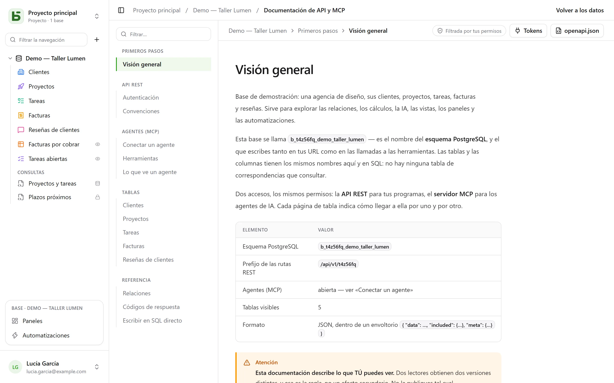

La API REST es la misma que usa la interfaz: **no existe ninguna ruta privada**.
Sus URL llevan los nombres físicos, los mismos que lees en SQL.

```text
/api/v1/<tenant>/data/<base>/<table>
/api/v1/t4z56fq/data/b_t4z56fq_ventes/opportunites
```

## Un token

En la interfaz, menú **⋯** de la base → **API y agentes** → **Tokens de API y MCP…**: ahí se crea un **token
de integración** limitado a esa base, de solo lectura de forma predeterminada, tras confirmar tu
contraseña. Solo se muestra una vez; guárdalo en una variable de entorno.

Un token lee, y también crea y modifica si se ha creado con permiso de escritura; **nunca elimina** y nunca tiene
más permisos que la persona que lo creó.

```bash
export BASEDB_TOKEN=bdb_…
curl "http://localhost:3000/api/v1/t4z56fq/data/b_t4z56fq_ventes/opportunites?limit=20" \
  -H "Authorization: Bearer $BASEDB_TOKEN"
```

## Leer

| Parámetro | Función |
|---|---|
| `filter` | una expresión legible: `statut eq "gagne" and montant gte 10000` |
| `sort` | `-montant,nom` |
| `fields` | las columnas que devolver |
| `limit`, `after` | paginación por cursor cifrado: `meta.next_cursor` de una página, pasado como `after`, da la siguiente (`meta.has_next_page`) |
| `links=display` | las relaciones con el valor de su campo principal |
| `count=exact` | el total, con un tope de 100 000 |
| `variables=raw` | los textos largos tal como se escribieron, `{{colonne}}` incluido, en lugar de con los [valores de la fila](/basedb/es/fonctionnalites/tables-et-champs/#texto-enriquecido-y-variables) |

Los operadores: `eq`, `ne`, `eq_ci`, `contains`, `starts_with`, `ends_with`, `in`, `is_null`,
`gt`, `gte`, `lt`, `lte`, `between`, combinados con `and`, `or`, `not` y paréntesis. Un
filtro atraviesa una relación: `clients_id.ville eq "Lyon"`.

## Escribir

```bash
curl -X POST "http://localhost:3000/api/v1/t4z56fq/data/b_t4z56fq_ventes/opportunites" \
  -H "Authorization: Bearer $BASEDB_TOKEN" -H "content-type: application/json" \
  -d '{"values": {"nom": "Audit RGPD", "statut": "nouveau", "montant": 12000}}'
```

`PATCH …/<table>/<_id>` modifica una fila con el mismo cuerpo `{"values": {…}}`. Los
errores tienen una forma única: `{ "code": "…", "details": {…}, "request_id": "…" }`, con un
código estable por causa.

Cada escritura devuelve la cabecera `x-basedb-transaction`: pasarla a
`POST /api/v1/<tenant>/history/undo` (`{"transaction": "…"}`) la deshace, como Ctrl+Z en
la interfaz; se rechaza si la fila se ha modificado desde entonces.

## Más allá de las filas

Con el mismo token:

| Ruta | Función |
|---|---|
| `GET …/data/<base>/<table>/aggregate` | resúmenes sobre todas las filas de un filtro: `aggregates=montant:sum,nom:filled`, `group=statut` |
| `GET …/data/<base>/<table>/<_id>/comments`, `POST` | leer y escribir los comentarios de una fila |
| `POST /api/v1/<tenant>/automations/<id>/run` | lanzar una automatización desencadenada por un botón, sobre una fila (`{"record": "…"}`) |
| `GET /api/v1/<tenant>/meta/bases/<base>/dashboards` | los paneles de una base |
| `GET /api/v1/<tenant>/meta/users` | los miembros del espacio de trabajo, para un campo Persona |
| `GET /api/v1/<tenant>/meta/templates` | las plantillas de base de la galería |

Las [vistas compartidas](/basedb/es/fonctionnalites/vues-partagees/) se leen sin cuenta:
`GET /api/v1/views/<jeton>` y `…/rows` en JSON, `…/calendar.ics` en iCalendar.

Construir (crear una automatización, un panel, una integración) sigue reservado a
una sesión de la interfaz: un token lee y escribe filas, no cambia la base.

## La documentación generada

Cada base tiene su página **Documentación de API y MCP**: para cada tabla, sus endpoints, sus
columnas, ejemplos en cURL y en JavaScript. Está **filtrada por tus permisos** —dos
lectores obtienen dos versiones—, escrita **en el idioma de tu pantalla**, y existe también en
OpenAPI 3.1 (`/api/v1/<tenant>/meta/bases/<base>/openapi.json`). Los nombres, las rutas y los
códigos de error son los mismos en todos los idiomas.


