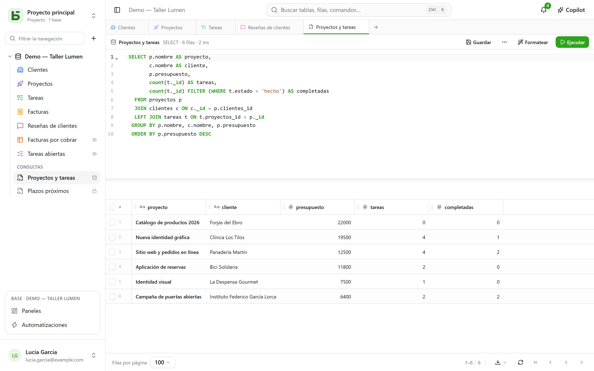

Es la razón de ser de basedb: **tus tablas son tablas reales**. Cualquier cliente PostgreSQL
las lee por su nombre.

## Los nombres

| Objeto | Nombre físico | Ejemplo |
|---|---|---|
| Base | un esquema `b_<tenant>_<nom>` | `b_t4z56fq_ventes` |
| Entorno de preproducción | el esquema con un sufijo | `b_t4z56fq_ventes_recette` |
| Tabla | su nombre slugificado | `opportunites` |
| Campo | su nombre slugificado | `echeance` |
| Relación | `<table cible>_id` | `clients_id` |
| [Vista SQL](/basedb/es/fonctionnalites/requetes-et-vues-sql/) | su nombre técnico, en el esquema de la base | `factures_a_encaisser` |

La página **Documentación de API y MCP** de cada base los indica todos, y `\d` en `psql` muestra
las descripciones (`COMMENT ON`).

## En la interfaz

El **+** de la barra de pestañas, o el menú **⋯** de la base → **Consulta SQL**: un editor
con resaltado y autocompletado, cuyo resultado se muestra en la misma cuadrícula que tus tablas.



- **Cada uno lee con sus permisos**: el nivel Gestión abarca toda la base, escrituras incluidas; los
  demás miembros escriben SQL en solo lectura, donde una tabla cerrada no existe y un campo
  oculto desaparece.
- Una consulta **se guarda** bajo las tablas (para uno mismo, para toda la base o para
  grupos) y se convierte, si se quiere, en una **vista SQL**: una vista PostgreSQL real, colocada entre
  las tablas y legible desde `psql`.

Todo se detalla en [Consultas y vistas SQL](/basedb/es/fonctionnalites/requetes-et-vues-sql/).

## Desde psql

Con el `docker-compose.yml` incluido, PostgreSQL se publica en `127.0.0.1:5432`:

```bash
psql "postgres://basedb:<POSTGRES_PASSWORD>@localhost:5432/basedb"
```

```sql
SET search_path = b_t4z56fq_ventes;

SELECT o.nom, o.montant, c.nom AS client
FROM opportunites o
JOIN clients c ON c._id = o.clients_id
WHERE o.statut = 'gagne';
```

Esta cuenta es la propietaria de la base de datos: lo lee todo, y los permisos de basedb no se le
aplican. Para una herramienta de BI, crea más bien un rol aparte con sus propios `GRANT`. Si una
tabla lleva una [regla de filas](/basedb/es/fonctionnalites/droits/#hasta-la-fila), PostgreSQL le
aplica la seguridad por filas: un rol de este tipo no ve en ella ninguna fila sin el atributo
`BYPASSRLS` o una política propia.

## Escribir en SQL

Está permitido. Las restricciones (selecciones únicas, relaciones, URL, obligatorio) las mantiene
PostgreSQL y rechazan un valor no válido, igual que en la interfaz. Y la escritura queda
**registrada en el historial**: el historial la muestra como «Sesión SQL directa», con la sesión que la
hizo, y se deshace como las demás.

:::caution
Cambiar la **estructura** en SQL (`ALTER TABLE`) elude el catálogo de basedb, que no la
conocería. Pasa por la interfaz, la API o una propuesta de agente: el motor de
migraciones planifica, bloquea durante poco tiempo y mantiene el catálogo exacto.
:::
