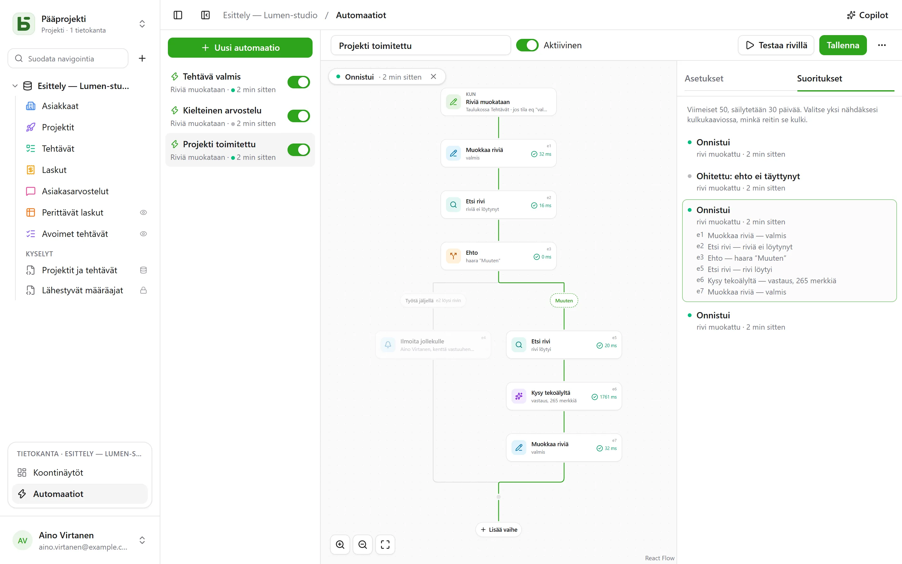

Automaatio kertoo **milloin**, **jos** ja **sitten**: kun tehtävä siirtyy tilaan ”Fait”, kirjaa
kellonaika; kun kielteinen arvio saapuu, ilmoita vastuuhenkilölle ja kirjoita Slackiin; joka
maanantai klo 9 luo tiimipalaverin rivi. Ja kun yksi toiminto ei riitä, se seuraa
**työnkulkua**: etsi rivi, valitse haara sen mukaan, mitä rivillä lukee, toista vaiheita
jokaisella suodatinta vastaavalla rivillä, ja käytä vaiheessa uudelleen sitä, minkä aiempi
vaihe löysi tai kirjoitti.

Ne avataan kohdasta **Automaatiot** sivupalkin alaosan avoimen tietokannan lohkosta, ja ne
vaativat **Hallintaoikeus**-tason.



## Työnkulku

Työnkulku piirretään ylhäältä alas: käynnistin ja sitten jokainen vaihe. Viivan **+** lisää
vaiheen siihen kohtaan; kortti avaa asetuksensa oikealle. Yksinkertainen automaatio – käynnistin
ja yksi toiminto – mahtuu kahteen korttiin ja määritetään kuten ennenkin.

## Milloin

| Käynnistin | Asetukset |
|---|---|
| **Rivi luodaan** | taulukko |
| **Riviä muokataan** | taulukko ja tarvittaessa vain seurattavat kentät |
| **Tiettyyn aikaan** | tunneittain, päivittäin tai viikoittain valittuna kellonaikana ja valitulla aikavyöhykkeellä |
| **Painiketta napsautetaan** | taulukon [Painike-kenttä](/basedb/fi/fonctionnalites/tables-et-champs/#painike) |

Rivien käynnistin näkee **kaikki** kirjoitukset: käyttöliittymän, API:n, agentin, jaetun
lomakkeen ja jopa suoran SQL:n – automaatiot lähtevät liikkeelle historiasta, joka tallentaa ne
kaikki.

## Vain jos

Valinnainen ehto [suodatinkielellä](/basedb/fi/integrations/api-rest/#lukeminen) –
`statut eq "fait"`, `montant gte 10000 and payee eq false` – arvioidaan riville **toiminnan
hetkellä**. Suoritus, jonka ehto ei täyty, ”ohitetaan”, ja se kerrotaan.

## Sitten

Enintään kolmekymmentä vaihetta järjestyksessä; ensimmäinen epäonnistuva vaihe pysäyttää
seuraavat.

| Vaihe | Mitä se tekee |
|---|---|
| **Muokkaa riviä** | kirjoittaa arvoja automaation käynnistäneeseen riviin – tai riviin, jonka jokin vaihe löysi tai loi |
| **Luo rivi** | tähän tai johonkin toiseen tietokannan taulukkoon |
| **Etsi rivi** | taulukon ensimmäinen suodattimeen täsmäävä rivi, jotta seuraavat vaiheet voivat viitata siihen tai muokata sitä |
| **Ilmoita jollekulle** | [ilmoitus](/basedb/fi/fonctionnalites/collaboration/#ilmoitukset) valituille henkilöille tai Henkilö-kentän henkilölle |
| **Lähetä sähköposti** | tiimin henkilöille, Henkilö-kentän henkilölle, E-mail-kentän osoitteeseen – asiakkaalle, toimittajalle – tai kirjoitettuihin osoitteisiin; aihe ja teksti viittaavat riviin ja aiempiin vaiheisiin |
| **Kutsu webhookia** | HTTPS-pyyntö palveluun — metodi, osoite, otsakkeet ja runko oman valintasi mukaan ([lisätiedot](#kutsu-palvelua)); sen vastaukseen voi sitten viitata |
| **Lähetä Slackiin** | viesti [yhdistettyyn](/basedb/fi/integrations/synchronisation/#slack) kanavaan |
| **Kysy tekoälyltä** | [tekoälypalveluntarjoajan](/basedb/fi/fonctionnalites/ia/) vastaus kehotteeseen, joka viittaa riviin ja aiempiin vaiheisiin – kirjoita, tiivistä, luokittele –, luettuna tekstinä, lukuna, kyllä tai ei -vastauksena, päivämääränä tai luettelon valintana |
| **Ehto** | useita haaroja: ensimmäinen, jonka ehto täyttyy, valitaan, ja ”Muuten”, kun mikään ei täyty; haarat yhdistyvät sen jälkeen |
| **Jokaiselle riville** | sen sisältämät vaiheet, kerran jokaiselle taulukon riville, joka vastaa suodatinta ([lisätiedot](#jokaiselle-riville)) |

Haku, joka ei löydä mitään, ei pysäytä työnkulkua: vaiheet, joiden piti muokata sen riviä,
ohitetaan. Jos haluat tehdä siinä tapauksessa jotain muuta, ehto testaa sen – haara, jonka
suodatin on tyhjä, valitaan heti, kun haku on löytänyt rivin.

## Jokaiselle riville

**Jokaiselle riville** -vaihe lukee taulukon rivit, jotka vastaavat sen suodatinta — tyhjä:
kaikki —, valitussa järjestyksessä, rajaansa asti (oletuksena 50, enintään 200), ja suorittaa
sitten sen sisään sijoitetut vaiheet kerran jokaiselle riville. ”Muistuta joka maanantai
maksamattomista laskuista” kirjoitetaan näin: **Ajastettu**, sitten **Jokaiselle riville**
laskuista `payee eq false and relancee eq false`, ja silmukan sisällä sähköposti laskun
yhteyshenkilölle sekä **Muokkaa riviä**, joka merkitsee valintaruudun ”Relancée”.

Silmukan sisällä vaiheen tunniste nimeää **kierroksen rivin**: `{{e1.client}}` viittaa siihen,
ja **Muokkaa riviä** ehdottaa sitä muokattavien rivien joukossa. Silmukan jälkeen
`{{e1.nombre}}` kertoo, kuinka monta riviä se kävi läpi — esimerkiksi Slack-yhteenvetoa
varten. Suodatin voi viitata aiempaan: maksetun laskun käynnistämänä `facture eq {{_id}}` käy
läpi sen erittelyrivit.

Rajan ylittävät rivit odottavat seuraavaa suoritusta, joka kertoo siitä: jätä suodattimen
ulkopuolelle jo käsitellyt — esimerkiksi ”uudelleenkäsitelty”-valintaruutu tai päivämäärä —
jotta ne kaikki tulevat käsitellyiksi suoritusten myötä. Silmukka ei voi sisältää toista
silmukkaa, ja suoritus pysähtyy kahden minuutin kuluttua.

## Kutsu palvelua

**Kutsu webhookia** -vaihe lähettää oletuksena `POST`-metodilla automaation datan: valitun
rivin ja sen, mitä edelliset vaiheet löysivät tai kirjoittivat. Jotta palvelu ymmärtää sen
odottamallaan tavalla, säädettävissä ovat:

- **metodi**: `POST`, `PUT`, `PATCH`, `GET` tai `DELETE` — kaksi jälkimmäistä ilman runkoa;
- **osoite**, joka voi viitata isäntänsä jälkeen — `https://api.exemple.fr/clients/{{e2.numero}}`;
  jokainen arvo koodataan siihen;
- **otsakkeet**, joiden arvo voi viitata: `Idempotency-Key: {{_id}}`;
- **runko**: automaation data, **koottava JSON**, **lomake** (yksi `avain=arvo`-pari riviä
  kohden) tai **teksti**. JSONissa lainausmerkkien sisällä oleva viittaus on tekstiä, ja niiden
  ulkopuolella arvo — luku, kyllä tai ei, luettelo:

```json
{ "facture": "{{e1.numero}}", "montant": {{e1.montant}}, "payee": {{e1.payee}} }
```

API-avain tai tunnus laitetaan **salaiseen** otsakkeeseen (lukko): instanssin avaimella
salattuna sitä ei enää koskaan näytetä — ei ruudulla, ei API:n kautta, eikä Copilotille — ja se
lähtee vain sille isännälle, jolle sen annoit. Osoitteen isännän vaihtaminen vaatii sen
antamista uudelleen; **Korvaa** syöttää uuden.

## Kysy tekoälyltä

Kuten [tekoälykenttä](/basedb/fi/fonctionnalites/ia/#kentän-tekoälyasetus), vaihe lähettää
palveluntarjoajalle kehotteensa, jossa jokainen viittaus on korvattu arvollaan:

```text
Cet avis de {{auteur}} demande-t-il une action de notre part ? {{avis}}
```

Valitse **odotettu vastaus** – vapaa tai lyhyt teksti, luku, kyllä tai ei, päivämäärä,
verkko-osoite tai valinta luettelosta, jonka voi ottaa Yksi valinta -kentästä. Mallille
kerrotaan tästä, ja vastaus, joka ei sisällä sitä, saa vaiheen epäonnistumaan. Seuraavat vaiheet
viittaavat siihen muodossa `{{e1.reponse}}`: luodun tehtävän otsikossa, viestissä tai Yksi valinta
-kentässä, jossa se sijoitetaan samannimiseen valintaan.

Mihin kehote viittaa, se lähtee palveluntarjoajalle: vaihe pyytää **suostumustasi**, joka on
annettava uudelleen, kun kehote muuttuu. Jokainen kutsu kirjataan lokiin ja lasketaan
tekoälykenttien kanssa kiintiöön `BASEDB_AI_FIELD_QUOTA` (oletuksena 300 tunnissa). Tekoäly ei
tee mitään itsestään: sen jälkeen asetetut vaiheet kirjoittavat tai ilmoittavat.

## Viittaaminen

Arvot, viestit ja suodattimet viittaavat aiempaan kunkin tekstin vieressä olevalla **{ }**
-painikkeella:

- `{{Titre}}`, `{{_id}}`: automaation käynnistänyt rivi;
- `{{e2.titre}}`, `{{e2._id}}`: vaiheen `e2` löytämä, luoma tai muokkaama rivi – jokaisen
  vaiheen tunniste näkyy sen kortissa;
- `{{e3.statut}}`, `{{e3.reponse.numero}}`: webhookin `e3` vastaus;
- `{{e4.reponse}}`: tekoälyvaiheen `e4` vastaus;
- `{{e5.client}}` silmukassa `e5`, kierroksen rivi; `{{e5.nombre}}` sen jälkeen, läpikäytyjen
  rivien määrä;
- `{{_maintenant}}`: suorituksen hetki.

Yhdestä viittauksesta koostuva arvo välittää itse arvon: viittauksen, henkilön, valinnan – näin
luotu rivi linkitetään riviin, jonka haku löysi. Suodattimessa viittaus on aina verrattava
arvo, ei koskaan suodatinkieltä.

Vaihe voi viitata vain siihen, mikä on varmasti tapahtunut ennen sitä: haaran löytämään ei voi
enää viitata ehdon jälkeen. Editori ilmoittaa siitä kortissa ennen tallennusta.

## Copilot

Otsakkeen **Copilot** avaa oikealle luonnollisen kielen keskustelun tietokannan
automaatioista: ”kun tehtävä siirtyy tarkastukseen, ilmoita sille osoitetulle henkilölle”,
”lisää muistiinpanoihin tekoälyn tekemä tiivistelmä”, ”miksi viimeisin suoritus
epäonnistui?”. Se vastaa ja **ehdottaa** kokonaista automaatiota – näytöllä olevaa muokattuna
tai uutta – ja luettelee, mikä muuttuu.

Copilot ei tallenna mitään: **Näytä työnkulussa** näyttää ehdotuksen editorissa, jossa luet sen
läpi ennen tallennusta – ja kortin **Peruuta** palauttaa työnkulun ennalleen. Uusi automaatio
avautuu editoriin luotavaksi. Jokainen ehdotus tarkistetaan kuin tallennus; kelpaamaton
hylätään, ja se kerrotaan.

Oletuksena tekoälypalveluntarjoajalle lähtee keskustelun lisäksi **vain rakenne**: taulukot ja
niiden kentät, tietokannan automaatiot, näytöllä oleva automaatio sellaisena kuin editori sen
näyttää, ja sen viimeisimmät suoritukset – niiden tilat ja virhekoodit, ei koskaan arvoja.
Henkilöt ja Slack-kanavat lähtevät merkintöinä (`p1`, `s1`), ei koskaan tunnisteillaan.
**Salli tietojen lukeminen** -valinta antaa Copilotin lukea rivejä keskustelun ajan (enintään
50 lukukertaa kohden), ja jokainen lukukerta luetellaan sen vastauksen alla.

## Testaaminen ja seuranta

**Testaa rivillä** suorittaa tallennetun automaation valitulle riville, oikeasti.
**Suoritukset**-välilehti säilyttää viimeiset 50 suoritusta 30 päivän ajan: odottaa, käynnissä,
onnistui, ohitettu syineen, epäonnistui koodeineen. Suorituksen valitseminen näyttää sen
työnkulun päällä – valittu haara piirretään, jokainen läpikäyty vaihe kertoo, mitä se teki ja
kuinka kauan siihen meni, ja loput himmennetään. Silmukassa jokainen vaihe kertoo myös,
kuinka monta kertaa se suoritettiin.

## Kenen nimissä se toimii

Automaatio toimii **sen viimeksi tallentaneen henkilön käyttöoikeuksilla**, jotka tarkistetaan
uudelleen jokaisessa suorituksessa: jos henkilö menettää oikeuden, sitä tarvinnut vaihe
epäonnistuu sen sijaan, että ohittaisi sen, ja haku löytää vain sen, mitä henkilö saa lukea.
Historia näyttää sen muodossa ”Automaatio ’Tâche terminée’ · henkilön … puolesta”, ja sen
kirjoitukset voi kumota kuten muutkin.

## Rajoitukset

- Automaation kirjoitukset eivät käynnistä muita automaatioita: toisiaan seuraavat toiminnot
  kirjoitetaan yhteen työnkulkuun.
- Haku antaa yhden rivin, ensimmäisen; silmukka käy läpi enintään 200 riviä suoritusta kohti,
  ja ensimmäinen epäonnistuva vaihe pysäyttää sen. Odotusta (”kolme päivää myöhemmin”) ei ole.
- Ei skriptejä. Sähköposti lähtee tekstimuodossa, yksi kullekin vastaanottajalle – enintään
  kaksikymmentä vaihetta kohden –, instanssin [lähetyspalvelimen](/basedb/fi/hebergement/variables/#sähköpostit)
  kautta; vastaus saapuu automaation omistavalle henkilölle.
- Ehto testaa riviä: jos haluat valita haaran tekoälyn vastauksen mukaan, kirjoita vastaus ensin
  rivin kenttään.
- [Tietokantamalli](/basedb/fi/fonctionnalites/modeles/) ottaa mukaan vain automaatiot, joissa
  ei ole hakua, silmukkaa, ehtoa eikä tekoälyvaihetta, eikä koskaan webhookia.
- Webhook ei seuraa uudelleenohjauksia ja odottaa enintään 10 sekuntia; muu kuin 2xx-vastaus
  epäonnistuttaa vaiheen.
- 100 suoritusta tunnissa automaatiota kohden; väliin jäänyt ajastettu suoritus tehdään
  jälkikäteen vain kerran.
- Viive kirjoituksen ja toiminnon välillä on noin sekunnin luokkaa.
