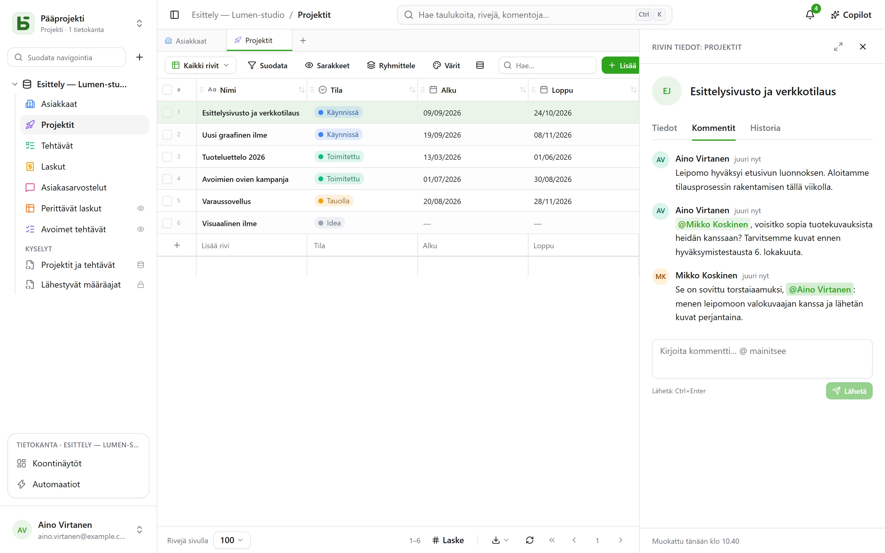
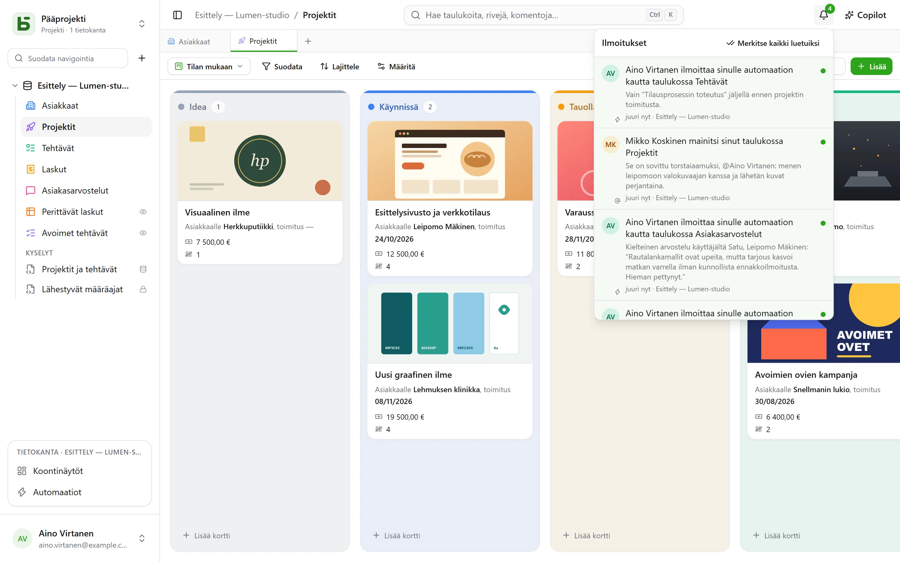

Useat henkilöt työskentelevät samassa tietokannassa samaan aikaan: kukin näkee muiden
kirjoitusten saapuvan, tietää, kuka katsoo mitäkin, ja keskustelee rivistä siellä, missä se on.

## Kommentit

Rivin tiedoissa on **Kommentit**-välilehti ”Tiedot”- ja ”Historia”-välilehtien välissä.
Kirjoita `@` **mainitaksesi** jäsenen ja lähetä Ctrl+Enter-näppäinyhdistelmällä. Kukin voi
muokata ja poistaa omia kommenttejaan.

Rivin lukuoikeus riittää sen kommentoimiseen. Mainittu henkilö, joka ei voi lukea riviä, ei saa
ilmoitusta – ja kirjoittajalle kerrotaan siitä, jottei hän luule viestin menneen perille.

## Ilmoitukset

Oikean yläkulman kello laskee lukemattomat. Sinne tulee neljä asiaa:

- joku **mainitsee** sinut kommentissa;
- joku **vastaa** keskusteluun, johon olet kirjoittanut;
- joku **valitsee** sinut Henkilö-kenttään – käyttöliittymästä, API:sta, lomakkeesta tai
  automaatiosta;
- [automaatio](/basedb/fi/fonctionnalites/automatisations/) **ilmoittaa** sinulle.

Ilmoituksen avaaminen avaa rivin. **Merkitse kaikki luetuiksi** nollaa laskurin; ilmoituksia
säilytetään 90 päivää.

### Sähköpostitse

Kun instanssilla on [lähetyspalvelin](/basedb/fi/hebergement/variables/#sähköpostit), kymmenen
minuuttia lukematta ollut ilmoitus lähtee myös sähköpostitse: yksi sähköposti kaikille
odottaville, linkillä jokaiseen riviin. Se, mitä luet ajoissa, ei lähde. Kohdassa **Asetukset ›
Ilmoitukset** kullakin lajilla on kaksi kytkintä: basedb:ssä ja sähköpostitse.

## Reaaliaikaisuus

Muiden kirjoitukset näkyvät **lataamatta sivua uudelleen**: muokattu solu, siirretty kortti,
lisätty rivi – tulivat ne käyttöliittymästä, API:sta, agentilta tai suorasta SQL:stä. Palvelin
lähettää vain **signaalin**, ei koskaan tietoja: näkymä lukee tiedot uudelleen sinun
käyttöoikeuksillasi. Solua, jota olet muokkaamassa, ei koskaan korvata kesken muokkauksen.

## Läsnäolo

**Samaa taulukkoa** katsovien henkilöiden kasvot näkyvät näytön yläosassa; **saman rivin**
avanneiden kasvot sen rivin tietojen otsakkeessa. Ruudukossa muiden osoitin näkyy solussa,
jonka päällä he ovat.

## Linkki jokaiseen näkymään

Selaimen osoite seuraa sitä, mitä katselet: taulukkoa, jotakin sen näkymistä, rivin tietoja,
koontinäyttöä, automaatiota, kysymystä, asetuksiasi. Liitä se viestiin: kollegasi päätyy samaan
paikkaan, omilla käyttöoikeuksillaan. Lisää se kirjanmerkkeihin; selaimen edellinen- ja
seuraava-painikkeet palaavat sinne, missä olit.

| Osoite | Minne se vie |
|---|---|
| `/bases/ventes/tables/opportunites` | tietokannan ”Ventes” taulukko ”Opportunités” |
| `/bases/ventes/tables/opportunites?vue=…` | jokin sen näkymistä |
| `/bases/ventes/tables/opportunites?ligne=…` | jonkin sen rivin tiedot |
| `/bases/ventes/tableaux-de-bord/…` | koontinäyttö |
| `/bases/ventes/automatisations/…` | automaatio |
| `/parametres/apparence` | asetuksesi |

Osoite nimeää **paikan**, ei tilaa, johon jätit sen: suodattimet, lajittelut ja sarakkeiden
leveydet pysyvät kunkin selaimen omina. Tietokanta ja taulukko kirjoitetaan osoitteeseen
PostgreSQL-nimellään: uudelleennimettyinä vanha osoite ei enää vie minnekään. Osoite, joka ei vie
minnekään – kirjoitusvirhe, poistettu kohde, tai jokin, jota et saa nähdä – näyttää tekstin
”Tätä sivua ei ole”.

## Kumoaminen

Ctrl+Z kumoaa viimeisimmän kirjoituksesi – katso [historia](/basedb/fi/fonctionnalites/historique/#kumoaminen-ctrlz).

## Rajoitukset

- Ei sähköpostia, jos ylläpitäjä ei ole määrittänyt lähetyspalvelinta.
- Jos kerralla muuttuu yli sata riviä, näkymä lataa koko sivun uudelleen rivi kerrallaan
  päivittämisen sijaan.
