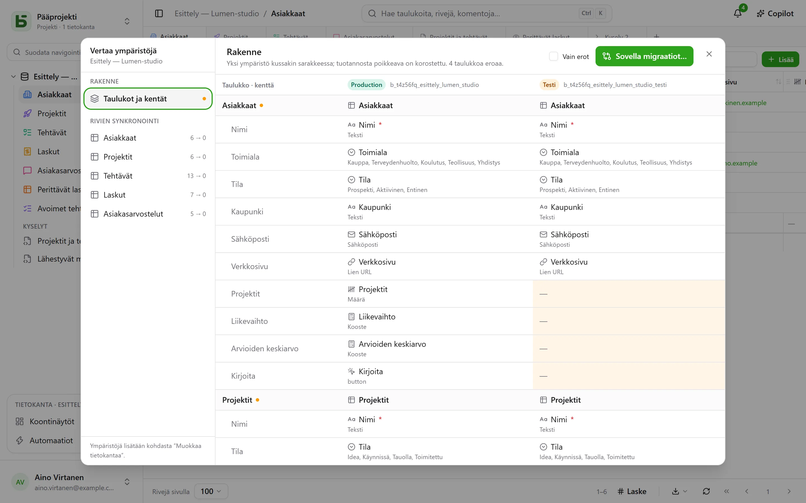

Tietokannalla voi olla **ympäristöjä**: tuotanto, testi, kehitys… Kukin niistä on täysimittainen
tietokanta – oma skeemansa, taulukkonsa, rivinsä ja käyttöoikeutensa – ja kaikilla on tietokannan,
sen taulukoiden ja sen kenttien **yhteinen alkuperä**.

## Käyttöliittymässä

Sivupalkki näyttää **yhden rivin tietokantaa kohden** ja merkin, joka kertoo avoimen ympäristön
ja jolla ympäristöä voi vaihtaa. Merkkiä ei näytetä niin kauan kuin on vain tuotanto.

Ympäristöjä lisätään, nimetään uudelleen ja poistetaan kohdassa **Muokkaa tietokantaa…**: uusi
ympäristö syntyy toisen ympäristön **rakenteen kopiosta** ilman sen rivejä.

## Ympäristöjen vertailu

Tietokannan valikosta kohdasta **Muut toiminnot** **Vertaa ympäristöjä…** avaa valintaikkunan:

- **Rakenne**: ympäristöt sarakkeina, taulukot ja kentät riveinä; tuotannosta poikkeava on
  korostettu.
- **Käytä migraatioita…** valmistelee suunnitelman siirtymiseksi ympäristöstä toiseen vaihe
  vaiheelta. Se ei koskaan valitse oletuksena sellaista, mikä kumoaisi kohteen uudemman muutoksen.
- **Rivien synkronointi**: taulukko kerrallaan rivien siirtäminen ympäristöstä toiseen tunnisteen
  perusteella.

## Miten basedb tietää, kuka muutti mitä

Vertailu perustuu **rakenteen historiaan**: jokaisen taulukon tai kentän luominen, muokkaaminen
tai poistaminen tallennetaan katalogin liipaisimella, ja sen voi lukea historian
”Rakenne”-välilehdeltä. Alkuperätunnisteet yhdistävät testiympäristön kentän sen
tuotantovastineeseen, vaikka se olisi nimetty uudelleen.

## API:n, SDK:n ja MCP:n kautta

**Koko tietokannalle luotu tunnus** avaa kaikki sen ympäristöt, sekä nykyiset että tulevat: yksi
tunnus tuotannolle ja testille. Ohjelma tai agentti valitsee ympäristön jokaisella kutsulla:

| Missä | Miten |
|---|---|
| [REST API](/basedb/fi/integrations/api-rest/#ympäristön-valitseminen) | otsake `X-Basedb-Environment: recette` tai `?environment=recette` |
| [SDK](/basedb/fi/integrations/sdk/#ympäristöt) | `db.environment('recette')` |
| [MCP](/basedb/fi/integrations/mcp/#ympäristön-valitseminen) | osoite `…/mcp?environment=recette` tai työkalun argumentti `environment` |
| [n8n](/basedb/fi/integrations/n8n/#tunnistetiedot) | tunnisteen **Environment**-kenttä |

Ilman mitään näistä jokainen tietokanta osoittaa omaan ympäristöönsä: tuotannon nimi avaa tuotannon,
testin nimi testin. Tunnus voidaan myös sitä luotaessa rajata näytettyyn ympäristöön: silloin se ei
näe mitään muuta. Kummassakin tapauksessa sen oikeudet tarkistetaan ympäristö kerrallaan sen
luoneen henkilön oikeuksia vasten.

## SQL:ssä

Jokainen ympäristö on skeema: `b_t4z56fq_ventes` tuotannolle, `b_t4z56fq_ventes_recette`
testille. Kyselysi vaihtavat ympäristöä vaihtamalla skeemaa – tai `search_path`-asetusta.
