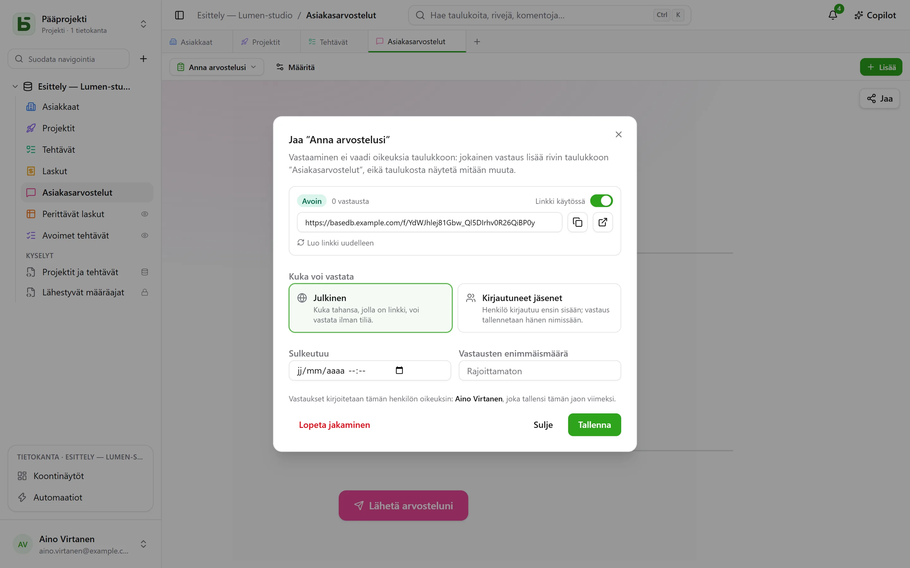
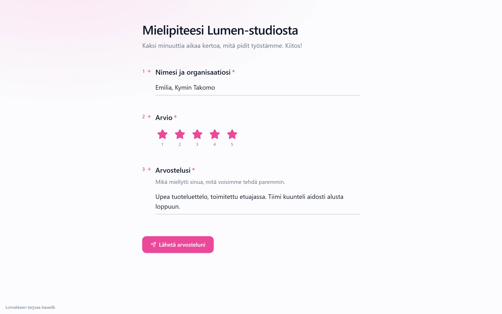

Lomakkeen, kyselylomakkeen tai tietovisan voi **jakaa linkillä** `/f/<jeton>`. Vastaaja ei tarvitse
**mitään käyttöoikeuksia taulukkoon**: jokainen vastaus lisää rivin, eikä hänelle näytetä
taulukosta mitään muuta. Jos haluat näyttää rivejä etkä vastaanottaa niitä, näkymän voi jakaa
[vain luku -muodossa](/basedb/fi/fonctionnalites/vues-partagees/).

## Kuka voi vastata

| Pääsy | Kuka vastaa | Mitä näytetään |
|---|---|---|
| **Julkinen** | kuka tahansa, jolla on linkki, ilman tiliä | pelkkä lomake |
| **Kirjautuneet jäsenet** | työtilan jäsen – tarvittaessa vain tietyistä ryhmistä | kirjautuminen, sitten lomake ja ”Vastaat käyttäjänä …” |

Linkin sivu on sovelluksen ulkopuolella: ei sivupalkkia, tietokannan nimeä eikä muita rivejä.
Se kantaa lomakkeen ulkoasua – sen teemaa, väriä, kirjasinta –, ja kysyy vain ne kysymykset, joita
aiemmat vastaukset edellyttävät.

## Kenen nimissä vastaus kirjoitetaan

Rivi kirjoitetaan **jaon julkaisseen henkilön valtuuksilla** – sen, joka on viimeksi tallentanut
jaon. Hänen oikeutensa luoda rivejä tarkistetaan **jokaisen vastauksen kohdalla** lomakkeen
kysymyksiin rajattuna: jos hän menettää sen, lomake keskeytetään, kunnes joku, jolla oikeus
on, tallentaa sen uudelleen.

Historia kertoo, kuka vastasi, ei sitä, kuka julkaisi:

- **jäsenen** vastaus kirjataan henkilölle;
- **julkinen** vastaus kirjataan lomakkeelle itselleen: ”Lomake ’Demande de devis’ · julkinen
  vastaus · julkaisija Camille”.

## Avaaminen ja sulkeminen

Valintaikkunassa määritetään:

- **Linkki käytössä** -kytkin;
- **sulkemispäivä**;
- **vastausten enimmäismäärä** – tarkka myös samanaikaisten vastausten kohdalla;
- **Luo linkki uudelleen**: vanha lakkaa toimimasta heti;
- **Lopeta jakaminen**: linkki katoaa, vastaukset jäävät taulukkoon.

Suljettu lomake kertoo sen yhdellä lauseella, jo ennen kuin se pyytää kirjautumaan.

## Jaettu tietovisa

Tietovisan sivu ei saa **yhtään oikeaa vastausta**: vain sen, mitä kukin kysymys on arvoinen.
Palvelin korjaa vastaukset.

- Kun korjaus tapahtuu **jokaisen kysymyksen jälkeen**, sivu lähettää palvelimelle jokaisen
  pisteytetyn vastauksen heti, kun se annetaan, ja saa silloin tietää, oliko se oikein – ja mikä
  oikea vastaus oli.
- Lähetyshetkellä palvelin laskee pistemäärän **saatujen vastausten perusteella** ja kirjoittaa
  sen sille valittuun kenttään, jos sellainen on ja jaon julkaissut henkilö voi kirjoittaa siihen.
  Sivu näyttää palvelimen palauttaman pistemäärän ja palautteen, paitsi jos tietovisa sanoo ”ei
  koskaan”.

Pistemäärä luetaan siis taulukosta sellaisena kuin palvelin on sen laskenut, ei sellaisena kuin
sivu olisi sen ilmoittanut.

## Rajoitukset

- **Viittaus**-, **Tiedosto**- ja **Kuva**-tyyppisiä kysymyksiä ei esitetä jaetun linkin kautta;
  valintaikkuna ilmoittaa niistä.
- Lähettäminen on rajoitettu 20 vastaukseen minuutissa osoitetta ja linkkiä kohden. Mukana
  toimitetun välityspalvelimen (Caddy) takana osoite on vierailijan osoite.

Yksityiskohdat ovat arkkitehtuuridokumentin
[luvussa 15](https://github.com/eodia/basedb/blob/main/docs/architecture/15-formulaires-partages.md).
