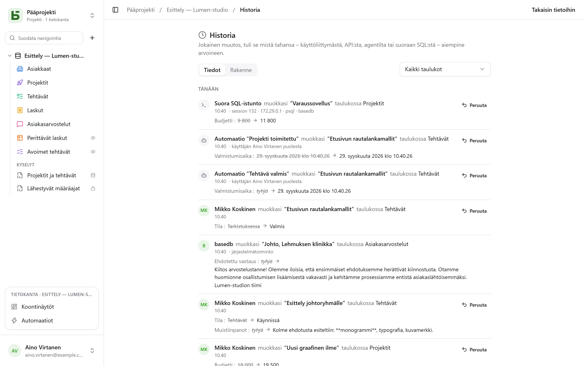

basedb kirjaa historiaan **jokaisen kirjoituksen**, mistä tahansa se tulee: käyttöliittymästä,
API:sta, MCP-agentilta, julkiselta lomakkeelta – ja jopa käsin `psql`:ssä kirjoitetusta
SQL-kyselystä.

## Miten se tallennetaan

Ei sovelluksen avulla, vaan **PostgreSQL-liipaisimilla** saman transaktion sisällä kuin
kirjoitus. Epäonnistunut kirjoitus ei jätä jälkeä; onnistunut kirjoitus ei voi jäädä
kirjaamatta. Revisiot siirretään sitten muuttumattomiin, kuukausittain osioituihin lokeihin.

Identiteetti välitetään istuntomuuttujilla, jotka asetetaan jokaisen transaktion alussa.
Kirjoitus, jolla niitä ei ole – suora SQL –, tallennetaan sellaisenaan sen tehneen istunnon
tiedoin (`psql`, osoite, prosessi): sitä ei silti koskaan hylätä.

| Toimija | Näytetään muodossa |
|---|---|
| henkilö | hänen nimensä |
| ohjelma (API) tai agentti (MCP) | tunnuksen luonut henkilö, ”tunnuksella …” |
| julkinen lomake | ”Lomake ’…’ · julkinen vastaus” |
| automaatio | ”Automaatio ’…’ · henkilön … puolesta”, jossa henkilö on automaatiosta vastaava |
| suora SQL | ”Suora SQL-istunto” |

## Mitä sillä voi tehdä

- **Lukea** rivin historian (rivin tietojen ”Historia”-välilehti), taulukon tai tietokannan
  historian (**Historia** tietokannan **⋯**-valikossa) taulukon mukaan suodatettuna.
- **Kumota** muutoksen: aiemmat arvot palautetaan kenttä kentältä.
- **Palauttaa** poistetun rivin sen ”poisti”-merkinnästä.
- Seurata **rakenteen historiaa** (”Rakenne”-välilehti): luodut, muokatut ja poistetut
  taulukot ja kentät.

## Kumoaminen (Ctrl+Z)

Ruudukossa **Ctrl+Z** (Macissa ⌘Z) kumoaa viimeisimmän kirjoituksesi; **Ctrl+Vaihto+Z** tai
**Ctrl+Y** tekee sen uudelleen. Viesti vahvistaa, mitä kumottiin – ”Kumottu: kentän ’Montant’
muutos” – ja siinä on painike kumoamisen perumiseen.

Näin voi kumota solun, siirretyn kortin tai palkin, luodun tai poistetun rivin, liittämisen –
ja kokonaisen tuonnin, joka lasketaan yhdeksi toimenpiteeksi. Enintään viisikymmentä
toimenpidettä välilehteä kohden.

Kyse ei ole näkymän palauttamisesta taaksepäin: se on **uusi kirjoitus**, jonka palvelin tekee
historian perusteella ja joka myös kirjataan historiaan. Se hylätään, jos joku on muuttanut
riviä sen jälkeen – ”Kumoaminen ei onnistu: kenttää ’Statut’ on muutettu sen jälkeen” – sen
sijaan, että toisen työ kirjoitettaisiin yli. Näin voi kumota vain omia kirjoituksiaan
viimeisten kahdenkymmenenneljän tunnin ajalta, eikä koskaan rakennetta. Solussa, jota ollaan
kirjoittamassa, Ctrl+Z kumoaa tekstin muutoksen.

## Käyttöoikeudet

Historia noudattaa lukuoikeuksia: sinulta piilotettu kenttä ei näy lukemissasi revisioissa.
