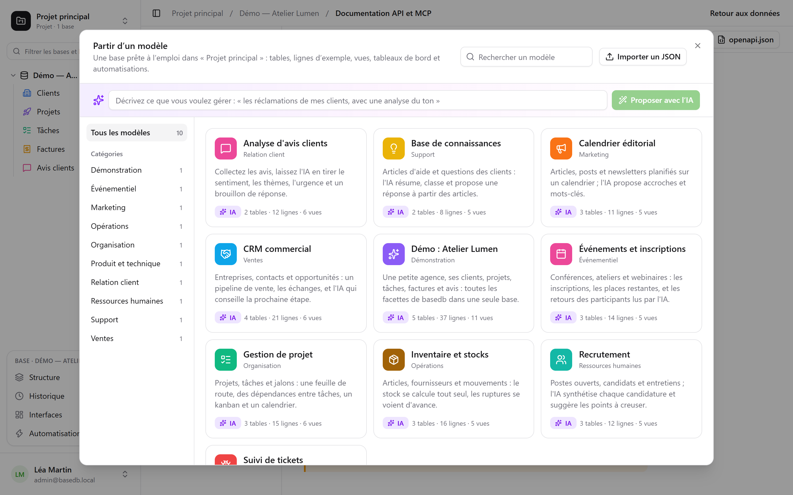

**Malli** luo kokonaisen tietokannan yhdellä napsautuksella: sen taulukot ja niiden viittaukset,
esimerkkirivit, näkymät, koontinäytön, automaatiot ja kentät, jotka tekoäly täyttää itse.
[Mallien galleria](/basedb/fi/modeles/) näyttää basedb:n tarjoamat mallit.

## Aloittaminen mallista

**Uusi tietokanta** ja sitten **Aloita mallista tai pyydä sitä tekoälyltä**: galleria avautuu.



Jokaisen mallin voi lukea kokonaan ennen käyttöä – sen taulukot ja niiden kentät, näkymät,
automaatiot ja jokaisen tekoälykentän kehotteen. **Luo tietokanta** kysyy tietokannan nimikettä
ja, jos mallissa on tekoälykenttiä, suostumustasi siihen, että niiden viittaamat arvot lähtevät
instanssin tekoälypalveluntarjoajalle. Ilman suostumusta ne ovat tavallisia kenttiä, jotka on
täytetty esimerkkiarvoillaan.

Tyhjä projekti tarjoaa myös **esittelytietokannan**: pieni toimisto asiakkaineen, projekteineen,
tehtävineen, laskuineen ja arvioineen, joka näyttää basedb:n kaikki puolet.

## Pyydä tekoälyltä

Kuvaile gallerian yläosassa tarpeesi yhdellä lauseella – ”asiakkaideni reklamaatioiden seuranta
ja niiden sävyn analyysi”. Tekoäly ehdottaa kokonaista tietokantaa: taulukot, uskottavat
esimerkkirivit, näkymät, koontinäytön ja tekoälykenttiä, kun käyttötarkoitus sopii niihin. Luet
sen kuin mallin, voit **hioa** sitä (”lisää toimittajataulukko”) ja sitten luoda sen. Tekoäly
saa vain lauseesi – ei mitään tietoja mistään tietokannasta – eikä mitään luoda ennen
napsautustasi.

## Mallin kirjoittaminen JSON-muodossa

Malli on JSON-dokumentti. Tässä sen runko:

```json
{
  "format": 1,
  "key": "suivi-tickets",
  "label": "Suivi de tickets",
  "summary": "Une phrase pour la galerie.",
  "category": "Produit et technique",
  "icon": "bug",
  "color": "#ef4444",
  "tables": [
    {
      "key": "tickets",
      "label": "Tickets",
      "fields": [
        { "label": "Titre", "kind": "short_text" },
        { "label": "Statut", "kind": "select", "options": ["Nouveau", "En cours", "Résolu"] },
        { "label": "Ouvert le", "kind": "date" },
        { "label": "Description", "kind": "long_text" },
        { "label": "Catégorie", "kind": "select", "options": ["Bug", "Demande"],
          "ai": { "prompt": "Classe ce ticket : {{Titre}} — {{Description}}" } },
        { "label": "Âge (jours)", "kind": "formula", "formula": "JOURS(AUJOURDHUI(); [Ouvert le])" }
      ]
    },
    { "key": "produits", "label": "Produits", "fields": [{ "label": "Nom", "kind": "short_text" }] }
  ],
  "links": [{ "from": "tickets", "label": "Produit", "to": "produits" }],
  "rows": {
    "produits": [{ "$key": "app", "Nom": "Application mobile" }],
    "tickets": [{ "Titre": "Crash au démarrage", "Statut": "En cours", "Ouvert le": "-3d", "Produit": "@app" }]
  },
  "views": [
    { "table": "tickets", "label": "Tableau", "kind": "kanban", "spec": { "group_by": "Statut" } }
  ],
  "dashboards": [
    { "label": "Vue d’ensemble", "blocks": [
      { "kind": "number", "title": "Ouverts", "table": "tickets", "filter": "[Statut] ne \"Résolu\"" },
      { "kind": "chart", "title": "Par catégorie", "table": "tickets", "group_by": "Catégorie", "style": "pie" }
    ] }
  ],
  "automations": []
}
```

Tärkeimmät säännöt:

- **Kaikkeen viitataan nimikkeellä**: kenttään näkymässä, suodattimessa (`[Statut] ne "Résolu"`),
  kaavassa (`[Prix] * [Quantité]`), tekoälykehotteessa tai viestissä (`{{Titre}}`). Valinta
  annetaan nimikkeellään.
- Taulukon **ensimmäinen kenttä** on sen näyttökenttä: teksti, luku, päivämäärä, sähköposti tai
  osoite.
- **Viittaus** määritellään kohdassa `links`, ei koskaan kenttänä; rivi viittaa siihen muodossa
  `"@clé"`, joka on kohdetaulukon rivin `$key`.
- **Päivämäärä** voi olla suhteessa päivään, jona malli otetaan käyttöön: `"today"`, `"+3d"`,
  `"-2w"`, `"+1m"`; päivämäärä ja aika lisää kellonajan, `"+1d 14:30"`. Henkilö kirjoitetaan
  `"$moi"`.
- **Tekoälykentällä** on `"ai": { "prompt": "…" }`, ja sille voi antaa esimerkkiarvon, joka
  kirjoitetaan vain, kun tekoälyä ei käytetä.
- Malli ei **koskaan** sisällä jakoja, käyttöoikeuksia, webhookeja, tiedostoja eikä muita
  henkilöitä kuin `"$moi"`: se tulee joskus muualta, eikä se saa avata mitään.

Täydellinen viite – kaikki kenttätyypit, kaikki näkymien avaimet, rajat – on tietovaraston
arkkitehtuuridokumentaation luvussa 20.

## Mallin julkaiseminen kaikille instansseille

Virallisen gallerian mallit ovat tietovaraston kansion
[`packages/templates/catalog`](https://github.com/eodia/basedb/tree/main/packages/templates/catalog)
tiedostoja, yksi tiedosto mallia kohden, nimettynä sen `key`-arvon mukaan. Julkinen sivusto
tekee niistä [gallerian](/basedb/fi/modeles/) ja julkaisee koko katalogin osoitteessa
[`/basedb/modeles/catalogue.json`](/basedb/modeles/catalogue.json). Jokainen instanssi lukee
sen, kun joku avaa gallerian, ja säilyttää sitä tunnin: tiedoston muokkaaminen ja sivuston
julkaiseminen uudelleen riittää muuttamaan kaikkien instanssien gallerian.

Jokainen malli tarkistetaan sivustoa koottaessa samalla validaattorilla kuin palvelimella:
virheellinen malli kaataa koonnin sen sijaan, että päätyisi käyttäjille.

Instanssi lukee osoitteen `BASEDB_TEMPLATES_URL` – oletuksena julkisen sivuston osoitteen.
Osoita se omaan katalogiisi tai aseta arvoksi `off`, jolloin mitään katalogia ei lueta:
instanssi tarjoaa silloin versioonsa sisältyvät mallit.

## Instanssisi mallit

Ylläpitäjä voi **tuoda JSON-mallin** instanssiinsa galleriasta (”Tuo JSON”): se lisätään kaikkien
käyttäjien galleriaan ja korvaa samalla avaimella olevan mallin. Tekoälyn ehdotuksen voi lisätä
sinne yhdellä napsautuksella.

Mistä tahansa tietokannasta voi myös tehdä mallin: **Tallenna malliksi** tietokannan valikossa
kohdassa **Muut toiminnot**. Sen taulukot, kentät, tekoälykehotteet, viittaukset, jaetut näkymät, koontinäytöt ja
automaatiot – ja halutessasi enintään 50 riviä taulukkoa kohden – ladataan JSON-muodossa
valmiina liitettäviksi viralliseen katalogiin tai instanssin katalogiin. Automaatio, joka etsii
rivin, valitsee haaroja tai viittaa aiempaan vaiheeseen, jää toistaiseksi pois, ja näkymä
kertoo sen.
